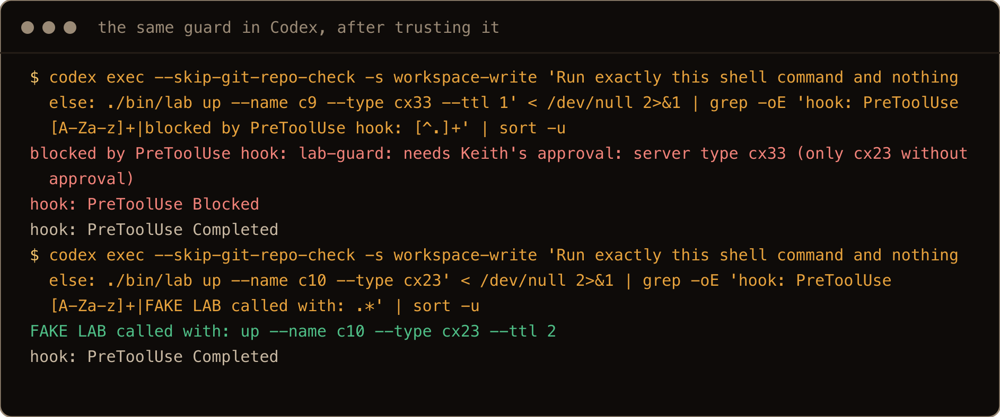
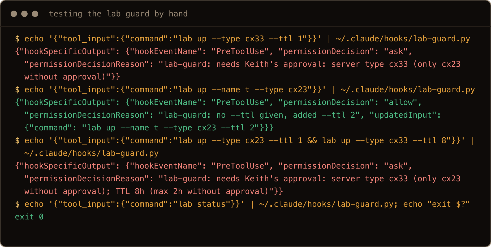

I never want Claude to just do things on its own. I want to set up a nice foundation for it, guide it, and help it along the way. It's a tool. It's not meant to replace the human but to augment their already existing abilities.

In my day to day job as an SRE, "it worked once, that's great" is not the goal. We want repeatable, known steps that do not change. We know it will always work this way. Until Microsoft throws a curveball.

I don't want my decisions to be overwritten. I want it to work exactly the same every time, like a PowerShell script. I'm tuning Claude to help augment my thinking, and what I put in my hooks is how I think and how I understand the world.

Rules you write in `CLAUDE.md` or a skill are instructions: the model reads them and usually follows them. A hook is different. It is a script the tool itself runs at a fixed moment, such as right before any shell command, and if the script says no, the command does not happen. The model does not get a vote. That is the whole idea of this post: prompts ask, hooks make sure.

I built two hooks for my own workflow and tested them on Claude Code 2.1.285 and Codex CLI 0.154.0: a **lab guard** for my disposable Hetzner test servers, and a **plan gate** that sends every plan to a judge model before I see it.

> **TL;DR.** A `PreToolUse` hook gets the upcoming tool call as JSON on stdin. Exit `0` with no output leaves your normal permission rules in charge, exit `2` blocks it and sends your stderr back to the model. For more control, print JSON with `permissionDecision` set to `allow`, `ask` or `deny`, and optionally `updatedInput` to rewrite the command. Claude Code reads hooks from `~/.claude/settings.json`; Codex reads `~/.codex/hooks.json` but only after you approve them in `/hooks`. Codex has no `ask` for `PreToolUse`: use `deny`. A hook that crashes lets the command run, so test every hook by piping JSON into it before you trust it.

## Contents

- [1. How a hook runs](#1-how-a-hook-runs)
- [2. Where hooks live](#2-where-hooks-live)
- [3. The lab guard: allow, rewrite, or ask](#3-the-lab-guard-allow-rewrite-or-ask)
- [4. The plan gate: three versions to get it right](#4-the-plan-gate-three-versions-to-get-it-right)
- [5. The same hooks in Codex](#5-the-same-hooks-in-codex)
- [6. Gotchas I hit](#6-gotchas-i-hit)
- [7. Testing a hook before you trust it](#7-testing-a-hook-before-you-trust-it)
- [Quick reference](#quick-reference)

## 1. How a hook runs

I already have gates like this. My plan gate skill, Jev AI, checks a generated plan against a set of conditions, and it either passes or fails and needs to be revisited. My Hetzner lab skill is more straightforward, with specific conditions on the TTL length and the VPS resources we stand up. If a lab needs more resources, it must seek approval before continuing.

Both of those are skills, which means Claude has to choose to follow them. A hook moves the check out of the model and into the tool. Here is what happens when one fires:

1. Claude decides to run a shell command.
2. Before it runs, Claude Code calls your script and hands it the upcoming call as JSON on stdin. This is what my test hook received, trimmed to the fields that matter:

```json
{
  "hook_event_name": "PreToolUse",
  "tool_name": "Bash",
  "tool_input": {
    "command": "./bin/lab up --name t2 --type cx23"
  }
}
```

3. Your script decides, and answers with its exit code or a line of JSON.
4. The tool does what the answer says.

The simplest answers are exit codes: `0` with no output means carry on as normal (your usual permission rules still apply), `2` means stop, and whatever the script printed to stderr goes back to the model as the reason. When I blocked a command that way, the command never ran and Claude reported my script's message word for word.

For more than yes or no, the script exits `0` and prints JSON:

```json
{"hookSpecificOutput": {"hookEventName": "PreToolUse",
  "permissionDecision": "ask",
  "permissionDecisionReason": "lab-guard: needs Keith's approval: server type cx33 (only cx23 without approval)"}}
```

`permissionDecision` can be `allow`, `ask` or `deny`, and with `allow` you can add `updatedInput` to run a changed command instead. One thing to know: `allow` also skips your normal "may I run this?" prompt. Your own deny and ask rules, and another hook's deny or ask, still win over it.

## 2. Where hooks live

They're used in many projects, so they belong in the global Claude settings. If they were meant for specific projects, they would live in the projects themselves and be added to the .gitignore. That's why the packs of hooks you find on the internet are OK, but they're generalized to help as many users as possible. If possible, you should always create custom hooks for your workflow needs.

For Claude Code, the project file you keep out of git is `.claude/settings.local.json`; `.claude/settings.json` is the one you commit when a team should share the hook.

| Tool | Everywhere | One project |
| --- | --- | --- |
| Claude Code | `~/.claude/settings.json` | `.claude/settings.json` (shared) or `.claude/settings.local.json` (just you) |
| Codex | `~/.codex/hooks.json` (or `[hooks]` in `~/.codex/config.toml`) | `.codex/hooks.json`, loaded only once you trust it |

Each entry names an event (`PreToolUse` here), a matcher for the tool name (`Bash` for shell commands, `ExitPlanMode` for plans), and the command to run. The relevant part of my global Claude Code config:

```json
"hooks": {
  "PreToolUse": [
    {
      "matcher": "Bash",
      "hooks": [
        { "type": "command", "command": "\"$HOME\"/.claude/hooks/lab-guard.py" }
      ]
    },
    {
      "matcher": "ExitPlanMode",
      "hooks": [
        { "type": "command", "command": "\"$HOME\"/.claude/hooks/plan-gate-hook.py", "timeout": 180 }
      ]
    }
  ]
}
```

That is an excerpt showing the two hooks in this post; it goes inside the top level `{ }` of `settings.json`, next to whatever else is there. The scripts live in `~/.claude/hooks/` and must be executable (`chmod +x ~/.claude/hooks/*.py`).

## 3. The lab guard: allow, rewrite, or ask

These rules make sure Claude is following my guidelines for planning, and that I don't forget to turn off my VPS, saving me money. And I don't have to manually spin up a VPS and do all the install steps to test out ideas with my agent.

My lab tool creates a Hetzner server with `lab up --type <type> --ttl <hours>`. The rules: a `cx23` for up to 2 hours is fine without asking; anything bigger or longer needs my approval; and if Claude forgets `--ttl` on a plain `lab up`, it gets 2 hours rather than the tool's default of 4. Every `lab up` in a command is checked, so `lab up --type cx23 --ttl 1 && lab up --type cx33 --ttl 8` still asks, and the flags are read with `argparse` the same way `lab` reads them, so `--type=cx53` and `--ty cx53` are caught too. What it cannot see is a `lab up` hidden inside a script or a `bash -c` string: a hook reads the command line, nothing more.

```python
#!/usr/bin/env python3
# PreToolUse guard for the Hetzner lab: cx23 and a TTL of 2 hours or less run freely.
# No --ttl on a plain lab up: add --ttl 2. Anything bigger: stop and ask Keith.
# Limit: it reads the command line only; a lab up inside a script or a bash -c string is not seen.
import argparse, json, shlex, sys

MAX_TTL = 2
ALLOWED_TYPES = {"cx23"}
OPERATORS = {";", "&&", "||", "|", "&", "(", ")", "\n"}

data = json.load(sys.stdin)
cmd = data.get("tool_input", {}).get("command", "")

# Split like a shell does: quoted text stays one token, # starts a comment, newlines separate commands.
try:
    lex = shlex.shlex(cmd, posix=True, punctuation_chars="();<>|&\n")
    lex.whitespace_split = True
    lex.whitespace = " \t\r"
    tokens = list(lex)
except ValueError:
    sys.exit(0)
starts = [i for i, t in enumerate(tokens[:-1]) if (t == "lab" or t.endswith("/lab")) and tokens[i + 1] == "up"]
if not starts:
    sys.exit(0)  # not running lab up, not our business

def answer(decision, reason, new_cmd=None):
    out = {"hookSpecificOutput": {"hookEventName": "PreToolUse",
           "permissionDecision": decision, "permissionDecisionReason": reason}}
    if new_cmd:
        out["hookSpecificOutput"]["updatedInput"] = dict(data["tool_input"], command=new_cmd)
    print(json.dumps(out))
    sys.exit(0)

def needs_keith(reason):
    reason = "lab-guard: needs Keith's approval: " + reason
    if "--codex" in sys.argv:
        # Codex has no "ask" for PreToolUse; an unknown answer counts as a hook failure and the command runs.
        answer("deny", reason + ". Ask Keith before running this")
    answer("ask", reason)

# Read the flags the way lab itself does (argparse), so --type=cx53 and --ty cx53 are caught too.
parser = argparse.ArgumentParser(add_help=False, exit_on_error=False)
parser.add_argument("--type", default="cx23")   # lab's own default type
parser.add_argument("--ttl", type=int)          # lab's own default is 4 hours

problems, missing_ttl = [], False
for s in starts:  # check every lab up in the command, not just the first
    args = []
    for t in tokens[s + 2:]:
        if t in OPERATORS:
            break
        args.append(t)
    try:
        opts, _ = parser.parse_known_args(args)
    except argparse.ArgumentError as err:
        problems.append(f"flags I cannot read ({err})")
        continue
    if opts.type not in ALLOWED_TYPES:
        problems.append(f"server type {opts.type} (only {', '.join(sorted(ALLOWED_TYPES))} without approval)")
    if opts.ttl is None:
        missing_ttl = True
    elif opts.ttl > MAX_TTL:
        problems.append(f"TTL {opts.ttl}h (max {MAX_TTL}h without approval)")

if problems:
    needs_keith("; ".join(problems))
if missing_ttl:
    # Only rewrite one plain lab up: no other commands, no comment, no second line.
    if len(starts) == 1 and not any(t in OPERATORS for t in tokens) and "#" not in cmd:
        answer("allow", f"lab-guard: no --ttl given, added --ttl {MAX_TTL}", cmd.rstrip() + f" --ttl {MAX_TTL}")
    needs_keith(f"a lab up without --ttl that I will not rewrite safely (add --ttl {MAX_TTL} or less)")
answer("allow", "lab-guard: cx23 and TTL within limits")
```

I tested it with a fake `lab` that only prints its arguments, so nothing got billed. What happened in Claude Code:

| Claude ran | The hook answered | Result |
| --- | --- | --- |
| `lab up --type cx23 --ttl 1` | allow | ran |
| `lab up --name t6 --type cx23` | allow, with `--ttl 2` added | ran as `lab up --name t6 --type cx23 --ttl 2`; in an earlier run Claude noticed a flag it never typed |
| `lab up --type cx33 --ttl 1` | ask | an approval prompt |

The approval prompt, from my own session:

```text
 Bash command
   │ .../bin/lab up --name test --type cx33 --ttl 1
   Run lab up command

 │ Hook PreToolUse:Bash requires confirmation for this command:
 │ lab-guard: needs Keith's approval: server type cx33 (only cx23 without approval)
```

## 4. The plan gate: three versions to get it right

My plan gate skill sends a plan to Jev, a judge model, with a fixed checklist: does it cover the request, stay in scope, include tests, name the files. As a skill, it only runs when Claude remembers to run it. In plan mode, Claude finishes by calling a tool named `ExitPlanMode`, the "here is my plan, approve it?" step, so a `PreToolUse` hook matched on `ExitPlanMode` fires right before I see any plan. The hook takes the plan text from `tool_input.plan`, runs the gate, and reads its exit code. If it cannot read the request, or Jev errors or cannot decide, the plan goes through with a note saying so rather than blocking. It took three versions.

**Version 1 asked Claude to save the request first.** The gate compares the plan against my original request, so the hook refused to run until Claude saved it to `.plan-gate/request.md`. Claude could not: plan mode only lets it edit its own plan file. It told me the plan was blocked and asked me to either let it write the file or leave plan mode. A deadlock.

**Version 2 read the request itself.** Every hook call includes `transcript_path`, the session's conversation log, so the hook pulls my messages from it and writes the request file on its own. That worked, and Jev failed my test plan for having no tests step. But my request had said "don't mention tests". The hook blocked, Claude revised, the hook blocked again, and Claude ended up suggesting I edit the hook to get past it. Two of my own rules disagreed, and the hook always wins.

On the first run I learned that plan mode is exactly what it is: plan mode. It can't make or save anything except its own plan. On the second run I learned that the hook is always what Claude will listen to. So if I try to make it do something it can't, it is another wall.

**Version 3 pushes back twice, then hands the decision to me.** The skill's own rule is at most three rounds, so the hook follows it: a failing plan is blocked on rounds one and two, with Jev's fixes sent back to Claude, and from round three on the hook answers `ask` instead. The count is per session and resets when a plan passes. The heart of it:

```python
MAX_ROUNDS = 3  # same as the plan-gate skill: at most three runs, then Keith decides
if res.returncode == 1:
    counter = workdir / "failed-rounds"
    rounds = int(counter.read_text()) + 1 if counter.exists() else 1
    counter.write_text(str(rounds))
    fixes = "\n".join(f"- {f['check']}: {f['fix']}" for f in report.get("failures", []))
    if rounds < MAX_ROUNDS:
        print(f"plan-gate hook: Jev failed this plan (round {rounds} of {MAX_ROUNDS}). "
              "Revise it to address every fix, then present it again:\n" + fixes, file=sys.stderr)
        sys.exit(2)
    # The plan approval screen does not show a hook's reason, so tell Keith directly on the Mac.
    checks = ", ".join(f["check"] for f in report.get("failures", []))
    subprocess.run(["osascript", "-e", f'display notification "Plan failed {rounds} rounds: {checks}. Your call." '
                    'with title "Jev plan gate" sound name "Glass"'], capture_output=True)
    print(json.dumps({"hookSpecificOutput": {"hookEventName": "PreToolUse", "permissionDecision": "ask",
          "permissionDecisionReason": f"plan-gate: Jev still fails this plan after {rounds} rounds. Keith decides:\n" + fixes}}))
    sys.exit(0)
```

On the third run it pushed back twice, then stopped and asked for my approval, with a notification on my Mac telling me why. The hook's own record for that session showed `failed-rounds: 3` and a last verdict of `fail` on `has_tests`.

The notification is there because of a gotcha: for plans, an `ask` shows Claude Code's normal "Ready to code?" screen, and the hook's reason does not appear on it. The lab guard's prompt showed its reason; the plan screen did not. Without the notification I only knew why because Claude happened to mention it.

## 5. The same hooks in Codex

I do my work with Claude and I have it call Codex when it needs it.

I figured the hooks only needed to live in Claude, since the information comes from Claude. But Claude's hook only sees the command that starts Codex, not what Codex runs after that. My lab skill is shared with Codex, so Codex can run `lab up` itself, and Claude's hook never sees it. The guard has to live where the command runs.

Codex's hook format is close to Claude Code's, same event names and the same JSON shape. The lab guard entry in my `~/.codex/hooks.json` (replace `/Users/you` with your home directory):

```json
{
  "hooks": {
    "PreToolUse": [
      {
        "matcher": "Bash",
        "hooks": [
          { "type": "command", "command": "python3 /Users/you/.claude/hooks/lab-guard.py --codex", "timeout": 30 }
        ]
      }
    ]
  }
}
```

Three differences I found by testing:

- **Codex skips hooks until you trust them.** Even user level hooks in `~/.codex/hooks.json` did nothing until I approved them in Codex's `/hooks` screen. There was no warning in `codex exec` runs; the `cx33` lab simply ran.
- **Codex has no `ask` for `PreToolUse`.** With the same guard answering `ask`, Codex logged `hook: PreToolUse Failed` and ran the `cx33` command anyway. That is why the Codex entry passes `--codex`, which makes the guard answer `deny` instead:

```text
Command blocked by PreToolUse hook: lab-guard: needs Keith's approval: server type cx33 (only cx23 without approval). Ask Keith before running this. Command: ./bin/lab up --name c4 --type cx33 --ttl 1
```

- Rewriting works the same. A `cx23` with no TTL ran in Codex as `lab up --name c6 --type cx23 --ttl 2`.



There is no Codex version of the plan gate: Codex has no `ExitPlanMode` step to hook.

## 6. Gotchas I hit

**A crashing hook fails open.** I made a hook raise an exception on purpose. The command it was guarding ran, and in my test Claude saw no hook message at all. In Codex, an answer it did not understand counted as a failure: it printed `hook: PreToolUse Failed` and ran the command anyway. For a guard, a bug means no guard, and the warning is easy to miss.

**A hook only has the environment Claude Code started with.** The plan gate needs an API key that I set in `~/.zshrc`. My Claude Code session did not have it, so neither did the hook. The hook now reads it from an interactive zsh itself, without ever printing it.

**Text matching catches too much.** The first lab guard searched the raw command text for `lab up`. When I ran a command that only mentioned `./bin/lab up` inside a quoted Codex prompt, the guard appended `--ttl 2` to the end of my whole command, and `ls -la hooks/` ran as `ls -la hooks/ --ttl 2`.

The thing that surprised me most was the rewrite. I thought it was weird that it would rewrite the command even though the command was provided to it.

The first version read the command as plain text, so "lab up" anywhere in it, even inside a quoted prompt, looked like a real lab command. Reading it the way a shell does fixed it. A Codex review of this post then caught two more holes in my second version: only the first `lab up` in a command was checked, and the rewrite could still land inside an `echo` string. A Claude review after that found three more: `--type=cx53` (which `lab` accepts) sailed through, a trailing `# comment` swallowed the added `--ttl 2`, and a newline let the next line's `--ttl` count as this one's. The version above reads flags like `lab` does, treats a newline as a new command, and only rewrites a single plain `lab up` with no comment; anything else without a TTL gets sent to me. Four versions for one small guard is the honest count.

**A plain `claude -p` run cannot test a plan hook.** In my `claude -p --permission-mode plan` run there was no `ExitPlanMode` tool, so the hook never fired. I tested the plan gate in real sessions.

**A gate needs a way out.** Version 1 demanded something plan mode cannot do, and version 2 overruled a request I made on purpose. Enforce the process, but leave the last decision with a human, the way version 3 does.

## 7. Testing a hook before you trust it

Given that a broken hook fails open, test it outside the tool first. A hook is just a script that reads JSON, so pipe some in:

```bash
echo '{"tool_name":"Bash","tool_input":{"command":"lab up --name t --type cx33 --ttl 1"}}' \
  | ~/.claude/hooks/lab-guard.py; echo "exit $?"
```

```text
{"hookSpecificOutput": {"hookEventName": "PreToolUse", "permissionDecision": "ask", "permissionDecisionReason": "lab-guard: needs Keith's approval: server type cx33 (only cx23 without approval)"}}
exit 0
```

Run every case you care about: the one that should pass, the one that should be rewritten, the one that should be stopped, and a command that is none of those (`lab status`, `ls`) to make sure it stays quiet. When you are unsure what the tool sends, have a throwaway hook save its stdin to a file and look.



The screenshots come from real runs on my Mac against a fake `lab` script that only prints its arguments.

## Quick reference

| Job | How |
| --- | --- |
| Claude Code hooks, everywhere | `hooks` in `~/.claude/settings.json` |
| Codex hooks, everywhere | `~/.codex/hooks.json`, then approve in `/hooks` |
| Block | exit `2`, reason on stderr; or `"permissionDecision": "deny"` |
| Ask me first | `"permissionDecision": "ask"` (Claude Code only) |
| Rewrite the command | `"permissionDecision": "allow"` plus `"updatedInput": {"command": ...}` |
| Hook on plans | matcher `ExitPlanMode` (Claude Code; test it in an interactive session) |
| The user's request | read it from `transcript_path` |
| Test a hook | pipe JSON into it and check the output and exit code |

I want you to walk away with a better understanding of how powerful this workflow can be, and how to incorporate it into your tool set.
