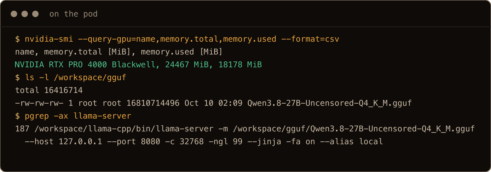
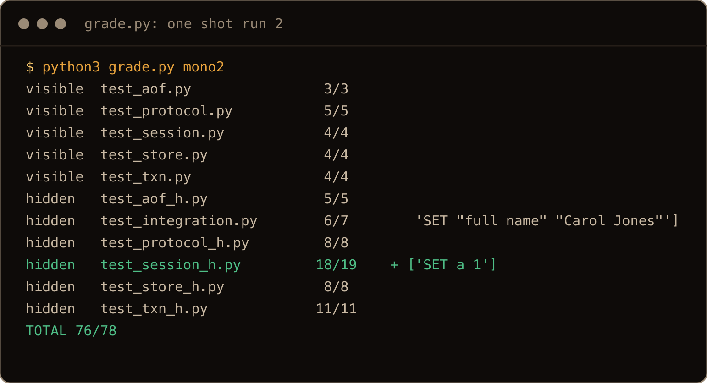
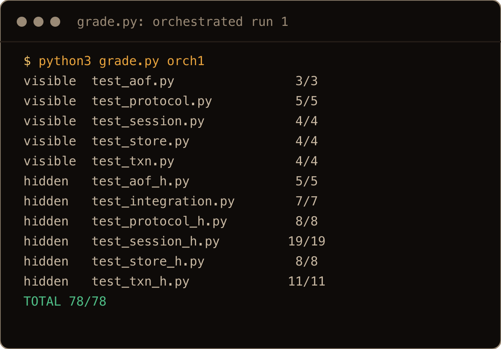
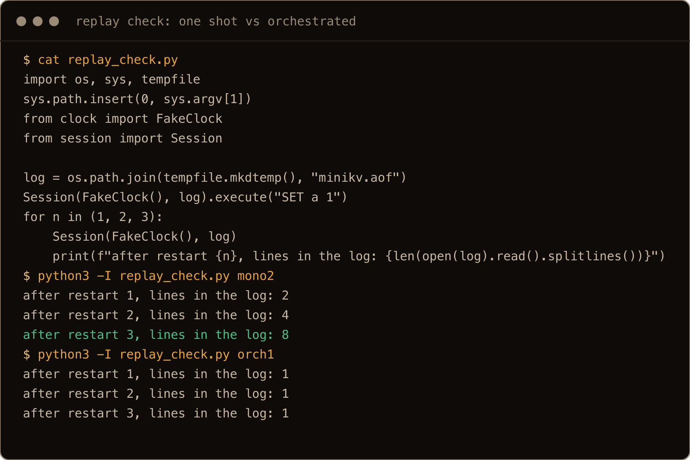

I want a local model for the privacy it gives me. And if I do have to use a frontier model as the master control node, the problem is cost: frontier models are expensive, and the subscription usage limits keep getting smaller and smaller. A local model lets me offset that.

So the question is whether the expensive model can do the thinking while the cheap one does the typing, and whether anything worth having comes out the other end. (For this test the "local" model ran on a rented RunPod card, which is not private from RunPod. It's the same 16.8 GB file that runs on any 24 GB card you own.)

There are already plenty of posts on wiring Claude Code to Ollama or a local endpoint. What I couldn't find was anyone measuring whether the split actually beats just giving the local model the whole job. So I had Claude set up a small project with hidden tests, ran it both ways on the same card, and graded it with the same script. This is what came out, including the parts that don't flatter the idea.

> **TL;DR.** Orchestrated (Claude writes five small task prompts, reviews every result against the spec, sends defects back with a reproduction): **78/78 and 77/78** on the full test suite, 58 of those tests hidden from the worker. One big prompt to the same model: **76, 74 and 71 out of 78**, and the 71 was the run with the most turns. Every one shot run shipped the same bug (replaying the log wrote it out again), and both orchestrated runs had it too, until review caught it. The worker was Qwen3.8 27B Q4_K_M on llama.cpp, one RTX PRO 4000 Blackwell at $0.57/hr, 32K context, and the whole session cost about forty cents of GPU. The review is where the defects died. This setup can't say how much the splitting alone buys.

## Contents

- [The setup](#the-setup)
- [The test project](#the-test-project)
- [The worker harness](#the-worker-harness)
- [How the orchestrated run works](#how-the-orchestrated-run-works)
- [Results](#results)
- [What the review caught](#what-the-review-caught)
- [What the review missed](#what-the-review-missed)
- [More turns made one shot worse](#more-turns-made-one-shot-worse)
- [Gotchas I hit](#gotchas-i-hit)
- [Honest limits](#honest-limits)
- [Quick reference](#quick-reference)

## The setup

Two roles. "Claude Code with a local model" gets used for two different setups, so here is which is which.

The first setup points Claude Code itself at a local endpoint, so the local model becomes the whole agent. That's not this. Here Claude stays Claude. It plans, writes the task prompts, reads the code that comes back, runs probes against it, and decides what goes back for rework. The local model is a worker it calls through a small harness, one stateless conversation per task, with four tools and a workspace folder.

| | |
| --- | --- |
| Orchestrator | Claude, in a Claude Code session on my Mac |
| Worker | `Qwen3.8-27B-Uncensored-Q4_K_M.gguf` (16.8 GB), llama.cpp `llama-server` |
| GPU | 1x RTX PRO 4000 Blackwell, 24 GB, RunPod Secure, $0.57/hr |
| Context | 32,768 tokens, `--jinja`, flash attention on, thinking off, temperature 0.2 |
| Reach | SSH tunnel from the Mac to the pod's port 8080 |

I wanted the RTX A5000 at $0.27/hr, which is what the first round of this experiment ran on, but RunPod had none in stock when I asked. The PRO 4000 was next on the list. The card changes speed. The model file and settings are identical, but the harness changed between the rounds, so the two aren't a card comparison.

The server on the pod is one line:

```bash
llama-server -m /workspace/gguf/Qwen3.8-27B-Uncensored-Q4_K_M.gguf \
  --host 127.0.0.1 --port 8080 -c 32768 -ngl 99 --jinja -fa on --alias local
```

It listens on localhost only, and I reach it through a tunnel instead of RunPod's public proxy:

```bash
ssh -f -N -p <pod-ssh-port> -i ~/.runpod/ssh/runpodctl-ssh-key \
  -o ExitOnForwardFailure=yes -L 8091:127.0.0.1:8080 root@<pod-ip>
curl -s http://127.0.0.1:8091/health
```

The prebuilt llama.cpp comes from my own Cloudflare R2 bucket. The model came from Hugging Face for the measured runs and is now mirrored to the same bucket. For the screenshot run below, a fresh pod pulled both from R2 and was serving in 379 seconds, a little over six minutes, five of them the 15.7 GiB model download. If you're starting from scratch, [the vLLM post](/blog/self-host-qwen-runpod-vllm/) covers renting the card and what RunPod bills you for.



The pod screenshots come from a fresh pod after the runs above, so the times and token counts in them differ from the tables.

## The test project

A toy project is only useful if it has corners. This one is `minikv`, a key value store in plain Python with five modules that depend on each other:

| Module | What it does | The corner that bites |
| --- | --- | --- |
| `store.py` | keys, values, expiry | `ttl` rounding, expired keys still in the dict |
| `txn.py` | nested transactions on top of the store | a key deleted in a transaction must read as missing, even if the store still has it |
| `protocol.py` | parse and format text commands | quoting rules, error order, `KEYS` takes no arguments |
| `aof.py` | append only log file | a torn last line is ignored, a blank line is kept |
| `session.py` | ties it together, replays the log at startup | replayed lines must not be logged again; transactions buffer their lines |

The spec is one page. There are 78 `unittest` tests: 20 the worker can see (one file per module) and 58 it never sees, covering edge cases and cross module scenarios. A reference solution written from the spec alone passes 78/78, so the tests are satisfiable. The grader takes the denominator from the test files, never from the submission, and only copies the five spec modules into its sandbox, so a stray file in the workspace can't shadow anything. It also runs Python with `-I` and counts results from the runner itself, so a fake `unittest.py` or a doctored summary gains nothing.

## The worker harness

The worker is a Python script, `worker.py`, that holds one conversation with the model through the OpenAI style `/v1/chat/completions` endpoint and gives it four tools:

- `list_files` and `read_file`, confined to the workspace folder
- `write_file`, confined the same way (absolute paths, `..` and symlinks out are refused)
- `run_command`, limited to `python3` scripts, `python3 -c`, `python3 -m unittest`, `ls`, `cat` and `pwd`, relative paths only

It also has a repeat guard: when the same sequence of one to three turns, tool calls and results included, repeats four times in a row, it gets a warning, and if it carries on, the run stops with `repeat-stop`. Every call prints one JSON line (trimmed here; a `done` run also carries the model's summary):

```json
{"turns": 6, "calls": 6, "bad_calls": 0, "completion_tokens": 693, "max_prompt_tokens": 2060, "total_prompt_tokens": 9455, "repeat_warnings": 0, "finish": "done", "secs": 55.1}
```

`finish` is the field that matters. `done` means the model said it was finished. `max-turns` means it ran out of turns, and in my runs that usually meant it was going in circles.


## How the orchestrated run works

Five tasks, one per module, in dependency order:

1. **Stage A, in parallel:** `store.py`, `protocol.py`, `aof.py`. Nothing depends on anything yet. Three tasks against one `llama-server`, and the slowest of them finished in 87 seconds.
2. **Review.** Claude reads each file against the spec and probes it with `python3 -c` one liners: the edge cases the spec names, error messages, round trips.
3. **Rework** for anything wrong, while the next module starts.
4. **Stage B:** `txn.py` (needs the store), then `session.py` (needs everything).
5. At most two rework rounds per task. After that, whatever is there gets graded.

Each task prompt is the spec text for that module, the interfaces of the modules it uses, the test command, and the line doing the most work: "the final grading uses extra tests you cannot see, so follow the requirements exactly". Here is the store prompt, trimmed:

```text
Write store.py (test file: test_store).
The workspace contains clock.py and a visible test file for your module. Plain Python 3 standard
library only. Run the test file with `python3 -m unittest <testfile without .py>` and fix failures.
The final grading uses extra tests you cannot see, so follow the requirements exactly, including
edge cases and error messages. Keep to the file named below; do not edit other files or the tests.

class Store(clock); attribute `clock` holds the clock. ...
- ttl(key) -> -2 if missing or expired, -1 if the key has no expiry, otherwise the remaining
  seconds rounded UP to an int (math.ceil(expire_at - now)).
```

A rework prompt states the defect, gives a short reproduction, and quotes the spec. No hint at the cause. This one, trimmed:

```text
Review of the current txn.py against the spec found that, inside a transaction, a key that was
deleted or has expired is still treated as present by some methods.

    t.delete("a")      # True, correct
    t.delete("a")      # returns True, required False (the key is no longer visible to this transaction)
    t.ttl("a")         # returns -1, required -2 (missing)
```

The one shot condition got the whole spec in a single prompt, all five modules at once, with the same tools, the same visible tests and a budget of 90 turns.

## Results

All runs on the same pod, same model, same harness, same grader.

| Run | Score (58 hidden + 20 visible) | Worker turns | Completion tokens | Worker time | Largest prompt | How it ended |
| --- | --- | --- | --- | --- | --- | --- |
| **Orchestrated, run 1** | **78/78** | 84 | 12,594 | 672 s | 7,832 | all tasks done |
| **Orchestrated, run 2** | **77/78** | 69 | 11,852 | 673 s | 6,014 | one rework ran out of turns |
| One shot, run 1 | 74/78 | 23 | 5,395 | 204 s | 10,469 | repeat guard stopped it |
| One shot, run 2 | 76/78 | 11 | 4,497 | 221 s | 8,568 | said it was done |
| One shot, guard off, 90 turns | 71/78 | 90 | 22,442 | 935 s | 32,001 | out of turns, context nearly full |





Both graded again for the screenshots, from the workspaces those runs left behind.

Worker time for the orchestrated runs is summed across tasks. Three of them ran in parallel, so the wall clock was shorter.

The headline is the gap, 77 to 78 against 71 to 76, but the more useful number is in the Largest prompt column. No orchestrated prompt got past 8K tokens. The one shot runs went to 10K and 8.5K and the long one ran to within 800 tokens of the 32K limit. The small tasks keep the model in the part of its context where it still pays attention.

The cost of that is turns. Orchestration took three to eight times as many worker turns as the one shot runs that stopped on their own. On a card that bills by the hour, that's a few extra minutes: the whole session, both conditions and all five runs, was 42 minutes of pod time, about $0.40.

## What the review caught

Every defect below passed the visible tests. That's the point of having hidden ones.

| Module | Defect | Run 1 | Run 2 |
| --- | --- | --- | --- |
| `protocol.py` | `KEYS` not implemented at all; `parse("KEYS")` raised "unknown command" | fixed in one rework | fixed in one rework |
| `txn.py` | a deleted or expired key still counted as found: second `delete` returned True, `ttl` gave -1, an expired key stayed in `keys()` | fixed in one rework | fixed in one rework |
| `txn.py` | a key deleted in an outer transaction was still visible inside a nested one | not present | still there when the rework rounds ran out |
| `session.py` | replaying the log at startup wrote every line out again, so the file doubled on each restart | fixed in round two | fixed in one rework |
| `session.py` | an inner `ROLLBACK` kept that transaction's lines, so a rolled back `SET` reached the log | fixed in round two | not present |

The replay bug is the one I'd frame. Every one shot run shipped it: all three fail the hidden test `test_replay_does_not_relog`. The orchestrated runs wrote it too, both times. The only difference is that Claude read `__init__`, saw the replay loop call `execute()`, and knew `execute()` logs. It's an easy bug to write and an easy bug to see, as long as somebody is looking.



The same goes for `txn.py`. The model wrote the same "deleted means found" bug in both orchestrated runs, and the first round of this experiment, the day before, hit it too. It's a stable blind spot.

I wouldn't trust it on its own, like any model. I would need to review its output. It will tell you it's done with the replay bug still in there, so the shape that works is well specified modules going out and something else doing the reading.

## What the review missed

The second orchestrated run lost one test, and it's a fair hit. The spec says to quote an argument when it is empty or contains whitespace or a double quote. The worker also quoted values with a backslash in them, so `format_command` produced `SET k "a\\b"` where the hidden test wanted `SET k a\b`. Both forms parse back to the same command, so a round trip check passes either way. Catching it means checking what `format_command` writes, character by character, and the review didn't.

And the nested transaction bug in run 2 was still there when its rework rounds ran out (only the second one was about it), but none of the 58 hidden tests exercise that case, so it cost nothing on the scoreboard. The review found a real defect the tests can't see, and the tests found one the review missed. Neither is a complete check on its own.

## More turns made one shot worse

The obvious objection to the first round of this experiment was budget: the orchestrated run used 88 turns and the one shot run only 40. So this time one shot got 90 turns, and one run had the repeat guard switched off so it could use all of them.

It used all of them and scored the worst of the five, 71/78. By the end its prompt was 32,001 tokens, within 800 of the 32,768 limit, because every turn appends the tool results to the conversation. The shorter runs failed two and four hidden tests. This one failed seven, including the transaction logging tests the shorter runs passed. More rope, same model, worse code. The runs with the guard on stopped themselves at 23 and 11 turns and did better.

So the gap isn't that orchestration gets more turns. It's that each turn happens in a short, focused conversation, with a reviewer deciding what the next one is about.

## Gotchas I hit

**The command filter is not a sandbox.** In one session rework the worker spent twelve of its twenty turns running the same check script with a new file name each time: `/tmp/aof1.txt`, `/tmp/aof2.txt`, up to `/tmp/aof12.txt`. Two problems in one. The absolute path was inside a `python3 -c` string, which the filter doesn't parse, so it wrote eleven files into `/tmp` on my Mac. And because each turn used a different file name, no two turns were identical and the repeat guard never fired. The worker's code runs as you, on your machine. Give it a workspace with nothing in it that matters.

**`finish: done` is the model's opinion.** Every task that ended `done` with a defect still in it came back with a cheerful summary saying all tests pass or everything is correct. They did pass. The visible ones.

**`max-turns` means read the code.** Three worker calls ran out of turns across the orchestrated runs. One was the original session task, which left code that passed its visible tests with two defects in it. The other two were reworks that didn't fix what they were sent to fix. The status tells you it stopped, not what it left behind.

**A second rework needs to say where.** The first session rework (defect plus reproduction plus spec) changed nothing at all. The second named the method and described the fix, and it was done in seven turns. That's the orchestrator doing more of the work, and it counts against the "Claude only reviews" story. It's in the honest limits below.

**Budget for the review.** The worker's numbers are in the table. Claude's aren't: reading five modules, writing probes and writing rework prompts is real orchestrator time and tokens, and it isn't counted anywhere above.

## Honest limits

- **Two runs per condition is still small.** The model isn't deterministic: the one shot runs scored 76, 74 and 71 with the same prompt. The gap held across every pair, but I wouldn't put a decimal place on it.
- **Run 2's review wasn't fully blind.** Claude reviewed run 1 without having seen any hidden test. Before run 2, grading the one shot runs had shown it short failure notes from the hidden tests. The run 2 review was held to the same probes and spec reading as run 1, but a note can't be unseen.
- **The spec is precise, and the review leans on it.** A reviewer reading a vaguer spec would catch less. Part of the win is a precise spec, which is also true when the worker is a person.
- **Some rework prompts went beyond the spec.** The second session rework in run 1 described the fix (a replay flag, one buffer per transaction), not just the defect.
- **Context was never the binding constraint for orchestration.** Its largest prompt was under 8K. This project doesn't show whether decomposition rescues a codebase that doesn't fit in 32K, only that it keeps the model well clear of the limit.
- **Orchestrator cost isn't counted.** Claude's tokens are the expensive ones, and the comparison above is worker cost only.

## Quick reference

| Thing | Value |
| --- | --- |
| Model | `Qwen3.8-27B-Uncensored-Q4_K_M.gguf`, 16,810,714,496 bytes |
| Card | 24 GB is enough at 32K context (RTX PRO 4000 Blackwell here, RTX A5000 in the first round) |
| Server | `llama-server -c 32768 -ngl 99 --jinja -fa on --alias local` |
| Worker settings | temperature 0.2, `enable_thinking: false`, `max_tokens` 4096 |
| Task size that worked | one module, 20 to 150 lines, its spec text, its interfaces, its test command |
| Rework | defect, reproduction, spec text; at most two rounds |
| Trust | `finish: done` and passing visible tests mean nothing until someone reads the code |

The cheap model is good enough for small, well specified tasks like this one. Would I trust it to touch my database? Probably not. But I can use it for automation tasks like Python or Bash scripts. Like with any model, check the output. Don't just run whatever it gives you.
