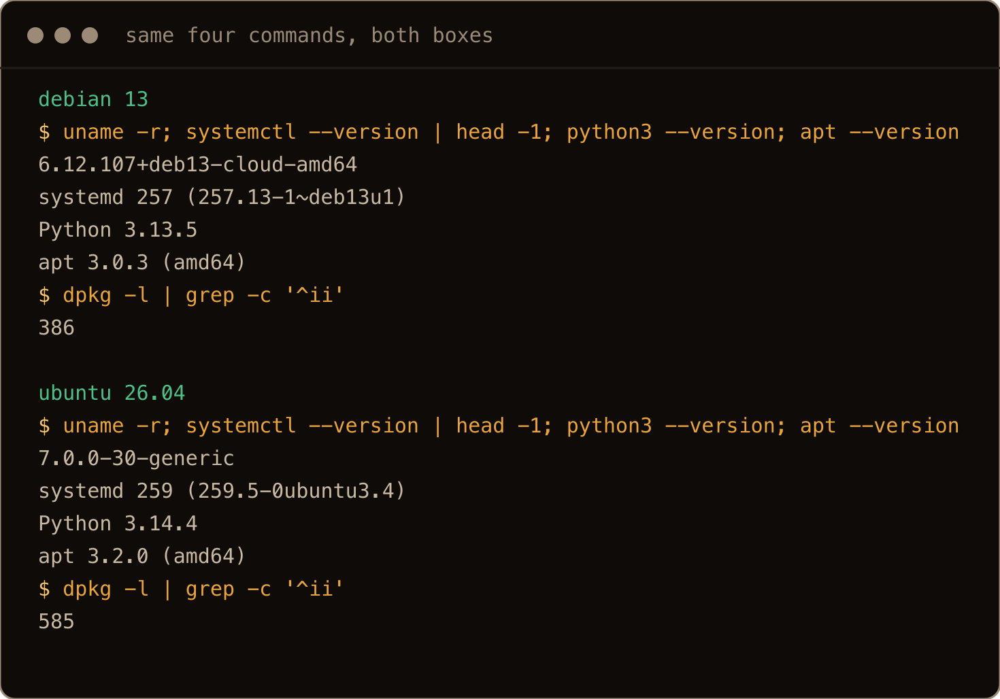
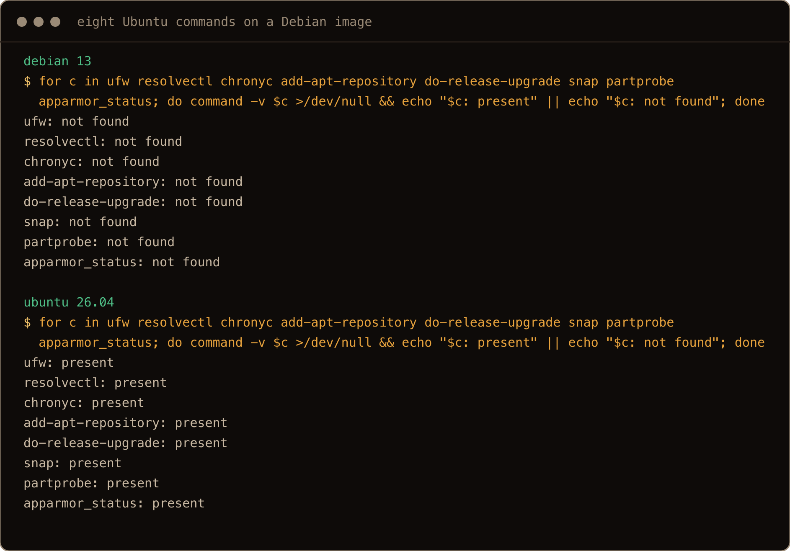
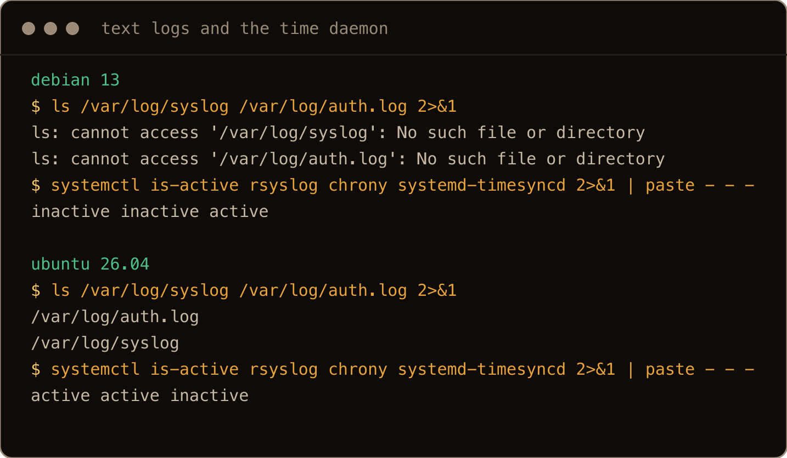
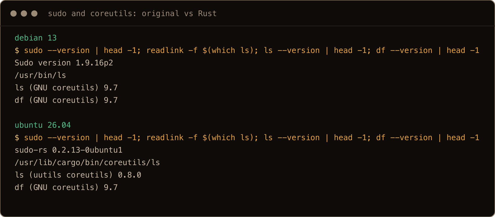
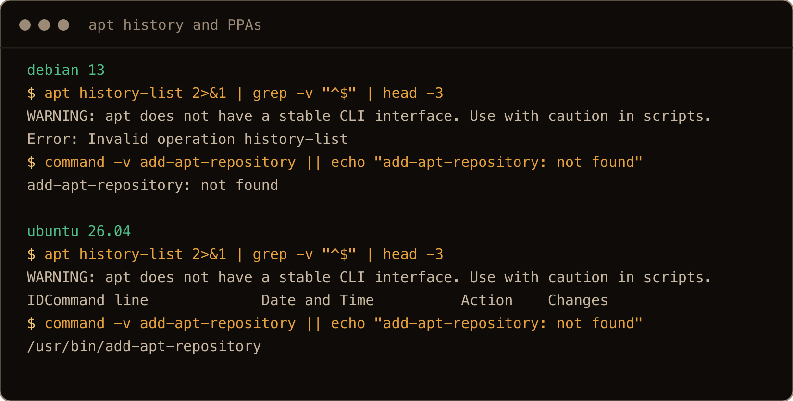

Most of the boxes I look after run Ubuntu, and the three Debian 13 posts on this site so far ([static IP](/blog/static-ip-debian-13/), [hardening](/blog/hardening-debian-13-server/), [Docker](/blog/install-docker-debian-13/)) each started with me typing an Ubuntu command at a Debian prompt and getting nothing back. This is the post I wanted before any of them: one list of what actually changes when you sit down at Debian 13 with Ubuntu habits, and, just as useful, what does not.

I built it the only way that works for a comparison. One fresh Debian 13 server and one fresh Ubuntu 26.04 server from the same provider, the same script run on both, and the differences below are the ones that came back. Where something is a property of the cloud image rather than the distribution, I say so, because that turned out to matter more than I expected: a surprising amount of "Debian is different" is really "this image is different."

> **TL;DR.** My apt, systemd and journalctl habits carried straight over; the pip lockout and the storage tools are the same too. Networking did not carry: this Debian image uses ifupdown, dhcpcd and resolvconf where Ubuntu uses netplan, networkd and resolved, and it has none of ufw, snap, PPAs, `apt history`, `resolvectl`, rsyslog, chrony or AppArmor, with older versions of nearly everything (kernel 6.12 against 7.0, Python 3.13 against 3.14). sudo is the original C sudo and coreutils are GNU's, not the Rust rewrites. Ubuntu supplied the one trap that runs the other way: sshd is socket activated there, so a `Port` change needs `daemon-reload` and a restart of `ssh.socket`.

## Contents

- [What is the same](#what-is-the-same)
- [The versions](#the-versions)
- [Networking is a different stack](#networking-is-a-different-stack)
- [Firewall and security](#firewall-and-security)
- [Logs, updates and time](#logs-updates-and-time)
- [sudo, coreutils and su](#sudo-coreutils-and-su)
- [Packaging: what is not there](#packaging-what-is-not-there)
- [SSH: the socket trap runs the other way](#ssh-the-socket-trap-runs-the-other-way)
- [Docker, Python and disks: do the other posts hold](#docker-python-and-disks-do-the-other-posts-hold)
- [Which one I would pick](#which-one-i-would-pick)
- [Gotchas I hit](#gotchas-i-hit)
- [Quick reference: Ubuntu habit to Debian equivalent](#quick-reference-ubuntu-habit-to-debian-equivalent)

## What is the same

Start here, because it is most of the list and it is why the switch is easier than it looks. On both boxes:

- `apt`, `apt-get`, `dpkg`, `apt-cache`, deb822 `.sources` files under `/etc/apt/sources.list.d/`, and `apt modernize-sources` to convert old `.list` files. Debian has no `/etc/apt/sources.list` at all on this image; Ubuntu's is a four line comment pointing you at `ubuntu.sources`.
- systemd, `systemctl`, `journalctl`, and journald with the same configuration: an all comments `journald.conf` on both, the same `syslog.conf` forwarding drop-in under `/usr/lib`, 8M of journal on a fresh boot, and the same size formulas from the [journald retention post](/blog/journald-disk-usage-retention-ubuntu-26-04/).
- bash as the login shell, a near identical `/etc/skel/.bashrc` with the colour prompt commented out, vim and nano both installed.
- cloud-init, which on both images creates only `root`, leaves the `sudo` group empty, locks root's password, and drops a `root ALL=(ALL) NOPASSWD:ALL` line in `/etc/sudoers.d/90-cloud-init-users`. That is the image, not the distribution. An installer build of either normally gives you a user, with a Debian wrinkle covered below.
- sshd with root allowed by key only (`sshd -T` prints it as `prohibit-password` on Ubuntu and the older spelling `without-password` on Debian, same setting) and `PasswordAuthentication yes`, plus an `Include /etc/ssh/sshd_config.d/*.conf` line for your own config files.
- The Python lockout. Both have the `EXTERNALLY-MANAGED` marker, neither has pip or a working `python3 -m venv` until you install `python3-pip` and `python3-venv`. The [pip post](/blog/pip-externally-managed-environment-ubuntu-26-04/) runs unchanged on Debian 13, which I checked.
- `unattended-upgrades` installed and switched on. The allowed origins differ (Debian lists its own security and stable origins, Ubuntu lists ESM ones too) but the behaviour is the same: security updates apply themselves.
- LVM, `gdisk`, `growpart`, `e2fsprogs`, `xfsprogs`, `mdadm`, `cryptsetup`, `btrfs-progs`. The [add a disk post](/blog/add-disk-fstab-lvm-ubuntu-26-04/) works on Debian with one exception below.
- fail2ban, once installed, ships the same `jail.d/defaults-debian.conf` on both, which I installed on each to check: `banaction = nftables`, sshd jail on `backend = systemd`. The [hardening post](/blog/hardening-debian-13-server/)'s fail2ban lockout applies to both distributions.

If your day is `apt install`, `systemctl`, `journalctl` and editing files under `/etc`, you will not notice which one you are on until you touch networking, the firewall, or something Ubuntu added.

## The versions

Debian ships what was stable at freeze and stays there. Ubuntu 26.04 came out eight months after Debian 13 and shows it, with two exceptions worth noting under the table:

| | Debian 13 (13.6, trixie) | Ubuntu 26.04.1 (resolute) |
| --- | --- | --- |
| Kernel | 6.12 (`-cloud-amd64`) | 7.0 (`-generic`) |
| systemd | 257 | 259 |
| Python | 3.13.5 | 3.14.4 |
| apt | 3.0.3 | 3.2.0 |
| bash | 5.2 | 5.3 |
| OpenSSH | 10.0 | 10.2 |
| `docker.io` in the archive | 26.1.5 | 29.1.3 |
| Packages installed, fresh image | 386 | 585 |
| Released | 9 August 2025 | April 2026 |
| Security support until | August 2028, then LTS to June 2030 | May 2031, then Ubuntu Pro to 2036 |



The screenshots in this post are from a second fresh pair of boxes run the same day, so their outputs match the table and the quoted outputs in the text.

The release and support dates are from the two projects' release pages, not from the lab. Everything else is what the boxes printed. Not quite everything is older on Debian: `util-linux` is a point release newer there, and GNU `df` is 9.7 on both. Two rows matter more than they look. The kernel: 6.12 is Debian's default for the life of the release, with a newer one in `trixie-backports` (7.1 on the day) if you opt in, and Ubuntu's newer hardware enablement kernels are likewise opt in on a server. And the package count: this Debian image is a smaller thing. The 200 extra packages on the Ubuntu image are the pieces this post is mostly about, ufw, netplan, snapd, rsyslog, AppArmor, chrony, `needrestart`, `command-not-found`, the Pro client, landscape.

One oddity for the collection: `/etc/debian_version` on the Ubuntu box says `forky/sid`, because Ubuntu syncs from Debian unstable, and `lsb_release` on Debian says `13` with codename `trixie`. Debian point releases count up, 13.6 was on the image and 13.7 was already in the archive the day I ran this; Ubuntu's are `26.04.1`, `26.04.2`.

## Networking is a different stack

This is the biggest difference and the one with a whole [post](/blog/static-ip-debian-13/) behind it, so briefly:

| | Debian 13 (this image) | Ubuntu 26.04 |
| --- | --- | --- |
| Config | `/etc/network/interfaces.d/` (ifupdown) | `/etc/netplan/*.yaml` |
| Brought up by | `networking.service` (runs ifupdown once at boot) | `systemd-networkd` |
| DHCP client | `dhcpcd` | `systemd-networkd` (dhcpcd installed, not running) |
| DNS | `resolvconf` writes `/etc/resolv.conf` | `systemd-resolved`, stub at `127.0.0.53` |
| `resolvectl` | command not found | works |

`netplan.io` is in the Debian archive, and `ifupdown` is in Ubuntu's, so either box can be made to look like the other. Out of the box they are not, and the muscle memory that fails first is `resolvectl status` on Debian and `ls /etc/netplan` (no such directory). `systemd-networkd` is installed but disabled on Debian; moving to it means writing a `.network` file, taking the interface away from ifupdown and dhcpcd, and sorting out DNS, which is the second half of the static IP post.


## Firewall and security

Neither image starts with a firewall running: nftables is installed and disabled on both, with an empty ruleset. From there they diverge. The Ubuntu image has `ufw` installed (inactive until you `ufw enable`) and AppArmor loaded with 182 profiles. The Debian image has neither: no `ufw` binary, no `apparmor` package, no profiles. `apt install ufw` works on Debian (0.36.2, the same version), and the [hardening post](/blog/hardening-debian-13-server/) shows the raw nftables ruleset I use instead. AppArmor is in Debian's archive too (4.1.0), so `apt install apparmor` is all it takes; this image just does not ship it.



## Logs, updates and time

Three quiet differences that each change a habit:

**Logs.** The Ubuntu image installs rsyslog, so `/var/log/syslog` and `/var/log/auth.log` exist and are text copies of the journal. The Debian image does not, so those files do not exist and the system log is the journal only (`dpkg.log`, the apt logs and `cloud-init.log` are still plain files). If you `grep /var/log/auth.log` by reflex, that is the first thing to break, and the fix is `journalctl _COMM=sshd-session` or `-u ssh`. It also means Debian is not paying for the second copy the journald post measured.

**Updates.** Both run `unattended-upgrades`. The Ubuntu image also ships `needrestart`, which runs after `apt upgrade` and, as configured there, restarts the services that need it rather than asking. The Debian image does not have it, so after an upgrade you check and restart services yourself (package scripts still restart some, sshd among them), or install `needrestart` from the archive. Ubuntu's `motd` runs twelve scripts, including the news feed and the Ubuntu Pro advert; Debian's runs two.

**Time.** Ubuntu uses chrony, so `chronyc tracking`. Debian uses `systemd-timesyncd`, so `timedatectl timesync-status`. `chronyc` is not found on Debian, and `timesync-status` on Ubuntu errors out because the timesyncd service is not there. Both were synced out of the box, Debian to the provider's NTP server and Ubuntu's chrony to Canonical's own pool.



## sudo, coreutils and su

Ubuntu 26.04 swapped two of the oldest pieces of the system for Rust rewrites, and Debian 13 did not. (Original sudo is its own project, not a GNU one; coreutils is GNU's.)

```text
Debian:  Sudo version 1.9.16p2        ls (GNU coreutils) 9.7
Ubuntu:  sudo-rs 0.2.13-0ubuntu1      ls (uutils coreutils) 0.8.0
```

On Debian, `sudo` is the original sudo and `/usr/bin/ls` is GNU coreutils 9.7, the whole set. On Ubuntu, `sudo` is `sudo-rs` at `/usr/lib/cargo/bin/sudo`, and `ls` and `cat` are uutils while `df` is still GNU 9.7, a half finished swap that has its own post coming. Everything in the [sudo-rs post](/blog/sudo-rs-vs-gnu-sudo-ubuntu-26-04/) about what changed is a list of things that did not change on Debian. If a script of yours depends on a GNU only flag, Debian is where it still works.



`su` is the same util-linux binary on both, and on both cloud images `su -` to root from a normal user fails with `Authentication failure`, because root's password is locked. I tried it on each. That is worth knowing on Debian specifically, where the old habit of `su -` instead of `sudo` comes from. On a Debian you install yourself, the installer asks for a root password, and if you set one it does not put your user in the `sudo` group, which is the origin of every "sudo: command not found" or "user is not in the sudoers file" thread about Debian. I did not run the installer for this post; that behaviour is documented rather than tested here.

## Packaging: what is not there

Same apt, different surroundings. On Debian:

- No PPAs. `add-apt-repository` does not exist and `software-properties-common` is not in the archive. PPAs are built on Launchpad against Ubuntu releases, so a guide that says `add-apt-repository ppa:something` is a guide you cannot follow on Debian. The answer is the project's own Debian repo, backports, or a `.deb`. Ubuntu added the deadsnakes PPA in one command on its box.
- No `apt history`. Ubuntu's apt 3.2 has `history-list`, `history-info`, `history-undo` and `history-rollback`, the subject of the [apt history post](/blog/apt-history-undo-rollback-ubuntu-26-04/). Debian's apt 3.0.3 has none of them; `apt history-list` answers `Error: Invalid operation history-list`. `/var/log/apt/history.log` is there on both, so the record exists, but the undo does not.
- No `do-release-upgrade`. Debian moves between releases by editing the suite in every `.sources` file, `apt update`, then `apt full-upgrade`, following that release's notes. I did not do it here.
- No snap. `snapd` is in Debian's archive but not installed on this image. On the Ubuntu image the `snap` command is present with no snaps installed, and it shapes one more difference: type a missing command on Ubuntu and `command-not-found` tells you how to install it (`snap install tree` on my run, `apt install tree` on another); on Debian you get `bash: tree: command not found` and nothing else.
- Backports are enabled on both images at priority 100, so nothing new installs from them unless you ask with `-t trixie-backports` or `-t resolute-backports` (a package you did pull from backports keeps updating from there). This Debian image's sources also carry `contrib non-free non-free-firmware`, which used to be the first edit on a new Debian box.



## SSH: the socket trap runs the other way

Here is the one difference that bit the Ubuntu side, and I would not have found it without running both. Debian runs sshd the old way, `ssh.service` enabled, the daemon listening on 22 itself. Ubuntu runs it socket activated: `ssh.socket` enabled, `ssh.service` disabled, systemd holding port 22 and starting sshd on the first connection.

That changes what happens when you change the port. I added a config file with `Port 22` and `Port 2222` under `sshd_config.d` on both boxes and restarted `ssh`:

```text
Debian:  0.0.0.0:22 and 0.0.0.0:2222 both listening after `systemctl restart ssh`
Ubuntu:  only 0.0.0.0:22 listening after `systemctl restart ssh`
```

On Ubuntu, sshd never gets to open its own ports; systemd owns the sockets, and the socket unit still said 22. Ubuntu ships a generator, `sshd-socket-generator`, that rewrites the socket unit's `ListenStream=` lines from `sshd_config`, but it runs on `daemon-reload`, not on a service restart. After `sudo systemctl daemon-reload && sudo systemctl restart ssh.socket ssh`, 2222 was listening on Ubuntu too. If you have ever changed the port on an Ubuntu box, restarted ssh, and found it still on 22, that is the whole story. Debian does not have this problem, and neither does Ubuntu if you disable the socket and enable the service, which is exactly what Debian's default is.


## Docker, Python and disks: do the other posts hold

The three verified 26.04 guides most likely to be reused on Debian, checked on the Debian box:

- Docker. Use Docker's own repo on both; the [Debian version](/blog/install-docker-debian-13/) is the same recipe with `linux/debian` and `trixie`. The archive versions are worth a look though: Debian's `docker.io` is 26.1.5, Ubuntu's is 29.1.3, so the "archive is old" argument is much stronger on Debian.
- Python. Identical. `apt install python3-pip python3-venv`, then venvs. pipx is 1.7.1 on Debian against 1.8.0, `uv` is in neither archive and its installer gave 0.12.17 on both boxes. Every command in the pip post ran the same on Debian.
- Disks. One difference: `partprobe` is not on the Debian cloud image, because `parted` is not installed, and the add a disk post uses it after `sgdisk`. `sudo partx -u /dev/sdb` does the same job with what is installed, or `apt install parted`. The rest, `sgdisk`, `mkfs.ext4`, the UUID line in fstab with `nofail`, `daemon-reload`, `mount -a`, `findmnt --verify` and `growpart`, ran unchanged, and the LVM tools are the same version; I did not repeat the LVM steps. `findmnt --verify` on Debian also warns about the `/media/cdrom0` line the image ships in fstab, which is harmless.

## Which one I would pick

For a server I want to leave alone, read with `journalctl`, and not think about for two years, Debian. Fewer moving parts, nothing phoning home about Pro, no snap, and the homelab things I already run (Proxmox, the Pi) are Debian underneath, so the habits carry. The cost is older versions and doing your own firewall.

For a box where I want this year's kernel, a vendor's PPA, hardware enablement, or the option of paid support with a long tail, Ubuntu LTS, and for anything where the guide I am following assumes Ubuntu, because it usually does. Pick by what the box is for. For me the one habit that genuinely needs relearning is networking; the rest is knowing which commands are not there.

## Gotchas I hit

- **Most "Debian is different" is "this image is different."** Root only, locked root password, no AppArmor: all image choices. Scope your surprise before you blame the distribution.
- `resolvectl`, `ufw`, `chronyc`, `add-apt-repository`, `do-release-upgrade`, `partprobe`, `snap`: command not found on Debian. Each has an answer above. The archive has the packages for all of them except two: `add-apt-repository`, because PPAs are an Ubuntu thing, and `do-release-upgrade`, because Debian upgrades by editing the sources.
- **`apt history` is Ubuntu's apt 3.2.** Debian's 3.0 does not have it. The log file exists; the undo does not.
- No rsyslog text logs on Debian. No `/var/log/syslog` or `auth.log`, so the system log is `journalctl` only.
- **Changing the SSH port on Ubuntu needs a socket restart**, not just `systemctl restart ssh`, because sshd is socket activated. Debian's is not.
- **`su -` fails on both cloud images.** Root's password is locked. Use `sudo`, and make a user first.
- Debian's sudo is the original sudo and its coreutils are GNU's. Anything the sudo-rs post says stopped working on Ubuntu still works on Debian.
- Point releases roll the version number. The image was 13.6 with 13.7 already in the archive. `cat /etc/debian_version` tells you which you are on.

## Quick reference: Ubuntu habit to Debian equivalent

| Ubuntu habit | On this Debian 13 image |
| --- | --- |
| `sudo netplan apply` | `sudo ifdown eth0 && sudo ifup eth0` from the console, config in `/etc/network/interfaces.d/` |
| `resolvectl status` | `cat /etc/resolv.conf`, which resolvconf manages. Do not just `apt install systemd-resolved` to get `resolvectl`: on this image that removed resolvconf and broke DNS until resolved was configured. It is a migration, covered in the static IP post. |
| `sudo ufw allow 22` | `sudo apt install ufw` first, or write `/etc/nftables.conf` |
| `grep sshd /var/log/auth.log` | `journalctl -u ssh` or `journalctl _COMM=sshd-session` |
| `chronyc tracking` | `timedatectl timesync-status` |
| `sudo add-apt-repository ppa:x/y` | No equivalent. Project repo, backports, or a `.deb`. |
| `sudo apt history-undo <ID>` (an ID from `apt history-list`) | Not available. Read `/var/log/apt/history.log` and reverse the package changes by hand; that restores packages, not their data or config. |
| `sudo do-release-upgrade` | No equivalent command. Follow the target release's upgrade notes: they prepare sources and backports and stage the upgrade. This image's suites live in `/etc/apt/sources.list.d/*.sources`. |
| `snap install x` | Prefer the Debian package, the name may differ. Otherwise `sudo apt install snapd`, then `sudo snap install x`, and `snap run x` or log in again for `/snap/bin`. Snap confinement on this image is partial, not strict. |
| `sudo partprobe /dev/sdb` | `sudo partx -u /dev/sdb`, or `apt install parted` |
| `sudo apt install -t resolute-backports x` | `sudo apt install -t trixie-backports x` |
| `systemctl restart ssh` after a port change | Works on Debian. On Ubuntu add `daemon-reload` and `restart ssh.socket`. |
| `aa-status` | AppArmor not on the cloud image. `apt install apparmor` loads its profiles straight away, no reboot. |
| `sudo needrestart -r l` after upgrades | Not installed. `sudo apt install needrestart` first; it also adds the apt hook. |

`[ same apt, same journal, different plumbing ]`
