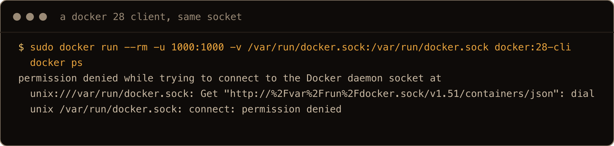
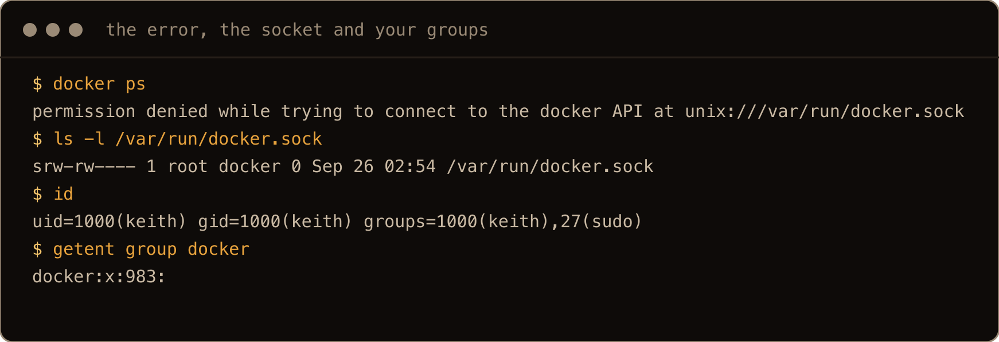
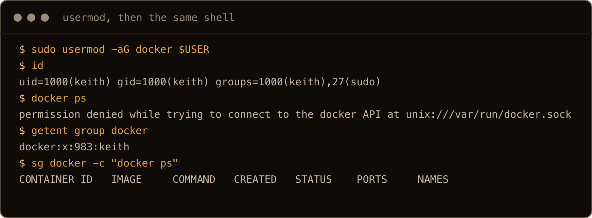
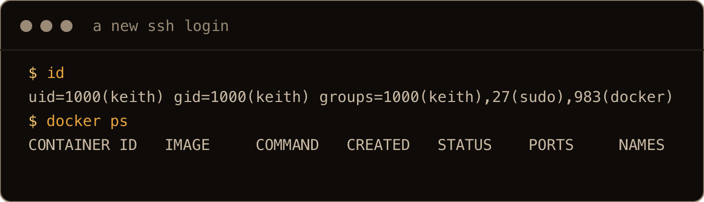
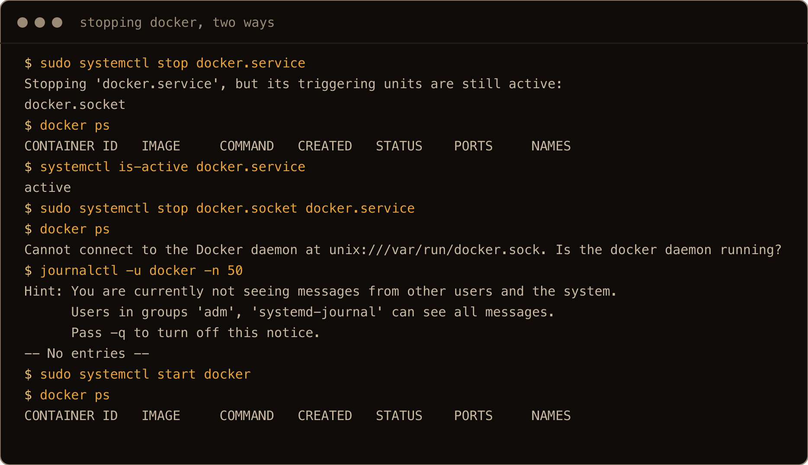
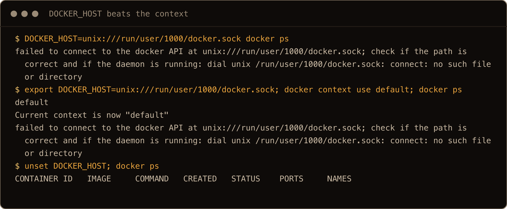
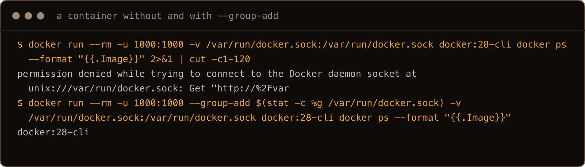
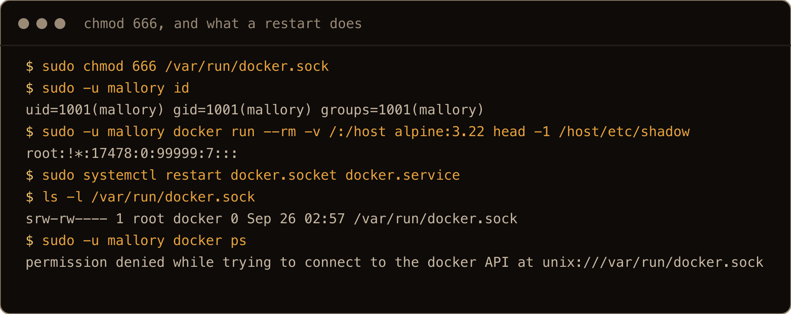

You install Docker, type `docker ps`, and get this back:

```text
permission denied while trying to connect to the docker API at unix:///var/run/docker.sock
```

Or you added yourself to the `docker` group ten minutes ago and still get it. The message names a file, so the first answer most people find is to `chmod 666` that file. It works, and it is the one fix to never use (section 7 shows why).

I reproduced every case in this post on a fresh Ubuntu 26.04 server with Docker 29.8.1 from Docker's apt repo, as a normal sudo user called `keith`.

The one thing to get straight: `docker` is only a client. The engine is a daemon running as root, and the two talk over one file, `/var/run/docker.sock`. That file belongs to `root` and the `docker` group, and only they can open it. "Permission denied" is the kernel refusing your process access to that file, before Docker has seen your command. Group membership is read when a login starts, which is why being added to the group does nothing for the shell you already have open.

> **TL;DR.** Check with `ls -l /var/run/docker.sock` (it should be `srw-rw---- root docker`) and `id` (look for `docker`). If `docker` is missing: `sudo usermod -aG docker $USER`, then log out and back in (or `newgrp docker` for the current shell). If the error says `Cannot connect to the Docker daemon` instead, the daemon is not running: `sudo systemctl start docker`. For a tool in a container with the socket mounted, run it with `--group-add $(stat -c %g /var/run/docker.sock)`. Never `chmod 666` the socket: any user on the box becomes root.

## Contents

- [1. The error, and why guides quote a different one](#1-the-error-and-why-guides-quote-a-different-one)
- [2. Check the socket and your groups](#2-check-the-socket-and-your-groups)
- [3. The fix: the docker group, then a new login](#3-the-fix-the-docker-group-then-a-new-login)
- [4. Not a permission problem: Cannot connect to the Docker daemon](#4-not-a-permission-problem-cannot-connect-to-the-docker-daemon)
- [5. The wrong socket](#5-the-wrong-socket)
- [6. Inside a container: --group-add](#6-inside-a-container-group-add)
- [7. Why not chmod 666](#7-why-not-chmod-666)
- [Gotchas I hit](#gotchas-i-hit)
- [Quick reference](#quick-reference)

## 1. The error, and why guides quote a different one

On Docker 29.8.1 the whole error is one line:

```text
$ docker ps
permission denied while trying to connect to the docker API at unix:///var/run/docker.sock
```

Most of the answers you will find quote a longer version. I ran the Docker 28, 27 and 26 clients (the `docker:28-cli` images and friends, as a user without access to the socket) against the same daemon, and all three printed the older wording:

```text
permission denied while trying to connect to the Docker daemon socket at unix:///var/run/docker.sock: Get "http://%2Fvar%2Frun%2Fdocker.sock/v1.51/containers/json": dial unix /var/run/docker.sock: connect: permission denied
```

Same cause, same fix. The API version in that URL varies with the client (`v1.51` from 28, `v1.47` from 27, `v1.45` from 26). The newer client just stopped printing the URL it was trying and the raw `dial unix` error. If you are searching for the message you got, search for both.



## 2. Check the socket and your groups

Three commands tell you which case you are in:

```text
$ ls -l /var/run/docker.sock
srw-rw---- 1 root docker 0 Sep 26 02:42 /var/run/docker.sock
$ id
uid=1000(keith) gid=1000(keith) groups=1000(keith),27(sudo)
$ getent group docker
docker:x:983:
```

Read them together. The socket is `rw` for its owner (`root`) and its group (`docker`), and nothing for anyone else. `id` shows `keith` in `keith` and `sudo`, not `docker`. And the `docker` group has no members. That is the whole problem: this user is neither root nor in the group, so the kernel says no.



The screenshots come from a clean run on a fresh box after the post was written, so timestamps differ from the text.

`sudo docker ps` works, because root can open the socket. That is fine for a one off, and tiresome as a habit.

## 3. The fix: the docker group, then a new login

```bash
sudo usermod -aG docker $USER
```

This is where people get stuck, because the next `docker ps` still fails. In the same shell, straight after the `usermod`:

```text
$ id
uid=1000(keith) gid=1000(keith) groups=1000(keith),27(sudo)
$ docker ps
permission denied while trying to connect to the docker API at unix:///var/run/docker.sock
$ getent group docker
docker:x:983:keith
```

The group file now lists `keith`, but the shell's own groups are the ones it got at login, and those have not changed. Any of these picks up the new group:

- log out and log back in (for SSH, a new connection). My next login showed `groups=1000(keith),27(sudo),983(docker)` and `docker ps` worked;
- `newgrp docker`, which starts a new shell with `docker` as its group, in the current terminal (`id` showed `gid=983(docker)` and `docker ps` worked);
- `sg docker -c "docker ps"` to run one command with the group.





`newgrp` only fixes that one shell and whatever you start from it. Log out and back in when you can. On a desktop, expect to log out of the whole session before other terminals and your editor see the group; I only tested SSH logins.

Be clear about what you just did, though. Being in `docker` is the same as having root on the machine (section 7 shows it), which the [Docker install post](/blog/install-docker-ubuntu-26-04/) covers. Add people you would also give `sudo` to.

## 4. Not a permission problem: Cannot connect to the Docker daemon

A different error, often mixed up with the first:

```text
Cannot connect to the Docker daemon at unix:///var/run/docker.sock. Is the docker daemon running?
```

This one means the file is there but nothing is listening on it. I got it by stopping both halves of Docker, and the socket file was still sitting there with its normal permissions:

```bash
sudo systemctl stop docker.socket docker.service
```

Stopping only `docker.service` was not enough to cause it. `systemctl` warned:

```text
Stopping 'docker.service', but its triggering units are still active:
docker.socket
```

and the next `docker ps` simply started the daemon again, because `docker.socket` is still listening and starts `docker.service` on the first connection. So if you see `Cannot connect to the Docker daemon` on a normal install, `docker.socket` is down too, or the daemon failed to start. `sudo systemctl start docker` and `sudo journalctl -u docker -n 50` are the next two commands. Keep the `sudo` on the second one: without it, a user outside the `adm` and `systemd-journal` groups gets `-- No entries --` and a hint, not Docker's log.



## 5. The wrong socket

If `DOCKER_HOST` or your Docker context points somewhere else, you get a third wording. Pointing at a socket that did not exist:

```text
$ DOCKER_HOST=unix:///run/user/1000/docker.sock docker ps
failed to connect to the docker API at unix:///run/user/1000/docker.sock; check if the path is correct and if the daemon is running: dial unix /run/user/1000/docker.sock: connect: no such file or directory
```

That path is where rootless Docker puts its socket, so a leftover `DOCKER_HOST` from a rootless setup does exactly this. `docker context ls` shows which endpoint the CLI is using:

```text
NAME        DESCRIPTION                               DOCKER ENDPOINT               ERROR
default *   Current DOCKER_HOST based configuration   unix:///var/run/docker.sock
```

If `DOCKER_HOST` is exported, `unset DOCKER_HOST` is the fix. `docker context use default` is not: it printed `Current context is now "default"` (on one run it also warned that `DOCKER_HOST` overrides the active context), and the next `docker ps` still went to the socket in `DOCKER_HOST`, because the variable wins over the context. Use the context command only when `DOCKER_HOST` is empty and a context is what points elsewhere. Or start the daemon the variable points at. I did not set up rootless Docker for this post; I only reproduced the missing socket.



## 6. Inside a container: --group-add

Tools that manage Docker from a container, like Portainer or a CI runner, mount the socket in. If the tool runs as a user other than root inside the container, it hits the same wall, because that user is not in the host's `docker` group. That is how I got the older error wording in section 1: the `docker:28-cli` image, run as `-u 1000:1000` with the socket mounted.

The fix is to give the container the socket's group by number, not by name, because the name `docker` may not exist inside the container or may have a different ID:

```bash
docker run --rm -u 1000:1000 \
  --group-add $(stat -c %g /var/run/docker.sock) \
  -v /var/run/docker.sock:/var/run/docker.sock \
  docker:28-cli docker ps
```

With `--group-add` that worked; without it, `permission denied`. In Compose the same thing is the `group_add:` key (per the Compose docs; I tested the `docker run` form). The group ID was 983 on my box and may not be on yours, which is why the command asks `stat` instead of hard coding it.



In the screenshot the first error is cut at 120 characters and both runs ask `docker ps` for only the image name, to keep the lines on screen.

The same warning applies as in section 3: a container with the socket can start containers with the host's `/` mounted. The [Portainer post](/blog/install-portainer-ubuntu-26-04/) shows what that means in practice.

## 7. Why not chmod 666

`sudo chmod 666 /var/run/docker.sock` makes the error go away for everyone, and that is the problem. I made a second user, `mallory`, in no special groups, and after the `chmod` ran this as them:

```text
$ id
uid=1001(mallory) gid=1001(mallory) groups=1001(mallory)
$ docker run --rm -v /:/host alpine:3.22 head -1 /host/etc/shadow
root:!*:17478:0:99999:7:::
```

An ordinary user read the host's shadow file, where the password hashes live, because a container can mount any path on the host and runs as root by default. With the socket open to everyone, every local user, and every process running as any user (a compromised web app included), is root on the box.

It also does not last. After `sudo systemctl restart docker.socket docker.service` the socket was back to `srw-rw----` and `mallory` got `permission denied` again. So `chmod 666` is both the dangerous fix and the one that stops working after a restart of Docker (and so after a reboot). Use the group.



## Gotchas I hit

- `usermod -aG docker` does nothing for the shell you ran it in. `id` still showed the old groups until a new login or `newgrp docker`.
- The error has two wordings. Docker 29 prints `... docker API at ...`; the 28, 27 and 26 clients printed `... Docker daemon socket at ...` with a `dial unix` tail.
- `permission denied` is about the socket's owner and mode; `Cannot connect to the Docker daemon` is about nothing answering; `failed to connect to the docker API at <path>` with `no such file or directory` is the wrong socket.
- Stopping `docker.service` alone does not stop Docker; `docker.socket` starts it again on the next command.
- In a container, add the socket's group by number with `--group-add $(stat -c %g /var/run/docker.sock)`.
- `chmod 666` turned an unprivileged user into root and was undone by a restart.

## Quick reference

| Symptom or job | Command |
| --- | --- |
| Check the socket | `ls -l /var/run/docker.sock` (expect `srw-rw---- root docker`) |
| Check your groups | `id`, `getent group docker` |
| Join the group | `sudo usermod -aG docker $USER`, then log out and back in |
| Use the group now | `newgrp docker`, or `sg docker -c "docker ps"` |
| `Cannot connect to the Docker daemon` | `sudo systemctl start docker`, `sudo journalctl -u docker -n 50` |
| Which socket am I using | `docker context ls`, `echo $DOCKER_HOST` |
| Back to the normal socket | `unset DOCKER_HOST` (and `docker context use default` if a context is set) |
| Tool in a container | `--group-add $(stat -c %g /var/run/docker.sock)` |
| Never | `chmod 666 /var/run/docker.sock` |

For `permission denied`, compare the socket's group with `id` before you change anything. If the error names a different socket, look at `DOCKER_HOST` and `docker context ls` first.
