You opened a port with `firewall-cmd`, the service answered, and after the next reload it stopped answering. Or the other way round: you added the rule with `--permanent`, got `success`, and the port is still shut. Both are the same thing, and it is the first thing that bites anyone who learned firewalls on ufw. ufw has one set of rules. firewalld has two.

The [Rocky Linux post](/blog/rocky-linux-10-for-ubuntu-people/) found that the Rocky 10 cloud image does not even ship firewalld, and said "I have not written the firewalld one yet". This is that one. I put two Rocky Linux 10.2 servers on a private network, installed firewalld on one, and poked at it from the other until every row of the ufw translation table at the bottom had been run and had printed what I say it printed.

The one thing to get straight: firewalld keeps a **runtime** configuration, which is what the kernel is enforcing right now, and a **permanent** configuration, which is what gets loaded at the next reload or boot. A plain `firewall-cmd --add-port` changes runtime only. `--permanent` changes the stored copy only. ufw writes both at once, so nobody coming from it expects to have to think about this. The second idea ufw does not have is zones: the rules you will write live in a zone, and each interface or source address is sent to one zone.

> **TL;DR.** `sudo dnf install firewalld`, `sudo systemctl enable --now firewalld`. Make every change with `--permanent`, then `sudo firewall-cmd --reload`, then compare `sudo firewall-cmd --list-all` (runtime) with `sudo firewall-cmd --permanent --list-all` (stored). A port the firewall rejects shows up on the client as `No route to host`; a port that is allowed with nothing listening is `Connection refused`. To allow one address, `sudo firewall-cmd --permanent --add-rich-rule='rule family="ipv4" source address="10.20.1.20" port port="9100" protocol="tcp" accept'`. On my boxes the private interface was in no zone at all, which means the default zone's rules applied to it.

## Contents

- [What I tested on](#what-i-tested-on)
- [Try it locally with Docker](#try-it-locally-with-docker)
- [1. Install it, because the image does not have it](#1-install-it-because-the-image-does-not-have-it)
- [2. firewall-cmd --list-all and what public lets in](#2-firewall-cmd-list-all-and-what-public-lets-in)
- [3. Runtime vs --permanent: why the port closed](#3-runtime-vs-permanent-why-the-port-closed)
- [4. firewall-cmd --reload, --complete-reload and a restart](#4-firewall-cmd-reload-complete-reload-and-a-restart)
- [5. Services, and writing your own](#5-services-and-writing-your-own)
- [6. Zones, and the interface that is in no zone](#6-zones-and-the-interface-that-is-in-no-zone)
- [7. Allow one address: --add-source or a rich rule](#7-allow-one-address-add-source-or-a-rich-rule)
- [8. Port open but still not reachable](#8-port-open-but-still-not-reachable)
- [Gotchas I hit](#gotchas-i-hit)
- [Quick reference: ufw to firewall-cmd](#quick-reference-ufw-to-firewall-cmd)

## What I tested on

- Two Rocky Linux 10 cloud servers, upgraded with `dnf upgrade` to 10.2, with a private network between them: `10.20.1.10` is the box with the firewall, `10.20.1.20` is the client I tested from, and I gave the client a second private address, `10.20.1.21`, so I could show one address allowed and its neighbour refused.
- firewalld 2.4.3 from the Rocky repos.
- Two throwaway listeners on the firewall box, `python3 -m http.server 8080` and the same on `9100`, so there is something to connect to.

Everything below ran as root on those boxes; I have written it with `sudo` because that is how you will type it.

## Try it locally with Docker

If you do not have two Rocky boxes to spare, the [lab folder for this post](https://github.com/peculiarengineer-mk/peculiarengineer/tree/main/labs/firewalld-rocky-10) runs most of it on your own machine. It is a Docker Compose file with a Rocky Linux 10 container running systemd, sshd and the two listeners on 8080 and 9100, with no firewalld, plus two client containers at `10.20.1.20` and `10.20.1.21`:

```bash
git clone https://github.com/peculiarengineer-mk/peculiarengineer.git
cd peculiarengineer/labs/firewalld-rocky-10
docker compose up -d --build
docker compose exec server bash
```

From that shell, start at section 1. The container's `eth0` plays the part of the private interface and shows `no zone` the same way (so type `eth0` wherever I write `eth1`), the client is `docker compose exec client20 curl ...`, the second address is `client21`, and a reboot is `docker compose restart server`. I ran the main steps through it on Docker Desktop on a Mac: the runtime and permanent split, `No route to host` against `Connection refused`, the rich rule letting `.20` in and not `.21`, and a restart keeping the permanent rule and losing the runtime one.

Two things do not carry over. The `--set-log-denied` lines from section 8 never appear, because the kernel does not log netfilter rejections from inside a container's network by default, and there is no NetworkManager, so the `eth0` half of section 6 has nothing to show. The server container also runs privileged, which it needs for systemd and nftables, and a privileged container is root on the Docker host (or on Docker Desktop's VM). Run it on a laptop or a spare box, not a machine that matters, and `docker compose down --rmi local` when you are done. The folder's README has the full list of differences and requirements.

## 1. Install it, because the image does not have it

```bash
sudo dnf install firewalld
sudo systemctl enable --now firewalld
sudo firewall-cmd --state
```

That installed ten packages (firewalld, its Python bindings, ipset and the nftables bindings), and on the first box the first `firewall-cmd --state` printed `Waiting on dbus connection...` before `running` (a later fresh box did not). The daemon was still coming up. It is harmless and it goes away on the next call.

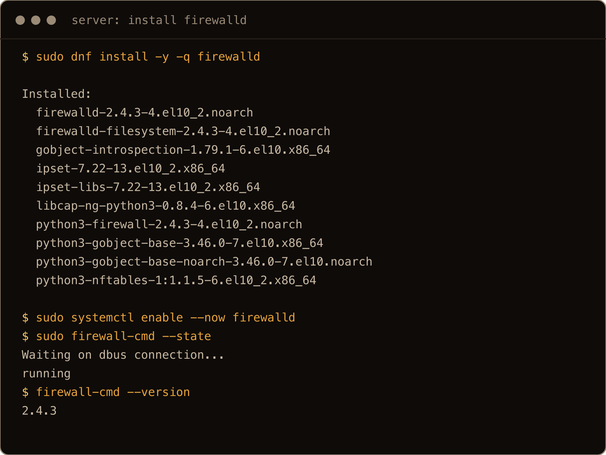

The screenshots come from a clean run on a fresh box after the post was written, so ports, timestamps and a few details differ from the text.

On an installer build of Rocky, or on RHEL, it may well be there already; I only tested the cloud image. Check with `systemctl status firewalld` before you install anything.

## 2. firewall-cmd --list-all and what public lets in

`firewall-cmd --list-all` is the `ufw status verbose` of firewalld. It shows the default zone:

```text
public (default, active)
  target: default
  ingress-priority: 0
  egress-priority: 0
  icmp-block-inversion: no
  interfaces: eth0
  sources: 
  services: cockpit dhcpv6-client ssh
  ports: 
  protocols: 
  forward: yes
  masquerade: no
  forward-ports: 
  source-ports: 
  icmp-blocks: 
  rich rules: 
```

Three services are allowed in. `ssh` you want. `dhcpv6-client` is for IPv6 address configuration. `cockpit` is the web console on port 9090, and it is open whether or not cockpit is installed. It was not installed on this image, so a connection from the client to `10.20.1.10:9090` came back `Connection refused`: the firewall let it through and nothing was listening. If you are not going to run cockpit, take it out:

```bash
sudo firewall-cmd --permanent --remove-service=cockpit
sudo firewall-cmd --reload
```

`target: default` is the part that corresponds to ufw's `default deny incoming`. Anything that does not match a service, port or rule gets rejected (ICMP excepted: the zone still accepts it, so ping works). firewalld rejects rather than drops, and that decides what the client sees, which is section 8.

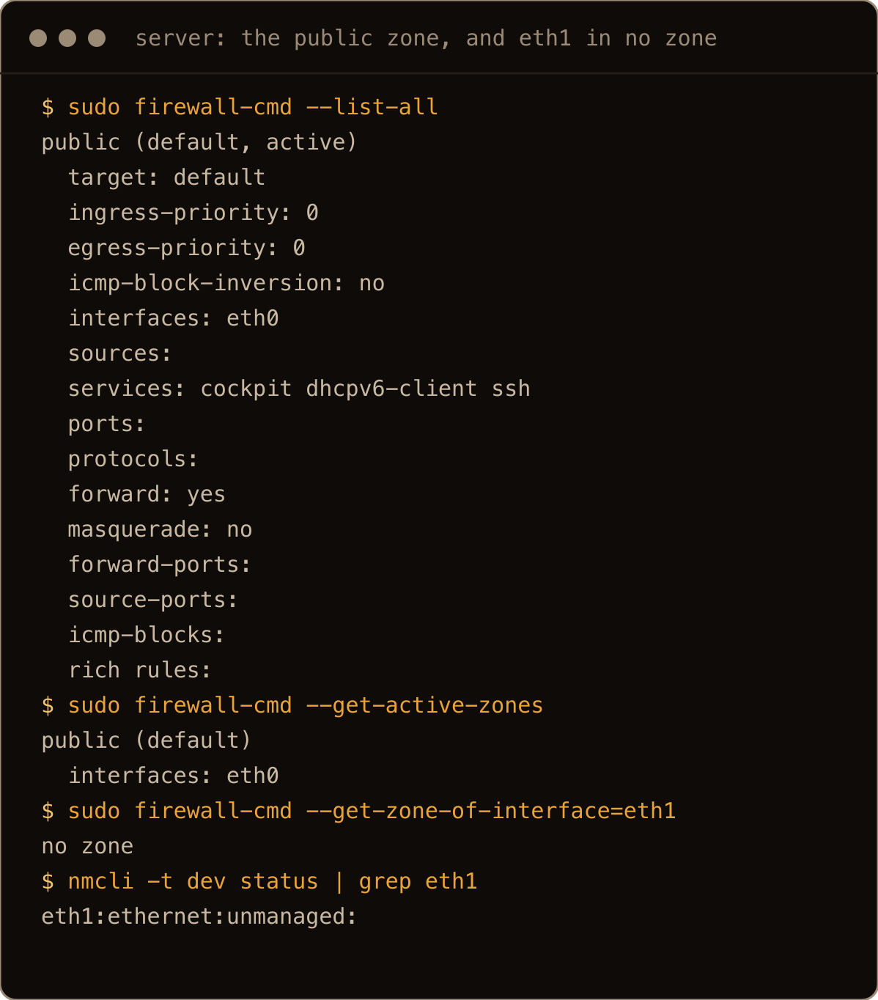

## 3. Runtime vs --permanent: why the port closed

This is the one that costs people an afternoon, so I reproduced both halves. Every check below is from the client, where a port the firewall rejects shows up as `No route to host`.

**Runtime only.** Add a port without `--permanent`:

```bash
sudo firewall-cmd --add-port=8080/tcp
```

The client connects straight away. Now look at both copies:

```text
$ sudo firewall-cmd --list-ports
8080/tcp
$ sudo firewall-cmd --permanent --list-ports

```

Runtime has it, permanent is empty. Run `sudo firewall-cmd --reload` and the client gets `No route to host` again, and `--list-ports` is empty. A reboot does the same thing: I added a runtime rule for 7002, rebooted, and it was gone.

**Permanent only.** Now the other way:

```bash
sudo firewall-cmd --permanent --add-port=8080/tcp
```

`success`, and the client still gets `No route to host`. `--list-ports` is empty and `--permanent --list-ports` says `8080/tcp`. The rule is written down and not loaded. After `sudo firewall-cmd --reload` the client connects.

So the habit is: `--permanent`, then `--reload`, every time. If you have been testing with runtime rules and got things working, you do not have to retype them:

```bash
sudo firewall-cmd --runtime-to-permanent
```

copies the whole runtime configuration into the permanent one. I added 9100 as a runtime rule, ran that, and `--permanent --list-ports` showed `8080/tcp 9100/tcp`, and 9100 still answered after a reload.


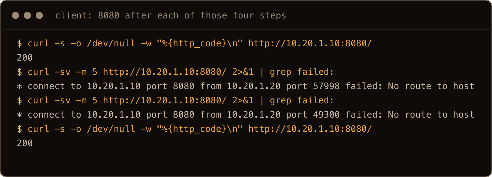

Two more things `firewall-cmd` says that are worth recognising. Adding a rule that is already there, or removing one that is not, prints a warning and still says `success`:

```text
$ sudo firewall-cmd --permanent --add-port=8080/tcp
Warning: ALREADY_ENABLED: 8080:tcp
success
$ sudo firewall-cmd --remove-port=7777/tcp
Warning: NOT_ENABLED: '7777:tcp' not in 'public'
success
```

And a port without a protocol is an error, not a guess: `firewall-cmd --add-port=8080` printed `Error: INVALID_PORT: bad port (most likely missing protocol), correct syntax is portid[-portid]/protocol` and exited 102. ufw lets you leave the protocol off and opens both TCP and UDP ([the ufw post](/blog/ufw-firewall-basics-ubuntu/) covers that); firewalld makes you say which.

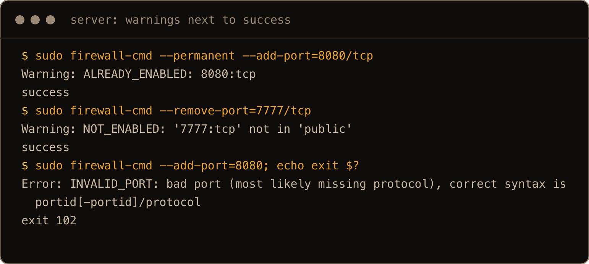

## 4. firewall-cmd --reload, --complete-reload and a restart

There are three ways to make firewalld reread its permanent configuration, and I wanted to know what each one does to connections that are already open. I kept two going while I ran them: my SSH session from my workstation printing the time every second, and a long lived TCP connection from the client to port 7000 on the firewall box, which I had opened with a runtime rule.

Each of `firewall-cmd --reload`, `firewall-cmd --complete-reload` and `systemctl restart firewalld` threw the runtime rule for 7000 away, as expected, and after each one a new connection to 7000 got `No route to host`. The connection that was already open kept going through all three, and my SSH session stayed connected throughout.

That last result goes against the man page, which says `--complete-reload` "will most likely terminate active connections, because state information is lost". It did not terminate mine, on this version, on this box. I would still not run it over the only SSH session to a remote server, and I have not needed it: `--reload` is the one to use.

The part that matters: an established connection outlives the rule that let it in. If you remove a rule and a client that was already connected keeps working, that is not the rule failing to apply. Test with a new connection.

## 5. Services, and writing your own

ufw has app profiles; firewalld has services, and a lot more of them. There were 263 definitions in `/usr/lib/firewalld/services/` on this box. `--info-service` shows what one opens:

```bash
sudo firewall-cmd --info-service=http
```

prints `ports: 80/tcp`. `firewall-cmd --get-services` lists them all. Where a service exists, I use it rather than a bare port, because `--list-all` then says `http` instead of `80/tcp` and you can tell what a rule is for six months later.

For your own app, make a service:

```bash
sudo firewall-cmd --permanent --new-service=myapp
sudo firewall-cmd --permanent --service=myapp --set-short="My app"
sudo firewall-cmd --permanent --service=myapp --add-port=8080/tcp
sudo firewall-cmd --permanent --add-service=myapp
sudo firewall-cmd --reload
```

That writes `/etc/firewalld/services/myapp.xml`, which is a few lines of XML you could also have written yourself. After the reload, `--list-services` said `dhcpv6-client myapp ssh` and the client could reach 8080.

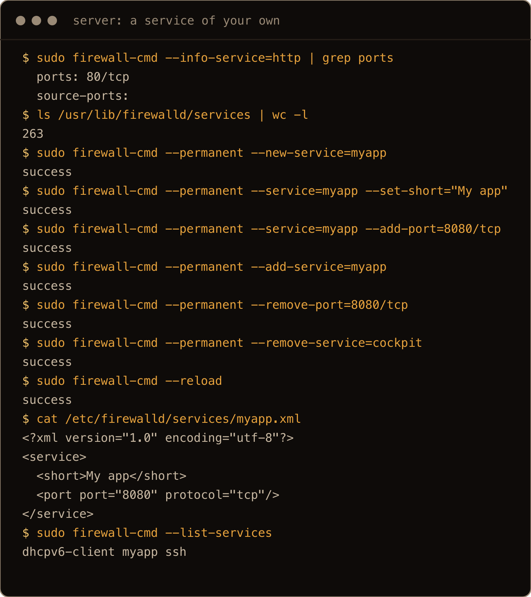

The clean run also removed the bare `8080/tcp` port left over from section 3 and took cockpit out as in section 2, which is why `cockpit` is missing from the list.

## 6. Zones, and the interface that is in no zone

`firewall-cmd --get-zones` lists ten: `block dmz drop external home internal nm-shared public trusted work`. Each is a set of rules plus a target for anything that matches nothing. An interface belongs to one zone, and traffic arriving on it gets that zone's rules.

Here is the thing I did not expect. The private interface on these boxes, `eth1`, is not managed by NetworkManager (`nmcli dev status` says `unmanaged`), and firewalld had not put it anywhere:

```text
$ sudo firewall-cmd --get-active-zones
public (default)
  interfaces: eth0
$ sudo firewall-cmd --get-zone-of-interface=eth1
no zone
```

"No zone" does not mean "no firewall". Traffic on `eth1` was handled by the default zone: on the fresh box, before any of section 3's rules, SSH from the client worked and 8080 was rejected. (If you have followed along, 8080 is open in `public` by now through the port and the `myapp` service, so it will connect.) With logging on (section 8), the kernel log labels a packet rejected on `eth1` as `filter_IN_public_REJECT: IN=eth1`. It is the same result as putting `eth1` in `public`, but `--get-active-zones` does not show it, which is confusing the first time you go looking.

To give the private network its own rules, put the interface in a zone. `internal` is the obvious name, but look at it first:

```text
$ sudo firewall-cmd --zone=internal --list-all
internal
  target: default
  ...
  services: cockpit dhcpv6-client mdns samba-client ssh
```

That is five services open on the private side, two of which (mDNS and the Samba client) have no business on a server. Strip them and add what you want:

```bash
sudo firewall-cmd --permanent --zone=internal --change-interface=eth1
for s in cockpit dhcpv6-client mdns samba-client; do
  sudo firewall-cmd --permanent --zone=internal --remove-service=$s
done
sudo firewall-cmd --permanent --zone=internal --add-port=9100/tcp
sudo firewall-cmd --reload
```

After that the private side allowed `ssh` and 9100, and 8080 (still open in `public`) was rejected on `eth1`. For an unmanaged interface firewalld writes the assignment into its own file, `<interface name="eth1"/>` in `/etc/firewalld/zones/internal.xml`.


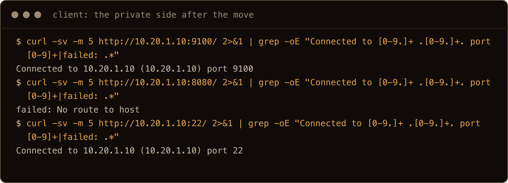

Do not reach for `trusted` for this. Its target is `ACCEPT`, which means every port on the interface is open, and it reads so reasonably in a zone list that it is easy to pick.

**Interfaces NetworkManager does manage** behave differently. When I moved `eth0` to `home` with

```bash
sudo firewall-cmd --permanent --zone=home --change-interface=eth0
```

firewalld printed:

```text
The interface is under control of NetworkManager, setting zone to 'home'.
success
```

It did not write the zone into its own files. It set `zone=home` in NetworkManager's keyfile for the connection, and the change was live at once, without the `--reload` that `--permanent` normally needs. It survived a reboot, and it also survived `firewall-cmd --reset-to-defaults`, because that command resets firewalld's files and this setting is not in them. (Do not try that one mid walkthrough: the reset also wipes the firewalld changes from sections 2 to 6, including the `internal` setup section 7 starts from. If you do, redo section 6's `internal` steps first.) To undo the zone, clear it in NetworkManager:

```bash
sudo nmcli con mod "cloud-init eth0" connection.zone ""
sudo nmcli con up "cloud-init eth0"
```

and `eth0` was back in `public`. (`home` allows `ssh`, which is why I could do this over SSH. Moving your only interface into a zone without `ssh` is how you lock yourself out.)


## 7. Allow one address: --add-source or a rich rule

The [node exporter post](/blog/prometheus-node-exporter-ubuntu-26-04/) fences port 9100 with one ufw line: `ufw allow from 10.20.1.20 to any port 9100 proto tcp`. firewalld has two ways to say that.

Both of these start from a clean slate. If you followed sections 3 and 6 on the same box, undo them first, or the leftovers let `.21` in and the test proves nothing:

```bash
sudo firewall-cmd --permanent --zone=internal --remove-interface=eth1
sudo firewall-cmd --permanent --remove-port=9100/tcp
sudo firewall-cmd --reload
```

**`--add-source`** sends traffic from an address to a zone, whatever interface it arrives on:

```bash
sudo firewall-cmd --permanent --zone=internal --add-source=10.20.1.20/32
sudo firewall-cmd --reload
sudo firewall-cmd --get-zone-of-source=10.20.1.20/32
```

With `internal` still allowing only `ssh` and 9100 from section 6, `10.20.1.20` could reach 9100 and `10.20.1.21`, one address along, got `No route to host`, because its traffic stayed in `public`. Use this when a whole subnet should share one set of rules. The source gets everything the zone allows: here, `.20` got SSH on the private side as well as 9100.

**A rich rule** says exactly what the ufw line says. (If you just tried `--add-source`, take it out again with `--permanent --zone=internal --remove-source=10.20.1.20/32` and reload, so you are testing one thing at a time.)

```bash
sudo firewall-cmd --permanent --add-rich-rule='rule family="ipv4" source address="10.20.1.20" port port="9100" protocol="tcp" accept'
sudo firewall-cmd --reload
sudo firewall-cmd --list-rich-rules
```

Same result from the client: `.20` in, `.21` rejected. For one address and one port, this is the one I would use. It is a single rule you can read back with `--list-rich-rules`. The one thing it cannot do is take something away: a rich rule lives in a zone like everything else, so if that zone already opens 9100 to everyone (a leftover `--add-port=9100/tcp`, say), `.21` gets in anyway. Check `--list-all` for broader allows before you trust it.

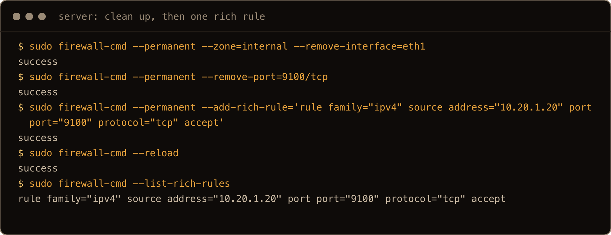

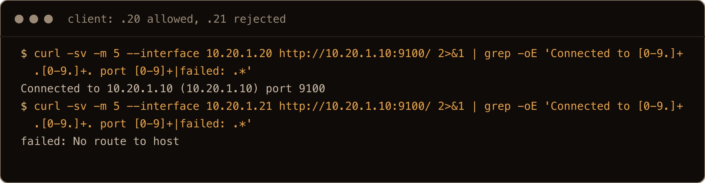

Rich rules also do denies. `rule family="ipv4" source address="10.20.1.21" service name="ssh" drop` made SSH from `.21` time out while `.20` still connected. Note `drop` rather than `reject`: that is the difference between a timeout and `No route to host` on the other end.

## 8. Port open but still not reachable

What the client prints tells you which layer said no. From the client, against the firewall box:

| Client sees | What happened | Where to look |
| --- | --- | --- |
| `No route to host` | firewalld rejected it (`reject with icmpx admin-prohibited`, from the default zone target) | the zone for that interface or source, runtime vs permanent |
| `Connection refused` | usually: the firewall let it through and nothing is listening | `ss -tlnp` on the server, the service's unit |
| a timeout | something dropped it: a `drop` rule, or a firewall in front of the box | rich rules, the cloud provider's firewall |

`No route to host` is a strange thing to see on a network where the route obviously works, which is why it throws people. On this setup it was the ICMP message firewalld sends back when it rejects a packet, not a routing problem. (A real missing route produces the same error text, and a rich rule with `reject type="tcp-reset"` would show up as `Connection refused` instead, so treat the table as the likely reading, then confirm with the log below.) And the current curl hides it: curl 8.12 on Rocky printed only `Failed to connect to 10.20.1.10 port 8080 after 6 ms: Could not connect to server` for both the rejected port and the refused one. Run `curl -v` and the real reason is on the `connect to ... failed:` line.

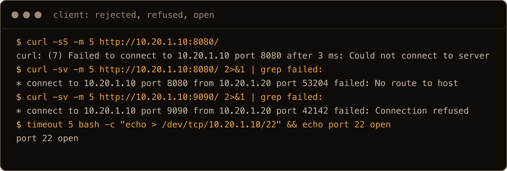

A timeout from outside was the provider's firewall in my case: from my workstation, 8080 on the public address timed out, because the cloud firewall in front of these boxes only lets SSH in, and firewalld never saw the packet. (The [SSH connection refused post](/blog/ssh-connection-refused-port-22-ubuntu/) has the same refused versus timeout distinction for port 22.)

The order I check things in, once the error has said which layer:

1. `sudo firewall-cmd --get-active-zones` and `--get-zone-of-interface=<nic>`: is the traffic in the zone you edited?
2. `sudo firewall-cmd --list-all` against `sudo firewall-cmd --permanent --list-all`, for that zone: is the rule loaded, or only written down?
3. `sudo ss -tlnp | grep <port>` on the server: is anything listening, and on which address?
4. If it is a service on a port it does not normally use, SELinux may be blocking the bind or the connection even with the firewall open. The Rocky post has [the `semanage port` fix for SSH on 2222](/blog/rocky-linux-10-for-ubuntu-people/#ssh-bind-to-port-2222-failed-permission-denied).
5. The provider's firewall or security group, if the error was a timeout from outside.

When you want firewalld to tell you what it rejected, turn on logging:

```bash
sudo firewall-cmd --set-log-denied=unicast
sudo journalctl -k -f
```

A rejected connection to 8081 from the client then logged:

```text
filter_IN_public_REJECT: IN=eth1 OUT= ... SRC=10.20.1.20 DST=10.20.1.10 ... PROTO=TCP SPT=49352 DPT=8081 ... SYN
```

which names the zone, the interface, the source and the port in one line. `--set-log-denied` is not a runtime flag: it wrote `LogDenied=unicast` into `/etc/firewalld/firewalld.conf`, was still on after a reboot, and it reloads firewalld to apply, which throws away any runtime only rules you were testing with. Save them with `--runtime-to-permanent` first. Set it back to `off` when you are done, or your kernel log fills with every port scan on the internet.

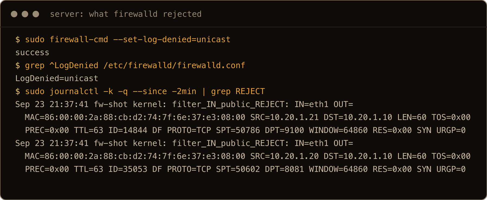

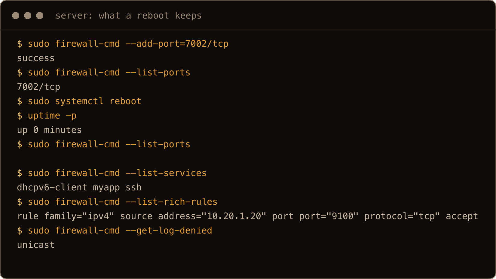

The reboot in that shot was the last step of the clean run, which is why the rule and the logging setting from sections 7 and 8 are in it: permanent things came back, the runtime 7002 did not.

## Gotchas I hit

- A rule without `--permanent` disappears on the next `--reload` or reboot. A rule with only `--permanent` does nothing until the next reload. `--runtime-to-permanent` rescues a working runtime setup.
- `No route to host` from a machine that is clearly reachable is firewalld rejecting the port. curl only says so with `-v`.
- The private interface was in `no zone`. Its traffic got the default zone's rules, and `--get-active-zones` did not list it.
- `internal` opens mDNS, the Samba client and cockpit out of the box. `trusted` opens everything.
- `cockpit` is allowed in `public` by default whether or not it is installed.
- On an interface NetworkManager manages, `--permanent --change-interface` sets the zone in NetworkManager, applies it immediately, and `--reset-to-defaults` does not undo it.
- `ALREADY_ENABLED` and `NOT_ENABLED` are warnings next to a `success`, so a script checking the exit code will not notice a rule that was already there or never was.
- An open connection survived every kind of reload and restart after its rule was gone. Test a rule change with a new connection.
- `--set-log-denied` is permanent and noisy. Turn it off afterwards.

EPEL does carry ufw (version 0.35), if you would rather not learn any of this. I have not tried running it on Rocky. I would keep firewalld, so the firewall commands in RHEL guides and package docs work as written.

## Quick reference: ufw to firewall-cmd

Every `firewall-cmd` command in the right column was run on the Rocky 10.2 box; ufw was not installed there, so the left column is the Ubuntu side for comparison. Add `sudo firewall-cmd --reload` after any `--permanent` change.

| ufw | firewall-cmd |
| --- | --- |
| `sudo ufw enable` | `sudo systemctl enable --now firewalld` |
| `sudo ufw status verbose` | `sudo firewall-cmd --list-all` (runtime), `--permanent --list-all` (stored) |
| `sudo ufw allow 8080/tcp` | `sudo firewall-cmd --permanent --add-port=8080/tcp` |
| `sudo ufw allow http` | `sudo firewall-cmd --permanent --add-service=http` |
| `sudo ufw allow from 10.20.1.20 to any port 9100 proto tcp` | `sudo firewall-cmd --permanent --add-rich-rule='rule family="ipv4" source address="10.20.1.20" port port="9100" protocol="tcp" accept'` |
| `sudo ufw insert 1 deny from 10.20.1.21 to any port 22 proto tcp` | `sudo firewall-cmd --permanent --add-rich-rule='rule family="ipv4" source address="10.20.1.21" service name="ssh" drop'` |
| `sudo ufw delete allow 8080/tcp` | `sudo firewall-cmd --permanent --remove-port=8080/tcp` |
| `sudo ufw reload` | `sudo firewall-cmd --reload` |
| `sudo ufw app list` | `sudo firewall-cmd --get-services` |
| `sudo ufw app info OpenSSH` | `sudo firewall-cmd --info-service=ssh` |
| `sudo ufw logging on` | `sudo firewall-cmd --set-log-denied=unicast`, then `journalctl -k` |
| `sudo ufw reset` | `sudo firewall-cmd --reset-to-defaults`. Not the same: ufw reset also disables ufw; firewalld keeps running with its stock rules (`cockpit dhcpv6-client ssh`), and NetworkManager zone settings stay |
| (no equivalent) | `sudo firewall-cmd --runtime-to-permanent` |
| (no equivalent) | `sudo firewall-cmd --permanent --zone=internal --change-interface=eth1` |

`--permanent`, then `--reload`, then read both `--list-all` outputs. Two copies of the rules, and the one you edited is not always the one that is running.
