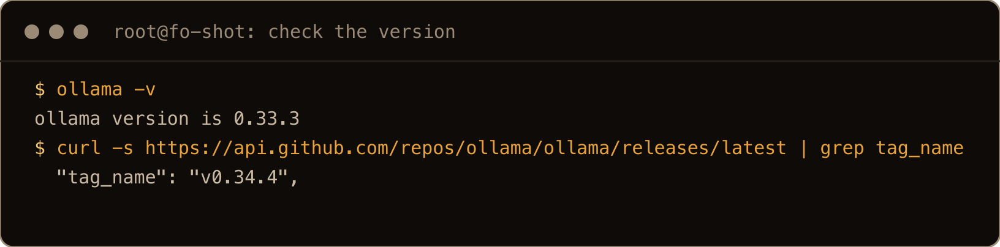
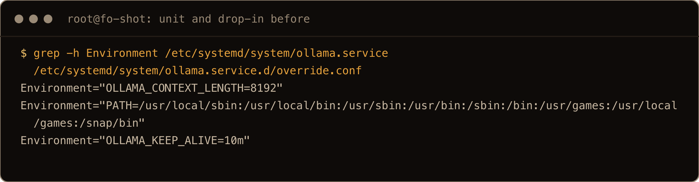
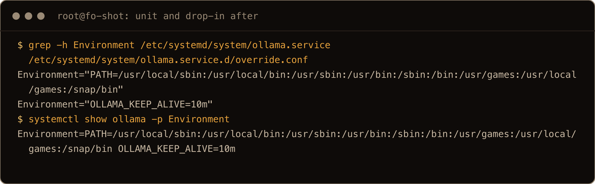
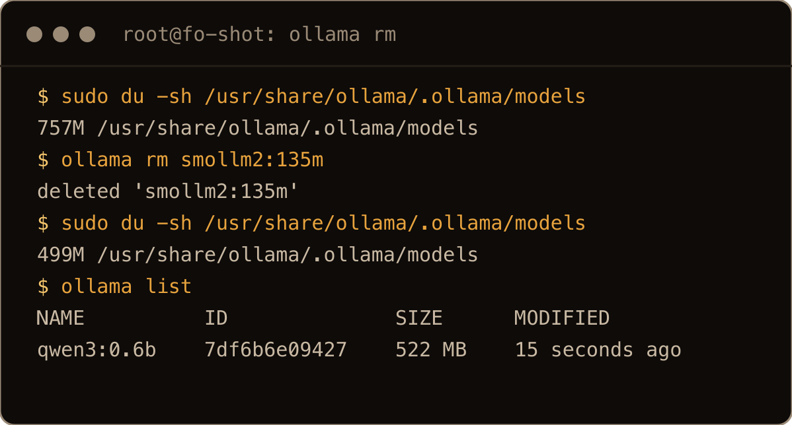
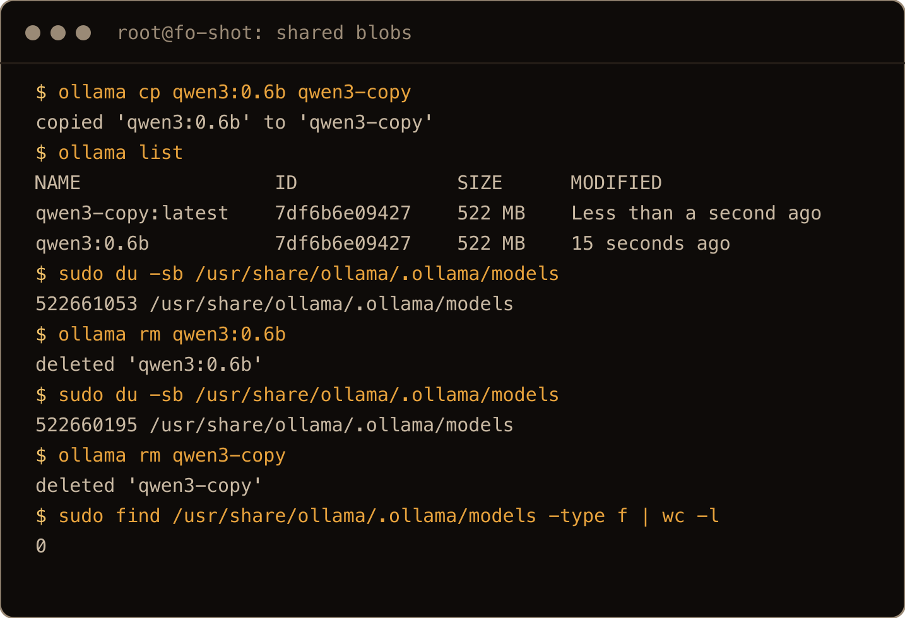

If you have an NVIDIA card sitting in a box at home, it can run a private LLM whose prompts never leave the house. Ollama makes the model part easy. The part that used to be fiddly was the GPU stack underneath it, and on Ubuntu 26.04 that got a lot shorter.

This is the companion to my [self-hosting Ollama on cheap cloud](/blog/self-host-ollama-oracle-free-vast-gpu/) guide, for when the hardware is your own. That one rents a GPU that arrives with CUDA already installed. Here the machine and the card are yours, so the driver and CUDA step is on you. Good news: on 26.04 it is a couple of `apt` lines.

> **TL;DR** `sudo ubuntu-drivers install` and reboot, confirm with `nvidia-smi`, then `curl -fsSL https://ollama.com/install.sh | sh`, `ollama run llama3.1:8b`, and check `ollama ps` shows `100% GPU`. The full native CUDA toolkit is one more line, `sudo apt install nvidia-cuda-toolkit`, and you no longer add NVIDIA's external repo to get it.

## Before you start

Confirm the card is actually seen by the machine:

```bash
lspci | grep -i nvidia
```

You want your GPU listed. If nothing comes back, the card is not seated or the slot is not enabled, and no amount of driver work fixes that.

One thing that bites people on desktops: **Secure Boot**. If it is on in the BIOS, the NVIDIA kernel module has to be signed or it will not load, and Ubuntu walks you through enrolling a key (MOK) during driver install. It is not hard, but if you would rather skip the dance, turn Secure Boot off in the BIOS before you start. On a headless homelab box it is usually already off.

## Install the NVIDIA driver

Let Ubuntu pick the right driver branch for your card:

```bash
sudo ubuntu-drivers install
```

`ubuntu-drivers` reads your hardware and installs the recommended driver from Ubuntu's own repository. If you want to see the options first, `ubuntu-drivers devices` lists them, and you can install a specific branch with `sudo apt install nvidia-driver-580` (swap the number for the one it recommends). For almost everyone, `ubuntu-drivers install` is the right call.

Reboot so the kernel module loads cleanly:

```bash
sudo reboot
```

Back in, confirm the driver is live:

```bash
nvidia-smi
```

You should see a table with your GPU, the driver version, and CUDA version. If `nvidia-smi` reports `command not found` or cannot talk to the driver, the module did not load, and Secure Boot is the usual reason on a desktop. This one command working is the gate for everything below.

## Install native CUDA

Here is the part that changed. Ubuntu 26.04 is the first release to ship NVIDIA CUDA in its own archive, so you install the toolkit straight from `apt`:

```bash
sudo apt update
sudo apt install nvidia-cuda-toolkit
```

Confirm the compiler is there:

```bash
nvcc --version
```

Two honest notes. First, **Ollama does not strictly need this.** Ollama bundles its own CUDA runtime and only needs a working driver, which you already have. If your only goal is running models, you can skip straight to installing Ollama. It is worth taking anyway, because it turns the machine into a real box for local AI: `nvcc` for anything you compile, and the CUDA libraries that PyTorch, vLLM, and the rest expect. If this box is going to do more than Ollama, get it now.

Second, **do not mix repositories.** The version in Ubuntu's archive lags a little behind NVIDIA's own, which is fine here. But if you later add NVIDIA's external CUDA repo for a newer toolkit, do not run both at once. The two sets of packages fight over library paths and quietly break `nvcc` lookups. Pick one source. On 26.04 the Ubuntu archive is the easy choice, and it is the whole reason the old 24.04 instructions to add a `cuda-keyring` repo are now obsolete.

## Install Ollama

The official script detects your driver and wires up GPU support and a systemd service in one shot:

```bash
curl -fsSL https://ollama.com/install.sh | sh
```

Confirm the service is up:

```bash
ollama --version
systemctl status ollama
```

You want `active (running)`. Ollama is now listening on `127.0.0.1:11434` and starts on every boot.

## Confirm the GPU is doing the work

Pull a model that actually uses the card. On 24 GB of VRAM (a 3090 or 4090) an 8B model runs fast with room to spare:

```bash
ollama pull llama3.1:8b
ollama run llama3.1:8b
```

Type at it to check it answers, then in another terminal prove where the work is happening:

```bash
ollama ps     # PROCESSOR column should read 100% GPU
nvidia-smi    # the ollama process should be eating VRAM
```

If `ollama ps` says the model is on CPU, the GPU is not being used and you are running an LLM at CPU speed while a perfectly good card sits idle. That almost always means `nvidia-smi` did not work above; fix the driver first, then reinstall Ollama so it re-detects the GPU.

Match the model to your VRAM. A rough guide: 8 GB cards are happy with quantized 7B to 8B models, 12 GB opens up 13B, and 24 GB runs those comfortably or a quantized larger model. When a model does not fit in VRAM, Ollama offloads the overflow to system RAM and the speed falls off a cliff, which means you have overshot your card.

## Reach it without exposing it

Ollama ships with no authentication, so do not bind it to a public address or open port 11434 to the internet. On your own hardware the simplest safe access from another machine is an SSH tunnel:

```bash
ssh -L 11434:127.0.0.1:11434 user@your-gpu-box
```

Now `localhost:11434` on your laptop talks to the model on the GPU box, encrypted, nothing exposed. For the fuller picture, a Caddy reverse proxy with real auth and a ChatGPT-style Open WebUI, the [cloud Ollama post](/blog/self-host-ollama-oracle-free-vast-gpu/#securing-the-api) covers both and every word applies here too.

## Update Ollama and remove models

Updating Ollama on Linux means running the same install script again; I did not find a separate update command. None of this touches the GPU, so I tested this section on a CPU only Ubuntu 26.04 box: I installed an older release, pulled two small models, updated, then removed them.

Check what you have first:

```bash
ollama -v
```

```text
ollama version is 0.33.3
```

Compare that with the newest release on the [Ollama releases page](https://github.com/ollama/ollama/releases), or ask GitHub from the terminal:

```bash
curl -s https://api.github.com/repos/ollama/ollama/releases/latest | grep tag_name
```



The screenshots in this section come from a second fresh CPU only box, run after the text was written, so times differ from the numbers in the prose.


To update, rerun the installer:

```bash
curl -fsSL https://ollama.com/install.sh | sh
```

It announces `Cleaning up old version at /usr/local/lib/ollama`, downloads the current build in its place, rewrites the systemd unit, and restarts the service. Then check again:

```bash
ollama -v
```

On my box that went from `0.33.3` to `0.34.4`, the service came back `active`, and `ollama list` still showed both models. Models live in a separate directory, so an update does not download them again.


The script also takes a version, which is how you pin a release (I used it for a fresh install of 0.33.3; rolling an existing install back should work the same way, but I did not test it):

```bash
curl -fsSL https://ollama.com/install.sh | OLLAMA_VERSION=0.33.3 sh
```

**The update overwrites `/etc/systemd/system/ollama.service`.** If you added a line such as `Environment="OLLAMA_CONTEXT_LENGTH=8192"` straight into that file, it is gone after the update and Ollama quietly goes back to its defaults. I added a line to the unit on my test box and the update removed it. Put your settings in a drop-in instead:

```bash
sudo systemctl edit ollama
```

That writes `/etc/systemd/system/ollama.service.d/override.conf`. The same update left my drop-in alone and `systemctl show ollama -p Environment` still listed its setting afterward.






Now the disk. See what you have:

```bash
ollama list
```

```text
NAME            ID              SIZE      MODIFIED
qwen3:0.6b      7df6b6e09427    522 MB    Less than a second ago
smollm2:135m    9077fe9d2ae1    270 MB    7 seconds ago
```

Remove one by the name in the first column:

```bash
ollama rm smollm2:135m
```

```text
deleted 'smollm2:135m'
```

With the systemd service the install script sets up, models are stored under `/usr/share/ollama/.ollama/models`, split into `blobs` (the weights) and `manifests` (the names). Check the size there before and after:

```bash
sudo du -sh /usr/share/ollama/.ollama/models
```

Removing `smollm2:135m` freed 270,901,309 bytes on my box, which is the 270 MB `ollama list` reported. `df` agreed to within 33 KB. A model that is loaded in memory gets unloaded too: `ollama ps` showed it running before the `rm` and empty after.




The catch is that `SIZE` in `ollama list` is not always what `rm` gives back. Two names can point at the same blobs. After `ollama cp qwen3:0.6b qwen3-copy`, `ollama list` showed two 522 MB entries with the same ID, and the directory had grown by 858 bytes. Removing the first name freed those 858 bytes and nothing else. The 522 MB only came back when I removed the last name pointing at it. If `rm` did not free what you expected, look for a matching ID further down `ollama list`.




## Gotchas I hit

- **`nvidia-smi` not working is the root of most problems.** If it fails, the driver did not load. Nothing downstream works until it does.
- **Secure Boot blocks the module.** On a desktop with Secure Boot on, enroll the MOK key when prompted or turn Secure Boot off before installing the driver.
- **Ollama on CPU despite a working card.** Reinstall Ollama after the driver is confirmed so its installer re-detects CUDA.
- **Do not mix CUDA repos.** Ubuntu's archive or NVIDIA's external repo, one or the other. Mixing breaks library paths.
- **Model bigger than VRAM.** It still runs, but it spills into system RAM and crawls. Pick a model that fits your card.
- **Port 11434 has no auth.** Never expose it. Tunnel over SSH or put a real proxy in front.
- **Updating rewrites the unit file.** Rerunning the install script replaces `/etc/systemd/system/ollama.service`, so settings added there vanish. Use `sudo systemctl edit ollama` (in the lab I wrote the same `override.conf` file directly, since `edit` opens an editor).
- **`ollama rm` keeps weights another name still uses.** Removing one of two names with the same ID in `ollama list` freed 858 bytes, not 522 MB.

## Quick reference

| Task | Command |
|---|---|
| See the card | `lspci \| grep -i nvidia` |
| List driver options | `ubuntu-drivers devices` |
| Install the driver | `sudo ubuntu-drivers install` |
| Verify the driver | `nvidia-smi` |
| Install native CUDA | `sudo apt install nvidia-cuda-toolkit` |
| Verify CUDA | `nvcc --version` |
| Install Ollama | `curl -fsSL https://ollama.com/install.sh \| sh` |
| Run a model | `ollama run llama3.1:8b` |
| Confirm GPU offload | `ollama ps` |
| Tunnel the API | `ssh -L 11434:127.0.0.1:11434 user@box` |
| Check the version | `ollama -v` |
| Update Ollama | `curl -fsSL https://ollama.com/install.sh \| sh` |
| Install a specific version | `curl -fsSL https://ollama.com/install.sh \| OLLAMA_VERSION=0.33.3 sh` |
| Change service settings | `sudo systemctl edit ollama` |
| List models | `ollama list` |
| Remove a model | `ollama rm MODEL` |
| Model disk use | `sudo du -sh /usr/share/ollama/.ollama/models` |

Install the driver, take the native CUDA toolkit from `apt` because on 26.04 you finally can, drop Ollama on top, and confirm `ollama ps` says `100% GPU`. The card you already own becomes a private LLM that answers as fast as it can draw power and never phones home.

`[ your card, your model, your box ]`
