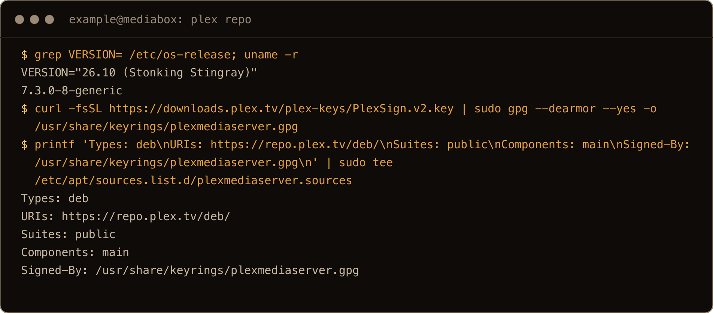
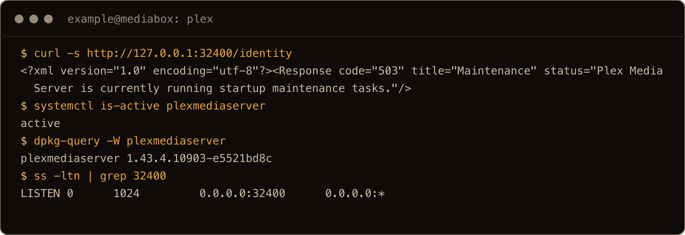
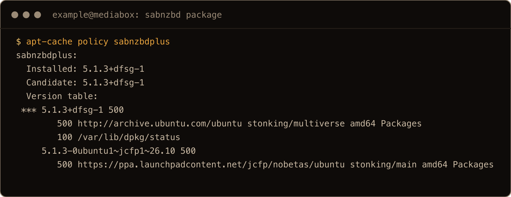
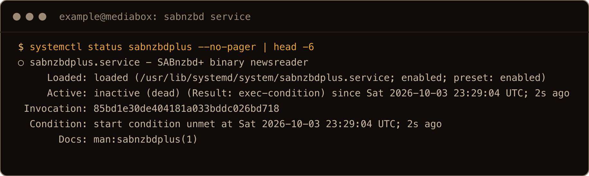
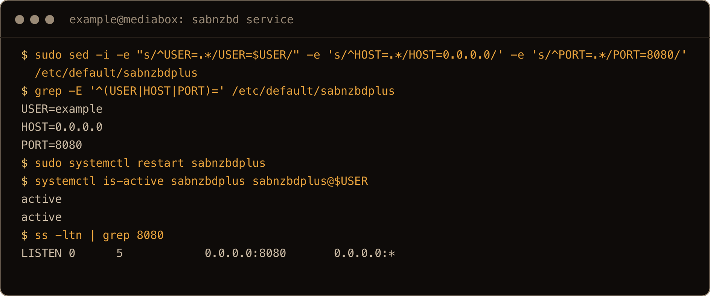
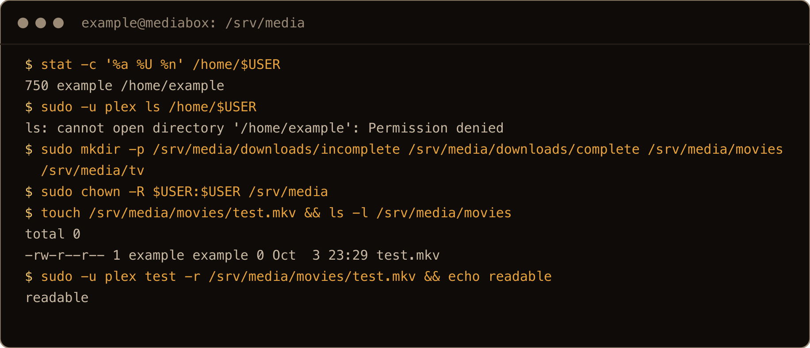
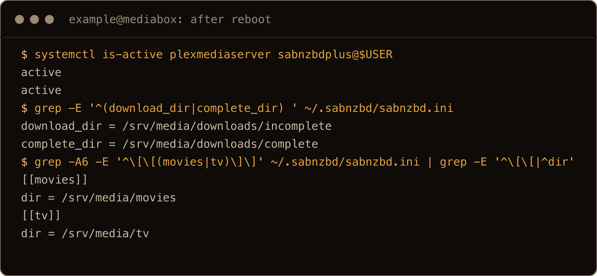
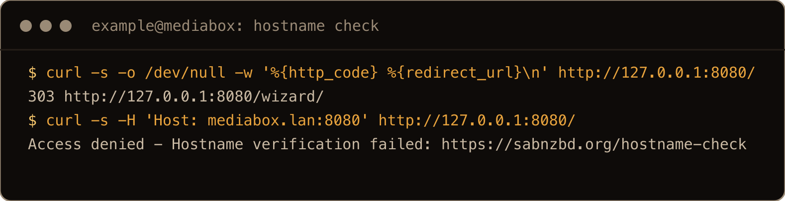
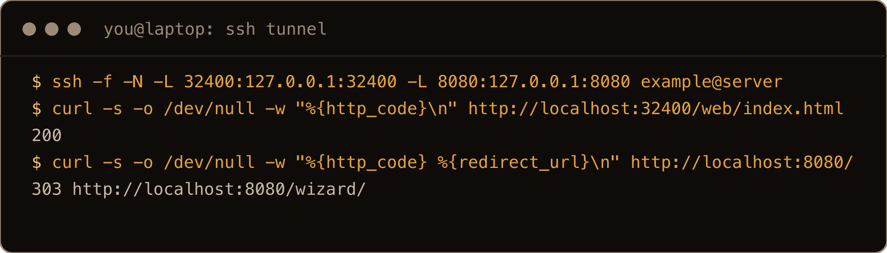
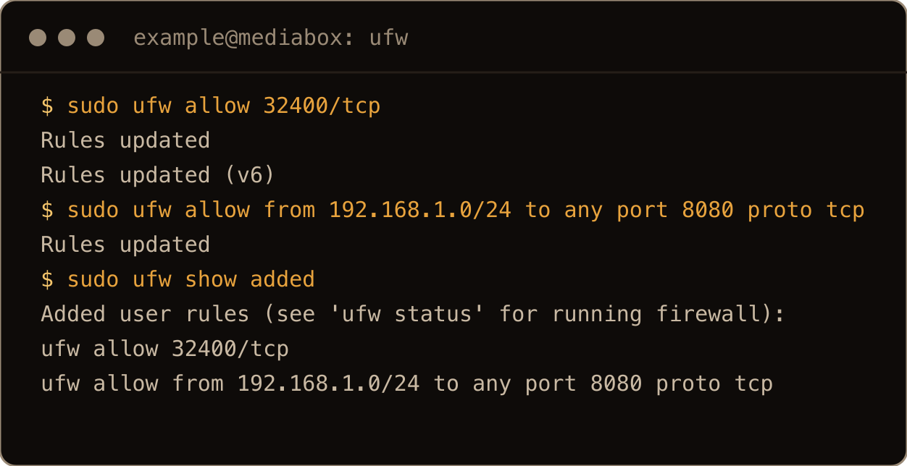

I use Plex to stream my videos, mostly to share them with family. I give them accounts on it. SABnzbd is for other reasons. Maybe I happen to want to raise the Jolly Roger and use my Usenet subscription.

Mine lives on my home network as a Proxmox VM, nothing crazy. This is just meant to show that you can host it on Ubuntu without Docker. If you want to do it the sane way, use my [Docker post](/blog/plex-sabnzbd-docker-compose-hardware-transcoding/).

This is the straight install on Ubuntu 26.10: Plex from Plex's repo, SABnzbd from Ubuntu's, one folder they both use, and the web pages. I ran it on a server freshly [upgraded from 26.04 to the 26.10 beta](/blog/upgrade-ubuntu-26-04-to-26-10-beta/).

> **TL;DR.** Add Plex's repo and `sudo apt install plexmediaserver`. `sudo apt install sabnzbdplus` (no PPA needed on 26.10). Set `USER=` in `/etc/default/sabnzbdplus` or the service never starts. Put media somewhere outside your home directory, like `/srv/media`, because Plex can't read inside it. Plex is on port 32400, SABnzbd on 8080.

## Contents

- [1. Install Plex](#1-install-plex)
- [2. Install SABnzbd](#2-install-sabnzbd)
- [3. Start SABnzbd](#3-start-sabnzbd)
- [4. One media folder for both](#4-one-media-folder-for-both)
- [5. Open the web pages](#5-open-the-web-pages)
- [6. Remote access for family](#6-remote-access-for-family)
- [Gotchas I hit](#gotchas-i-hit)
- [Quick reference](#quick-reference)

## 1. Install Plex

Plex Media Server comes from Plex's own apt repo. That repo doesn't use the Ubuntu codename (its suite is just `public`), so there is no waiting for a 26.10 suite, and it installed cleanly on the 26.10 beta. Add the key and the source:

```bash
sudo apt update && sudo apt install -y curl gpg
curl -fsSL https://downloads.plex.tv/plex-keys/PlexSign.v2.key | sudo gpg --dearmor --yes -o /usr/share/keyrings/plexmediaserver.gpg
printf 'Types: deb\nURIs: https://repo.plex.tv/deb/\nSuites: public\nComponents: main\nSigned-By: /usr/share/keyrings/plexmediaserver.gpg\n' | sudo tee /etc/apt/sources.list.d/plexmediaserver.sources
```



The screenshots in this post come from a final clean run on a fresh server upgraded to 26.10, as a user called `example`.

Then install it:

```bash
sudo apt update
sudo apt install -y plexmediaserver
systemctl is-active plexmediaserver
```

I got `plexmediaserver 1.43.4.10903`, running as its own `plex` user, enabled at boot and listening on port 32400. For the first few seconds after install it answers with `503` and "Plex Media Server is currently running startup maintenance tasks". That's normal; give it a moment.



## 2. Install SABnzbd

SABnzbd's own Ubuntu instructions start with `sudo add-apt-repository ppa:jcfp/nobetas`. On 26.10 you can skip it:

```bash
sudo apt install -y sabnzbdplus
```

Ubuntu's multiverse repo has `sabnzbdplus` 5.1.3, the same release the PPA has. I added the PPA too, to compare, and apt still picked Ubuntu's build (`5.1.3+dfsg-1` sorts above the PPA's `5.1.3-0ubuntu1~jcfp1~26.10`). You only need the PPA when Ubuntu falls behind a new SABnzbd release.



## 3. Start SABnzbd

The package installs a service and then leaves it off:

```text
$ systemctl status sabnzbdplus
○ sabnzbdplus.service - SABnzbd+ binary newsreader
     Active: inactive (dead) (Result: exec-condition)
  Condition: start condition unmet
```



It refuses to start until `/etc/default/sabnzbdplus` says which user to run as. Run SABnzbd as your own user, and set where it listens:

```bash
sudo sed -i -e "s/^USER=.*/USER=$USER/" -e 's/^HOST=.*/HOST=0.0.0.0/' -e 's/^PORT=.*/PORT=8080/' /etc/default/sabnzbdplus
sudo systemctl restart sabnzbdplus
```

`$USER` is filled in by your shell before `sudo` runs, so it's your username, not root. `HOST=0.0.0.0` makes it listen on every IPv4 interface, so other machines on your network can reach it. After the restart, `sabnzbdplus@<you>.service` is the one doing the work, and port 8080 is listening.



## 4. One media folder for both

This is the part that bites. SABnzbd runs as you and saves to `~/Downloads/complete` by default. Plex runs as `plex`. Ubuntu creates home directories with mode `750`, and mine was, so:

```text
$ sudo -u plex ls /home/example
ls: cannot open directory '/home/example': Permission denied
```

Plex can't get into the folder to scan a single finished download. Put the media outside your home directory instead, owned by you:

```bash
sudo mkdir -p /srv/media/downloads/incomplete /srv/media/downloads/complete /srv/media/movies /srv/media/tv
sudo chown -R $USER:$USER /srv/media
```

SABnzbd writes there as you. With its permissions setting left empty and the service's default umask (`022`), new files come out readable by everyone (`-rw-r--r--`), which is all Plex needs. A file created there as my user passed `sudo -u plex test -r`.



Mine lives on an external disk mounted on my Ubuntu machine.

Same rule wherever yours is: the SABnzbd user can write it, `plex` can read it, and no directory on the way there is closed off like a home directory. If you're adding a disk, my [disk and fstab post](/blog/add-disk-fstab-lvm-ubuntu-26-04/) covers mounting it so it comes back after a reboot.

## 5. Open the web pages

**SABnzbd** is at `http://<server-ip>:8080`, which sends you to the quick-start wizard. It asks for your Usenet provider's server and login. Afterwards, in **Config > Folders**, set the temporary download folder to `/srv/media/downloads/incomplete` and the completed download folder to `/srv/media/downloads/complete`. Then, in **Config > Categories**, set the folder for the `movies` category to `/srv/media/movies` and for `tv` to `/srv/media/tv`. A download tagged with a category lands straight in the folder Plex scans; without that, finished downloads sit in `complete` where Plex never looks. I checked that these settings survive a reboot.



If you open SABnzbd by a hostname instead of the IP, you can get this:

```text
Access denied - Hostname verification failed: https://sabnzbd.org/hostname-check
```

SABnzbd only answers to names on its list, which starts as the server's own hostname. Add yours under **Config > Special > host_whitelist**, set a username and password in **Config > General** (that also lifts the check), or use the IP.



**Plex** is at `http://<server-ip>:32400/web`. Sign in with your Plex account to claim the server, then add libraries pointing at `/srv/media/movies` and `/srv/media/tv`.

If the server isn't on your network (a VPS, say), Plex won't let you claim it from outside. Tunnel the port over SSH and use it as if you were on the box:

```bash
ssh -L 32400:127.0.0.1:32400 -L 8080:127.0.0.1:8080 you@server
```

Then open `http://localhost:32400/web` and `http://localhost:8080` on your own machine. That's how I reached both on the test server, which only let SSH in.



In the screenshot I added `-f -N` so the tunnel runs in the background instead of opening a shell.

If `ufw` is on, open Plex to everyone (section 6 needs that for remote access) and SABnzbd to your own network only. SABnzbd has no business being on the internet:

```bash
sudo ufw allow 32400/tcp
sudo ufw allow from 192.168.1.0/24 to any port 8080 proto tcp
```

Use your own subnet. If you don't want remote access, give 32400 the same `from` rule as 8080. The [ufw post](/blog/ufw-firewall-basics-ubuntu/) has the rest.



## 6. Remote access for family

For family outside your house, turn on Plex's remote access: in Plex Web, **Settings > Remote Access** under your server's settings. Plex then needs port 32400 reachable from the internet. It tries to open the port on your router by itself (UPnP); if that doesn't work, forward it by hand.

I forwarded port 32400 on my router. Nothing tripped me up; it was a very simple network change.

Forward TCP 32400 to the server's LAN IP, then tick **Manually specify public port** on the Remote Access page, enter `32400`, and click **Retry**. Give the server a fixed address (a DHCP reservation or a [static IP](/blog/set-static-ip-ubuntu-26-04-netplan/)) so the forward doesn't point at nothing after a reboot. Then invite family from your Plex account. One thing that isn't free: Plex's [remote playback requirements](https://support.plex.tv/articles/requirements-for-remote-playback-of-personal-media/) say remote playback of your own videos on the affected Plex apps needs a Plex Pass on the server owner's account, which covers the people you share with, or a Plex Pass or Remote Watch Pass for each viewer. Forward 32400 only. Port 8080 stays inside.

## Gotchas I hit

- `sabnzbdplus` installs but stays `inactive (dead)` until `USER=` is set in `/etc/default/sabnzbdplus`.
- SABnzbd's default download folders are in your home directory, which `plex` can't read when the home directory is `750`.
- "Hostname verification failed" means SABnzbd doesn't know the name you used; using the IP skips that check.
- Plex answers `503` "startup maintenance" for a few seconds after install.
- The SABnzbd PPA isn't needed on 26.10; Ubuntu's build wins anyway.

## Quick reference

| Step | Command |
| --- | --- |
| Plex repo | key to `/usr/share/keyrings/plexmediaserver.gpg`, `Suites: public` in `/etc/apt/sources.list.d/plexmediaserver.sources` |
| Plex | `sudo apt install plexmediaserver`, port 32400 |
| SABnzbd | `sudo apt install sabnzbdplus`, port 8080 |
| Start SABnzbd | set `USER=`, `HOST=`, `PORT=` in `/etc/default/sabnzbdplus`, `sudo systemctl restart sabnzbdplus` |
| Media | `/srv/media`, owned by the SABnzbd user; categories `movies` and `tv` point at its library folders |
| From outside | `ssh -L 32400:127.0.0.1:32400 -L 8080:127.0.0.1:8080 you@server` |
| Family | Plex remote access, forward TCP 32400 only |

Two services, two ports, one folder they agree on. Keep SABnzbd on the inside.
