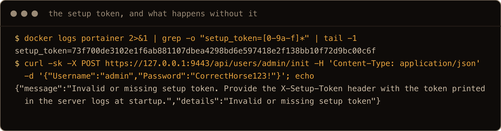
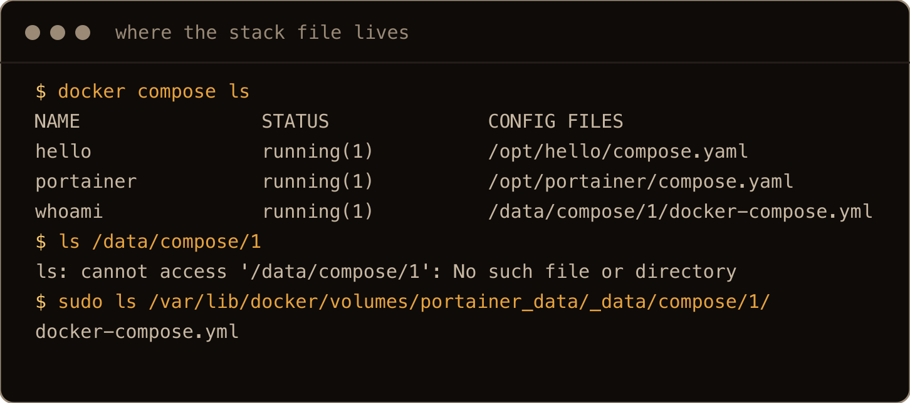
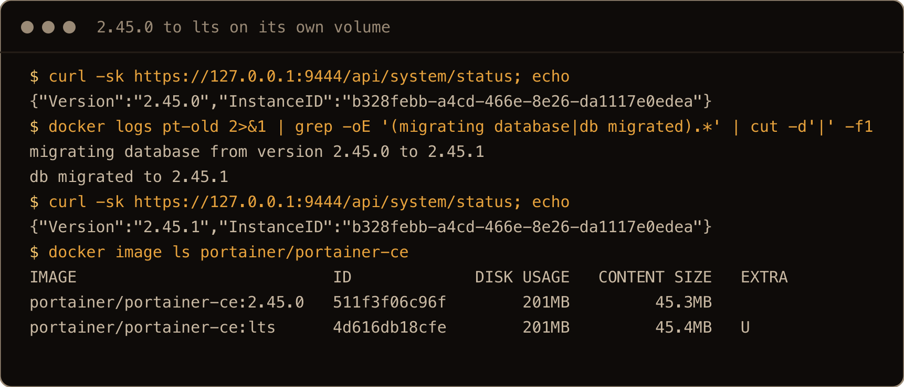
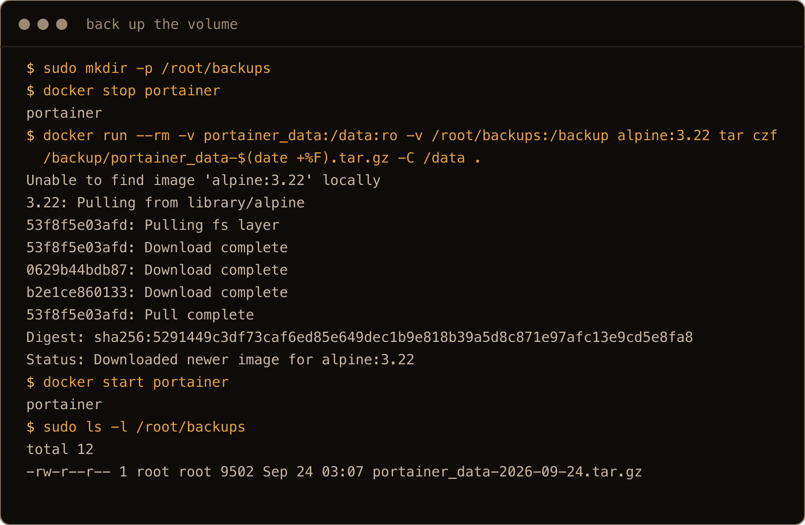
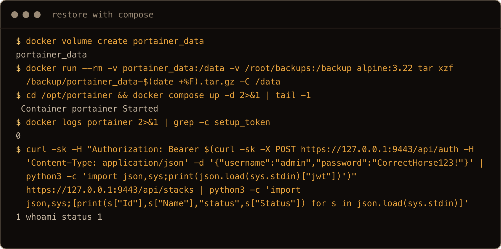

The install command in Portainer's docs is one line, and it works. It also publishes the Portainer UI on port 9443 on every address the server has, and Docker writes its own firewall rules for that, so ufw never gets a say. On a box where ufw said only SSH was allowed in, a client standing in for the outside world could still load the Portainer login page. That page is the front door to a container that holds the Docker socket, which means whoever gets through it as an admin is root on the host.

So this is the Portainer install I would actually put on a server: Compose instead of a long `docker run`, the UI bound to `127.0.0.1`, and an SSH tunnel to reach it. It also covers the parts the older guides predate or skip. Since 2.43, Portainer will not let you create the admin account until you give it a token from its logs, and it still locks itself after five minutes if you do not. Stack files end up somewhere `docker compose ls` points at but you cannot open. And updating, backing up and removing it each have one small trap.

The one thing to get straight: Portainer is not a dashboard sitting beside Docker. It is a web login in front of `/var/run/docker.sock`. I proved that on the lab box by asking Portainer's API, and nothing else, to start an Alpine container with the host's `/` mounted and print the first line of `/etc/shadow`. It printed `root:!*:17478:0:99999:7:::`. Treat the Portainer login like an SSH login, and keep it off the open internet the same way.

> **TL;DR.** Install Docker from Docker's repo. `docker volume create portainer_data`, then run Portainer from a Compose file that publishes only `127.0.0.1:9443:9443` and mounts `portainer_data` as an `external` volume. Reach it with `ssh -N -L 9443:127.0.0.1:9443 you@server` and open `https://localhost:9443`. Within five minutes, create the admin with the `setup_token` from `docker logs portainer`; if it times out, `docker restart portainer` and use the new token. Update with `docker compose pull && docker compose up -d`. Back up by stopping Portainer and tarring the volume.

## Contents

- [What I tested on](#what-i-tested-on)
- [1. Install Docker first](#1-install-docker-first)
- [2. What 9443, 8000 and 9000 are](#2-what-9443-8000-and-9000-are)
- [3. Why the stock command gets past ufw](#3-why-the-stock-command-gets-past-ufw)
- [4. Install Portainer with Compose on 127.0.0.1](#4-install-portainer-with-compose-on-127001)
- [5. Reach it over an SSH tunnel](#5-reach-it-over-an-ssh-tunnel)
- [6. First login: the setup token and the five minute window](#6-first-login-the-setup-token-and-the-five-minute-window)
- [7. Stacks, and where the Compose file actually lives](#7-stacks-and-where-the-compose-file-actually-lives)
- [8. Update Portainer without losing anything](#8-update-portainer-without-losing-anything)
- [9. Back up and restore portainer_data](#9-back-up-and-restore-portainer_data)
- [10. Remove Portainer, and what stays behind](#10-remove-portainer-and-what-stays-behind)
- [Gotchas I hit](#gotchas-i-hit)
- [Quick reference](#quick-reference)

## What I tested on

- A Hetzner cx23 running Ubuntu 26.04.1 LTS, kernel 7.0.0-30. The cloud firewall only let port 22 in.
- Docker Engine 29.8.1 and Docker Compose v5.5.1 from Docker's apt repo.
- Portainer CE 2.45.1 LTS, which is what the `lts` tag pulled on 24 September 2026, plus 2.45.0 for the update test.
- ufw 0.36.2, enabled with only OpenSSH allowed.

I did every step that normally happens in the browser (creating the admin, adding the environment, deploying a stack, the backup download) through Portainer's HTTP API with `curl`, because the box had no browser on it. So what I tested is the server's responses; I have not seen the browser flow in 2.45.1, and where a step names a menu, that is from Portainer's docs.

## 1. Install Docker first

Portainer runs as a container, so Docker comes first. Use Docker's own apt repo, not Ubuntu's `docker.io`; [Install Docker on Ubuntu 26.04](/blog/install-docker-ubuntu-26-04/) has the exact steps and is what I ran on this box. The commands below assume your user is in the `docker` group (or put `sudo` in front). Check it answers:

```bash
docker version
docker compose version
```

## 2. What 9443, 8000 and 9000 are

The docs command publishes two ports and the image exposes three. The container logs say what each one is:

```text
starting HTTPS server | bind_address=:9443
starting HTTP server | bind_address=:9000
server: Reverse tunnelling enabled
server: Listening on http://0.0.0.0:8000
```

- **9443** is the web UI and the API over HTTPS, with a certificate Portainer generates for itself on first start. This is the only one you need.
- **8000** is a tunnel server for Portainer's Edge agents, which per Portainer's docs is how it manages remote Docker hosts that dial in to it. If Portainer is only managing the machine it runs on, nothing ever connects to 8000. A plain `curl` to it returns `404`. Leave it unpublished.
- **9000** is the same UI over plain HTTP. It is listening inside the container in 2.45.1 (a `curl` to the container's address on 9000 returned the status JSON with a `200`), and without `-p 9000:9000` it is reachable from the host only on the container's bridge address (the section 3 install's `172.17.0.2:9000`), not from other machines. Do not publish it. Your password would cross the network in the clear.

## 3. Why the stock command gets past ufw

This is the command from Portainer's docs:

```bash
docker volume create portainer_data
docker run -d -p 8000:8000 -p 9443:9443 --name portainer --restart=always \
  -v /var/run/docker.sock:/var/run/docker.sock \
  -v portainer_data:/data portainer/portainer-ce:lts
```

`-p 9443:9443` with no address means every address. `docker ps` shows it:

```text
0.0.0.0:8000->8000/tcp, [::]:8000->8000/tcp, 0.0.0.0:9443->9443/tcp, [::]:9443->9443/tcp, 9000/tcp
```

With ufw on and only SSH allowed, I tested from a separate network namespace wired to the host, which stands in for a machine outside (the real internet could not reach the box past Hetzner's firewall). A plain Python web server on port 8081 on the host timed out, which is ufw doing its job. Portainer on 9443 answered `200`. The reason is in iptables (the first rule is in the nat table, `sudo iptables -t nat -S DOCKER`; the second in the filter table, `sudo iptables -S DOCKER`):

```text
-A DOCKER ! -i docker0 -p tcp -m tcp --dport 9443 -j DNAT --to-destination 172.17.0.2:9443
-A DOCKER -d 172.17.0.2/32 ! -i docker0 -o docker0 -p tcp -m tcp --dport 9443 -j ACCEPT
```

Published ports are rewritten to the container's address before ufw's input rules ever look at them, and Docker adds its own accept rule on the forwarding path. The [ufw post](/blog/ufw-firewall-basics-ubuntu/) calls this out as "Docker punches through", and Portainer is the worst container to learn it with.

![ufw status shows only OpenSSH allowed, docker ps shows portainer published on 0.0.0.0 and [::] for 8000 and 9443, a curl from the stand in outside client gets 200 on 9443, and the same client times out on a plain host listener on 8081 with exit 28](../../assets/install-portainer-shot-01-past-ufw.png)

The screenshots come from a clean run on a fresh box after the post was written, so tokens, IDs, timestamps and sizes differ from the text. The `docker volume create` and the stock `docker run` are left out of this one because the image download fills the screen.

In fairness to Portainer, a stranger who finds a fresh install can no longer just create the admin account (section 6 covers the token). But the login page is still there for anyone to try passwords against, on an app that is root on your box.

## 4. Install Portainer with Compose on 127.0.0.1

Put the address in front of the port and Docker only listens there. I keep it in a Compose file so the flags are written down and the update in section 8 is two commands.

If you ran the docs command from section 3, take that container away first. The volume stays, and Compose cannot start a second container called `portainer` while the first one exists (it fails with `Conflict. The container name "/portainer" is already in use`):

```bash
docker stop portainer
docker rm portainer
```

Then create the volume by hand (it already exists if you ran section 3, which is fine), so its name is exactly `portainer_data`:

```bash
docker volume create portainer_data
sudo mkdir -p /opt/portainer
sudo nano /opt/portainer/compose.yaml
```

```yaml
services:
  portainer:
    image: portainer/portainer-ce:lts
    container_name: portainer
    restart: always
    ports:
      - "127.0.0.1:9443:9443"
    volumes:
      - /var/run/docker.sock:/var/run/docker.sock
      - portainer_data:/data

volumes:
  portainer_data:
    external: true
```

```bash
cd /opt/portainer
docker compose up -d
```

Two details in there are deliberate. Only 9443 is published, and only on loopback. And `external: true` tells Compose to use the existing `portainer_data` volume instead of making its own. Leave that out and Compose creates `portainer_portainer_data`, named after the project folder. I did exactly that on the lab box while switching from the `docker run` install: `docker volume ls` showed both volumes, Portainer came up empty and printed a fresh setup token, and my admin password got `Invalid credentials`. The old data was untouched, just ignored. With `external: true` the same file brought back the admin and the stack.

I checked the listening side on the equivalent `docker run -p 127.0.0.1:9443:9443` install on the same volume, which publishes exactly what this file does:

```text
$ docker ps --format '{{.Names}} {{.Ports}}'
portainer 8000/tcp, 9000/tcp, 127.0.0.1:9443->9443/tcp
$ sudo ss -tlnp | grep 9443
LISTEN 0      4096       127.0.0.1:9443      0.0.0.0:*    users:(("docker-proxy",pid=4028,fd=8))
```

From the outside namespace, 9443 now timed out. From the host itself, `curl -k https://127.0.0.1:9443/` returned `200`.


If you prefer `docker run`, the same thing is `-p 127.0.0.1:9443:9443` and no `-p 8000:8000`.

## 5. Reach it over an SSH tunnel

From your own machine:

```bash
ssh -N -L 9443:127.0.0.1:9443 you@your-server
```

Leave that running and open `https://localhost:9443`. SSH carries the connection to the server and hands it to `127.0.0.1:9443` there, so Portainer is exactly as reachable as your SSH is. From my Mac, through the tunnel:

```text
$ curl -sk https://localhost:9443/api/system/status
{"Version":"2.45.1","InstanceID":"1b75100e-d5f7-4444-8c93-0117a4534e8b"}
```

Expect a certificate warning in the browser (I only reached it with `curl -k`). It is one Portainer made for itself on first start, with an empty subject, valid for five years, and it lives in the volume under `/data/certs` (it survived the container being recreated). If you want a real certificate, put Portainer behind a reverse proxy such as [Caddy](/blog/caddy-reverse-proxy-docker-compose-ubuntu-26-04/), but keep that proxy private. If it accepts connections from the internet, the Portainer login is back on the internet, even though Portainer itself still listens only on loopback.

For everyday access I would use [Tailscale](/blog/install-tailscale-ubuntu-26-04/) so Portainer is reachable from your tailnet and nowhere else. I did not test that route for this post, only the SSH tunnel.

## 6. First login: the setup token and the five minute window

Older guides say: open the page and create an admin. On 2.43 and later there is a step before that. The startup logs print a token. This is from `docker logs portainer` on the first start:

```text
setup_token=7416bc9610a1a2fc79c6021969798e9660fd8e0ed67dd5b836e391ea8fdc2614

Paste it into the setup screen, or send it in the X-Setup-Token header.
Start with --no-setup-token to disable.
```

To pull out just the newest token (which matters after a restart, below):

```bash
docker logs portainer 2>&1 | grep -o "setup_token=[0-9a-f]*" | tail -1
```

Without it, creating the admin fails. Over the API that is a `403`:

```text
{"message":"Invalid or missing setup token. Provide the X-Setup-Token header with the token printed in the server logs at startup.","details":"Invalid or missing setup token"}
```

The release notes for 2.43.0 describe it as a one time token that is required to create the first administrator or to restore a backup on a new instance. It exists for exactly the problem in section 3: someone finding your fresh install before you do. I have not tried `--no-setup-token` and see no reason to.



With the token, the admin was created. Two more things from that step:

- The password has a minimum length. `short` came back `Password does not meet the requirements`. A 16 character one was accepted.
- After creating the admin through the API, there is no environment yet: `GET /api/endpoints` returned `[]`, and I added the local Docker socket as an environment called `local` myself. Per Portainer's docs, the web setup flow does that step for you (Get Started). I did not see it in a browser.

**The five minute window is still real.** I started Portainer at 02:10:54, did nothing, and at 02:15 the log said:

```text
the Portainer instance timed out for security purposes, to re-enable your Portainer instance, you will need to restart Portainer
```

The container does not stop. `docker ps` still said `Up 5 minutes`, which is what makes this confusing. The front page redirects to `/timeout.html`, and the API says `Administrator initialization timeout`. The fix is:

```bash
docker restart portainer
docker logs portainer 2>&1 | grep -o "setup_token=[0-9a-f]*" | tail -1
```

After the restart the log had a second, different token, and the new one is the one I used. Get the tunnel open before you start Portainer, then take the newest token from the logs, not the one you copied earlier.


Once an admin exists, restarts and recreated containers do not print a token.

## 7. Stacks, and where the Compose file actually lives

A stack in Portainer is a Compose project that Portainer deployed. In the UI it is Stacks, then Add stack, then the web editor; I deployed this one through the API:

```yaml
services:
  whoami:
    image: traefik/whoami:v1.11
    ports:
      - "127.0.0.1:8080:80"
    restart: unless-stopped
```

It is a real Compose project, so the host sees it. Here it is next to one I started by hand from `/opt/hello`:

```text
$ docker compose ls
NAME                STATUS              CONFIG FILES
hello               running(1)          /opt/hello/compose.yaml
whoami              running(1)          /data/compose/1/docker-compose.yml
```

`/data/compose/1/docker-compose.yml` is a path inside the Portainer container. On the host, `ls /data/compose/1` says `No such file or directory`. The file is really here:

```text
/var/lib/docker/volumes/portainer_data/_data/compose/1/docker-compose.yml
```

`docker compose -p whoami ps` still works from the host, because Compose finds projects by label. But the file to edit is the copy in Portainer, and if you change the stack from the command line Portainer's copy stops describing what is running.



On the clean run Portainer itself was already a Compose project, so it shows up in that list too.

The other direction: Portainer's stack list only holds stacks Portainer created. The `hello` project did not appear in `/api/stacks`, although its container did show up with its `hello` project label. I did not check how the web UI presents a project like that.

My rule of thumb from this: pick one owner per project. Things I deploy from a Git repo or a folder on the server stay plain Compose files, and Portainer is for looking at them, reading logs and restarting. If a stack was born in Portainer, edit it in Portainer.

## 8. Update Portainer without losing anything

Everything Portainer knows lives in the volume: the database with users, environments and settings, the stack files, the certificate, and the Edge tunnel key. The container is disposable. Updating means a new container on the same volume.

With the Compose file from section 4 and the `lts` tag:

```bash
cd /opt/portainer
docker compose pull
docker compose up -d
```

To see a real version change, I ran a second instance pinned to `2.45.0` on its own volume, added a second user and a stack, then changed the tag to `2.45.1` and ran the same two commands. The log showed the migration:

```text
migrating database from version 2.45.0 to 2.45.1
db migrated to 2.45.1
```

The status endpoint reported `2.45.1` with the same instance ID, the second user could log in, the stack was still listed, and the stack's container went from `Up 11 seconds` to `Up 19 seconds`, so updating Portainer did not restart the things it manages. The old image stays on disk, 201MB each here, until you remove it. On a pinned tag, remove it by name (`docker image rm portainer/portainer-ce:2.45.0`); a plain `docker image prune` reclaimed `0B` here, because an image that still has a tag is not dangling. On `lts`, the pull moves the tag to the new image, so the old one is left untagged and `docker image prune` is the command that removes it (Docker's rule for dangling images; `lts` did not move during my test).



On the clean run the test instance was a plain `docker run` container: I removed it and started it again on `lts` rather than editing a Compose file, and the migration went the same way.

Portainer also copied its database to `/data/backups/portainer.db.bak` before migrating. I saw that when I tried going back from 2.45.1 to 2.45.0, which worked for that one patch release. One patch release going back cleanly does not prove the next update can be undone. Take the full volume backup in section 9 first, so if changing the image back fails you can restore Portainer's state; Portainer's docs say the same.

If you installed with the docs `docker run` command, the update is `docker stop portainer`, `docker rm portainer`, `docker pull portainer/portainer-ce:lts`, and the same `docker run` again. Removing the container does not touch the volume.

If Portainer comes up after a Docker update and says `The environment named local is unreachable`, look at your Docker version before you blame Portainer. On a separate lab box, Docker 29.0.0, 29.1.5 and 29.2.0 reported a minimum API version of 1.44, which is the version floor the GitHub reports of that message point at. I did not see the message on a Portainer screen myself. From 29.3.0 through 29.8.1 the minimum was back to 1.40, and Portainer 2.33.3 worked on 29.8.1. This box ran Docker 29.8.1, which reports `minimum version 1.40`, and 2.45.1 saw the local environment fine. So if `docker version` shows a 29.0 to 29.2 engine, updating Docker is the first thing to try.

## 9. Back up and restore portainer_data

The dependable backup is the volume itself, taken while Portainer is stopped so the database is not mid write:

```bash
sudo mkdir -p /root/backups
docker stop portainer
docker run --rm -v portainer_data:/data:ro -v /root/backups:/backup alpine:3.22 \
  tar czf /backup/portainer_data-$(date +%F).tar.gz -C /data .
docker start portainer
```

That produced a file of 9 to 16KB across my runs, holding `portainer.db`, `compose/1/docker-compose.yml`, `certs/`, `chisel/private-key.pem` and the `portainer.key` pair. The stack containers kept running while Portainer was stopped. Anyone logged in gets logged out, though: the session token from before the stop came back `Invalid JWT token`.



To prove it restores, I removed the container and deleted the volume, then ran this (use your own backup's file name; the screenshot run did it the same day with `$(date +%F)`):

```bash
docker volume create portainer_data
docker run --rm -v portainer_data:/data -v /root/backups:/backup alpine:3.22 \
  tar xzf /backup/portainer_data-2026-09-24.tar.gz -C /data
cd /opt/portainer
docker compose up -d
```

Use the Compose file to start it again, not a `docker run` line: a container started by `docker run` is not part of the Compose project, so a later `docker compose down` would leave it running and `docker volume rm` would fail with `volume is in use`. No setup token in the logs, the admin logged in, the environment and the stack were back, and the stack's Compose file came back identical.



Portainer also has its own backup under Settings, then Back up Portainer, which downloads a `.tar.gz` (the API call takes an optional password for it). Through the API that file held the same things plus a JSON export of the database. Per the docs you restore it on a brand new Portainer from the setup screen. I did it through the API, and that restore needs the setup token as well: without it I got the same `403`, with it the restore returned `200` and the user and stack were there. That should put a restore on the same five minute clock, though I did not time it.

Neither backup includes the data your containers keep in their own volumes. The Portainer backup is Portainer's memory, not your apps. Back those up separately; [restic to object storage](/blog/backup-homelab-restic-object-storage/) is how I would do it.

## 10. Remove Portainer, and what stays behind

```bash
cd /opt/portainer
docker compose down
```

That removed the Portainer container and its network. Everything else stayed:

- every stack Portainer deployed, still running;
- the `portainer_data` volume;
- the Portainer images;
- `docker compose ls` still listing each stack with a `/data/compose/...` path that now exists nowhere you can reach.

Removing Portainer does not remove what it deployed, which is usually what you want. To turn a stack into a plain Compose project, copy its file out of the volume before you delete the volume, take it down by project name, and bring it back up from the copy:

```bash
sudo cp /var/lib/docker/volumes/portainer_data/_data/compose/1/docker-compose.yml ~/whoami-compose.yml
sudo chown $USER: ~/whoami-compose.yml
cat ~/whoami-compose.yml
docker compose -p whoami down
docker compose -p whoami -f ~/whoami-compose.yml up -d
```

The `chown` and the copy into your home matter: if your user cannot read the copied file (a copy under `/root` was unreadable in one walkthrough), the `down` works and the `up` fails with `permission denied`, leaving the stack stopped. After that, `docker compose ls` showed the project running from the copied file, an ordinary Compose project with a file you can open. Put the copy wherever you keep Compose files. The directory numbers are Portainer's stack IDs, so check the file is the one you think it is before you copy it.


That run was as root, so `~` is `/root` there, and I skipped the `cat` check because I had just deployed that stack myself.

To remove everything, take the stacks down first (`docker compose -p <name> down`), then:

```bash
docker volume rm portainer_data
docker image rm portainer/portainer-ce:lts
```

## Gotchas I hit

- The docs command is reachable past ufw: `-p 9443:9443` and `-p 8000:8000` listen on every address and Docker's rules skip ufw. Bind to `127.0.0.1`, and do not publish 8000 unless you use Edge agents.
- An admin, or any user given access to the local environment, can start a container with `/` mounted, so Portainer is root on the host. A plain user with no environment access got `403 Permission denied to access environment`. Guard the admin login like SSH.
- On 2.43 and later the first admin needs the `setup_token` from `docker logs portainer`. Guides written before that do not mention it.
- The five minute lockout does not stop the container. `docker ps` says it is up while every page redirects to `/timeout.html`; `docker restart portainer` fixes it and prints a new token.
- A plain `volumes: portainer_data:` in Compose becomes `portainer_portainer_data`, and Portainer looks freshly installed. Use `external: true`.
- Stopping Portainer for a backup invalidated my session. Expect to log in again after any restart.
- `docker compose ls` shows stack files at `/data/compose/N/...`, a path inside the container; the real file is under `/var/lib/docker/volumes/portainer_data/_data/compose/N/`.
- Both backup methods cover Portainer's own state, not your apps. Their volumes need their own backup.

## Quick reference

| Job | Command |
| --- | --- |
| Create the volume | `docker volume create portainer_data` |
| Start (Compose) | `cd /opt/portainer && docker compose up -d` |
| Port line to use | `"127.0.0.1:9443:9443"` |
| Tunnel from your machine | `ssh -N -L 9443:127.0.0.1:9443 you@server`, then `https://localhost:9443` |
| Setup token | `docker logs portainer 2>&1 \| grep -o "setup_token=[0-9a-f]*" \| tail -1` |
| Timed out before setup | `docker restart portainer`, then the new token |
| Version | `curl -sk https://127.0.0.1:9443/api/system/status` |
| Update | `docker compose pull && docker compose up -d` |
| Back up | stop, `tar czf` the volume through an `alpine` container, start |
| Stack files on the host | `/var/lib/docker/volumes/portainer_data/_data/compose/` |
| Remove | `docker compose down`, then stacks, then `docker volume rm portainer_data` |

Portainer is a login in front of the Docker socket. Keep it on loopback, reach it through a tunnel, and back up the volume before you touch it.
