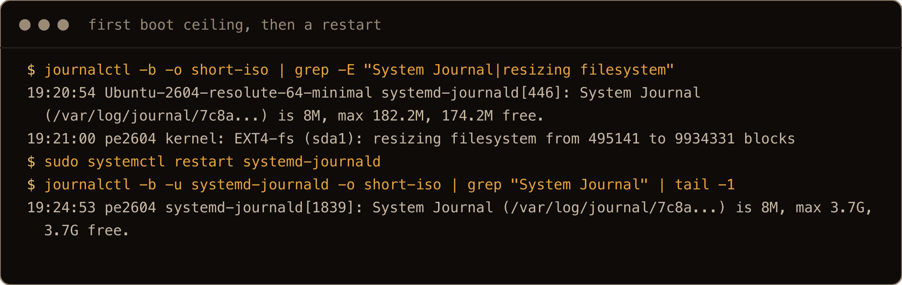
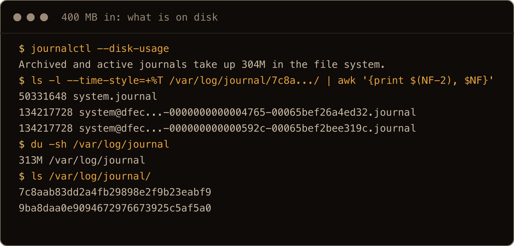
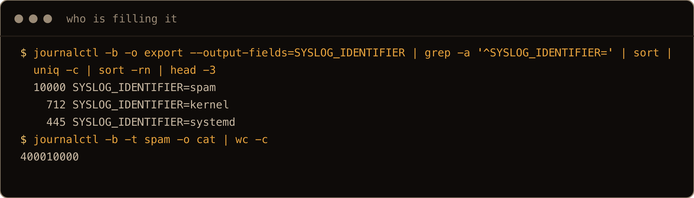
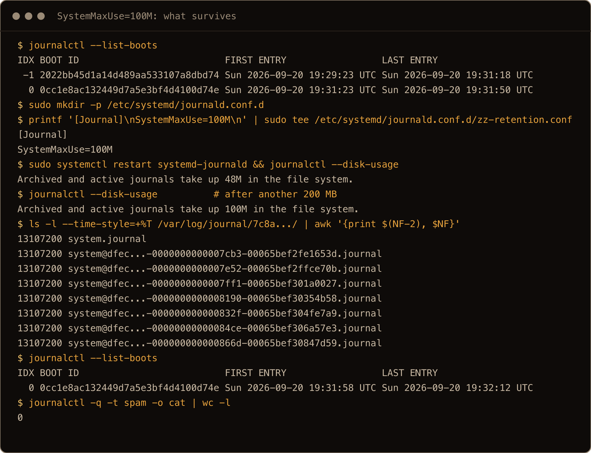
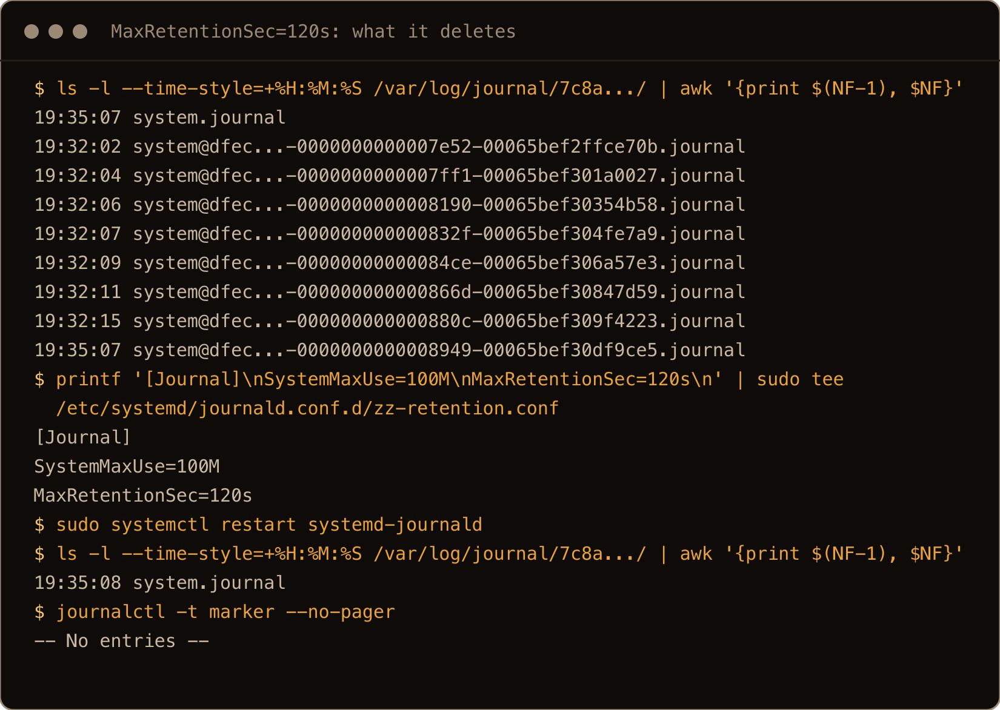
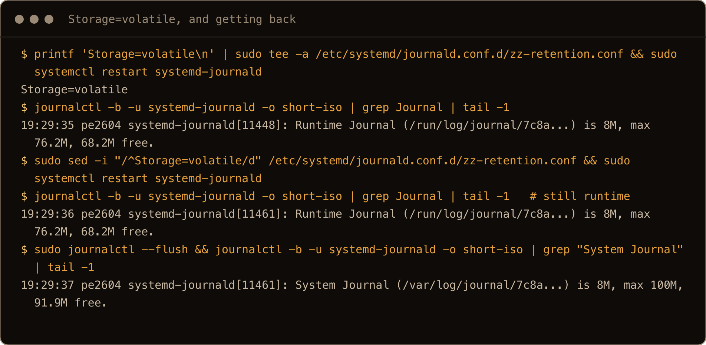

The [journalctl post](/blog/reading-logs-journalctl-ubuntu-26-04/) ended with "size the journal with `SystemMaxUse=` and `MaxRetentionSec=` and let journald manage it," which is correct and also skips the part where you find out what those numbers should be. This is that part. I took a fresh Ubuntu 26.04 server, measured what the journal does on its own, pushed a few hundred megabytes of logs through it, and tried every retention knob to see what it actually deletes.

The first surprise was a 182 MB journal cap on a 38 GB disk, because journald works out its ceiling once, when it starts, and on this cloud image that happened seven seconds before the root filesystem was grown. The second was `MaxRetentionSec=` deleting a marker I had logged seconds earlier, because it deletes whole files by their oldest entry. The rsyslog copy and a `ForwardToSyslog=no` file that did nothing are further down.

> **TL;DR.** journald caps itself at 10% of the filesystem or 4 GB, whichever is smaller, and works that out once at startup, so restart it after growing a disk. To set your own limits, put `SystemMaxUse=`, `MaxRetentionSec=` and `MaxFileSec=` in `/etc/systemd/journald.conf.d/zz-retention.conf` and `sudo systemctl restart systemd-journald`. Retention deletes whole files by their oldest entry, so a short `MaxFileSec=` is what keeps a month meaning roughly a month. On this image rsyslog keeps a second copy; `ForwardToSyslog=no` turns it off only from a file that sorts after, or replaces, Ubuntu's `syslog.conf`, which is why mine starts with `zz-`.

## Contents

- [What the defaults actually work out to](#what-the-defaults-actually-work-out-to)
- [The ceiling is computed once, at startup](#the-ceiling-is-computed-once-at-startup)
- [Where the space goes](#where-the-space-goes)
- [Who is filling it](#who-is-filling-it)
- [Capping it with SystemMaxUse](#capping-it-with-systemmaxuse)
- [Retention by time, and why it deletes more than you asked](#retention-by-time-and-why-it-deletes-more-than-you-asked)
- [The second copy: rsyslog](#the-second-copy-rsyslog)
- [Volatile storage, for SD cards](#volatile-storage-for-sd-cards)
- [What I would actually set](#what-i-would-actually-set)
- [Gotchas I hit](#gotchas-i-hit)
- [Quick reference](#quick-reference)

## What the defaults actually work out to

Every setting in `/etc/systemd/journald.conf` is commented out on the image I tested. The one override in the config files is `/usr/lib/systemd/journald.conf.d/syslog.conf`, which turns forwarding to rsyslog on, and that file matters later. Everything about size is at its default, and the defaults are formulas rather than numbers. From `man journald.conf` on the systemd 259 that 26.04 ships:

> `SystemMaxUse=` and `RuntimeMaxUse=` control how much disk space the journal may use up at most. `SystemKeepFree=` and `RuntimeKeepFree=` control how much disk space systemd-journald shall leave free for other uses. The first pair defaults to 10% and the second to 15% of the size of the respective file system, but each of the calculated default values is capped to 4G.

So the ceiling is 10% of the filesystem holding `/var/log/journal`, up to 4 GB, and journald also tries to leave the last 15% alone, again up to 4 GB. systemd's `M` and `G` are binary units; I write them as MB and GB throughout. Individual files are capped at one eighth of the ceiling, up to 128 MB, "so that usually seven rotated journal files are kept as history." Time based limits are off: `MaxRetentionSec=0`, and `MaxFileSec=1month` only forces a rotation every month. journald prints the numbers it settled on every time it starts, and that is the single most useful line in this whole topic:

```bash
$ journalctl -b -u systemd-journald -o short-iso | grep 'System Journal'
2026-09-20T13:44:51+00:00 pe2604-journald systemd-journald[1689]: System Journal (/var/log/journal/2ec6...) is 8M, max 3.7G, 3.7G free.
```

That is the answer for this 38 GB disk: a 3.7 GB ceiling. The table applies the documented formula; I measured the 38 GB row, and the earlier post saw the 4 GB cap on a 75 GB disk:

| Filesystem | Default ceiling | Keeps free |
| --- | --- | --- |
| 20 GB VPS | 2 GB | 3 GB |
| 38 GB (this box) | 3.7 GB | 4 GB (cap) |
| 75 GB | 4 GB (cap) | 4 GB (cap) |
| 1 TB | 4 GB (cap) | 4 GB (cap) |

On anything bigger than 40 GB the cap wins and you get 4 GB. On a small VPS the journal can take a tenth of your disk before it starts throwing anything away, which is fine right up until it is not.

## The ceiling is computed once, at startup

Here is the line from the same box's first boot, before I restarted anything:

```text
13:42:33 systemd-journald[444]: System Journal (/var/log/journal/2ec6...) is 8M, max 182.2M, 174.2M free.
13:42:40 kernel: EXT4-fs (sda1): resizing filesystem from 495141 to 9934331 blocks
```

182 MB, not 3.7 GB. journald flushed to disk and computed its limits at 13:42:33. First boot grew the root filesystem from its 1.9 GB image size to 38 GB at 13:42:40, seven seconds later. journald never looked again. I spun up a second fresh box to make sure it was not a fluke and got the identical pair of lines, same 182.2M, same seven second gap.



That is the final clean run on a third fresh box: the same pair of lines, six seconds apart that time, and the same 3.7G after a restart. The screenshots in the rest of this post come from that box too, so their timestamps and IDs differ from the transcripts in the text, which are from the first one.

I wanted to know whether journald ever catches up on its own, so I built a test where I controlled the disk: a 300 MB loop filesystem mounted on `/var/log/journal`, journald restarted so it computed a ceiling against it:

```text
System Journal (/var/log/journal/2ec6...) is 3.3M, max 26.4M, 23.1M free.
```

Then I grew the loop file to 3 GB, resized the filesystem online, waited 45 seconds, and pushed 100 MB of logs through:

```bash
$ df -h /var/log/journal | tail -1
/dev/loop0      2.9G   24M  2.8G   1% /var/log/journal
$ journalctl --disk-usage
Archived and active journals take up 23.1M in the file system.
```

Still capped at the old 26 MB, on a filesystem that now had 2.8 GB free. Of the 1,500 messages I had written before the resize, none survived. After `systemctl restart systemd-journald` the startup line said `max 290.4M`, and the next 100 MB went in and stayed. In every case I tried on this build, the ceiling was a snapshot taken when journald starts; the man page does not promise that either way.

In practice: on a cloud box whose disk is grown during first boot, the journal runs with a ceiling computed against the image size until something restarts journald. A reboot does it, and on the second boot of my box the line said `max 3.7G`. Until then, a 182 MB journal on a 38 GB disk is throwing away history you thought you had four gigabytes of. The same applies any time you grow a disk under a running box, which the [add a disk post](/blog/add-disk-fstab-lvm-ubuntu-26-04/) shows how to do without a reboot. journald does not notice. Check the startup line after any resize and restart the daemon if the number is stale. A message sent right after each restart in this post reached the journal.

This also explains a loose end in the earlier post, where the journal grew past 300 MB without hitting a ceiling. As far as I can reconstruct, that box had been rebooted for the boot history section before the disk test, and the reboot is exactly the restart that recomputes the cap.

## Where the space goes

To see the mechanics I wrote 10,000 messages of 40 KB of random base64 through `systemd-cat`, about 400 MB of text:

```bash
$ journalctl --disk-usage
Archived and active journals take up 304M in the file system.
$ ls -l /var/log/journal/2ec6eaf028db408b958d67c7632c9bd7/ | awk '{print $5, $9}'   # sequence ids shortened
50331648 system.journal
134217728 system@92f7...-0000000000000001-00065bea4df8d344.journal
134217728 system@92f7...-00000000000016fe-00065bea5851f61e.journal
```

400 MB in became 304 MB on disk, because journald compresses entries with zstd and even random base64 shrinks by a quarter. The archived files are exactly 128 MB each, the file size cap from above, and `system.journal` is the active one journald is still writing. And the file names carry two hex numbers, the sequence number and the timestamp of the first entry in that file. `00065bea4df8d344` is microseconds since the epoch and decodes to 13:42:28 UTC, the first line of this boot. That timestamp is going to matter in the retention section.

`journalctl --header` shows the same files with their state, `ONLINE` for the active one and `ARCHIVED` for the rest, and per file usage. Then there is this:

```bash
$ du -sh /var/log/journal
313M	/var/log/journal
$ ls /var/log/journal/
2ec6eaf028db408b958d67c7632c9bd7  9ba8daa0e9094672976673925c5af5a0
```

`du` says 313 MB, `--disk-usage` said 304 MB, and the difference is the second directory. It is a journal from a different machine ID, left there when the cloud image was built, and it holds 303 lines ending with the image builder's shutdown on 26 August. `journalctl --disk-usage` only counts this machine's directory, and `SystemMaxUse=` only governs this machine's directory, so that 8 MB ghost is invisible to every limit in this post. `journalctl -m --disk-usage` counts everything, `journalctl -D /var/log/journal/9ba8...` reads it, and `sudo rm -r` on the directory is the only way it goes away. Eight megabytes is nothing, but if you ever inherit a box where `du` and `--disk-usage` disagree by a lot, this is why.



## Who is filling it

Before you cap anything, find out what is writing. There is no per unit disk usage command, but the journal's fields make it a one liner. Entries per unit:

```bash
$ journalctl -b -o export --output-fields=_SYSTEMD_UNIT | grep -a '^_SYSTEMD_UNIT=' | sort | uniq -c | sort -rn | head -5
  10001 _SYSTEMD_UNIT=session-5.scope
    381 _SYSTEMD_UNIT=init.scope
    121 _SYSTEMD_UNIT=cloud-init-main.service
     75 _SYSTEMD_UNIT=user@0.service
     20 _SYSTEMD_UNIT=snapd.service
```

That ran in under a second against 300 MB of journal. Swap `_SYSTEMD_UNIT` for `SYSLOG_IDENTIFIER` to rank by tag instead, which is what you want for scripts and anything that logs through `logger`. My spam ran from an SSH session, so by unit it shows up as the session scope, and by identifier it shows up as `spam`, 10,000 entries. Once you have a suspect, measure it in bytes:

```bash
$ journalctl -b -t spam -o cat | wc -c
400010000
```

That counts the rendered messages plus newlines, not what they occupy on disk after compression, but it ranks the culprits. There was no `jq` on this fresh server, which is why these use `grep` and `sort` instead. The `-a` on grep is because journal export output contains binary field separators and grep otherwise decides the whole thing is a binary file.



## Capping it with SystemMaxUse

The [journalctl post](/blog/reading-logs-journalctl-ubuntu-26-04/) already showed that lowering `SystemMaxUse=` and restarting trims the journal immediately, no vacuum needed. The new wrinkle is the active file: the restart deletes archives, but the active file stays even when it is over the budget on its own, and a `SystemMaxUse=1M` test left the 8 MB active file in place. What I wanted to see this time is what the cap does while it is being enforced. I rebooted so the box had two boots in its history, then set 100 MB and restarted:

```bash
$ sudo mkdir -p /etc/systemd/journald.conf.d
$ printf '[Journal]\nSystemMaxUse=100M\n' | sudo tee /etc/systemd/journald.conf.d/50-retention.conf
$ sudo systemctl restart systemd-journald
$ journalctl --disk-usage
Archived and active journals take up 48M in the file system.
```

304 MB to 48 MB. journald deleted both 128 MB archives and kept the 48 MB active file, just under half the new cap on its own, and `--list-boots` still showed the previous boot because its tail end lived in that active file. Then I wrote another 5,000 messages, 200 MB:

```bash
$ journalctl --disk-usage
Archived and active journals take up 100M in the file system.
$ ls -la /var/log/journal/2ec6.../ | awk '{print $5, $9}'
13107200 system.journal
13107200 system@92f7...-0000000000003adf-....journal
... six more at 13107200 ...
$ journalctl --list-boots
IDX BOOT ID                          FIRST ENTRY                 LAST ENTRY
  0 2d2403af8831423c94980b137e4d19f9 Sun 2026-09-20 13:47:29 UTC Sun 2026-09-20 13:47:51 UTC
```

Held at exactly 100 MB, as eight files of 12.5 MB, one eighth of the cap each. The previous boot is gone, and of the original 10,000 messages, none survive. This is the trade in one screen: a small `SystemMaxUse=` is a small window into the past, and the granularity of that window is the file size. When journald needs space it deletes the oldest whole file, 12.5 MB at a time here, 128 MB at a time at the default.



## Retention by time, and why it deletes more than you asked

`MaxRetentionSec=` is the setting everyone reaches for when they want "keep a month of logs," and it does not do what the name suggests. To test it in minutes rather than months I rotated the journal, logged a marker, waited three minutes, logged another marker and rotated again. That left a stack of archives, and the two that matter are the one closed three minutes earlier and the one closed a second earlier, which held the second marker. Then I set a two minute retention and restarted:

```bash
$ ls -la --time-style=+%H:%M:%S /var/log/journal/2ec6.../ | awk '{print $6, $7}'
13:50:38 system.journal
13:47:35 system@...-0000000000003c7e-00065bea60155703.journal
...
13:47:57 system@...-0000000000004638-00065bea610ed925.journal
13:50:38 system@...-000000000000479b-00065bea61891a06.journal
$ printf '[Journal]\nSystemMaxUse=100M\nMaxRetentionSec=120s\n' | sudo tee /etc/systemd/journald.conf.d/50-retention.conf
$ sudo systemctl restart systemd-journald
$ ls -la /var/log/journal/2ec6.../ | awk '{print $9}'
system.journal
$ journalctl -t marker
-- No entries --
```

Every archive was deleted, including the one I had closed one second earlier, and the marker I logged a second before that rotation went with it. The reason is in the file name. That last archive is stamped `00065bea61891a06`, which decodes to 13:47:57, the time of its *first* entry, because it was opened at the previous rotation. Its newest entries were seconds old. journald judges an archive by the timestamp of its oldest entry, and if that is older than `MaxRetentionSec=`, the whole file goes, new entries included.



So the real granularity of time based retention is how often files rotate, which is `MaxFileSec=` (a month by default) or hitting the size cap, whichever comes first. And the error is in the direction you do not want. With `MaxRetentionSec=1month` and the default monthly rotation, a file opened on day one is deleted the moment its first entry turns 30 days old, taking entries only a few days old with it, so you keep somewhere between nothing and a month. With `MaxFileSec=1week` the most you lose early is a week, so "a month" means three to four weeks of history at any given moment, as long as the size cap has not taken more first. Time retention only ever shortens what the size limits leave. The man page hints at this in the passive voice: "to ensure that not too much data is lost at once when old journal files are deleted, it might make sense to change this value from the default of one month." I did not run the month long version, but the two minute one leaves no doubt about the mechanism.

For one off cleanup, `journalctl --vacuum-time=`, `--vacuum-size=` and `--vacuum-files=` are covered in the earlier post, including why you `--rotate` first.

## The second copy: rsyslog

This image installs rsyslog, and journald forwards to it, so every line lands in `/var/log/syslog` or one of its siblings (`auth.log` for authentication, `kern.log` for the kernel) as well as the journal. After my 400 MB of spam:

```bash
$ du -sh /var/log/journal /var/log/syslog
313M	/var/log/journal
78M	/var/log/syslog
```

The syslog copy is smaller only because it is truncated: each 40 KB message arrived in `/var/log/syslog` as about 8 KB, which matches rsyslog's documented default maximum message size. For normal sized log lines the two grow together, and `/var/log/syslog` is plain text, uncompressed until logrotate gets to it. Its retention is a separate policy in `/etc/logrotate.d/rsyslog`: weekly rotation, four rotations kept, compressed after the first. So a chatty box is paying twice, under two different sets of rules, and only one of them is the journal.

If you read logs with `journalctl`, and after the earlier post you should, the text copy is dead weight. There are two ways to stop it and one trap. The trap first. Ubuntu turns forwarding on with a file it ships at `/usr/lib/systemd/journald.conf.d/syslog.conf`, and these config snippets apply in filename order across directories, so a file called `50-retention.conf` in `/etc` loses to it:

```bash
$ systemd-analyze cat-config systemd/journald.conf | grep -E '^# /.*conf|^ForwardToSyslog'
# /etc/systemd/journald.conf
# /etc/systemd/journald.conf.d/50-retention.conf
ForwardToSyslog=no
# /usr/lib/systemd/journald.conf.d/syslog.conf
ForwardToSyslog=yes
```

Last one wins, so that `no` did nothing, and the test message still landed in `/var/log/syslog`. Two names work: `/etc/systemd/journald.conf.d/syslog.conf`, which replaces the shipped file outright because same named files in `/etc` mask `/usr/lib`, or anything that sorts after it, which is why the file in this post is called `zz-retention.conf`. With either, the test message reached the journal and not the text file. `systemd-analyze cat-config` prints every assignment in the order they apply, so you can see which one lands last before you trust it.


The other way is to stop or remove rsyslog, `sudo systemctl disable --now rsyslog` or `sudo apt remove rsyslog`, which stops the text files being written. Before you do either, check what on the box reads `/var/log/auth.log` or `/var/log/syslog`. On 26.04 the obvious candidate does not: fail2ban 1.1.0 ships `backend = systemd` for its sshd jail and matches on the journal, not on `auth.log`, which I checked by installing it and reading its jail defaults. Anything you grep out of habit, and any log shipper pointed at a file, is your list.

## Volatile storage, for SD cards

On a Raspberry Pi or anything else that boots from flash, a journal writing to `/var/log/journal` all day is wear you do not need. `Storage=volatile` keeps it in memory under `/run/log/journal` instead, with its own smaller ceiling. It does not stop rsyslog, though, so on a box with rsyslog installed the text copy is still going to flash unless you turn forwarding off or stop the service. Append the line to the retention file from this post rather than replacing it, or the `ForwardToSyslog=no` line goes with it:

```bash
$ printf 'Storage=volatile\n' | sudo tee -a /etc/systemd/journald.conf.d/zz-retention.conf
$ sudo systemctl restart systemd-journald
$ journalctl -b -u systemd-journald -o short-iso | tail -1
... Runtime Journal (/run/log/journal/2ec6...) is 8M, max 76.2M, 68.2M free.
```

The `Runtime` limits are 10% of `/run`, which is a tmpfs sized to a fraction of RAM, so 76 MB on this 4 GB box. You lose boot history, and the files already in `/var/log/journal` stay there untouched but unwritten. Going back is the surprise: I removed the setting and restarted journald, and it kept writing to `/run`. journald only moves from the runtime journal to disk when it is told to flush, which happens once at boot, and a restart does not repeat it. `sudo journalctl --flush` does, and the daemon then logged a `System Journal` line with the 3.7 GB ceiling and carried on writing to disk.



On the final run a 100 MB cap was already in `zz-retention.conf` on that box, so the flush came back with `max 100M`, which is the point of reading the line back: it tells you what is in force right now.

## What I would actually set

For a server whose logs I read with `journalctl` and do not ship anywhere, this is the file. Some transcripts above used `50-retention.conf`, which works for every setting except the last one here, and that is why the real file gets a name that sorts after `syslog.conf`:

```ini
# /etc/systemd/journald.conf.d/zz-retention.conf
[Journal]
SystemMaxUse=1G
MaxRetentionSec=1month
MaxFileSec=1week
ForwardToSyslog=no
```

A gigabyte is a number I can reason about instead of a percentage that moves with the disk. It is a starting point, and after a week I would check `--list-boots` and `--disk-usage` to see how much history the box's real workload leaves under it. `MaxRetentionSec=1month` with `MaxFileSec=1week` means old logs go a week at a time, so a month is three to four weeks of history if the size cap has room for it. `ForwardToSyslog=no` stops the second copy. The directory did not exist on my fresh box, so `sudo mkdir -p /etc/systemd/journald.conf.d` first, then `sudo systemctl restart systemd-journald`, and read the `System Journal` line it prints to confirm the cap you meant is the cap you got. On a VPS with a 20 GB disk I would halve the size. On a Pi, `Storage=volatile`, and accept that the journal starts over on every boot.

## Gotchas I hit

- **The ceiling is computed once, at startup.** Grow a disk, restart journald. On a cloud image whose disk grows during first boot, the journal runs with a tiny cap until journald next restarts. Read the `System Journal` startup line.
- **`MaxRetentionSec=` deletes whole files by their oldest entry**, newer entries included. An archive one second old went because its first entry was three minutes old. Pair it with a short `MaxFileSec=`, and expect less history than the number, not more.
- `SystemMaxUse=` is a history budget, not a disk budget. 100 MB kept none of 10,000 messages and erased the previous boot. Files go one at a time, one eighth of the cap each.
- A `ForwardToSyslog=no` in a file named `50-anything.conf` does nothing, because Ubuntu's `syslog.conf` in `/usr/lib` sorts after it. Name yours `syslog.conf` or `zz-something.conf`, and check with `systemd-analyze cat-config`.
- `--disk-usage` ignores other machines' journals. The image build left an 8 MB directory that no limit governs. `-m` counts it, `rm -r` removes it.
- rsyslog truncates. Long lines are cut to about 8 KB in `/var/log/syslog`. The journal has the full entry.
- **Coming back from `Storage=volatile` needs `journalctl --flush`.** A restart alone keeps writing to `/run`. And volatile does not stop rsyslog writing to disk.
- The `journald.conf.d` directory does not exist on a fresh box. `mkdir -p` it before the first `tee`.
- The commented `#Storage=persistent` in this image's `journald.conf` says the compiled default is persistent, where upstream's is `auto`. The earlier post said `auto`. On this image it makes no difference, because the on disk directory exists either way.

## Quick reference

```bash
# what journald decided at startup
journalctl -b -u systemd-journald -o short-iso | grep 'System Journal'
journalctl --disk-usage            # this machine only
journalctl -m --disk-usage         # every directory under /var/log/journal
journalctl --header | grep -E '^File path|^State|^Disk usage'

# who is writing
journalctl -b -o export --output-fields=SYSLOG_IDENTIFIER | grep -a '^SYSLOG_IDENTIFIER=' | sort | uniq -c | sort -rn | head
journalctl -b -t TAG -o cat | wc -c         # TAG = an identifier from the list above

# set retention (file name sorts after Ubuntu's syslog.conf on purpose)
sudo mkdir -p /etc/systemd/journald.conf.d
sudo tee /etc/systemd/journald.conf.d/zz-retention.conf <<'EOF'
[Journal]
SystemMaxUse=1G
MaxRetentionSec=1month
MaxFileSec=1week
ForwardToSyslog=no
EOF
sudo systemctl restart systemd-journald
systemd-analyze cat-config systemd/journald.conf | grep -vE '^#|^$'   # every assignment, in order; last wins

# one-off cleanup (archives only; rotate to include the active file)
sudo journalctl --rotate && sudo journalctl --vacuum-size=200M

# leftover journal from the image build
ls /var/log/journal/ ; cat /etc/machine-id       # the directory that is NOT your machine id
sudo rm -r /var/log/journal/OTHER_ID              # substitute it

# volatile (add the line to the file above rather than replacing it), and back
printf 'Storage=volatile\n' | sudo tee -a /etc/systemd/journald.conf.d/zz-retention.conf && sudo systemctl restart systemd-journald
sudo sed -i '/^Storage=volatile/d' /etc/systemd/journald.conf.d/zz-retention.conf && sudo systemctl restart systemd-journald && sudo journalctl --flush
```

The defaults are sane on a big disk and most people never look, which is fine right up to the day `df` says the journal has 4 GB and the boot you need is not in it.

`[ System Journal is 8M, max what you meant ]`
