Your llama.cpp server was fine last week. Now it will not start, and the whole log is one line:

```text
error: invalid argument: --mlock
```

llama.cpp 0.4.1 (September 14, 2026) removed `--mlock`, `--mmap`, `--no-mmap` and `--direct-io` and folded them into a single `--load-mode` flag. Every systemd unit, Docker command and shell script that still passes one of the old flags now exits on the spot. If you came here for that, [section 7](#7-error-invalid-argument-mlock) has the fix.

The rest of this post is the setup I wanted in the first place: llama.cpp's own server on a plain Ubuntu 26.04 box with no GPU, running as a service with its own user, answering the OpenAI API on localhost with a key. I ran all of it on a fresh 26.04 server with 4 vCPUs and 8 GB of RAM, with llama.cpp build 11222 (it reports itself as `0.5.0-dev`).

The one thing to get straight: llama.cpp moves fast, and the version you install decides which flags exist and which models load. The copy in Ubuntu's archive is build 8681 and still takes `--mlock`. It also refused the current Qwen3.5 file I tried. The release builds on GitHub are current and error on `--mlock`. Pick the source first, then write flags for that version.

> **TL;DR.** `sudo apt install libgomp1`, extract the release tarball into a versioned directory with `tar --no-same-owner`, point a symlink `/opt/llama.cpp` at it, create a `llama` system user **with a home directory**, download the model as that user with `llama download -hf <repo>:<quant>`, and run `llama-server` from systemd with `--host 127.0.0.1`, `--api-key-file` and `--offline`. If an old unit dies with `error: invalid argument: --mlock`, replace it with `--load-mode mmap+mlock` and add `LimitMEMLOCK=infinity` to the unit, or drop the lock entirely. `LLAMA_ARG_MLOCK=1` no longer errors; it is silently ignored, so set `LLAMA_ARG_LOAD_MODE=mmap+mlock` instead.

## Contents

- [1. apt, snap, or the release build](#1-apt-snap-or-the-release-build)
- [2. Install the release build](#2-install-the-release-build)
- [3. `llama serve` and `llama-server` are the same server](#3-llama-serve-and-llama-server-are-the-same-server)
- [4. A user with a home, and a model](#4-a-user-with-a-home-and-a-model)
- [5. The systemd unit](#5-the-systemd-unit)
- [6. Test the OpenAI API](#6-test-the-openai-api)
- [7. error: invalid argument: --mlock](#7-error-invalid-argument-mlock)
- [8. failed to mlock: Try increasing RLIMIT_MEMLOCK](#8-failed-to-mlock-try-increasing-rlimit_memlock)
- [9. The other errors I hit](#9-the-other-errors-i-hit)
- [10. Upgrading and rolling back](#10-upgrading-and-rolling-back)
- [Gotchas I hit](#gotchas-i-hit)
- [Quick reference](#quick-reference)

## 1. apt, snap, or the release build

There are three ways to get llama.cpp onto 26.04, and they are three different versions:

| Source | Version on 2026-09-27 | `--mlock` | Notes |
| --- | --- | --- | --- |
| `apt install llama.cpp` (universe) | build 8681 | accepted | Ubuntu's own package. No `llama` command. Could not load the current Qwen3.5 0.8B Q8_0 file. |
| `snap install llama-cpp` | 0.4.0 on stable, 0.4.1 on candidate | 0.4.0 warns, 0.4.1 errors | Published by an individual, not by Canonical or ggml-org. Refreshes itself. |
| Release tarball from GitHub | build 11222 (`0.5.0-dev`) | error | Current. You update it yourself. |

The apt package is the boring choice, and for most packages boring wins. Here it loses, because llama.cpp's model support moves with the build. The archive's build 8681 served the Qwen3.5 0.8B Q4_0 file happily, then failed on the Q8_0 file from the same repository with `missing tensor 'blk.24.ssm_conv1d.weight'` ([section 9](#missing-tensor-the-archive-build-is-too-old-for-the-file)). New model, old build, no workaround except a newer build.

The snap is current, but read its store page before you trust it with a service: the publisher is an individual account, and snaps refresh on their own. I installed 0.4.0 from stable, where `--mlock` prints a deprecation warning and runs. `snap refresh llama-cpp --candidate` moved it to 0.4.1, and the same command line stopped with `error: invalid argument: --mlock`. When 0.4.1 reaches stable, that refresh happens to everyone with no one at the keyboard. (Its `llama-cpp --help` is also broken: the wrapper tries to run a binary called `llama---help`.)

I use the release build. It is current, I choose when it changes, and rolling back is one symlink.

## 2. Install the release build

The builds are on the [releases page](https://github.com/ggml-org/llama.cpp/releases), named by build number. The CPU build for x86 is `llama-b<build>-bin-ubuntu-x64.tar.gz`; there is an `ubuntu-arm64` one too. Pin a number rather than scripting "latest": fourteen new builds went up on the day I wrote this.

The release build needs one library that a fresh 26.04 server does not have, the GNU OpenMP runtime:

```bash
sudo apt install libgomp1
```

Skip it and the first `--version` stops with `error while loading shared libraries: libgomp.so.1: cannot open shared object file`. (I only found this on a second, truly fresh box. On my first box I had installed the apt `llama.cpp` package earlier, which pulls `libgomp1` in, so the release build just worked there.)

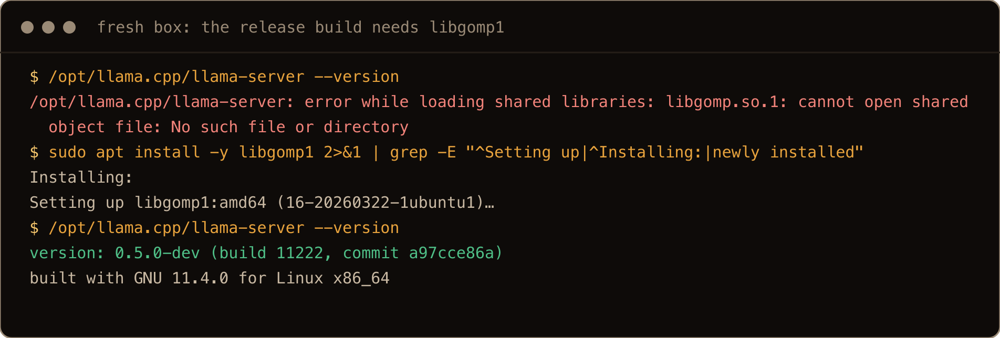

The screenshots in this post come from a final clean run on a fresh box, after the rest was written and reviewed, so PIDs, times and IDs differ from the text blocks. Two of them start the server with `systemd-run` as a quick transient unit instead of editing the real one.

Then the build itself:

```bash
B=b11222
cd /tmp
curl -fLO https://github.com/ggml-org/llama.cpp/releases/download/$B/llama-$B-bin-ubuntu-x64.tar.gz
sudo mkdir -p /opt/llama.cpp-$B
sudo tar xzf llama-$B-bin-ubuntu-x64.tar.gz -C /opt/llama.cpp-$B --strip-components=1 --no-same-owner
sudo ln -sfn /opt/llama.cpp-$B /opt/llama.cpp
/opt/llama.cpp/llama-server --version
```

```text
version: 0.5.0-dev (build 11222, commit a97cce86a)
built with GNU 11.4.0 for Linux x86_64
```

**`--no-same-owner` is not optional.** The files in the tarball belong to uid 1001. Without the flag, `tar` running as root keeps that owner, and on a fresh Ubuntu box uid 1001 is nobody yet. The second person you add to the box is uid 1001. I added two users, and the second one owned every file in the directory and could write to `libllama.so`, the library a root managed service loads. With the flag, everything lands as `root:root`. If you already extracted without it, `sudo chown -R root:root /opt/llama.cpp-*` fixes it.

**Keep the whole directory together.** The tarball holds 60 files, and `llama-server` is a 17 KB launcher. The server itself lives in `libllama-server-impl.so`, next to the model library, `libmtmd` and one CPU backend per instruction set level (`libggml-cpu-haswell.so`, `-skylakex`, `-zen4` and so on, picked at start). Copy only the binary to `/usr/local/bin` and it dies at once ([section 9](#libllama-server-implso-cannot-open-shared-object-file)). A symlink is fine, because the binary finds its libraries relative to its real location:

```bash
sudo ln -sfn /opt/llama.cpp/llama-server /usr/local/bin/llama-server
sudo ln -sfn /opt/llama.cpp/llama /usr/local/bin/llama
```

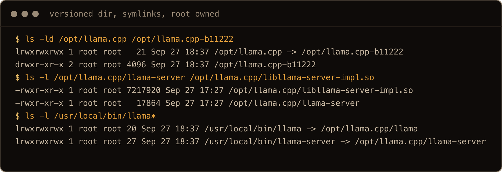

## 3. `llama serve` and `llama-server` are the same server

The current README starts servers with `llama serve`, and older guides use `llama-server`. The release build ships both: `llama` is a small front end with subcommands:

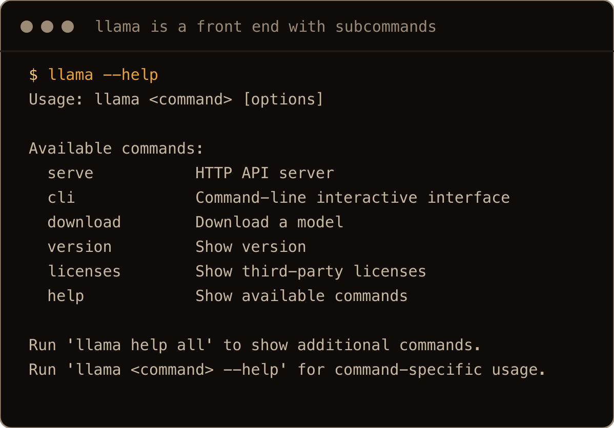

`llama serve --help` and `llama-server --help` printed exactly the same text on this build (I diffed them), so the flags in this post belong to both. I use `llama-server` in the unit because it is the name in every log line and every guide, and `llama download` for fetching models. The apt package has no `llama` command at all, so a `llama serve` guide will not work on the archive build.

## 4. A user with a home, and a model

The service gets its own system user. The part that matters is `--create-home`:

```bash
sudo useradd --system --create-home --home-dir /var/lib/llama --shell /usr/sbin/nologin llama
```

`-hf` downloads land in the Hugging Face cache under the user's home, `~/.cache/huggingface/hub`, and a user without a writable home breaks there ([section 9](#cannot-create-directories-read-only-file-system-cachehuggingface)). With the home in `/var/lib/llama`, the service and the download agree on one path.

Download the model as that user, so the files are its own:

```bash
cd /tmp
sudo -u llama llama download -hf ggml-org/gemma-4-E4B-it-GGUF:Q4_0 --no-mmproj
sudo -u llama llama-server --cache-list
```

```text
number of models in cache: 1
   1. ggml-org/gemma-4-E4B-it-GGUF:Q4_0
```

(The `cd /tmp` is there because `useradd` makes the home `0750`, so `sudo -u llama` from inside your own home, or you from inside its home, runs into a directory the other side cannot read.)

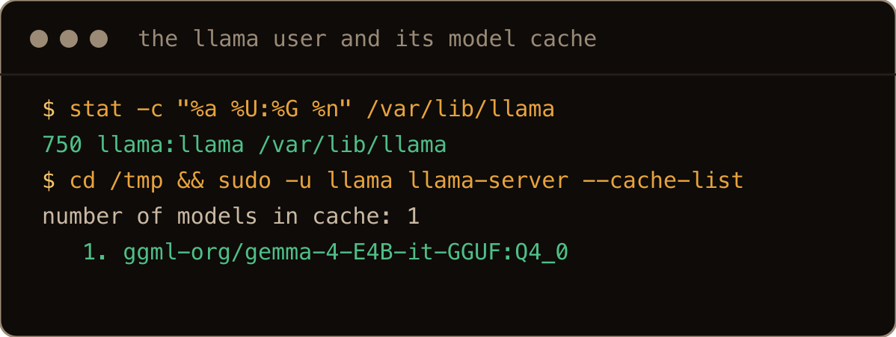

The part after the colon is the quantization, and it is worth naming. Leave it off and `-hf` picks `Q4_K_M`, or the first file in the repository if there is no `Q4_K_M`. This repository has no `Q4_K_M`, and its files are `BF16` (15 GB), `Q4_0` (4.6 GB) and `Q8_0` (8 GB). `--no-mmproj` skips the multimodal projector file, which you only need to send the model images or audio.

Gemma 4 E4B at `Q4_0` is what I would run on a small CPU box. On 4 vCPUs it generated a little over 5 tokens a second, which is slow reading pace but fine for scripts and batch jobs. For checking the plumbing, `ggml-org/Qwen3.5-0.8B-GGUF:Q8_0` is 834 MB and did 15 to 18 tokens a second. It also told me one of the three Linux init systems was called "Init System (IDT)", so keep it for plumbing.

## 5. The systemd unit

First an API key, readable by root and the service and nobody else:

```bash
sudo mkdir -p /etc/llama
openssl rand -hex 24 | sudo tee /etc/llama/api-key >/dev/null
sudo chown root:llama /etc/llama/api-key
sudo chmod 640 /etc/llama/api-key
```

Then `/etc/systemd/system/llama-server.service`:

```ini
[Unit]
Description=llama.cpp server
After=network-online.target
Wants=network-online.target

[Service]
User=llama
Group=llama
WorkingDirectory=/var/lib/llama
ExecStart=/opt/llama.cpp/llama-server \
  -hf ggml-org/gemma-4-E4B-it-GGUF:Q4_0 --no-mmproj --offline \
  --host 127.0.0.1 --port 8080 \
  --api-key-file /etc/llama/api-key \
  --ctx-size 8192
Restart=on-failure
RestartSec=5
MemoryMax=6G
NoNewPrivileges=yes
ProtectSystem=strict
ProtectHome=yes
ReadWritePaths=/var/lib/llama
PrivateTmp=yes

[Install]
WantedBy=multi-user.target
```

```bash
sudo systemctl daemon-reload
sudo systemctl enable --now llama-server
systemctl status llama-server --no-pager
```

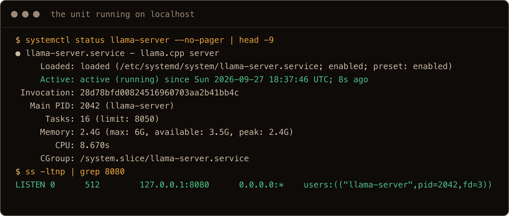

Why each piece is there:

- `--offline` makes the server use the cache and never touch the network. The model is already downloaded, so a restart should not depend on Hugging Face being up, and a server that phones out on every boot is not what I want on the box.
- `--host 127.0.0.1` keeps it on the box. Without an API key the server says so in its log: `security: no API key is set and CORS allows all origins`. If other machines need it, put it behind a reverse proxy with TLS (my [nginx reverse proxy post](/blog/nginx-reverse-proxy-ubuntu-26-04/) covers that) rather than binding it to `0.0.0.0`.
- `--api-key-file` reads the key from the file, so it never shows up in `ps` or `systemctl status` the way `--api-key <key>` would.
- `--ctx-size 8192` caps the context. The default of 0 means "whatever the model says", and Qwen3.5 says 262,144 tokens. The KV cache for the context comes out of RAM, so pick a number that fits.
- `MemoryMax=6G` stops a runaway model from taking the whole box. Size it to the model plus the context.
- `ProtectSystem=strict` makes the filesystem read only for the service, `ReadWritePaths=/var/lib/llama` opens up its home again, and `PrivateTmp=yes` gives it a private, writable `/tmp`. `ProtectHome=yes` is safe here only because the home is in `/var/lib`.

If units are new to you, my [systemd units and timers post](/blog/systemd-units-timers-ubuntu-26-04/) walks through the pieces.

## 6. Test the OpenAI API

`/health` answers without a key (so does `/v1/health`), which is handy for monitoring. The API endpoints want the key:

```text
$ curl -si localhost:8080/v1/models | head -1
HTTP/1.1 401 Unauthorized
$ curl -s localhost:8080/v1/models
{"error":{"message":"Invalid API Key","type":"authentication_error","code":401}}
```

With the key:

```bash
KEY=$(sudo cat /etc/llama/api-key)
curl -s localhost:8080/v1/chat/completions \
  -H "Authorization: Bearer $KEY" -H "Content-Type: application/json" \
  -d '{"messages":[{"role":"user","content":"Name three Linux init systems."}],"max_tokens":200}'
```

For an OpenAI client library, that is base URL `http://127.0.0.1:8080/v1` with the key as the API key.

**The trap on the first request: an empty `content`.** Qwen3.5 and Gemma 4 both think before they answer, and the server puts the thinking in `message.reasoning_content`, separate from `message.content`. On the 0.8B Qwen with `max_tokens` at 200, the thinking used all 200 tokens, so I got `finish_reason: length`, `content: ''` and a page of reasoning. Gemma thought for about 500 characters, started the answer and ran out partway through it. Nothing is broken. You have three ways out:

- raise `max_tokens` so the model gets past its thinking,
- turn thinking off per request with `"chat_template_kwargs":{"enable_thinking":false}` in the body,
- or turn it off for the whole server with `--reasoning off` in the unit.

With either of the last two, the answer landed in `content`. Per request, it came back with `finish_reason: stop`. With `--reasoning off`, the 0.8B Qwen can still run to the 200 token limit (it did once for me, and stopped on its own in another run), but the text is answer, not thinking.


## 7. error: invalid argument: --mlock

This is the one that breaks working setups. On a build from 0.4.1 onwards, any of the old loading flags stops the server before it does anything:

```text
$ llama-server -hf ggml-org/Qwen3.5-0.8B-GGUF --mlock
error: invalid argument: --mlock
$ llama-server --no-mmap
error: invalid argument: --no-mmap
$ llama-server --direct-io
error: invalid argument: --direct-io
```

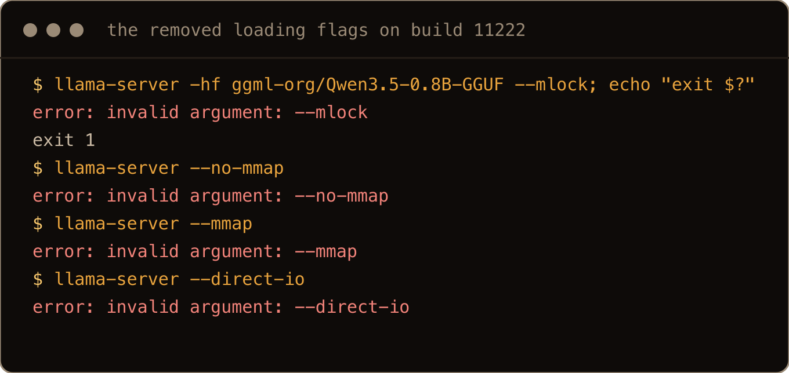

Under systemd it looks worse, because `Restart=on-failure` retries every 5 seconds forever. The status shows `activating (auto-restart)`, and the journal is a column of the same line:

```text
llama-server[9124]: error: invalid argument: --mlock
systemd[1]: llama-server.service: Main process exited, code=exited, status=1/FAILURE
systemd[1]: llama-server.service: Scheduled restart job, restart counter is at 24.
```

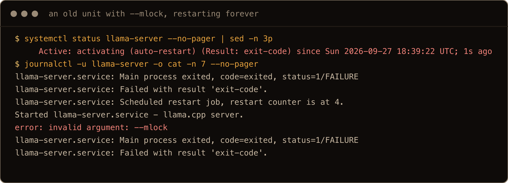

The replacement is `--load-mode` (short form `-lm`), which takes one value:

| Old flags | New flag |
| --- | --- |
| `--mlock` | `--load-mode mmap+mlock` |
| `--no-mmap` | `--load-mode none` |
| `--no-mmap --mlock` | `--load-mode mlock` |
| `--direct-io` | `--load-mode dio` |
| (nothing) | nothing; the default is `auto`, which is mmap |

Watch the first row, because it depends on where you are coming from. Before 0.4, mmap was on by default (the archive's build 8681 still says `--mmap, --no-mmap ... (default: enabled)`), so `--mlock` meant mapped and locked, which is `mmap+mlock`. An answer in the [llama.cpp discussion on exactly this question](https://github.com/ggml-org/llama.cpp/discussions/27912) lands on the same mapping. The 0.4.0 snap, though, prints this:

```text
W DEPRECATED: --mlock is deprecated. use --load-mode mlock instead
```

and it does what it says: on 0.4.0 the old flag tried to lock an 800,882,688 byte buffer, the same size of buffer `--load-mode mlock` locks on the new build. So a unit written for 0.4.0 already had `mlock` behaviour, and a unit written before 0.4 had `mmap+mlock` behaviour.

The difference is real. `mlock` on its own means no mmap: the whole model is read into the process's own memory. I ran both in the unit with the same 834 MB model. With `mmap+mlock`, systemd counted about 280 MB against the service. With `mlock`, it counted 1 GB. `VmLck` was the same 782,116 kB either way. With a `MemoryMax=` in the unit, that is the number that matters, so I use `mmap+mlock`.

**The Docker trap: `LLAMA_ARG_MLOCK` is silently ignored.** Most flags have an environment variable form (`--help` lists it under each flag), and Compose files use them a lot. On build 11222, `LLAMA_ARG_MLOCK=1` started the server with no warning and `VmLck: 0 kB`. The flag errors; the variable does not, so the container keeps running and the lock is just gone. Replace it with `LLAMA_ARG_LOAD_MODE=mmap+mlock`, and look for `LLAMA_ARG_MMAP` and `LLAMA_ARG_NO_MMAP` in your Compose files while you are there.

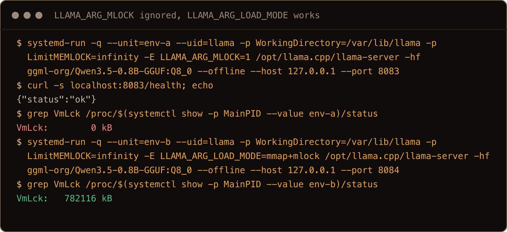

And do you need the lock at all? Probably not. It stops the kernel from dropping the model's pages under memory pressure and reading them back from the GGUF file later, which matters on a box that is short of memory and runs other things. On a box that exists to serve the model, the default does the job. Section 8 is the price of turning it on.

## 8. failed to mlock: Try increasing RLIMIT_MEMLOCK

I put `--load-mode mmap+mlock` in the unit and the service started, answered `/health`, and looked fine. The log said otherwise:

```text
W warning: failed to mlock 281141248-byte buffer (after previously locking 0 bytes): Cannot allocate memory
Try increasing RLIMIT_MEMLOCK ('ulimit -l' as root).
```

A service on 26.04 gets a locked memory limit of 8 MB (`LimitMEMLOCK=8388608` in `systemctl show llama-server`), and a model does not fit in 8 MB. The server carries on without the lock, and `/proc/<pid>/status` shows `VmLck: 0 kB`. So the flag was there, and nothing was locked.

The fix goes in the unit, not in `ulimit`:

```ini
[Service]
LimitMEMLOCK=infinity
```

After a `daemon-reload` and restart, the warning was gone, `Max locked memory` in `/proc/<pid>/limits` read `unlimited`, and `VmLck` was 782,116 kB for the 834 MB Qwen file.

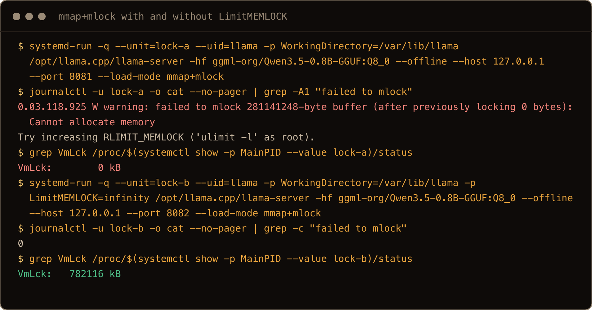

Now the price. With Gemma 4 E4B at `Q4_0`, the lock pinned 4,467,400 kB (about 4.3 GiB), and `free -h` on the 8 GB box showed 309 MiB available. Locked memory cannot be reclaimed, so everything else on the box now competes for what is left. On a small box that also runs other services, leave the lock off.

## 9. The other errors I hit

### libllama-server-impl.so: cannot open shared object file

```text
/usr/local/bin/llama-server: error while loading shared libraries: libllama-server-impl.so: cannot open shared object file: No such file or directory
```

I copied `llama-server` out of the release directory on its own. It is a launcher, and it looks for its libraries next to its own real path. Put the whole directory in `/opt` and symlink the binary instead of copying it ([section 2](#2-install-the-release-build)). A symlink worked straight away, and `ldd` showed every library resolved from `/opt/llama.cpp`.

### cannot create directories: Read-only file system [/.cache/huggingface...]

```text
E get_repo_commit: error: filesystem error: cannot create directories: Read-only file system [/.cache/huggingface/hub/models--ggml-org--Qwen3.5-0.8B-GGUF/refs]
E llama_model_load_from_file_impl: exactly one out metadata, path_model, and file must be defined
E srv    load_model: failed to load model, ''
```

That was a unit with `DynamicUser=yes` and `-hf`. There is no home directory, so the cache path became `/.cache/huggingface`, on a filesystem the unit made read only. A system user created without a home gave the same failure with `Permission denied [/nonexistent/.cache/...]`. The first line is the real error; the `exactly one out metadata, path_model, and file` line after it just means no model file came out of the download. Give the service user a real home, as in [section 4](#4-a-user-with-a-home-and-a-model), and download the model as that user before the first start.

![a copy of llama-server in /tmp/copied fails with libllama-server-impl.so: cannot open shared object file, and a DynamicUser run fails with cannot create directories: Read-only file system [/.cache/huggingface/hub/...] and then failed to load model](../../assets/llama-cpp-2604-shot-11-errors.png)

### missing tensor: the archive build is too old for the file

```text
llama_model_load: error loading model: missing tensor 'blk.24.ssm_conv1d.weight'
```

That was Ubuntu's apt build 8681 loading `Qwen3.5-0.8B-Q8_0.gguf`. The Q4_0 file from the same repository loaded fine on the same build. The Q8_0 file has 335 tensors, including an extra block the old loader does not know, and the Q4_0 has 320. The model is not corrupt; the build is older than the file. The release build loaded it, logging only that it was ignoring the extra `blk.24` tensors. If a GGUF from this month fails with `missing tensor`, check `llama-server --version` before you download it again.

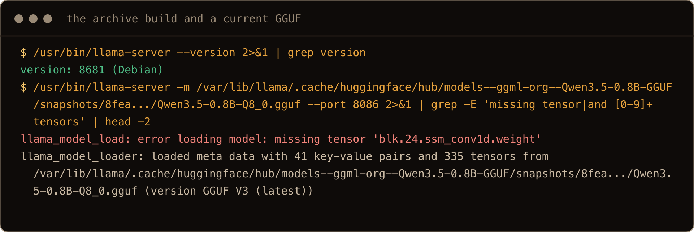

## 10. Upgrading and rolling back

The versioned directory and the symlink are the whole upgrade story. Extract the new build next to the old one, move the link, restart:

```bash
B=b11222   # swap in the build number you want from the releases page
cd /tmp
curl -fLO https://github.com/ggml-org/llama.cpp/releases/download/$B/llama-$B-bin-ubuntu-x64.tar.gz
sudo mkdir -p /opt/llama.cpp-$B
sudo tar xzf llama-$B-bin-ubuntu-x64.tar.gz -C /opt/llama.cpp-$B --strip-components=1 --no-same-owner
/opt/llama.cpp-$B/llama-server --version
```

Before you move the link, run the new binary with your unit's flags by hand, on another port, as the service user, for a few seconds. An `invalid argument` shows up at once, and a caught error beats a restart loop. Then:

```bash
sudo ln -sfn /opt/llama.cpp-$B /opt/llama.cpp
sudo systemctl restart llama-server
```

If the new build breaks something anyway (the `--mlock` removal was exactly this), point the link back at the old directory and restart. I moved the link between builds 11200 and 11222 and back, and `--version` followed it each time. Delete old directories when you are sure you will not need them.

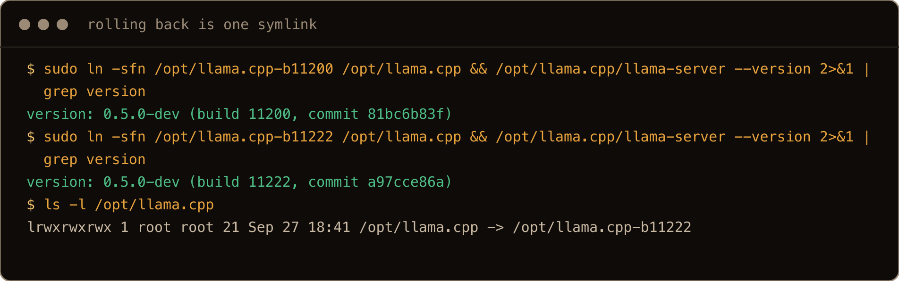

## Gotchas I hit

- `error: invalid argument: --mlock` from 0.4.1 onwards, and the same for `--mmap`, `--no-mmap` and `--direct-io`. Use `--load-mode`.
- `LLAMA_ARG_MLOCK=1` does not error. It is ignored, and the server starts without the lock.
- Before 0.4, `--mlock` meant `--load-mode mmap+mlock`. The 0.4.0 shim mapped it to `--load-mode mlock` instead, which counts the whole model against `MemoryMax=`.
- `mmap+mlock` under systemd did nothing until `LimitMEMLOCK=infinity`, and it only said so in a warning.
- Extracting the release tarball as root without `--no-same-owner` gave uid 1001 ownership of the server's files.
- `llama-server` copied alone into `/usr/local/bin` cannot find `libllama-server-impl.so`. Symlink it.
- A service user without a writable home breaks `-hf` downloads, and the error that follows mentions `path_model` instead.
- Ubuntu's apt build 8681 could not load a current Qwen3.5 Q8_0 file.
- A thinking model with a small `max_tokens` returns an empty `content` and `finish_reason: length`.
- The release build needs `libgomp1`, which a fresh 26.04 server does not have.

## Quick reference

| Job or symptom | Command or fix |
| --- | --- |
| Which build am I on | `llama-server --version` |
| `libgomp.so.1: cannot open shared object file` | `sudo apt install libgomp1` |
| Install a release build | `tar xzf llama-<b>-bin-ubuntu-x64.tar.gz -C /opt/llama.cpp-<b> --strip-components=1 --no-same-owner`, then `ln -sfn` |
| Download a model | `sudo -u llama llama download -hf <repo>:<quant> --no-mmproj` |
| List cached models | `sudo -u llama llama-server --cache-list` |
| Start without the network | `--offline` |
| Keep it on the box | `--host 127.0.0.1` plus `--api-key-file` |
| `invalid argument: --mlock` | `--load-mode mmap+mlock` |
| `invalid argument: --no-mmap` | `--load-mode none` |
| `invalid argument: --direct-io` | `--load-mode dio` |
| Docker env var | `LLAMA_ARG_LOAD_MODE=mmap+mlock` (not `LLAMA_ARG_MLOCK`) |
| `failed to mlock ... RLIMIT_MEMLOCK` | `LimitMEMLOCK=infinity` in the unit |
| Empty `content`, `finish_reason: length` | raise `max_tokens`, or `--reasoning off` |
| `libllama-server-impl.so: cannot open shared object file` | symlink the binary, do not copy it |
| `Read-only file system [/.cache/huggingface...]` | a service user with a real home |
| `missing tensor` | a newer build |
| Roll back | `ln -sfn /opt/llama.cpp-<old> /opt/llama.cpp` and restart |

Pin the build, keep the old directory, and read the release notes before you move the link. On this project, flags can disappear between one Sunday and the next.
