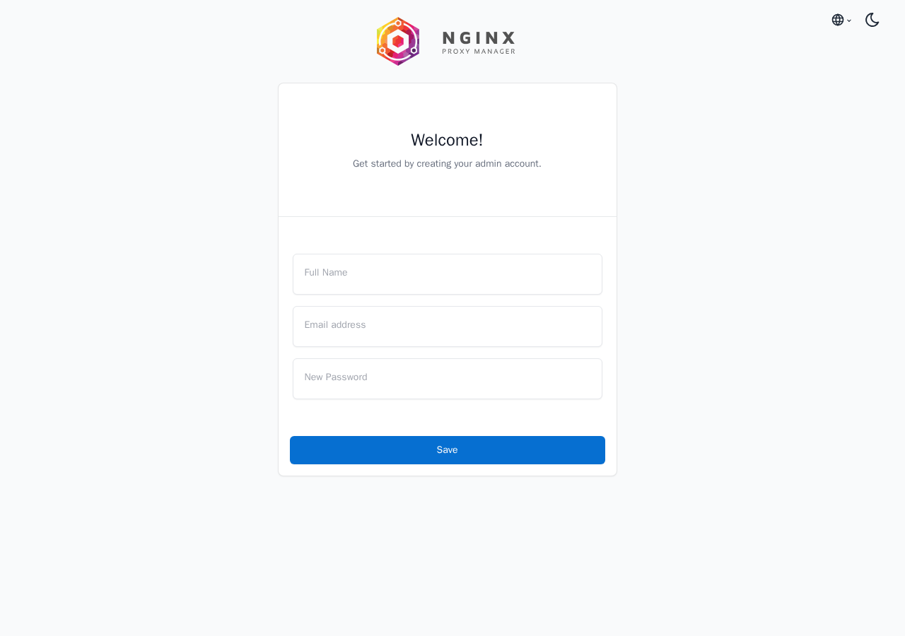

Nginx Proxy Manager is a GUI for managing nginx configurations, instead of using the terminal and the nginx conf. I prefer to use the terminal for all my work, honestly, but there are use cases for having a GUI. Like for coworkers that are not as used to the terminal, or for home use, because why not.

Most guides for it are thin: install, log in with `admin@example.com` and `changeme`, done.

That login is gone. Since version 2.13.0 (November 2025) there is no default admin at all. The first person to open the admin page creates the account, and on a VPS with the stock compose file that page is open to the whole internet. I ran everything in this post on a fresh Ubuntu 26.04 server with Docker 29.8.1 and Nginx Proxy Manager 2.16.0, the release from September 24, 2026.

The one thing to get straight: Nginx Proxy Manager runs inside a container, so every name it proxies to is resolved from inside that container. `localhost` is the proxy itself, not your server, and an app in another Compose project does not exist for it until they share a Docker network. Nearly every 502 Bad Gateway comes back to that.

> **TL;DR.** Create a Docker network (`docker network create proxy`), run `jc21/nginx-proxy-manager:2.16.0` on it with `80:80`, `443:443` and **`127.0.0.1:81:81`**, and reach the admin UI through an SSH tunnel (`ssh -L 8181:127.0.0.1:81 you@server`, then `http://localhost:8181`). Create the admin on the first page before anything else can. Put your apps on the same `proxy` network without publishing their ports, and forward to the **container name and the container's port**. For a 502, read `data/logs/proxy-host-<id>_error.log`. For a certificate that fails with `Internal Error`, read `data/logs/letsencrypt.log`. Back up `data/` and `letsencrypt/` together.

## Contents

- [1. What you need first](#1-what-you-need-first)
- [2. The compose file](#2-the-compose-file)
- [3. The first login: there is no changeme](#3-the-first-login-there-is-no-changeme)
- [4. Why ufw does not protect port 81](#4-why-ufw-does-not-protect-port-81)
- [5. Put an app behind it](#5-put-an-app-behind-it)
- [6. 502 Bad Gateway: three causes, three log lines](#6-502-bad-gateway-three-causes-three-log-lines)
- [7. HTTPS, and the Internal Error behind a failed certificate](#7-https-and-the-internal-error-behind-a-failed-certificate)
- [8. Backups and upgrades](#8-backups-and-upgrades)
- [Gotchas I hit](#gotchas-i-hit)
- [Quick reference](#quick-reference)

## 1. What you need first

- Docker Engine and the Compose plugin from Docker's own apt repository. My [Install Docker on Ubuntu 26.04](/blog/install-docker-ubuntu-26-04/) post covers it.
- A DNS name pointing at the server. Your own domain works, and so does a free DuckDNS name, which I used in the [NetBird post](/blog/self-host-netbird-reverse-proxy-duckdns-ubuntu-26-04/). For this post I used an `sslip.io` name (`whoami.<the-ip-with-dashes>.sslip.io` resolves to that IP), which needs no account. Let's Encrypt limits certificates per registered domain, and `duckdns.org` is on the Public Suffix List, so your DuckDNS name gets its own quota. `sslip.io` is not on the list when I checked, so everyone using it shares one quota. It worked for me, but for anything you keep, use a domain or DuckDNS.
- Ports 80 and 443 reachable from the internet. Port 80 matters even if you only want HTTPS: the normal certificate request uses Let's Encrypt's HTTP challenge, which connects to port 80 ([section 7](#7-https-and-the-internal-error-behind-a-failed-certificate)). The DNS challenge avoids that, but needs your DNS provider's API credentials, and this post does not cover it.

## 2. The compose file

Create the shared network first. Every app you put behind the proxy joins this one network:

```bash
sudo docker network create proxy
```

Then create `/opt/npm` (`sudo mkdir -p /opt/npm`) and put this in `/opt/npm/compose.yaml` (with `sudo nano` or `sudoedit`):

```yaml
services:
  app:
    image: jc21/nginx-proxy-manager:2.16.0
    restart: unless-stopped
    ports:
      - "80:80"
      - "443:443"
      - "127.0.0.1:81:81"
    environment:
      TZ: "America/Los_Angeles"
    volumes:
      - ./data:/data
      - ./letsencrypt:/etc/letsencrypt
    networks:
      - proxy

networks:
  proxy:
    external: true
```

```bash
cd /opt/npm
sudo docker compose up -d
sleep 10
curl -s localhost:81/api/
```

```text
{"status":"OK","setup":false,"version":{"major":2,"minor":16,"revision":0}}
```

The first start, image pull included, took about 14 seconds. Three lines are there on purpose:

- A fixed tag, `2.16.0`, never `latest`, so an upgrade happens when you decide ([section 8](#8-backups-and-upgrades)). The official example pins it too.
- `127.0.0.1:81:81` where the official example has `81:81`. Port 81 is the admin UI. Bound to `127.0.0.1` it answers only on the server itself, and [sections 3 and 4](#3-the-first-login-there-is-no-changeme) are why.
- The external `proxy` network, which the official example does not have, so apps from other Compose projects can join it ([section 5](#5-put-an-app-behind-it)).

`"setup":false` in that API answer means no admin exists yet. Keep reading before you do anything else.

## 3. The first login: there is no changeme

Every older guide says to log in with `admin@example.com` and `changeme`. On 2.16.0:

```text
$ curl -s -X POST localhost:81/api/tokens -H 'Content-Type: application/json' \
    -d '{"identity":"admin@example.com","secret":"changeme"}'
{"error":{"code":400,"message":"Invalid email or password"}}
```

There is no user at all. The 2.13.0 release notes put it plainly: "New setup wizard; no more default initial user". Open the admin UI and the first page is a form that says **Welcome! Get started by creating your admin account.**, with Full Name, Email address and New Password.



Here is the catch. While no admin exists, that form's API endpoint needs no login. I tested it from another machine against the stock compose file, where port 81 is published to the world:

```text
$ curl -s -X POST http://<server-ip>:81/api/users -H 'Content-Type: application/json' \
    -d '{"name":"Stranger","nickname":"s","email":"stranger@example.com","roles":["admin"],"is_disabled":false,"auth":{"type":"password","secret":"..."}}'
{"id":1,"email":"stranger@example.com","roles":["admin"],...}
```

That request made a stranger the admin. After it, `/api/` said `"setup":true`, the same request from anyone else got `403 Permission Denied`, and the real owner would find a proxy that belongs to somebody else. Whoever opens port 81 first wins, and on a public IP you do not control who that is. "I will set it up in a minute" is a race you do not need to run.

With `127.0.0.1:81:81`, the setup page is only reachable from the server, and you reach it through SSH:

```bash
ssh -L 8181:127.0.0.1:81 you@your-server
```

Leave that running and open `http://localhost:8181` on your own machine. Create the admin, and use a real email address, because it becomes your Let's Encrypt account ([section 7](#7-https-and-the-internal-error-behind-a-failed-certificate)).

**For automated installs**, two environment variables create the admin at the first start, so the setup window never opens. Add them under the existing `environment:` key:

```yaml
    environment:
      TZ: "America/Los_Angeles"
      INITIAL_ADMIN_EMAIL: "you@example.org"
      INITIAL_ADMIN_PASSWORD: "a-long-random-password"
```

With them, `/api/` said `"setup":true` from the first second, and an anonymous create got `403`. The catch: the container logs the password in plain text at startup, `Creating a new user: you@example.org with password: ...`, where anyone who can run `docker compose logs` reads it. Change the password in the UI after the first login, then delete the two lines and run `sudo docker compose up -d`. That recreates the container, and the old log goes with it (I checked: zero matches for the password afterwards).

## 4. Why ufw does not protect port 81

I have always just opened ports as needed. With Docker, it manages the ports for you, so you don't actually have to update your ufw rules.

If your plan was "publish 81 and block it with ufw", I tried it:

```text
$ sudo ufw deny 81/tcp
$ sudo ufw status
81/tcp                     DENY        Anywhere
```

From another machine, `http://<server-ip>:81/` still answered `200`. Docker publishes ports with its own firewall rules, and traffic to a published port is forwarded to the container before ufw's input rules ever see it. My [ufw basics post](/blog/ufw-firewall-basics-ubuntu/) warns about this, and here it is doing real damage: the rule shows up in `ufw status`, looks like protection, and blocks nothing.

The same goes for your apps. If an app's compose file says `ports: - "8080:80"`, that port is open to the internet no matter what ufw says, even though you only meant it for the proxy. The fix is the same in both cases: bind to `127.0.0.1`, or better, do not publish the app's port at all ([next section](#5-put-an-app-behind-it)). A cloud firewall in front of the server (Hetzner, AWS security groups and the like) does filter these, because it sits outside the box.

## 5. Put an app behind it

I used `traefik/whoami` as the app, because it answers every request with the container's hostname and IPs. Its `/opt/whoami/compose.yaml` (again `sudo mkdir -p /opt/whoami` first):

```yaml
services:
  whoami:
    image: traefik/whoami:v1.11
    restart: unless-stopped
    networks:
      - proxy

networks:
  proxy:
    external: true
```

No `ports:` at all. Nothing on the host listens for it, so from outside the only way in is through the proxy. (The server itself and other containers on `proxy` can still reach it at its Docker address.) After `cd /opt/whoami && sudo docker compose up -d`, both containers are on the network:

```text
$ sudo docker network inspect proxy -f '{{range .Containers}}{{.Name}} {{end}}'
whoami-whoami-1 npm-app-1
```

In the UI, on the Proxy Hosts page, click **Add Proxy Host**. On the Details tab:

- **Domain Names**: `whoami.example.com` (whatever points at your server).
- **Scheme**: `http`. This is how the proxy talks to the app, inside the Docker network. HTTPS for visitors is on the SSL tab.
- **Forward Hostname / IP**: `whoami`, the Compose service name.
- **Forward Port**: `80`, the port the app listens on inside its container.
- **Block Common Exploits** on. **Websockets Support** on for apps that need it (dashboards, chat, anything with live updates).

Save, and `http://whoami.example.com` answers with the whoami page.

## 6. 502 Bad Gateway: three causes, three log lines

A 502 from Nginx Proxy Manager means nginx reached out to the forward address and got nothing usable. The page itself says only `502 Bad Gateway` and `openresty`, so it looks the same whatever the cause. The per host error log does not. It is on the host at `/opt/npm/data/logs/proxy-host-<id>_error.log`, where `<id>` is the host's number in the UI:

```bash
sudo tail -2 /opt/npm/data/logs/proxy-host-1_error.log
```

I produced all three common causes on purpose.

**`localhost` as the forward host.** I first ran whoami with `8080:80` published and forwarded to `localhost` port `8080`:

```text
connect() failed (111: Connection refused) while connecting to upstream, ... upstream: "http://[::1]:8080/"
```

`localhost` inside the proxy container is the proxy container. Nothing listens on 8080 there. Forwarding to the server's public IP, or to the Docker network gateway (`172.18.0.1` here), with port 8080 did work, but only because the app's port was published, which [section 4](#4-why-ufw-does-not-protect-port-81) says to avoid.

**The app is on a different Docker network.** Before both joined `proxy`, each Compose project had its own default network, and forwarding to `whoami` gave:

```text
whoami could not be resolved (2: Server failure)
```

Docker's DNS only answers names on networks the container is attached to. Add the app to the shared network. The same message also appears when the app container is stopped, so check `docker ps` too.

**The host port instead of the container port.** With both on `proxy`, forwarding to `whoami` port `8080` (the old published port) gave:

```text
connect() failed (111: Connection refused) while connecting to upstream, ... upstream: "http://172.20.0.3:8080/"
```

The name resolved, so the network is right, but inside the network you talk to the container's own port, 80 here. (A container that is up but whose app is not listening, for example because the app process inside it died, gives the same refused line on the correct port.) The `8080` in `8080:80` only exists on the host.

| Error log says | Meaning | Fix |
| --- | --- | --- |
| `upstream: "http://[::1]:<port>/"` | forwarding to the proxy's own localhost | the container name, on a shared network |
| `<name> could not be resolved` | the app is not on the proxy's network, or not running | add both to `proxy`; check `docker ps` |
| `Connection refused` to a `172.x` address | wrong port, or the app is not listening | the container's internal port; the app's own logs |

## 7. HTTPS, and the Internal Error behind a failed certificate

On the proxy host's SSL tab, choose to request a new certificate in the **SSL Certificate** list, turn on **Force SSL**, and save. Nginx Proxy Manager runs certbot with the HTTP challenge, and a few seconds later the host serves HTTPS:

```text
$ curl -sI http://whoami.example.com/ | head -1
HTTP/1.1 301 Moved Permanently
$ echo | openssl s_client -connect whoami.example.com:443 2>/dev/null | openssl x509 -noout -issuer -enddate
issuer=C=US, O=Let's Encrypt, CN=YE2
notAfter=Dec 27 01:30:26 2026 GMT
```

Certificates last 90 days. The container checks at every start and on a timer, and renews anything expiring within 30 days.

When a request fails, all Nginx Proxy Manager says is `Internal Error`. The reason is in `/opt/npm/data/logs/letsencrypt.log`, or in `docker compose logs`. I hit two:

**The admin's email is not accepted.** The certificate request uses the admin account's email (certbot runs with `-m <your email>`). My first test admin was `stranger@example.com`, and Let's Encrypt refused to register it:

```text
Unable to register an account with ACME server. The ACME server believes stranger@example.com is an invalid email address.
```

Change the email on your user to a real one and request again. This is the second reason to use a real address when you create the admin.

**Port 80 is not reachable.** I closed port 80 in the cloud firewall and requested a certificate for another name:

```text
  Type:   connection
  Detail: 178.104.69.178: Fetching http://app.178-104-69-178.sslip.io/.well-known/acme-challenge/...: Timeout during connect (likely firewall problem)
```

The HTTP challenge means Let's Encrypt connects to your server on port 80 to fetch a file. Open 80 in the cloud firewall, forward it on your router if the server is at home, and check that the DNS name points at this server. Fix the cause before you click again, because Let's Encrypt rate limits failures too.

## 8. Backups and upgrades

Everything lives in two folders: `data/` (the SQLite database with your hosts, users and settings, plus the generated nginx configs and logs) and `letsencrypt/` (the certificates and the ACME account). Back them up together, with the container stopped so the database is consistent:

```bash
cd /opt/npm
sudo docker compose stop
sudo tar czf /root/npm-backup-$(date +%F).tgz -C /opt/npm data letsencrypt compose.yaml
sudo docker compose start
```

Mine was 40 KB. To test the restore, I stopped the stack, deleted `/opt/npm` entirely, extracted the archive into a new `/opt/npm`, and ran `docker compose up -d`. The proxy host, its certificate and the admin login all came back, and the site answered over HTTPS.

To upgrade, back up, change the tag in `compose.yaml`, and run `sudo docker compose pull && sudo docker compose up -d`. I upgraded a 2.15.1 install with an admin account to 2.16.0 that way, and the admin login carried over. Read the release notes first: 2.16.0's say certbot was updated and DNS challenge plugins "may not work as expected", which matters if you use DNS challenges for wildcard certificates.

## Gotchas I hit

- `admin@example.com` and `changeme` do not exist since 2.13.0. The first visitor to the setup page becomes the admin, with no login needed.
- `ufw deny 81/tcp` changed nothing. Docker's published ports go around ufw.
- The official setup docs still said a default admin user is created on first run when I read them.
- `INITIAL_ADMIN_PASSWORD` is printed in plain text in the container log.
- `localhost` as the forward host points at the proxy container, not the server.
- Forward to the container's own port, not the published host port.
- A certificate request with an `example.com` admin email fails, and the UI shows only `Internal Error`.
- No port 80, no certificate with the default HTTP challenge, even for an HTTPS only site.

## Quick reference

| Job or symptom | Command or fix |
| --- | --- |
| Admin UI only on the server | `"127.0.0.1:81:81"` in `ports:` |
| Reach the admin UI | `ssh -L 8181:127.0.0.1:81 you@server`, then `http://localhost:8181` |
| Is an admin set up yet | `curl -s localhost:81/api/` (`"setup":false` means no) |
| Admin created at first start | `INITIAL_ADMIN_EMAIL` and `INITIAL_ADMIN_PASSWORD`, then remove them |
| Shared network | `sudo docker network create proxy`, `external: true` in each project |
| Forward target | the Compose service name and the container's port |
| 502 reason | `sudo tail /opt/npm/data/logs/proxy-host-<id>_error.log` |
| Certificate `Internal Error` | `sudo tail -50 /opt/npm/data/logs/letsencrypt.log` |
| Backup | stop, `tar czf ... data letsencrypt compose.yaml`, start |
| Upgrade | change the tag, `sudo docker compose pull && sudo docker compose up -d` |

This makes life easier instead of having to reload the nginx conf with every change.
