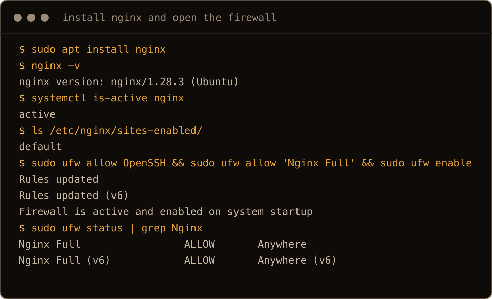
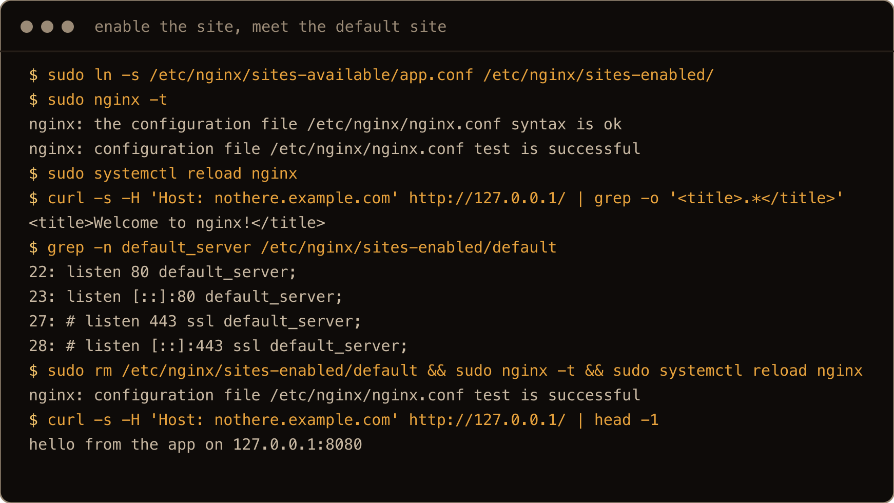
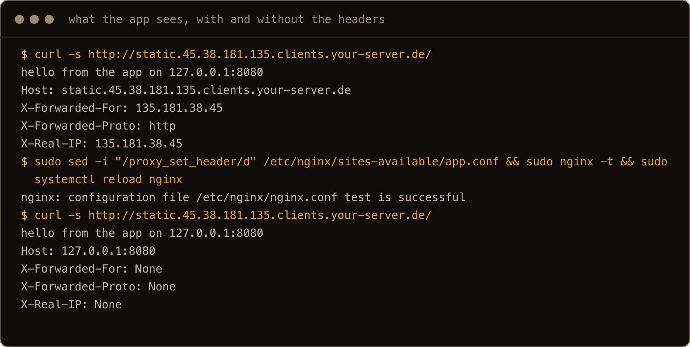
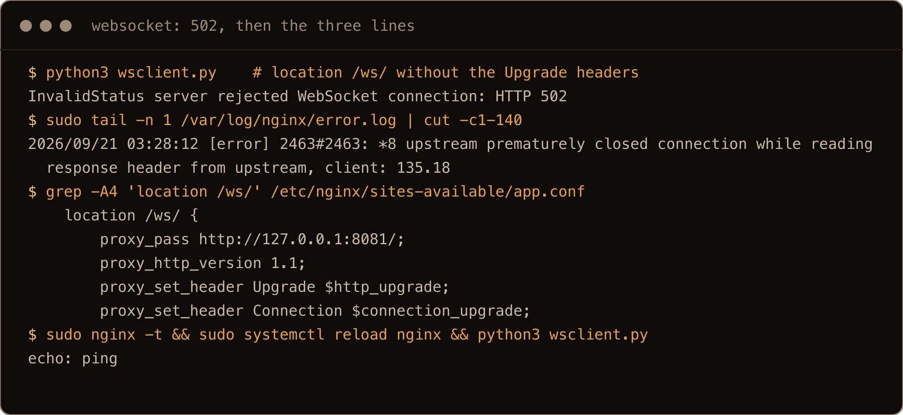
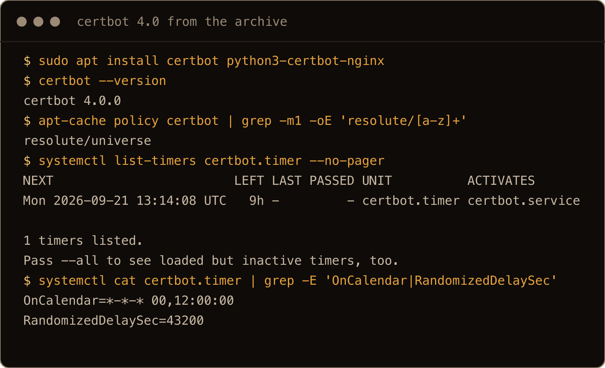
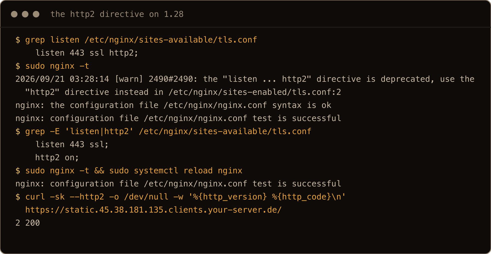
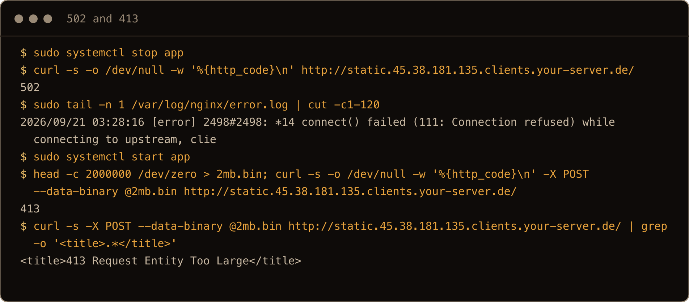

The app is running. It listens on `127.0.0.1:8080`, it has a systemd unit, and it works fine over an SSH tunnel. Now it needs a hostname, a certificate, and to stop being reachable only by me. The [Caddy post](/blog/caddy-reverse-proxy-docker-compose-ubuntu-26-04/) covers this for containers. This is the version for a plain Ubuntu 26.04 box where the app is a process and the proxy is the nginx that has been in the archive forever.

Nginx needs a dozen lines for this. The reason it gets a post is what happened on my test box between the dozen lines and the working site: the default site kept answering just after a reload, the app saw `127.0.0.1` as every client's address until the forwarding headers went in, a websocket endpoint came back `502` until two more headers went in, and the HTTP/2 syntax every older guide still shows made nginx 1.28 print a deprecation warning. Each of those is one line once you know it, and none of them is in the nginx welcome page.

One thing to get straight first. In this setup nginx is the only thing facing the internet. It accepts the connection on 80 and 443, and opens a second connection from itself to `127.0.0.1:8080`. Your app sees nginx as the client. Every `proxy_set_header` line in this post exists to pass along something the app would otherwise never learn about the real request.

> **TL;DR.** `sudo apt install nginx`, write `/etc/nginx/sites-available/app.conf` with a `server_name` and a `location /` that does `proxy_pass http://127.0.0.1:8080;` plus the `Host`, `X-Real-IP`, `X-Forwarded-For` and `X-Forwarded-Proto` headers, symlink it into `sites-enabled`, remove the `default` symlink, `sudo nginx -t && sudo systemctl reload nginx`. For HTTPS, `sudo apt install certbot python3-certbot-nginx` and `sudo certbot --nginx -d app.example.com`; on 26.04 that is certbot 4.0 from the archive and no snap is involved. Then add `http2 on;` next to the `listen 443 ssl;` line certbot wrote.

## Contents

- [Prerequisites](#prerequisites)
- [1. Install nginx and open the firewall](#1-install-nginx-and-open-the-firewall)
- [2. The site file](#2-the-site-file)
- [3. Why the default site keeps winning](#3-why-the-default-site-keeps-winning)
- [4. The headers your app actually needs](#4-the-headers-your-app-actually-needs)
- [5. Websockets](#5-websockets)
- [6. HTTPS with certbot from the archive](#6-https-with-certbot-from-the-archive)
- [7. Reading the errors: 502, 413, and a reload that has not landed yet](#7-reading-the-errors-502-413-and-a-reload-that-has-not-landed-yet)
- [Gotchas I hit](#gotchas-i-hit)
- [Quick reference](#quick-reference)

## Prerequisites

- Ubuntu 26.04 with a sudo user. Everything here ran on a fresh 26.04.1 server image.
- An app already listening on a loopback port. Mine is a small Python HTTP server on `127.0.0.1:8080` that prints back the headers it receives, run from a systemd unit, because that makes section 4 visible. Yours is whatever you are fronting. If it listens on `0.0.0.0`, change that to `127.0.0.1` first, or the proxy is decorative.
- A DNS `A` record for the hostname pointing at the box, and ports 80 and 443 reachable from the internet. If a cloud firewall sits in front of the server, open both there too. The HTTP challenge certbot uses in section 6 needs 80 reachable from Let's Encrypt.

## 1. Install nginx and open the firewall

```bash
sudo apt update
sudo apt install nginx
nginx -v
```

On 26.04 that is `nginx/1.28.3 (Ubuntu)`, from `main`, started and enabled by the package. It comes with HTTP/2, HTTP/3 and the real IP module compiled in, so nothing from a PPA is needed for anything in this post. (The stream module is a separate `libnginx-mod-stream` package; this post does not need it.) Browse to the box's IP and you get the "Welcome to nginx!" page, served by `/etc/nginx/sites-enabled/default`. That is the default site I remove in section 3.

The package also registers ufw application profiles:

```bash
sudo ufw allow OpenSSH
sudo ufw allow 'Nginx Full'
sudo ufw enable
```

`Nginx Full` is 80 and 443. There are also `Nginx HTTP`, `Nginx HTTPS`, and `Nginx QUIC`, which is 80 and 443 on TCP plus 443 on UDP. If ufw was already on, just add the second rule. If you have never touched ufw on this box, the [ufw basics post](/blog/ufw-firewall-basics-ubuntu/) explains why `OpenSSH` goes in before `enable`.



The screenshots in this post are from a second fresh 26.04 box, so the hostname in them is that box's reverse DNS name where the prose says app.example.com.

## 2. The site file

Nginx on Ubuntu reads `/etc/nginx/nginx.conf`, which includes every file in `/etc/nginx/sites-enabled/`. The convention is one file per site in `sites-available` and a symlink in `sites-enabled` to turn it on. Create the site with `sudo nano /etc/nginx/sites-available/app.conf`:

```nginx
# /etc/nginx/sites-available/app.conf
server {
    listen 80;
    listen [::]:80;
    server_name app.example.com;

    location / {
        proxy_pass http://127.0.0.1:8080;
        proxy_set_header Host $host;
        proxy_set_header X-Real-IP $remote_addr;
        proxy_set_header X-Forwarded-For $proxy_add_x_forwarded_for;
        proxy_set_header X-Forwarded-Proto $scheme;
    }
}
```

Enable it, test the whole configuration, and reload:

```bash
sudo ln -s /etc/nginx/sites-available/app.conf /etc/nginx/sites-enabled/
sudo nginx -t
sudo systemctl reload nginx
```

`nginx -t` parses everything nginx would load and refuses if any file is broken, which is why it goes before every reload. A broken config with a plain `restart` leaves you with no web server at all. With a `reload`, nginx keeps serving the old config until the new one parses, so the worst case is the change not taking.

Now `curl http://app.example.com/`. Mine came back with the welcome page on the first try and the app on the second, and the next section is about why. Read it even if you got the app first time, because it ends with removing the default site, and every edit from here on gets the same `sudo nginx -t && sudo systemctl reload nginx` before you test it.

## 3. Why the default site keeps winning

Nginx picks a `server` block by matching the request's `Host` header against every `server_name`. When nothing matches, it uses the block marked `default_server`, and if none is marked, the first one it loaded. `sites-enabled/default` has both `listen` lines marked `default_server`, so any request for a name nginx does not recognise lands there:

```bash
curl -s -H 'Host: nothere.example.com' http://127.0.0.1/ | grep -o '<title>.*</title>'
```

```text
<title>Welcome to nginx!</title>
```

That is expected and harmless. What bit me was the request for my real hostname also landing on the welcome page, and the cause was not nginx at all. It was me running `curl` in the same second as the `reload`. A reload is graceful: the master process parses the new config, starts new workers, and tells the old ones to finish their connections and exit. `systemctl reload nginx` returns as soon as the signal is sent, not when the swap is done, and on my box a request in that first second was still answered by an old worker running the old config. One second later the same request hit the app. If your first `curl` after a reload shows the previous config, run it again before you touch anything.

Then decide what should answer for hostnames you did not configure. I remove the default site, so that an unknown name falls through to the first block, which is the app:

```bash
sudo rm /etc/nginx/sites-enabled/default
sudo nginx -t && sudo systemctl reload nginx
```

If you would rather unknown names get nothing, keep a catch all block with `return 444;`, which closes the connection without a response. Either is fine. Leaving the welcome page up is the choice that looks unfinished to anyone who scans your IP.



## 4. The headers your app actually needs

Take the four `proxy_set_header` lines out, test and reload, and look at what the app receives. Mine prints them:

```text
Host: 127.0.0.1:8080
X-Forwarded-For: None
X-Forwarded-Proto: None
X-Real-IP: None
```

Without the headers, the app thinks its own name is `127.0.0.1:8080`, so any absolute link it builds from `Host` points at loopback. (Nginx rewrites the `Location` header of a redirect back to the public name by default; it does nothing about links inside page bodies.) The app sees every visitor as `127.0.0.1`, so rate limits and audit logs are wrong. And it has no way to know the request arrived over HTTPS once section 6 is done, which is where secure cookie and redirect loop problems come from. Put the four lines back and the same request shows, with my hostname and address in place of the placeholders:

```text
Host: app.example.com
X-Forwarded-For: 203.0.113.7
X-Forwarded-Proto: http
X-Real-IP: 203.0.113.7
```

`$proxy_add_x_forwarded_for` appends the connecting address to whatever `X-Forwarded-For` already came in, so with a CDN in front the chain ends with the CDN's address and the app has to know how many hops to trust. `X-Real-IP` is always the address nginx saw. Which header your app trusts is the app's business. Web frameworks have a setting for "I am behind a proxy, believe these headers", and it is off by default because a client can send `X-Forwarded-For: 198.51.100.66` itself; on a test box that forged value arrived at the app as `198.51.100.66, <the client address>`. Trust the headers only on requests that came from `127.0.0.1`, and only as many hops of the chain as you actually have.



## 5. Websockets

Anything that opens a websocket (a web terminal, a chat, most dashboards that update without a refresh) needs three more lines, and the failure without them is worth seeing once. My websocket app is a small echo server on `127.0.0.1:8081` (Python's `websockets` package, `python3-websockets` in the archive, and a client from the same package). I gave it a `location /ws/` with `proxy_pass http://127.0.0.1:8081/;` and the `Host` header and nothing else. The client got `server rejected WebSocket connection: HTTP 502` and nginx logged `upstream prematurely closed connection while reading response header from upstream`. The app was fine. Nginx had spoken HTTP/1.0 to it and dropped the `Upgrade` header, so the app closed a handshake it never saw. (If your websocket lives on the same port as the rest of the app, a bare `location /` sends the request to the app as an ordinary HTTP request and you get whatever the app answers with, a 200 or a 400, and the same fix applies.)

Two things fix it. A `map` outside the `server` block that turns the `Connection` header into `upgrade` only when the client asked for one, and a `location` for the websocket path that speaks HTTP/1.1 and passes both headers through:

```nginx
map $http_upgrade $connection_upgrade {
    default upgrade;
    ''      close;
}

server {
    listen 80;
    listen [::]:80;
    server_name app.example.com;

    location / {
        proxy_pass http://127.0.0.1:8080;
        proxy_set_header Host $host;
        proxy_set_header X-Real-IP $remote_addr;
        proxy_set_header X-Forwarded-For $proxy_add_x_forwarded_for;
        proxy_set_header X-Forwarded-Proto $scheme;
    }

    location /ws/ {
        proxy_pass http://127.0.0.1:8081/;
        proxy_http_version 1.1;
        proxy_set_header Upgrade $http_upgrade;
        proxy_set_header Connection $connection_upgrade;
        proxy_set_header Host $host;
    }
}
```

The `map` has to sit at the `http` level, which in a `sites-available` file means above `server`, not inside it. Test, reload, and my echo server answered `echo: ping` through the proxy. If the app serves the websocket on the same port and path as everything else, put the three extra lines in `location /` instead of a second location; they do no harm to ordinary requests.

The trailing slash on `proxy_pass http://127.0.0.1:8081/` matters. With it, nginx strips the `/ws/` prefix and the app sees `/`. Without it, the app would receive `/ws/` and would need a route for that path. Either way, be deliberate.



## 6. HTTPS with certbot from the archive

Certbot's own instructions still send Ubuntu users to the snap. On 26.04 the archive has certbot 4.0.0 and its nginx plugin in `universe`, current enough that I see no reason to add snapd for it:

```bash
sudo apt install certbot python3-certbot-nginx
sudo certbot --nginx -d app.example.com
```

Certbot answers the HTTP challenge through the running nginx on port 80, gets the certificate, and rewrites `app.conf`: it turns your existing `server` block into the HTTPS one, with `listen 443 ssl` and the `ssl_certificate` lines pointing into `/etc/letsencrypt/live/app.example.com/`, and adds a separate port 80 block that redirects to it. Renewal is a systemd timer the package installs, `certbot.timer`, which runs at midnight and noon with a random delay of up to twelve hours; `systemctl list-timers certbot.timer` shows the next run, and `sudo certbot renew --dry-run` proves it can renew without waiting sixty days to find out.

*I could not run this step on the box used for this post, because its provider firewall only opens SSH and Let's Encrypt has to reach port 80. The commands above are certbot's documented flow, and the package versions are what 26.04 installs. Everything below in this section I did run with a self signed certificate standing in for the real one, which you can do too if your 80 is closed for now:*

```bash
sudo openssl req -x509 -newkey rsa:2048 -nodes -days 30 -subj /CN=app.example.com \
  -keyout /etc/ssl/private/app.key -out /etc/ssl/certs/app.crt
```

```nginx
# a second server block in app.conf, the shape certbot produces
server {
    listen 443 ssl;
    http2 on;
    server_name app.example.com;
    ssl_certificate /etc/ssl/certs/app.crt;
    ssl_certificate_key /etc/ssl/private/app.key;
    location / {
        proxy_pass http://127.0.0.1:8080;
        proxy_set_header Host $host;
        proxy_set_header X-Real-IP $remote_addr;
        proxy_set_header X-Forwarded-For $proxy_add_x_forwarded_for;
        proxy_set_header X-Forwarded-Proto $scheme;
    }
}
```

*Test with `curl -k`, since the certificate is self signed, and swap the two `ssl_` lines for certbot's when the port opens.*



Certbot writes `listen 443 ssl;` and stops there. To turn HTTP/2 on, add one line inside that block:

```nginx
listen 443 ssl;
http2 on;
```

Do not write `listen 443 ssl http2;`. Older configs and most guides still have that syntax. On nginx 1.28 it parses, but `nginx -t` prints:

```text
[warn] the "listen ... http2" directive is deprecated, use the "http2" directive instead
```

With `http2 on;` in place, `curl --http2 -I https://app.example.com/` comes back as `HTTP/2 200` (add `-k` for the self signed stand in). Also add `X-Forwarded-Proto $scheme` to the 443 block if certbot's rewrite did not carry it over. In that block `$scheme` is `https`, which is what tells your app to issue secure cookies.



## 7. Reading the errors: 502, 413, and a reload that has not landed yet

**`502 Bad Gateway`** means nginx accepted the request and could not get an answer from the app. I stopped the app (`sudo systemctl stop app`, mine is a unit called `app`, then `curl -i http://app.example.com/`) and got exactly this, with the cause in the log:

```text
connect() failed (111: Connection refused) while connecting to upstream
```

The line to read is the most recent one in `/var/log/nginx/error.log` that matches your request. `Connection refused` is the app not listening (crashed, wrong port, bound to a different address). `upstream prematurely closed connection` is the app closing mid request, which is the websocket case from section 5, or an app that crashed on that specific request. A `504` after sixty seconds with `upstream timed out` in the log is `proxy_read_timeout`, whose default is `60s`. It is the wait between two reads from the app, not a total budget, so a slow first byte is what trips it. Raise it in the `location` if the app legitimately takes longer.

**`413 Request Entity Too Large`** is nginx refusing an upload before the app ever sees it. The default `client_max_body_size` is `1m`. A 2 MB `POST` to my proxy (`head -c 2000000 /dev/zero > 2mb.bin; curl -i -X POST --data-binary @2mb.bin http://app.example.com/`) got the 413 page from nginx with nothing in the app's log. Set `client_max_body_size 100m;` (or whatever fits) in the `server` or `location` block.

**The reload that has not landed** is section 3: a request in the same second as `systemctl reload nginx` can still hit an old worker. Wait a second and try again before debugging a config that is actually fine.



## Gotchas I hit

- The default site answered for my hostname after a reload. It was the graceful reload still swapping workers, not a config problem. Run the `curl` twice.
- Websockets came back `502` with `upstream prematurely closed connection` in the log. The `map` block plus `proxy_http_version 1.1`, `Upgrade` and `Connection` in the location fixed it.
- `nginx -t` warned `the "listen ... http2" directive is deprecated`. Copying a 22.04 era config onto 26.04 does this. Use `listen 443 ssl;` and `http2 on;` on its own line.
- A 2 MB upload got `413`. `client_max_body_size` defaults to `1m` and the app never sees the request.
- Without `proxy_set_header Host $host` my test app received `127.0.0.1:8080` as the `Host` header. Without `X-Forwarded-For` it had no idea who the visitor was.
- The `map` for websockets goes above the `server` block, not inside it. Inside, `nginx -t` fails with `"map" directive is not allowed here`.
- Certbot 4.0 comes from apt on 26.04. If you already have certbot from snap on the box, pick one installation and remove the other, so only one of them manages renewal.

## Quick reference

```bash
# on a fresh box, in this order
# install and firewall
sudo apt install nginx
sudo ufw allow 'Nginx Full'

# site
sudo nano /etc/nginx/sites-available/app.conf
sudo ln -s /etc/nginx/sites-available/app.conf /etc/nginx/sites-enabled/
sudo rm /etc/nginx/sites-enabled/default
sudo nginx -t && sudo systemctl reload nginx

# https
sudo apt install certbot python3-certbot-nginx
sudo certbot --nginx -d app.example.com
sudo certbot renew --dry-run

# when it breaks
sudo tail -n 20 /var/log/nginx/error.log
curl -s -o /dev/null -w '%{http_code}\n' http://127.0.0.1:8080/   # is the app even there
```

```nginx
# app.conf: the map goes above the server block, and this location replaces the one in section 2
map $http_upgrade $connection_upgrade {
    default upgrade;
    ''      close;
}

# the location block, complete
location / {
    proxy_pass http://127.0.0.1:8080;
    proxy_http_version 1.1;
    proxy_set_header Upgrade $http_upgrade;
    proxy_set_header Connection $connection_upgrade;
    proxy_set_header Host $host;
    proxy_set_header X-Real-IP $remote_addr;
    proxy_set_header X-Forwarded-For $proxy_add_x_forwarded_for;
    proxy_set_header X-Forwarded-Proto $scheme;
    client_max_body_size 100m;    # uploads; default is 1m
    proxy_read_timeout 300s;      # only if the app has slow responses; default is 60s
}
```

The app still only listens on loopback. It just has a front door now.
