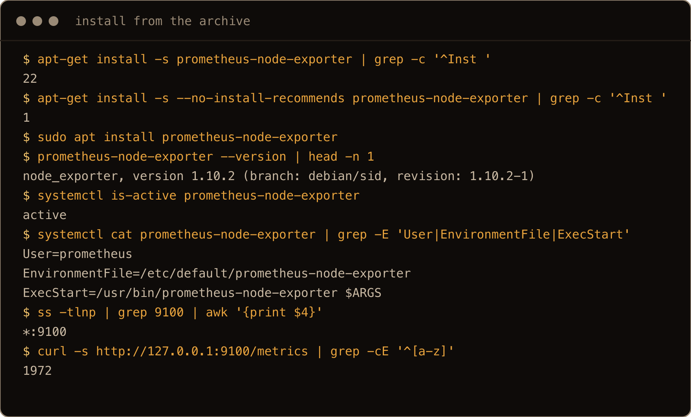
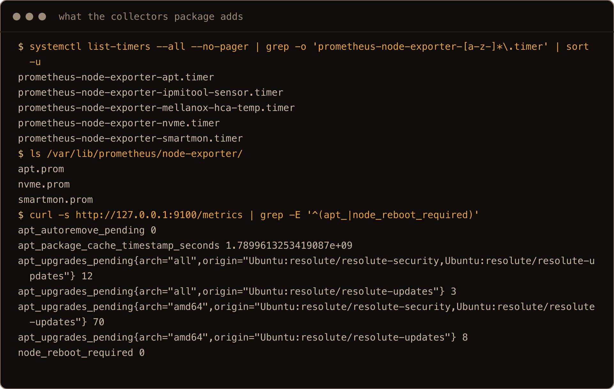
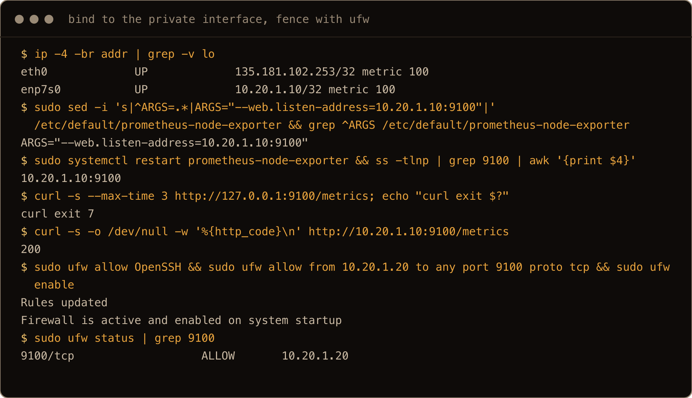
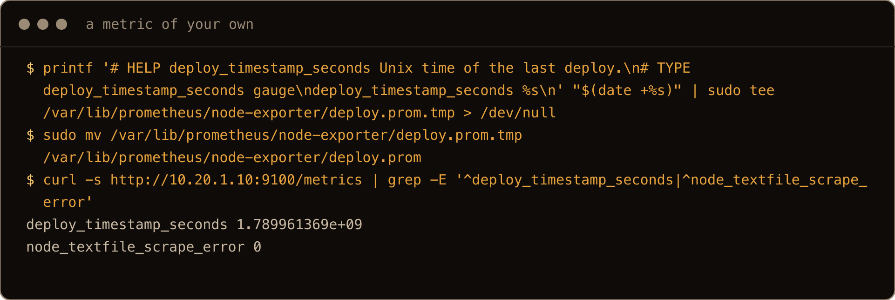
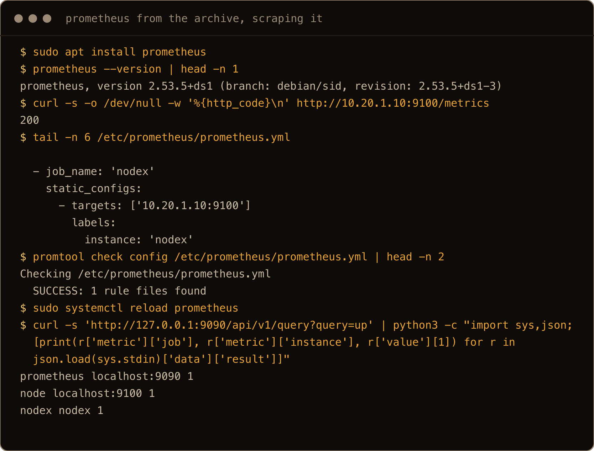
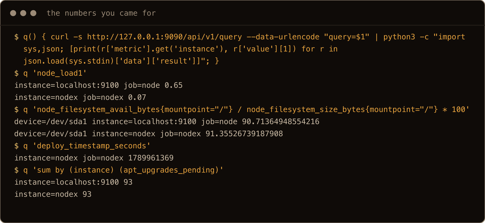
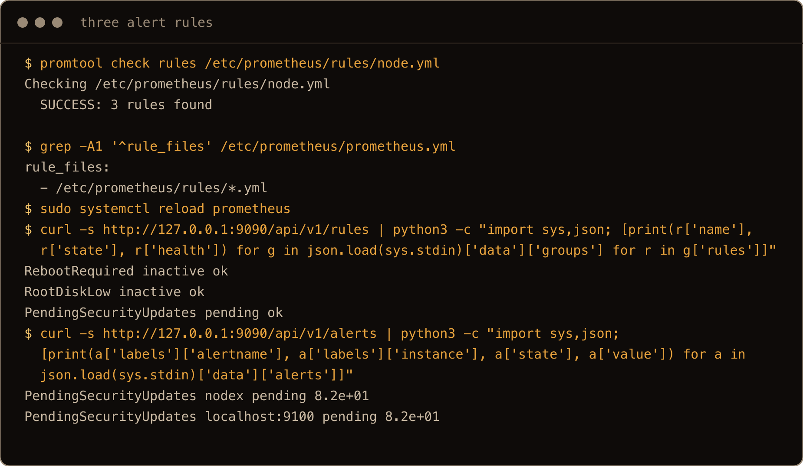
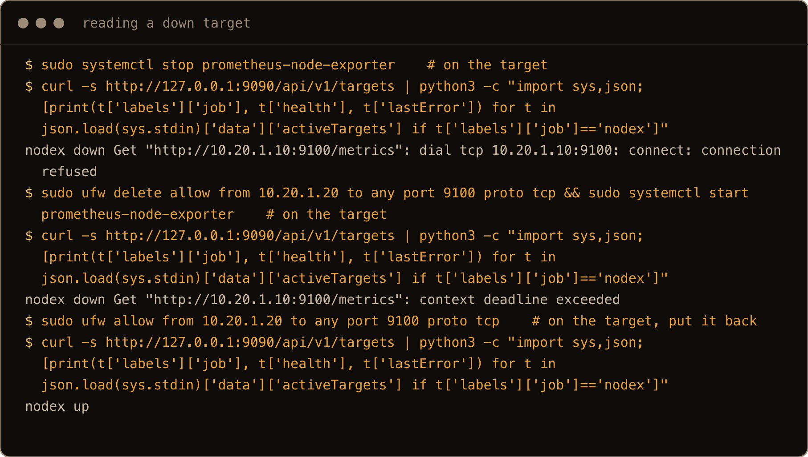

Every server I look after eventually gets the same question asked of it: how full is the disk, is it about to run out of memory, and does it need a reboot that nobody has got round to. Node exporter is the standard answer. It is one binary that exposes a few thousand numbers about the machine on port 9100, and Prometheus pulls them every fifteen seconds and keeps them. Ubuntu 26.04 has both in the archive, which is where this post starts and where most guides do not.

Most node exporter guides download a tarball from GitHub, make a user, and write a unit file. That works, and section 7 does it, but on 26.04 `apt install prometheus-node-exporter` gives you a unit, a dedicated user, a config file for the flags, and a set of extra collectors that report pending apt upgrades and whether the box wants a reboot. The reason for the post is the two things the package does that I did not want (it drags in twenty one other packages by default, and it listens on every interface), the two failure messages that look alike from the Prometheus side and mean different things, and the alert rules that turn "I have metrics" into "I get told".

The one thing to get straight: Prometheus scrapes. The exporter never sends anything anywhere. It sits there answering `GET /metrics`, and whoever can reach port 9100 can read every mount point, every network interface, the memory and load figures and, with the collectors package, the list of pending updates on the box. So the exporter's listen address and the firewall rule in front of it are part of the install, not an afterthought.

> **TL;DR.** On the server: `sudo apt install --no-install-recommends prometheus-node-exporter`, set `ARGS="--web.listen-address=10.20.1.10:9100"` in `/etc/default/prometheus-node-exporter` to bind it to the private interface, `sudo ufw allow from <prometheus ip> to any port 9100 proto tcp`. On the Prometheus box: `sudo apt install prometheus`, add a `job_name` with the server's private address to `/etc/prometheus/prometheus.yml`, `promtool check config`, `sudo systemctl reload prometheus`, and confirm with `up` in the query API. Drop the recommends if you do not want ipmitool, smartmontools and nvme-cli on a cloud VM; keep them on real hardware, because the `apt_upgrades_pending` and `node_reboot_required` metrics come from that package.

## Contents

- [Prerequisites](#prerequisites)
- [1. Install the exporter from the archive](#1-install-the-exporter-from-the-archive)
- [2. What the collectors package adds, and what it costs](#2-what-the-collectors-package-adds-and-what-it-costs)
- [3. Bind it to the private interface and fence it with ufw](#3-bind-it-to-the-private-interface-and-fence-it-with-ufw)
- [4. A metric of your own with the textfile collector](#4-a-metric-of-your-own-with-the-textfile-collector)
- [5. Prometheus from the archive, scraping it](#5-prometheus-from-the-archive-scraping-it)
- [6. Three alert rules worth having](#6-three-alert-rules-worth-having)
- [7. The upstream binary, when the package is too old](#7-the-upstream-binary-when-the-package-is-too-old)
- [8. Reading a down target](#8-reading-a-down-target)
- [Gotchas I hit](#gotchas-i-hit)
- [Quick reference](#quick-reference)

## Prerequisites

- Two Ubuntu 26.04 machines that can reach each other on a private network: the server you want metrics from, and the one that will run Prometheus. Mine are two cloud VMs with a private network between them, `10.20.1.10` for the server and `10.20.1.20` for Prometheus. A tailnet works the same way; use the `100.x` addresses.
- A sudo user on both.
- Nothing else. Grafana is a separate afternoon and this post stops at Prometheus answering queries.

## 1. Install the exporter from the archive

```bash
sudo apt install prometheus-node-exporter
prometheus-node-exporter --version
```

On 26.04 this is `node_exporter, version 1.10.2`, from `universe`, and the package does the parts the GitHub tarball leaves to you: a `prometheus` system user, a unit called `prometheus-node-exporter.service` that is enabled and running when apt returns, and `/etc/default/prometheus-node-exporter` with an `ARGS=""` line where every flag goes. The unit is short and worth reading once:

```bash
systemctl cat prometheus-node-exporter
```

```text
[Service]
Restart=on-failure
User=prometheus
EnvironmentFile=/etc/default/prometheus-node-exporter
ExecStart=/usr/bin/prometheus-node-exporter $ARGS
ExecReload=/bin/kill -HUP $MAINPID
```

Check it is answering:

```bash
curl -s http://127.0.0.1:9100/metrics | grep -cE '^[a-z]'
curl -s http://127.0.0.1:9100/metrics | grep -E '^node_load1 |^node_memory_MemAvailable_bytes'
```

Just under two thousand metric lines on my box. `node_load1`, `node_memory_MemAvailable_bytes`, `node_filesystem_avail_bytes{mountpoint="/"}` are the three you will query first.



The screenshots in this post come from a second pair of fresh 26.04 boxes, so timestamps and the odd number differ from the prose.

## 2. What the collectors package adds, and what it costs

`prometheus-node-exporter` recommends `prometheus-node-exporter-collectors`, and apt installs recommends by default. On my fresh VM that one recommendation turned a one package install into twenty two: `ipmitool`, `smartmontools`, `nvme-cli`, `freeipmi`, `openipmi`, `moreutils`, `jq`, the SNMP libraries and a Python Prometheus client. What you get for it is a set of systemd timers that run collector scripts (every fifteen minutes for the three that run on this VM) and drop their output into `/var/lib/prometheus/node-exporter/` as `.prom` files, which the exporter's textfile collector picks up on the next scrape:

```bash
systemctl list-timers --all | grep prometheus
ls /var/lib/prometheus/node-exporter/
```

```text
prometheus-node-exporter-apt.timer
prometheus-node-exporter-nvme.timer
prometheus-node-exporter-smartmon.timer
prometheus-node-exporter-ipmitool-sensor.timer     (inactive, no IPMI here)
prometheus-node-exporter-mellanox-hca-temp.timer   (inactive)

apt.prom  nvme.prom  smartmon.prom
```

The one that earns its keep on any Ubuntu box is `apt.prom`:

```bash
curl -s http://127.0.0.1:9100/metrics | grep -E '^(apt_|node_reboot_required)'
```

```text
apt_autoremove_pending 0
apt_package_cache_timestamp_seconds 1.7899594604788072e+09
apt_upgrades_pending{arch="amd64",origin="Ubuntu:resolute/resolute-security,Ubuntu:resolute/resolute-updates"} 70
apt_upgrades_pending{arch="all",origin="Ubuntu:resolute/resolute-security,Ubuntu:resolute/resolute-updates"} 12
apt_upgrades_pending{arch="amd64",origin="Ubuntu:resolute/resolute-updates"} 8
apt_upgrades_pending{arch="all",origin="Ubuntu:resolute/resolute-updates"} 3
node_reboot_required 0
```

Ninety three pending upgrades on an image that was a few minutes old, eighty two of them from the security pocket, and a `node_reboot_required` gauge that goes to `1` on the apt collector's next run after `/run/reboot-required` appears, so within about fifteen minutes. Those two metrics are the reason I would keep the collectors package on real hardware, where `smartmon.prom` and `nvme.prom` also mean something.



On these VMs there is no SMART data and no IPMI, so the trade is `ipmitool` and friends for one useful script. If you decide that before installing, the smaller install is one flag:

```bash
sudo apt install --no-install-recommends prometheus-node-exporter
```

That installs exactly one package. No timers, an empty textfile directory, the same exporter. If you already did the default install in section 1, the flag does nothing on its own (apt reports nothing new to install); purge `prometheus-node-exporter prometheus-node-exporter-collectors`, run `apt autoremove`, and install again with the flag. If you want `apt_upgrades_pending` without the rest, the script is [`apt_info.py`](https://github.com/prometheus-community/node-exporter-textfile-collector-scripts/blob/master/apt_info.py) from the community collector repo; it needs `python3-apt` and `python3-prometheus-client`, a timer of your own, and section 4 shows where its output goes.

## 3. Bind it to the private interface and fence it with ufw

Out of the box the exporter listens on `*:9100`, every address the machine has. On a server with a public IP that is the whole machine's inventory on an unauthenticated port. Two layers fix it. First, tell the exporter to listen only on the private address:

```bash
sudo nano /etc/default/prometheus-node-exporter
```

```text
ARGS="--web.listen-address=10.20.1.10:9100"
```

```bash
sudo systemctl restart prometheus-node-exporter
ss -tlnp | grep 9100
```

The socket line now shows `10.20.1.10:9100` instead of `*:9100`.

`curl http://127.0.0.1:9100/metrics` now fails with `connection refused`. That is correct; the exporter is no longer on loopback. Use the private address for local checks from here on.

Second, allow only the Prometheus box through the firewall. If ufw is not on yet, let SSH in before enabling it:

```bash
sudo ufw allow OpenSSH
sudo ufw allow from 10.20.1.20 to any port 9100 proto tcp
sudo ufw enable
sudo ufw status
```

Belt and braces. If someone later changes `ARGS` back, or the private interface picks up a second address, the firewall still only admits one client. If your two machines talk over a tailnet instead, bind to the `100.x` address and allow from the Prometheus node's `100.x` address; nothing else changes.



## 4. A metric of your own with the textfile collector

The textfile collector is on by default in the Ubuntu package, pointed at `/var/lib/prometheus/node-exporter/`. Any `*.prom` file in there, in the exposition format, is served alongside the built in metrics. This is how a deploy script reports when it last ran:

```bash
printf '# HELP deploy_timestamp_seconds Unix time of the last deploy.\n# TYPE deploy_timestamp_seconds gauge\ndeploy_timestamp_seconds %s\n' "$(date +%s)" \
  | sudo tee /var/lib/prometheus/node-exporter/deploy.prom.tmp > /dev/null
sudo mv /var/lib/prometheus/node-exporter/deploy.prom.tmp /var/lib/prometheus/node-exporter/deploy.prom
curl -s http://10.20.1.10:9100/metrics | grep -E '^deploy_timestamp_seconds|^node_textfile_scrape_error'
```

```text
deploy_timestamp_seconds 1.789959553e+09
node_textfile_scrape_error 0
```

Write to a temporary name and `mv` into place. The exporter can read the directory at any moment. I dropped a file of garbage in there to see what happens: `node_textfile_scrape_error` went to `1`, the journal got `failed to parse textfile data`, that file's metrics were skipped, and every other file was still served. A half written file that happens to still parse is worse: it is served as if complete, with no error. Hence the rename. The `mv` is atomic on the same filesystem, so the exporter sees either the old file or the whole new one.



## 5. Prometheus from the archive, scraping it

On the second machine:

```bash
sudo apt install prometheus
prometheus --version
```

That is Prometheus `2.53.5` from `universe`. Upstream is on 3.x, and 2.53 was upstream's 2.x long term support line, whose upstream support ended in July 2025; Ubuntu maintains the package on its own from here. For a home or small fleet server that is fine: the scrape config, the query language and the alert rules in this post are identical on both. If you want 3.x, the upstream tarball installs the same way as section 7 does for the exporter. Two things the package does that you should know about: it recommends `prometheus-node-exporter`, so the Prometheus box gets its own exporter and a `job_name: node` for `localhost:9100` already in the config, and it ships `/etc/default/prometheus` with `ARGS=""` for flags such as `--storage.tsdb.retention.time`.

Before touching the config, confirm the network path works from this side:

```bash
curl -s -o /dev/null -w '%{http_code}\n' http://10.20.1.10:9100/metrics
```

A `200` here means the bind address is right and the firewall lets this box through. Anything else, fix that first; Prometheus will only tell you the same thing more slowly. Then add the job to the end of `/etc/prometheus/prometheus.yml`:

```yaml
  - job_name: 'nodex'
    static_configs:
      - targets: ['10.20.1.10:9100']
        labels:
          instance: 'nodex'
```

Setting `instance` yourself is optional. Without it, Prometheus uses the target address as the instance label, and every alert reads `10.20.1.10:9100 needs a reboot`. With it, alerts and queries say the machine's name. Check and reload:

```bash
promtool check config /etc/prometheus/prometheus.yml
sudo systemctl reload prometheus
```

The package's unit has an `ExecReload` that sends `HUP`, so `reload` re reads the config without dropping the database. Give it a scrape interval and ask:

```bash
curl -s 'http://127.0.0.1:9090/api/v1/query?query=up'
```

Prometheus has a web UI on port 9090 that is easier to read, but the API is what works from a headless box over SSH, and the shape is simple: `data.result[].metric` is the label set and `data.result[].value[1]` is the number. `up` is `1` for every target Prometheus could scrape on its last attempt and `0` for every one it could not. Mine showed three targets at `1`: Prometheus itself, its local exporter, and `nodex`. From there, the numbers you came for:

```text
node_load1{instance="nodex"}                                   0.23
node_filesystem_avail_bytes{mountpoint="/",instance="nodex"}
  / node_filesystem_size_bytes{mountpoint="/",instance="nodex"} * 100   91.4
deploy_timestamp_seconds{instance="nodex"}                     1789959553
```

The textfile metric from section 4 shows up like any other, which is the point of it.



The rules directory from section 6 was already in place when this shot was taken, which is why `promtool` counts a rule file here; on a first run it prints `SUCCESS: /etc/prometheus/prometheus.yml is valid prometheus config file syntax`.



## 6. Three alert rules worth having

Metrics nobody looks at are a database. I put these three rules in `/etc/prometheus/rules/node.yml` on the Prometheus VM (the directory does not exist after the install, so `sudo mkdir -p /etc/prometheus/rules` first):

```yaml
groups:
  - name: node
    rules:
      - alert: RebootRequired
        expr: node_reboot_required == 1
        for: 1h
        labels: { severity: info }
        annotations: { summary: "{{ $labels.instance }} needs a reboot" }
      - alert: RootDiskLow
        expr: node_filesystem_avail_bytes{mountpoint="/"} / node_filesystem_size_bytes{mountpoint="/"} < 0.10
        for: 15m
        labels: { severity: warning }
        annotations: { summary: "{{ $labels.instance }} root filesystem under 10% free" }
      - alert: PendingSecurityUpdates
        expr: sum by (instance) (apt_upgrades_pending{origin=~".*security.*"}) > 0
        for: 1d
        labels: { severity: info }
        annotations: { summary: "{{ $labels.instance }} has security updates pending" }
```

Point the config at the directory, check both files, reload:

```yaml
rule_files:
  - /etc/prometheus/rules/*.yml
```

```bash
promtool check rules /etc/prometheus/rules/node.yml
promtool check config /etc/prometheus/prometheus.yml
sudo systemctl reload prometheus
curl -s http://127.0.0.1:9090/api/v1/rules
```

`promtool check rules` reported `SUCCESS: 3 rules found`, and the rules API listed all three as `health: ok`. Within a minute `PendingSecurityUpdates` was `pending` for both of my boxes, which is what images with eighty two security updates waiting should produce, and it will fire after the `for: 1d` if nobody runs `apt upgrade`. `RebootRequired` and `PendingSecurityUpdates` both come from the apt collector, so they need section 2's collectors package (or `apt_info.py`) on each target. `RootDiskLow` uses the built in filesystem collector and works everywhere.

Where the alerts go (email, a chat webhook, a pager) is Alertmanager's job, which is `prometheus-alertmanager` in the same archive and a post of its own. Until then the `/api/v1/alerts` endpoint and the Alerts page on 9090 show what is pending and firing.



## 7. The upstream binary, when the package is too old

The archive's 1.10.2 is from late 2025; upstream was at 1.12.1 when I wrote this. If you need a collector or a fix from a newer release, the upstream binary is a single file and the unit is the same shape as the packaged one:

```bash
V=1.12.1
curl -sLO https://github.com/prometheus/node_exporter/releases/download/v$V/node_exporter-$V.linux-amd64.tar.gz
tar xzf node_exporter-$V.linux-amd64.tar.gz
sudo install -m 0755 node_exporter-$V.linux-amd64/node_exporter /usr/local/bin/node_exporter
sudo useradd --system --no-create-home --shell /usr/sbin/nologin node_exporter
```

```ini
# /etc/systemd/system/node_exporter.service
[Unit]
Description=Prometheus node exporter (upstream binary)
After=network-online.target
Wants=network-online.target

[Service]
User=node_exporter
ExecStart=/usr/local/bin/node_exporter --web.listen-address=10.20.1.10:9100 --collector.textfile.directory=/var/lib/prometheus/node-exporter
Restart=on-failure

[Install]
WantedBy=multi-user.target
```

```bash
sudo systemctl disable --now prometheus-node-exporter
sudo systemctl daemon-reload
sudo systemctl enable --now node_exporter
curl -s http://10.20.1.10:9100/metrics | grep ^node_exporter_build_info
```

Both want port 9100, so the packaged one has to be stopped and disabled first, and `--collector.textfile.directory` has to be passed explicitly; the upstream binary has no default for it. On my box `node_exporter_build_info` switched from `version="1.10.2"` to `version="1.12.1"` and Prometheus did not notice anything but the label. The cost is that apt no longer upgrades it; that is now a `curl` you run yourself.

## 8. Reading a down target

The targets endpoint says why a scrape failed, and the two messages you will see most often look similar and are not:

```bash
curl -s http://127.0.0.1:9090/api/v1/targets | python3 -c \
  "import sys,json; [print(t['labels']['job'], t['health'], t['lastError']) for t in json.load(sys.stdin)['data']['activeTargets']]"
```

I stopped the exporter on the server. Within twenty seconds Prometheus reported:

```text
nodex down Get "http://10.20.1.10:9100/metrics": dial tcp 10.20.1.10:9100: connect: connection refused
```

**`connection refused`** almost always means the packet arrived and nothing was listening: the exporter is stopped, crashed, or bound to a different address than the one in the job. (A firewall that rejects rather than drops produces it too.) Check the exporter's unit status and `ss -tlnp | grep 9100` on the target.

Then I started it again and deleted the ufw rule instead. One thing to know before you try this: Prometheus keeps the HTTP connection to a target open between scrapes, and ufw does not cut an established connection, so `up` can stay at `1` for a while after the rule is gone. Restarting the exporter forces a new connection, and the next scrape reported:

```text
nodex down Get "http://10.20.1.10:9100/metrics": context deadline exceeded
```

**`context deadline exceeded`** means the scrape hit its timeout, ten seconds by default, without an answer: a firewall dropping packets, a wrong IP, a route that does not exist, or an exporter that is stalled. The exporter can be perfectly healthy. Check the ufw rule on the target and `curl` the address from the Prometheus box. Put the rule back and the target was `up` on the next scrape.

`up` going to `0` is the same for both, which is why it is worth having the `lastError` text to hand before deciding which machine to log into.



## Gotchas I hit

- `apt install prometheus-node-exporter` installed twenty two packages. `--no-install-recommends` gets you one, at the price of the apt and reboot metrics, and it only helps if you pass it on the first install.
- The exporter listens on every interface by default. `--web.listen-address` in `/etc/default/prometheus-node-exporter` plus a ufw `allow from` rule. After that, `curl 127.0.0.1:9100` is refused on purpose.
- Deleting the ufw rule produced `context deadline exceeded` while the exporter was still running. That message is about the path, not the process. And it only shows up once the scrape opens a new connection; the established one keeps working until something closes it.
- Two exporters cannot bind the same address and port; the second one fails with `address already in use`. Disable the packaged unit before enabling an upstream one on the same address.
- The upstream binary has no default textfile directory. Pass `--collector.textfile.directory` or the `.prom` files silently stop appearing.
- Write `.prom` files to a temp name and `mv` them, or `node_textfile_scrape_error` will occasionally be `1` and the metrics in that file will be missing for a scrape.
- The archive's Prometheus is 2.53, a major version behind upstream. Everything in this post works on both, but read the upstream docs with that in mind.

## Quick reference

```bash
# target
sudo apt install --no-install-recommends prometheus-node-exporter   # drop the flag to get apt/reboot metrics
sudo nano /etc/default/prometheus-node-exporter    # ARGS="--web.listen-address=10.20.1.10:9100"
sudo systemctl restart prometheus-node-exporter
sudo ufw allow from 10.20.1.20 to any port 9100 proto tcp
curl -s http://10.20.1.10:9100/metrics | grep -E '^node_load1 |^node_reboot_required'

# prometheus box
sudo apt install prometheus
sudo nano /etc/prometheus/prometheus.yml           # add the job under scrape_configs, rule_files: - /etc/prometheus/rules/*.yml
promtool check config /etc/prometheus/prometheus.yml
promtool check rules /etc/prometheus/rules/node.yml
sudo systemctl reload prometheus
curl -s 'http://127.0.0.1:9090/api/v1/query?query=up'
curl -s http://127.0.0.1:9090/api/v1/targets      # lastError says which machine to look at
curl -s http://127.0.0.1:9090/api/v1/alerts
```

Ninety three pending updates on a box that was five minutes old. The exporter did not fix that, but at least now something is counting.
