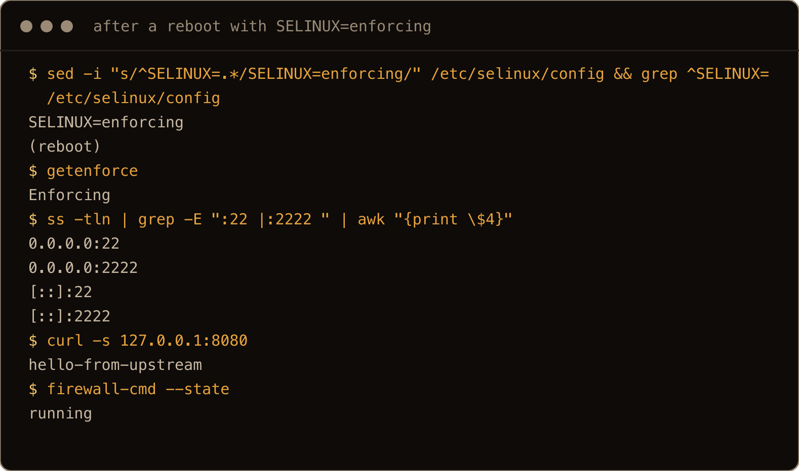

Most of the boxes I look after run Ubuntu. The RHEL family (Red Hat, and its free rebuilds Rocky and Alma) is what most of the enterprise world runs, and sooner or later someone hands you one. The [Debian post](/blog/debian-13-for-ubuntu-people/) was the easy version of this comparison, because Debian and Ubuntu share apt and most of `/etc`. This is the hard version. Sit down at a Rocky Linux 10 prompt with Ubuntu habits and `apt`, `dpkg`, `ufw`, `netplan` and `add-apt-repository` are all `command not found`.

I built it the same way. One fresh Rocky Linux 10 server, one fresh AlmaLinux 10 server and one fresh Ubuntu 26.04 server from the same provider on the same day, the same script run on all three, then a second round of hands on checks on the Rocky box: a user, a firewall, a port change, a reverse proxy, Docker, and a reboot. Rocky and Alma came back near identical, so the text says "Rocky" and calls out the one functional place Alma differs. Where something is a property of the cloud image rather than the distribution, I say so, and this time that includes the biggest finding in the post.

> **TL;DR.** systemd, `journalctl`, `sshd_config.d`, cloud-init, chrony and rsyslog all carry over. Packaging is the same ideas under different names: `dnf` instead of `apt`, `.repo` files instead of `.sources`, EPEL instead of PPAs, `wheel` instead of `sudo`, and no `EXTERNALLY-MANAGED` marker, so `pip install` as root just works. Networking is NetworkManager and `nmcli`, not netplan. The firewall is `firewalld`, and it is not on this cloud image. The trap is SELinux: this image ships it **permissive**, so an SSH port change and an nginx `proxy_pass` both work, then fail on the first restart or request after you set enforcing, with `Bind to port 2222 on 0.0.0.0 failed: Permission denied` and `(13: Permission denied) while connecting to upstream`. The fixes are `semanage port` and `setsebool`, and both are below.

## Contents

- [What is the same](#what-is-the-same)
- [The versions](#the-versions)
- [Users: wheel, not sudo](#users-wheel-not-sudo)
- [Packaging: dnf, repos, EPEL and history](#packaging-dnf-repos-epel-and-history)
- [Networking: NetworkManager and nmcli](#networking-networkmanager-and-nmcli)
- [Firewall: firewalld, once you install it](#firewall-firewalld-once-you-install-it)
- [SELinux: permissive on this image, and why that is a trap](#selinux-permissive-on-this-image-and-why-that-is-a-trap)
- [SSH: Bind to port 2222 failed: Permission denied](#ssh-bind-to-port-2222-failed-permission-denied)
- [nginx: (13: Permission denied) while connecting to upstream](#nginx-13-permission-denied-while-connecting-to-upstream)
- [Logs, updates and time](#logs-updates-and-time)
- [Python, Docker and disks: do the other posts hold](#python-docker-and-disks-do-the-other-posts-hold)
- [Rocky or Alma](#rocky-or-alma)
- [Which one I would pick](#which-one-i-would-pick)
- [Gotchas I hit](#gotchas-i-hit)
- [Quick reference: Ubuntu habit to Rocky equivalent](#quick-reference-ubuntu-habit-to-rocky-equivalent)

## What is the same

Start here, because it is more of the list than the reputation suggests. On both boxes:

- systemd 25x, `systemctl`, `journalctl`, `hostnamectl`, `timedatectl`. Every systemd and journal command I ran for this post behaved the same on both, so the [systemd units and timers post](/blog/systemd-units-timers-ubuntu-26-04/) and the [journalctl post](/blog/reading-logs-journalctl-ubuntu-26-04/) should carry over; the one path difference is under logs below.
- cloud-init, which on both images creates only `root`, locks root's password, leaves the admin group empty (`wheel` on Rocky, `sudo` on Ubuntu) and drops `root ALL=(ALL) NOPASSWD:ALL` in `/etc/sudoers.d/90-cloud-init-users`. That is the image, not the distribution.
- sshd with `Include /etc/ssh/sshd_config.d/*.conf`, root allowed by key only, and your own settings going in a numbered drop-in. Rocky ships three drop-ins already (`40-redhat-crypto-policies.conf`, `50-redhat.conf`, `50-cloud-init.conf`); Ubuntu's directory is empty.
- chrony for time, on both. `chronyc tracking` works and `timedatectl timesync-status` errors out on both, because neither runs timesyncd. Rocky synced to the provider's NTP server, Ubuntu's chrony to Canonical's pool.
- rsyslog, running on both, so both have text logs beside the journal. The file names differ, covered below.
- bash 5 as the login shell, vim and nano installed, `ss`, `lvm`, `parted`, `growpart`, `mkfs.xfs`, `mkfs.ext4`, `mdadm`, `cryptsetup`.
- `su -` to root from a normal user fails on both cloud images with `Authentication failure`, because root's password is locked. I tried it on Rocky here and on Ubuntu in the Debian post's lab, on the same image.

If your day is `systemctl`, `journalctl` and editing files under `/etc`, you will not notice which one you are on. The rest of this post is the remainder: packaging, networking, the firewall and SELinux, which is to say everything Ubuntu made easy.

## The versions

RHEL 10 shipped in May 2025 and its clones followed within weeks. Ubuntu 26.04 is eleven months younger and, like Debian 13, the older release shows it:

| | Rocky Linux 10.2 (Red Quartz) | AlmaLinux 10.2 (Lavender Lion) | Ubuntu 26.04.1 (resolute) |
| --- | --- | --- | --- |
| Kernel | 6.12 (`el10_2` build) | same | 7.0 (`-generic`) |
| systemd | 257 | 257 | 259 |
| Python | 3.12.14 | 3.12.14 | 3.14.4 |
| Package tool | dnf 4.20.0 | dnf 4.20.0 | apt 3.2.0 |
| bash | 5.2 | 5.2 | 5.3 |
| OpenSSH | 9.9p1 | 9.9p1 | 10.2p1 |
| sudo | original sudo 1.9.17p2 | same | sudo-rs 0.2.13 |
| coreutils | GNU 9.5 | GNU 9.5 | uutils 0.8.0 (`df` still GNU 9.7) |
| Packages installed, fresh image | 443 | 443 | 585 |
| First release (10.0 / 26.04) | 11 June 2025 | 27 May 2025 | April 2026 |
| Support until | May 2030 active, May 2035 security | same | May 2031, then Ubuntu Pro to 2036 |


The screenshots in this post are from a second pair of fresh boxes run the same night, and both of the provider's images had moved in between: the second Rocky box booted as 10.1 and was brought to 10.2 with `dnf upgrade` before this shot (that story is under updates below), and the second Ubuntu box has kernel build `-30` where the first had `-31`. Build suffixes in the shots differ from the table for that reason; the versions do not.

The release and support dates are from the projects' own pages, not the lab. Everything else in the table is what the boxes printed. Two rows matter more than they look. The kernel: RHEL keeps one kernel base for a whole major release and backports fixes into it, so Rocky 10 will still say 6.12 in 2030 (that is Red Hat's stated policy, not something the box can show). And the support row: ten years, with the last five security only, against Ubuntu's five plus a paid tail. That is what the family is for, and nothing in this post argues with it.

One row that is not in the table because it is about your CPU, not the box: RHEL 10 and Rocky 10 require an x86-64-v3 processor, roughly Intel Haswell (2013) or newer, per their release notes. AlmaLinux 10 also builds for v2, which is the one reason to pick Alma over Rocky on a specific box. The lab CPUs (AMD EPYC Rome) are v3, so I could not test the refusal.

## Users: wheel, not sudo

The admin group is `wheel`, and `/etc/sudoers` on Rocky already has `%wheel ALL=(ALL) ALL`. So a new admin user is:

```bash
sudo useradd -m -G wheel keith
sudo passwd keith
sudo mkdir -m 700 /home/keith/.ssh
sudo cp /root/.ssh/authorized_keys /home/keith/.ssh/
sudo chown -R keith:keith /home/keith/.ssh
```

and an existing user joins with `sudo usermod -aG wheel keith`. That is the [create a sudo user post](/blog/create-sudo-user-ubuntu-26-04/) with `sudo` changed to `wheel`, plus the key copy, which matters more here than on Ubuntu: this image sets `PasswordAuthentication no`, so a user with only a password cannot log in over SSH at all. I logged in as `keith` with the copied key to check. Two details. Rocky's `login.defs` has `CREATE_HOME yes`, so `-m` is not strictly needed, but it is harmless and I keep typing it. And the `%wheel` line asks for a password; for passwordless sudo, drop a file in `/etc/sudoers.d/` as you would on Ubuntu, which I did for `keith` to run the checks below.


Ubuntu's group is `sudo` with `%sudo ALL=(ALL:ALL) ALL`. Same shape, different name, and neither box has the other's group: `usermod -aG sudo keith` on Rocky fails with `group 'sudo' does not exist`, and there is no `wheel` group on Ubuntu.

## Packaging: dnf, repos, EPEL and history

Here is the translation. Everything with output quoted below was typed on the box.

**The commands.** `dnf install`, `dnf remove`, `dnf upgrade`, `dnf search`, `dnf info`. `dnf check-update` lists pending updates and exits 100 when there are any (36 on the day), which is useful in scripts and alarming the first time. `apt` is not found, `dpkg` is not found. `yum` and `dnf` are both symlinks to the same `dnf-3`, so old guides still work.

**The repos.** `/etc/yum.repos.d/*.repo`, INI style, with one or more repos per file. On the day, Rocky enables `baseos`, `appstream` and `extras`. `crb` (CodeReady Builder, headers and build dependencies) is disabled on Rocky and enabled on Alma, which is the one functional difference I found between the two. Turn it on with `dnf config-manager --set-enabled crb`.

**EPEL is the PPA replacement, sort of.** Half the things an Ubuntu person installs by reflex are not in Rocky's repos at all. `htop` and `fail2ban` both answered `No matching Packages to list` on the fresh box, and `pipx`, `uv`, `python3.13` and plain `netcat` turned out to live in the same place, which you reach with:

```bash
sudo dnf install epel-release
```

`epel-release` comes from the `extras` repo (`dnf info epel-release` says so), so that one command works on a fresh box, and after it `dnf repolist` shows a fourth repo, `epel` (a fifth if you enabled `crb` above). It is one repo run by the Fedora project, not a thousand personal ones. There is no `add-apt-repository`. For a vendor's own repo you download a `.repo` file into `/etc/yum.repos.d/` or use `dnf config-manager --add-repo <url>`, which is what the Docker step below does.

**Package names.** The names you know are the Debian names, and dnf does not translate:

| You type | Rocky has |
| --- | --- |
| `apache2` | `httpd` |
| `dnsutils` | `bind-utils` |
| `netcat` | `nmap-ncat` (or `netcat` from EPEL) |
| `build-essential` | `dnf group install "Development Tools"` |
| `python3-venv` | nothing to install, `python3 -m venv` works out of the box |
| `gdisk` | `gdisk`, but not on the image, so `sgdisk` is missing until you install it |

When you do not know the name, `dnf provides "*/dig"` finds the package that owns a file, which is `apt-file` without the separate database.

**History and undo.** Here Rocky is closer to Ubuntu 26.04 than Debian is. `dnf history list` shows every transaction, `dnf history info last` shows what it changed, and `dnf history undo last` reverses it. I installed `htop` from EPEL, undid it, and `htop` was gone. This is the feature the [apt history post](/blog/apt-history-undo-rollback-ubuntu-26-04/) is about, and dnf had it first.


**Two settings in `/etc/dnf/dnf.conf` worth knowing about.** `best=True` is the setting that makes dnf refuse an upgrade rather than quietly pick a lower version when the newest one has a dependency problem, where apt's habit is to hold the package back and carry on. `installonly_limit=3` is the setting that keeps three kernels installed and removes the oldest when a fourth arrives, which is the kernel half of apt's `autoremove`, done for you. I read both from the file; a fresh box has one kernel and nothing to hold back, so neither behaviour was exercised.

**Missing commands are just missing.** Type `tree` on a fresh Rocky box and bash says `command not found` and nothing else. Ubuntu's `command-not-found` hook, which in an interactive shell tells you which package to install (the Debian post shows it), has no equivalent on this image.


## Networking: NetworkManager and nmcli

No `/etc/netplan`, no `netplan` command, no `/etc/network/interfaces.d`, and on Rocky 10 no `/etc/sysconfig/network-scripts` either, which is where older RHEL guides will send you. The stack is:

| | Rocky 10 (this image) | Ubuntu 26.04 |
| --- | --- | --- |
| Config | `/etc/NetworkManager/system-connections/*.nmconnection` (keyfiles) | `/etc/netplan/*.yaml` |
| Brought up by | `NetworkManager` | `systemd-networkd` |
| Tool | `nmcli` | `netplan` |
| DNS | NetworkManager writes `/etc/resolv.conf` directly | `systemd-resolved`, stub at `127.0.0.53` |
| `resolvectl` | binary present, answers `The name is not activatable` | works |

cloud-init wrote one connection, `cloud-init eth0`, and `nmcli con show` lists it. A static address is two commands. The values below are placeholders; put in the address, prefix and gateway the box has now (`nmcli dev show eth0` prints them), because `con up` applies the change immediately and the wrong gateway ends your SSH session:

```bash
sudo nmcli con mod "cloud-init eth0" ipv4.method manual \
  ipv4.addresses 10.0.0.5/24 ipv4.gateway 10.0.0.1 ipv4.dns "1.1.1.1 1.0.0.1"
sudo nmcli con up "cloud-init eth0"
```

I ran it on the Alma box with that box's current address and gateway, over SSH, and kept the session. `nmcli con mod` edits the keyfile (an `[ipv4]` block with `address1=`, `gateway=` and `dns=`) and `con up` applies it, so together they are `netplan apply`. `/etc/resolv.conf` was rewritten with the new servers on the way. The muscle memory that fails first is `resolvectl status` and `ls /etc/netplan`.


## Firewall: firewalld, once you install it

Neither image starts with any firewall rules. Both have `nft` and `iptables` installed and an empty ruleset. From there the Ubuntu image has `ufw` installed (`ufw status` says `inactive` until you `ufw enable`), and the Rocky image has no front end at all: `firewall-cmd` not found, `firewalld` not installed. That surprised me, because firewalld is the RHEL firewall and I have never seen an installer build without it. This cloud image does not ship it, and `dnf history` says why: transaction 2 in the image's own build log is `remove firewalld`, run by whoever built the image. Somebody took it out on purpose.

```bash
sudo dnf install firewalld
sudo systemctl enable --now firewalld
sudo firewall-cmd --list-all
```

Out of the box the default zone is `public`, `eth0` lands in it, and it allows `ssh`, `dhcpv6-client` and `cockpit` (port 9090, whether or not cockpit is installed). Opening things is `--add-service` or `--add-port`, and the flag every Ubuntu person forgets is `--permanent`, because a rule added without it lives in the running config only and goes away on the next reload or reboot (that is what the flag is for; I only tested the permanent path):

```bash
sudo firewall-cmd --add-service=http --permanent
sudo firewall-cmd --add-port=2222/tcp --permanent
sudo firewall-cmd --reload
```

Underneath it is nftables, `table inet firewalld`, 292 non-blank lines of ruleset for that one zone. `ufw allow 22` and `firewall-cmd --add-service=ssh --permanent` both end up in the kernel's nftables, by different routes and in different tables. The [ufw post](/blog/ufw-firewall-basics-ubuntu/) has no direct equivalent here, and I have not written the firewalld one yet.


## SELinux: permissive on this image, and why that is a trap

Ubuntu has AppArmor, loaded with 182 profiles on this image, and most server setups never trip over it. Rocky has SELinux, and most do. Except that on this cloud image you will not, for a while, and that is the finding the post is really about.

```text
$ getenforce
Permissive
$ grep ^SELINUX= /etc/selinux/config
SELINUX=permissive
```

Permissive means SELinux is loaded, files and processes carry their labels, denials are written to the audit log, and nothing is enforced. Both the Rocky 10 and the AlmaLinux 10 image on Hetzner Cloud shipped that way on the day I ran this (22 September 2026). The installer's default is enforcing; I did not run an installer or Red Hat's own cloud image for this post, so check `getenforce` on yours rather than assuming either way. A surprising amount of "Rocky is different" on this box is really "this image turned the different part off."

Why it is a trap: everything you set up works. You change the SSH port, it listens. You put nginx in front of an app, it proxies. You get comfortable, or a hardening guide tells you to set `SELINUX=enforcing` and reboot, and two services you tested are now broken, with no change to their config. The next two sections reproduce both, and the switch between the two states is one command, which I ran between the permissive and enforcing halves of each:

```bash
sudo setenforce 1     # enforcing until reboot; getenforce confirms
```

To make it stick, set `SELINUX=enforcing` in `/etc/selinux/config`, which I did at the end, and rebooted to check that both fixes below survived it.

The tools you need, and their packages: `getenforce`, `setenforce`, `getsebool`, `setsebool` and `restorecon` are on the image. `semanage`, the one you need for ports and file contexts, is not; it lives in `policycoreutils-python-utils`. `ausearch -m avc -ts recent` reads the denials. That command is worth running on a permissive box before you switch, because every operation you have already exercised that would be blocked is in there; anything you have not exercised yet is not.

## SSH: Bind to port 2222 failed: Permission denied

The Debian post found that changing the SSH port on Ubuntu needs `daemon-reload` and a restart of `ssh.socket`, because sshd is socket activated there. Rocky runs `sshd.service` the old way (`sshd.socket` exists and is disabled), so that trap is gone. SELinux supplies a new one: the label trap replaces the socket trap.

I added `/etc/ssh/sshd_config.d/10-port.conf` with `Port 22` and `Port 2222`, checked it with `sshd -t`, and restarted:

```text
Permissive:  0.0.0.0:22 and 0.0.0.0:2222 both listening after `systemctl restart sshd`
Enforcing:   only 0.0.0.0:22 listening, and in the journal:
             sshd: error: Bind to port 2222 on 0.0.0.0 failed: Permission denied.
             (and a second line for ::, one per address family)
```

Even in permissive mode the audit log already had the denial: `comm="sshd" src=2222 ... tcontext=system_u:object_r:unreserved_port_t:s0`. Port 2222 is an unreserved port and only ports labelled `ssh_port_t` are ones sshd is allowed to bind. The fix is one label:

```bash
sudo dnf install policycoreutils-python-utils
sudo semanage port -a -t ssh_port_t -p tcp 2222
sudo systemctl restart sshd
```

`semanage port -l | grep ssh_port_t` then shows `tcp 2222, 22`, and sshd binds both under enforcing. Add the firewalld rule from the previous section, and test the new port from a second session before you drop `Port 22`. Those are the three steps the RHEL port change guides give, and now you know which layer each one is for: `semanage` for SELinux, the drop-in for sshd, `firewall-cmd` for the packet filter.


One more sshd difference: this cloud image sets `PasswordAuthentication no` in `50-cloud-init.conf`. The Ubuntu image leaves it `yes`. If you create a user on Rocky and cannot log in with a password, that is why, and it is the right default.

## nginx: (13: Permission denied) while connecting to upstream

The second thing enforcing breaks is the most common thing people put on a server. nginx from AppStream, a stand in app on port 3000, and the smallest reverse proxy there is:

```bash
sudo setenforce 0     # the SSH section left the box enforcing; start this one permissive
sudo dnf install nginx
sudo mkdir -p /srv/app && echo hello-from-upstream | sudo tee /srv/app/index.html
(cd /srv/app && sudo setsid python3 -m http.server 3000 >/dev/null 2>&1 &)
echo 'server { listen 8080; location / { proxy_pass http://127.0.0.1:3000; } }' \
  | sudo tee /etc/nginx/conf.d/app.conf
sudo nginx -t && sudo systemctl enable --now nginx
curl 127.0.0.1:8080
```

Under permissive that last line prints `hello-from-upstream`. Under enforcing it returns **502**. The error log says why, and it is not what it looks like:

```text
connect() to 127.0.0.1:3000 failed (13: Permission denied) while connecting to upstream
```

That is not a file permission and no `chmod` will touch it. nginx runs in the `httpd_t` SELinux domain, and the policy does not let that domain connect out to port 3000 unless a boolean says so. The audit log has it as `denied { name_connect } ... comm="nginx" dest=3000 scontext=system_u:system_r:httpd_t:s0`. The switch is a boolean, and `-P` makes it survive a reboot:

```bash
getsebool httpd_can_network_connect          # --> off
sudo setsebool -P httpd_can_network_connect on
curl 127.0.0.1:8080                          # hello-from-upstream
```

On Ubuntu this configuration works first time, which is where the [nginx reverse proxy post](/blog/nginx-reverse-proxy-ubuntu-26-04/) was run. On a permissive Rocky box it also works first time; I set it up under permissive, got `hello-from-upstream`, ran `setenforce 1`, and the next request was the 502. That post's recipe needs one extra step here that is invisible until enforcing is on, and if you only remember one boolean from SELinux, this is the one.


## Logs, updates and time

**Logs.** rsyslog runs on both, but writes different files. Rocky has `/var/log/messages` and `/var/log/secure`; Ubuntu has `/var/log/syslog` and `/var/log/auth.log`. The `grep sshd /var/log/auth.log` reflex becomes `grep sshd /var/log/secure`, or `journalctl -u sshd` (the unit is `sshd`, not `ssh`). The journal was 16M on Rocky after boot against 8M on Ubuntu, and there is no `/etc/systemd/journald.conf` on Rocky at all: the stock file lives at `/usr/lib/systemd/journald.conf`, and your overrides go in `/etc/systemd/journald.conf.d/`, which is exactly what the [journald retention post](/blog/journald-disk-usage-retention-ubuntu-26-04/) tells you to do anyway.


**Updates.** Ubuntu ships `unattended-upgrades` switched on. Rocky ships nothing. The equivalent is `dnf-automatic`, and it is two decisions, not one:

```bash
sudo dnf install dnf-automatic
sudo systemctl enable --now dnf-automatic.timer
```

The package ships four timers. `dnf-automatic.timer` reads `/etc/dnf/automatic.conf`, where the defaults are `download_updates = yes` and `apply_updates = no`, so out of the box it downloads updates and installs nothing. Either set `apply_updates = yes` in that file, or enable `dnf-automatic-install.timer` instead, whose service runs `dnf-automatic --installupdates` and installs regardless of the setting. There is no security only mode by default; `upgrade_type = security` in the same file gives you one. After updates, `dnf needs-restarting -r` says whether a reboot is due and `dnf needs-restarting` lists processes running old libraries (empty on a fresh box, which is what I got). There is no `needrestart`, so nothing prompts you after an upgrade the way Ubuntu's does.

**Point releases.** The second Rocky box in the screenshot run booted as 10.1, because the provider's image had not been rebuilt since January, and `dnf upgrade` took it to 10.2 in one go: 258 packages, a new kernel, reboot. That is the whole point release process, and it is the same command as a Tuesday's patching. It is also why that screenshot shows 10.1 before the upgrade.


**Time.** chrony on both, as noted. The only difference is which servers, and that is the image.

## Python, Docker and disks: do the other posts hold

**Python.** Rocky 10 has Python 3.12, no pip, and no `EXTERNALLY-MANAGED` marker. That last part changes the [pip post](/blog/pip-externally-managed-environment-ubuntu-26-04/) completely: after `dnf install python3-pip`, `python3 -m pip install cowsay` as root installed into `/usr/local/lib/python3.12/site-packages` with only the usual "running as root" warning. (Red Hat patches pip to keep root installs out of `/usr/lib`, where rpm's files live, which is a gentler fence than Debian's marker.) The lockout that post is about does not exist here. Use a venv anyway; `python3 -m venv` works with no extra package and the venv has pip inside it, where the same command on the Ubuntu box fails until `python3.14-venv` is installed. `pipx`, `uv` and `python3.13` are all in EPEL.

**Docker.** Not in Rocky's repos; `podman` is, and is the distribution's answer. If you want Docker, Docker's own RHEL repo works on Rocky 10 unchanged:

```bash
sudo dnf config-manager --add-repo https://download.docker.com/linux/rhel/docker-ce.repo
sudo dnf install docker-ce docker-ce-cli containerd.io
sudo systemctl enable --now docker
sudo docker run --rm hello-world
```

That gave Docker 29.8.1 and `Hello from Docker!`, with SELinux enforcing and firewalld running. Those four commands are the [Ubuntu Docker post](/blog/install-docker-ubuntu-26-04/)'s install steps with the repo URL and `dnf` swapped in; I did not rerun the rest of that post here. `podman` was not installed on the image either, despite being the house container tool.


**Disks.** `parted`, `partprobe`, `growpart`, LVM, xfsprogs and e2fsprogs are all present. `sgdisk` is not, so the [add a disk post](/blog/add-disk-fstab-lvm-ubuntu-26-04/) needs `dnf install gdisk` first, or `parted` for the partitioning step. One image note: the root filesystem on this Rocky image is ext4, where the Rocky installer's default (not tested here) is XFS. If you are reading a RHEL guide that assumes `xfs_growfs`, check `findmnt -no FSTYPE /` first.

## Rocky or Alma

The two boxes differed in the `.repo` file names, the vendor string in some package versions (`.rocky.0.1` against `.alma.1` on systemd and cloud-init, identical on the kernel), CRB enabled by default on Alma and disabled on Rocky, and nothing else my script could find. Same kernel build, same systemd, same package count, same cloud-init behaviour, same permissive SELinux. By their own descriptions, Rocky aims to be bug for bug identical to RHEL, and Alma aims for ABI compatibility and allows itself fixes and additions, of which the x86-64-v2 build is the visible one. For a homelab or a small fleet, pick by which community you would rather ask questions in. For an older CPU, Alma.

## Which one I would pick

For a box that has to behave like RHEL, because the software vendor tests against it or the rest of the estate runs it, Rocky (or RHEL itself, if a checklist says the word), and I would set SELinux to enforcing on day one, before anything is installed, so every denial shows up while I am still watching. Ten years of patches is a real thing. Starting from a 6.12 kernel is the price.

For everything else I run, Ubuntu or Debian, because the guides assume it and I would rather have this year's kernel. The one habit that genuinely needs relearning on Rocky is not dnf, which you will pick up in an afternoon. It is treating SELinux as part of every service you deploy, and this image lets you skip that until it hurts.

The box at the end of the run, for the record: enforcing written to the config file, a reboot, and then sshd on both ports, firewalld running, and the proxy answering once the stand in app was started again, which the screenshot does not show. A bare `setsid` process is not a unit, so nothing brings it back after a reboot.



## Gotchas I hit

- **SELinux is permissive on this cloud image**, on Rocky and Alma both. Everything works until you set enforcing, then the SSH port and the reverse proxy break with no config change. Run `ausearch -m avc -ts recent` before you switch to see what will.
- **`Bind to port 2222 on 0.0.0.0 failed: Permission denied`** from sshd, with an `unreserved_port_t` denial in `ausearch`, means the port has no `ssh_port_t` label. `semanage port -a -t ssh_port_t -p tcp 2222`, and `semanage` needs `policycoreutils-python-utils`.
- **`(13: Permission denied) while connecting to upstream`** from nginx is not a file permission. Check `ausearch` for a `name_connect` denial from `comm="nginx"`; if it is there, it is `httpd_can_network_connect`, off by default. `setsebool -P httpd_can_network_connect on`.
- **firewalld is not on the cloud image.** No rules are active either. `dnf install firewalld`, `systemctl enable --now firewalld`, and remember `--permanent` on every rule.
- **The pip lockout does not exist.** No `EXTERNALLY-MANAGED` marker on Rocky 10, so `pip install` as root writes into the system site-packages. Nothing stops you. Use a venv.
- **`dnf install htop` fails on a fresh box.** So does fail2ban, and pipx, uv and python3.13 are in the same repo. `dnf install epel-release` first.
- **The admin group is `wheel`.** `usermod -aG sudo keith` fails on Rocky with `group 'sudo' does not exist`. `-G wheel`.
- **`dnf check-update` exits 100** when updates are available. Not an error.
- **Password logins are off** on this image (`50-cloud-init.conf`). Create the user, then add a key.
- **`dnf-automatic` installs nothing by default.** `apply_updates = no`. Set it, or enable the `-install` timer.
- **No `/etc/systemd/journald.conf`** on Rocky. Drop-ins under `journald.conf.d/` still work.
- **`sgdisk` is not installed.** `dnf install gdisk`.
- **Docker is not in the repos, and podman is not on the image.** Docker's RHEL repo works on Rocky 10.

## Quick reference: Ubuntu habit to Rocky equivalent

| Ubuntu habit | On this Rocky Linux 10 image |
| --- | --- |
| `sudo apt install x` | `sudo dnf install x` |
| `sudo apt update && sudo apt upgrade` | `sudo dnf upgrade` (dnf refreshes its own metadata when it is stale) |
| `apt search x` / `apt show x` | `dnf search x` / `dnf info x` |
| `apt-file search /bin/dig` | `dnf provides "*/dig"` |
| `sudo apt history-undo <ID>` | `sudo dnf history undo <ID>`, IDs from `dnf history list` |
| `sudo add-apt-repository ppa:x/y` | `sudo dnf install epel-release`, or a `.repo` file in `/etc/yum.repos.d/`, or `dnf config-manager --add-repo <url>` |
| `apt install build-essential` | `dnf group install "Development Tools"` |
| `sudo usermod -aG sudo keith` | `sudo usermod -aG wheel keith` |
| `sudo netplan apply` | `nmcli con mod "<name>" ...` then `nmcli con up "<name>"`; keyfiles in `/etc/NetworkManager/system-connections/` |
| `resolvectl status` | `cat /etc/resolv.conf`, NetworkManager writes it; `nmcli -g IP4.DNS dev show eth0` |
| `sudo ufw allow 22` | `sudo dnf install firewalld && sudo systemctl enable --now firewalld` first, then `sudo firewall-cmd --add-service=ssh --permanent && sudo firewall-cmd --reload` |
| `sudo ufw status` | `sudo firewall-cmd --list-all` |
| `aa-status` | `getenforce`, `sestatus`; denials in `ausearch -m avc -ts recent` |
| Change `Port` then `systemctl restart ssh` | `semanage port -a -t ssh_port_t -p tcp <port>` first (`semanage` is in `policycoreutils-python-utils`), open the port in firewalld, then `systemctl restart sshd` (no socket to restart) |
| `grep sshd /var/log/auth.log` | `grep sshd /var/log/secure` or `journalctl -u sshd` |
| `tail -f /var/log/syslog` | `tail -f /var/log/messages` |
| `unattended-upgrades` (on by default) | `dnf install dnf-automatic`, set `apply_updates = yes`, `systemctl enable --now dnf-automatic.timer` |
| `sudo needrestart -r l` | `dnf needs-restarting -r`, and `dnf needs-restarting` for the service list |
| `apt install python3-venv python3-pip` | `dnf install python3-pip`; venv already works; no `EXTERNALLY-MANAGED` |
| `apt install docker.io` | `dnf install podman`, or Docker's RHEL repo for `docker-ce` |
| `sudo sgdisk ...` | `dnf install gdisk` first, or use `parted` |
| `snap install x` | No `snap` command on this image. EPEL, the project's repo, or a container. |
| `sudo do-release-upgrade` | No equivalent command. Point releases (10.2 to 10.3) arrive through `dnf upgrade`; a new major version is a reinstall, or a migration tool such as Alma's ELevate, following that release's notes. Not tested here. |

`[ same systemd, same journal, and getenforce before you trust anything you just set up ]`
