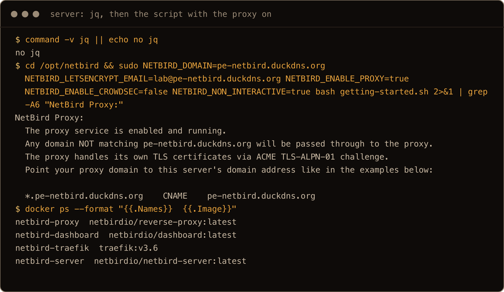
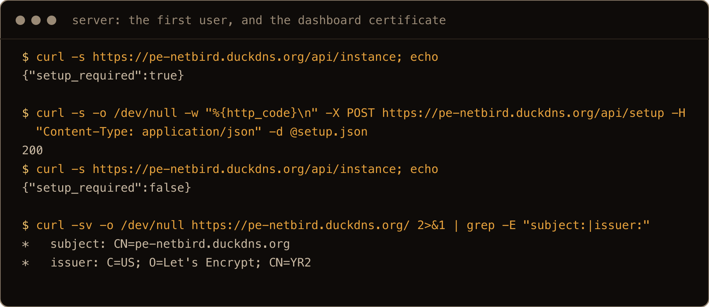
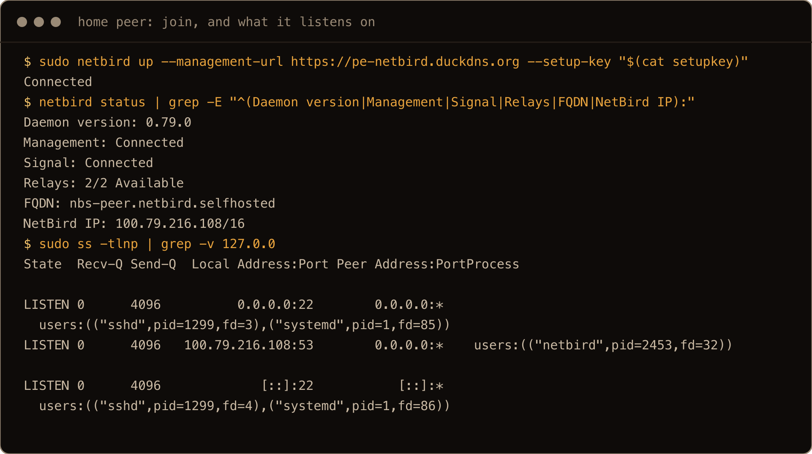
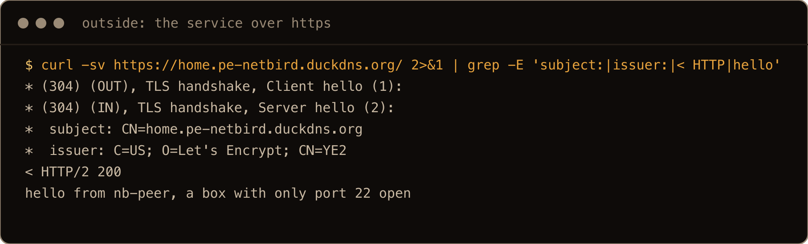
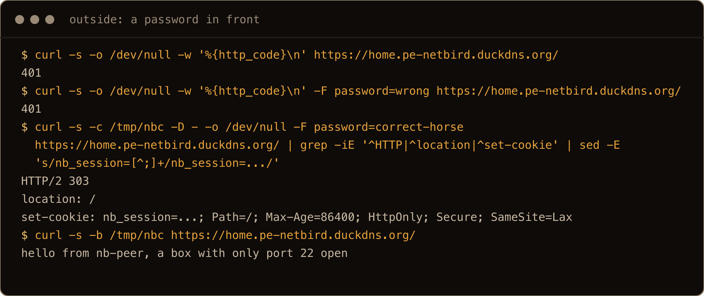
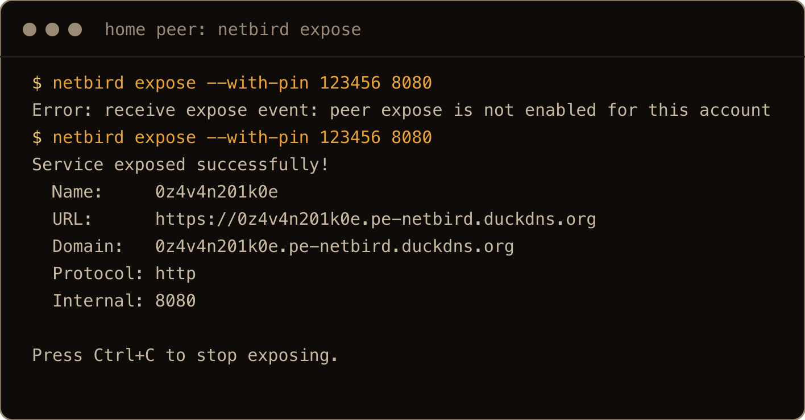
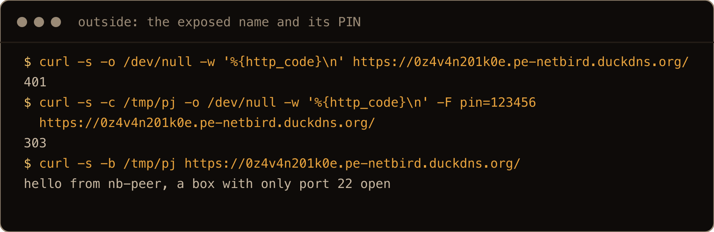
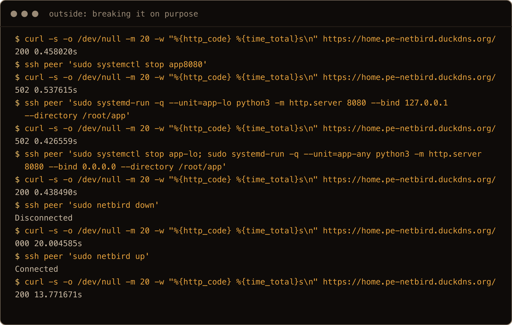

I wanted one thing at home reachable from an ordinary browser, over HTTPS, without opening a port on the router and without the traffic going through someone else's edge. Cloudflare Tunnel and Tailscale Funnel both do the first part, and both route you through their network to do it. NetBird can do it on a VPS you own: the server that runs your WireGuard mesh now has a reverse proxy built in, so the VPS takes the HTTPS request and hands it down the tunnel to the machine at home.

NetBird's docs start with "point your domain and a wildcard record at the server", and that is the part that stops people who never bought a domain. This post does it with a free DuckDNS name, and I ran it on two fresh Ubuntu 26.04 servers: one as the NetBird server, and one standing in for the machine at home, with nothing open but SSH.

The one thing to get straight: the VPS takes every public connection, and the machine at home only ever connects outward. There are three pieces. The **NetBird server** on the VPS is the control plane (users, peers, keys) and the relay. The **peer** at home dials out to it, so nothing listens at home. The **NetBird Proxy**, also on the VPS, answers `https://app.<your name>` with its own certificate for that name and forwards the request over WireGuard to the peer. Traefik sits in front of both and passes TLS for the proxy's names straight through, which is why NetBird's docs say Traefik is the only front proxy that works for this.

> **TL;DR.** Get a DuckDNS name and point it at the VPS. Open TCP 80 and 443 and UDP 3478 on the VPS. Install Docker and `jq`, then run NetBird's getting started script with `NETBIRD_ENABLE_PROXY=true`. Create the admin at `https://<name>.duckdns.org/setup`. On the machine at home, install the NetBird client and `netbird up --management-url https://<name>.duckdns.org --setup-key <key>`. Bind the app to `0.0.0.0` or the NetBird address (not `127.0.0.1`), add a reverse proxy service for `app.<name>.duckdns.org` pointing at that peer and port, and open it. DuckDNS answers for every name under yours, which is the wildcard record the docs ask for.

## Contents

- [What I tested on](#what-i-tested-on)
- [1. A free name that covers every subdomain](#1-a-free-name-that-covers-every-subdomain)
- [2. Open the ports on the VPS](#2-open-the-ports-on-the-vps)
- [3. Install the server with the proxy switched on](#3-install-the-server-with-the-proxy-switched-on)
- [4. Create the admin](#4-create-the-admin)
- [5. Join the machine at home](#5-join-the-machine-at-home)
- [6. Publish one service](#6-publish-one-service)
- [7. Put a password or PIN in front of it](#7-put-a-password-or-pin-in-front-of-it)
- [8. netbird expose, for something quick](#8-netbird-expose-for-something-quick)
- [9. What 502, 401 and a timeout mean](#9-what-502-401-and-a-timeout-mean)
- [10. Next to Cloudflare Tunnel and Tailscale Funnel](#10-next-to-cloudflare-tunnel-and-tailscale-funnel)
- [Gotchas I hit](#gotchas-i-hit)
- [Quick reference](#quick-reference)

## What I tested on

- Two Hetzner cx23 servers (2 vCPU, 4GB) with Ubuntu 26.04, on 24 September 2026. The cloud firewall on the "home" box only let SSH in.
- Docker Engine 29.8.1 and Compose v5.5.1 on the NetBird server, installed from Docker's repo as in [Install Docker on Ubuntu 26.04](/blog/install-docker-ubuntu-26-04/).
- NetBird's server images as the script pulled them on the day (`netbirdio/netbird-server:latest`, `netbirdio/dashboard:latest`, `netbirdio/reverse-proxy:latest`, and `traefik:v3.6`); 0.79.0, released on 18 September, was the latest NetBird release, and the client on the peer reported 0.79.0.
- The DuckDNS name `pe-netbird.duckdns.org`.

NetBird's docs label the reverse proxy as beta. Everything below worked on this version; I have not tested how a service survives a NetBird upgrade.

## 1. A free name that covers every subdomain

The proxy gives every service its own hostname under a base name (`app.pe-netbird.duckdns.org`), so the base name needs every subdomain under it to resolve to the VPS. With a real domain that is a wildcard DNS record. With DuckDNS it is already there: after I pointed the name at the server, every name under it answered with the same address.

```text
$ dig +short pe-netbird.duckdns.org
135.181.38.45
$ dig +short app.pe-netbird.duckdns.org @ns1.duckdns.org
135.181.38.45
```

(Before that, `x.y.pe-netbird.duckdns.org`, two levels down, resolved too.)

The other reason DuckDNS works here: `duckdns.org` is on the Public Suffix List (I checked the list), so per Let's Encrypt's rate limit docs its limits count against your name, not against every DuckDNS user put together. That matters, because this setup asks for new certificates (two, as it turns out) for every service name.

Sign in at duckdns.org with one of the accounts it offers, create a name, and copy the token it shows you. Keep the token in a file rather than in your shell history:

```bash
mkdir -p ~/.config/duckdns
install -m 600 /dev/null ~/.config/duckdns/token
nano ~/.config/duckdns/token          # paste the token, save
curl "https://www.duckdns.org/update?domains=pe-netbird&token=$(tr -d '\n' < ~/.config/duckdns/token)&ip=203.0.113.10"
```

Use your own name and your VPS address. The update URL answers `OK`, and the new address showed up in `dig` within seconds.

## 2. Open the ports on the VPS

The script's closing message lists what it needs:

```text
Open ports:
  - 443/tcp   (HTTPS - all NetBird services)
  - 80/tcp    (HTTP - redirects to HTTPS)
  - 3478/udp   (STUN - required for NAT traversal)
  - 51820/udp (WIREGUARD - (optional) for P2P proxy connections)
```

I opened TCP 80 and 443 and UDP 3478 in the provider's firewall and left 51820 closed, which matters later (section 5). The machine at home needs nothing opened at all: every connection it makes is outbound.

If the VPS also runs ufw, remember that Docker publishes ports underneath it (the [ufw post](/blog/ufw-firewall-basics-ubuntu/) calls this "Docker punches through"). The compose file the script writes publishes 51820/udp from the proxy container, so on a VPS with only ufw that port is open whatever ufw says. Here the provider's firewall is what kept it closed.

## 3. Install the server with the proxy switched on

The script needs Docker with the Compose plugin, `curl` and `jq` already installed. A fresh 26.04 image has `curl` but not `jq`:

```bash
sudo apt install jq
```

NetBird's docs give `curl ... | bash`. I downloaded it first so I could read it (it is about 1,800 lines), and I ran it unattended, because every prompt has an environment variable:

```bash
sudo mkdir -p /opt/netbird && cd /opt/netbird
sudo curl -fsSL https://github.com/netbirdio/netbird/releases/latest/download/getting-started.sh -o getting-started.sh
sudo NETBIRD_DOMAIN=pe-netbird.duckdns.org \
  NETBIRD_LETSENCRYPT_EMAIL=you@example.com \
  NETBIRD_ENABLE_PROXY=true \
  NETBIRD_ENABLE_CROWDSEC=false \
  NETBIRD_NON_INTERACTIVE=true \
  bash getting-started.sh
```

Run interactively, it asks the same things in turn: the domain, which reverse proxy (0 is the built in Traefik), an email for Let's Encrypt (required; unattended without it, the script stops with `NETBIRD_LETSENCRYPT_EMAIL is required for a non-interactive install.`), then `Enable proxy? [y/N]` and `Enable CrowdSec? [y/N]`. It finished with:

```text
NETBIRD SETUP COMPLETE
...
NetBird Proxy:
  The proxy service is enabled and running.
  Any domain NOT matching pe-netbird.duckdns.org will be passed through to the proxy.
  The proxy handles its own TLS certificates via ACME TLS-ALPN-01 challenge.
  Point your proxy domain to this server's domain address like in the examples below:

  *.pe-netbird.duckdns.org    CNAME    pe-netbird.duckdns.org
```

That last line is the wildcard record DuckDNS already gives you. Four containers were running: `netbird-server`, `netbird-dashboard`, `netbird-proxy` and `netbird-traefik`. The configuration is in `/opt/netbird` (`docker-compose.yml`, `config.yaml`, `dashboard.env`, `proxy.env`, `traefik-dynamic.yaml`), so back that folder up with the Docker volumes it names.



The screenshots come from a clean run on two fresh boxes after the post was written, so addresses, names and timings differ a little from the text. The `apt install jq` step is left out of this one; it only printed apt's restart notice.

The dashboard certificate was a real one on the first try, `CN=pe-netbird.duckdns.org` from Let's Encrypt. And it is small: `docker stats` put the four containers at 70MiB, 22MiB, 21MiB and 20MiB. The docs ask for 1 CPU and 2GB, and that is generous.

## 4. Create the admin

Open `https://pe-netbird.duckdns.org/setup` and create the first user. That page only works while no users exist, which you can check: `curl https://pe-netbird.duckdns.org/api/instance` said `{"setup_required":true}` before and `{"setup_required":false}` after. Logins are handled by an embedded Dex server, so there is nothing else to set up for users.

I had no browser on the lab, so I did this with the call the setup page makes, `POST /api/setup` with an email, password and name, and logged in afterwards with a script. In a browser it is one form. Once in, you need a **setup key** for the machine at home: create a reusable one in the dashboard (I used the API, `POST /api/setup-keys`).



## 5. Join the machine at home

On the machine that runs the service, install the client and point it at your server:

```bash
curl -fsSL https://pkgs.netbird.io/install.sh | sh
sudo netbird up --management-url https://pe-netbird.duckdns.org --setup-key <your setup key>
netbird status
```

```text
Management: Connected
Signal: Connected
Relays: 2/2 Available
FQDN: nb-peer.netbird.selfhosted
NetBird IP: 100.66.194.33/16
```

It got the address `100.66.194.33` on a new `wt0` interface. On the peer, the only TCP port listening on a public address was still SSH. NetBird does open its own UDP sockets (WireGuard on 51820 among them), but the peer's cloud firewall let nothing but SSH in and everything below still worked, because the connections that matter are the ones the peer makes outward.



Once a service exists (next section), the proxy shows up on the peer as another NetBird peer, and `netbird status -d` says how they are connected:

```text
proxy-...netbird.selfhosted:
  NetBird IP: 100.66.196.27
  Status: Connected
  Connection type: Relayed
  Relay server address: rels://pe-netbird.duckdns.org:443
```

**Relayed** is because I left UDP 51820 closed on the server, so the two could not talk WireGuard directly and went through the server's relay over 443 instead. It worked and responses came back in about half a second. Open 51820 if you want direct connections; I did not test that.

## 6. Publish one service

The app has to be reachable on the peer's NetBird address, because that is where the proxy connects. I used a plain web server with one page, bound to that address (use the `NetBird IP` your `netbird status` shows, without the `/16`):

```bash
mkdir -p ~/app
echo "hello from nb-peer, a box with only port 22 open" > ~/app/index.html
python3 -m http.server 8080 --bind 100.66.194.33 --directory ~/app
```

Binding to `0.0.0.0` works too. Binding to `127.0.0.1` does not (section 9).

Then add the service: in the dashboard it lives under the reverse proxy section (per the docs), and I used the API, `POST /api/reverse-proxies/services`, with the domain `app.pe-netbird.duckdns.org`, the peer as the target, protocol `http` and port `8080`. The server filled in the peer's NetBird address as the target host by itself.

The service came back `pending`, and its status recorded the certificate as issued six seconds after I created it. From my laptop:

```text
$ curl -v https://app.pe-netbird.duckdns.org/
*  subject: CN=app.pe-netbird.duckdns.org
*  issuer: C=US; O=Let's Encrypt; CN=YE1
< HTTP/2 200
hello from nb-peer, a box with only port 22 open
```

A real certificate for that exact name, served from a box whose cloud firewall only allows SSH in. My first request loop saw the first `200` about a minute after creating the service, so give it a moment before assuming something is wrong.



On the clean run the service is called `home.` rather than `app.`, for the reason in the next paragraph.

**Rebuilding? Mind the certificate limit.** The proxy asks Let's Encrypt for two certificates per name, an ECDSA one and an RSA one (the certificate volume held `app.pe-netbird.duckdns.org` and `app.pe-netbird.duckdns.org+rsa`). Let's Encrypt allows five certificates for the exact same name per week, so the third time I built this setup with `app.` in one week, only the RSA one came back. The proxy logged the refusal, and my laptop, which asks for ECDSA, got a TLS error (`tlsv1 alert internal error`, with `acme/autocert: missing certificate` in the proxy log) while a client limited to RSA still got a `200`. A new name (`home.`) worked straight away. If you are testing, keep the Docker volumes between rebuilds, or change the name.


The proxy passes the visitor's address through: its log showed my own public IP as `client_ip`, not Traefik's.

## 7. Put a password or PIN in front of it

A service with no authentication is open to the internet, which is the point, but most homelab dashboards should not be. The proxy can put a password, a PIN, SSO through your NetBird login, and a few other options in front (the docs list them). I tested the password and the PIN.

I set a password on the service (the `auth.password_auth` field when you update it through the API; the dashboard has the same options, per the docs). After that, an anonymous request got a `401` and a small "NetBird Service" login page. The page posts the password back to the same URL:

```text
$ curl -s -o /dev/null -w '%{http_code}\n' -F password=wrong https://app.pe-netbird.duckdns.org/
401
$ curl -s -D - -o /dev/null -F password=<the right one> https://app.pe-netbird.duckdns.org/
HTTP/2 303
location: /
set-cookie: nb_session=...; Path=/; Max-Age=86400; HttpOnly; Secure; SameSite=Lax
```

With that cookie the app answered. `Max-Age=86400` means a login lasts a day. The password is checked by the proxy on the VPS, before anything reaches the machine at home, which is the reason to use it rather than a login in the app itself.



## 8. netbird expose, for something quick

For a quick share there is a command on the peer itself:

```bash
netbird expose --with-pin 123456 8080
```

The first time, it failed with `peer expose is not enabled for this account`. Turning it on is an account setting (Peer Expose, per the docs), and the server refused it until I also chose a group allowed to use it: `peer expose requires at least one group`. I picked `All`. After that:

```text
Service exposed successfully!
  Name:     908osflzfrae
  URL:      https://908osflzfrae.pe-netbird.duckdns.org
  ...
Press Ctrl+C to stop exposing.
```



Without the PIN that URL gave `401`, with it a `303` and then the page. When the command stopped, the name stopped answering. The name is random each time (`--with-name-prefix` sets the start of it), so every run asks Let's Encrypt for new certificates. On a DuckDNS name those count against Let's Encrypt's limits for your name (the weekly limit on new certificates per registered name is in their docs; I did not hit that one), which is fine for the odd share. Run it in a loop and you use up that limit, and new share names stop getting certificates until the week rolls over.



## 9. What 502, 401 and a timeout mean

I broke it on purpose, from the outside with `curl`, with the password from section 7 taken off again (with it still on, every row below is just a `401` until you log in):

| What I did on the peer | What the browser gets |
| --- | --- |
| stopped the app | `502`, and the proxy log says `status=502 title="Service Unavailable"` |
| ran the app on `127.0.0.1:8080` only | the same `502` |
| ran it on `0.0.0.0:8080` | `200` |
| `netbird down` | no answer at all: `curl` gave up after 20 seconds |
| `netbird up` again | `200`, but the first request took 14 seconds |

In these tests, a stopped app and an app listening only on loopback both gave `502`, a disconnected peer gave a timeout, and `401` was only ever my own password or PIN doing its job. So on a `502`, check where the app is listening; on a timeout, check `netbird status` on the peer. The loopback case is the one that catches people, because the app works fine from the machine itself.



## 10. Next to Cloudflare Tunnel and Tailscale Funnel

I have not tested either of those for this post, so this is only the difference in shape, from their docs. Cloudflare Tunnel ends your visitors' HTTPS on Cloudflare's network. Tailscale Funnel relays the encrypted connection through Tailscale's servers and ends TLS on your own machine, with a certificate for its `ts.net` name. Both need an account with the vendor, and the public name is theirs or on their DNS. NetBird's proxy ends TLS on your VPS, and the only third parties are DuckDNS for the name and Let's Encrypt for the certificates. The price is that you run and patch the VPS, and the feature is still marked beta. If you already use [Tailscale](/blog/install-tailscale-ubuntu-26-04/) for your own access, you do not need any of this for yourself; this is for letting other people in.

## Gotchas I hit

- A fresh Ubuntu 26.04 image has no `jq`. Install it before the getting started script, which needs it.
- Unattended mode does not make the Let's Encrypt email optional: set `NETBIRD_LETSENCRYPT_EMAIL`.
- Creating the admin needs the `/setup` page in a browser (or the `POST /api/setup` it calls). It only works while there are no users.
- An app bound to `127.0.0.1` gives a `502`. Bind to `0.0.0.0` or the NetBird address.
- With UDP 51820 closed, the proxy reached the peer through the relay on 443. It still worked.
- The first request after the peer reconnects can take many seconds.
- `netbird expose` is off until you enable Peer Expose and give it a group, and every run makes a new random hostname and new certificates.
- Each service name uses two certificates, ECDSA and RSA. Build with the same name three times in a week and one of them is refused (`429 rateLimited ... (5) already issued for this exact set of identifiers`); for me it was ECDSA, which showed up as a TLS error on my laptop.

## Quick reference

| Job | Command or setting |
| --- | --- |
| Point DuckDNS at the VPS | `curl "https://www.duckdns.org/update?domains=<name>&token=$(tr -d '\n' < ~/.config/duckdns/token)&ip=<vps ip>"` |
| VPS ports | TCP 80, 443; UDP 3478 (51820 optional) |
| Prerequisites | Docker with Compose, `curl`, `sudo apt install jq` |
| Install with the proxy | `NETBIRD_DOMAIN=<name>.duckdns.org NETBIRD_LETSENCRYPT_EMAIL=<email> NETBIRD_ENABLE_PROXY=true NETBIRD_NON_INTERACTIVE=true bash getting-started.sh` |
| First user | `https://<name>.duckdns.org/setup` |
| Join a peer | `curl -fsSL https://pkgs.netbird.io/install.sh \| sh`, then `netbird up --management-url https://<name>.duckdns.org --setup-key <key>` |
| Check it | `netbird status`, `netbird status -d` |
| App binding | `0.0.0.0` or the NetBird IP, not `127.0.0.1` |
| Quick share | `netbird expose --with-pin <6 digits> <port>` |

If the public URL gives a `502`, look at where the app is listening before you look at NetBird: an app that answers on `localhost` can still be unreachable through the tunnel.
