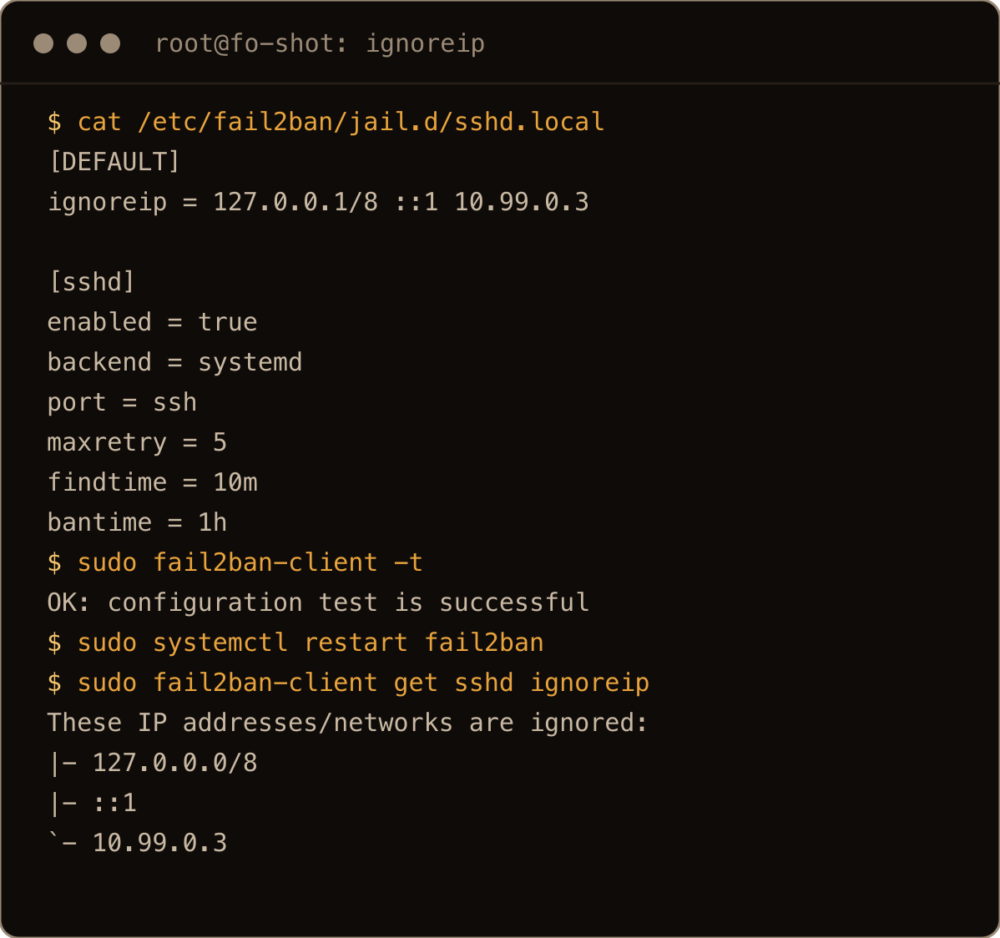
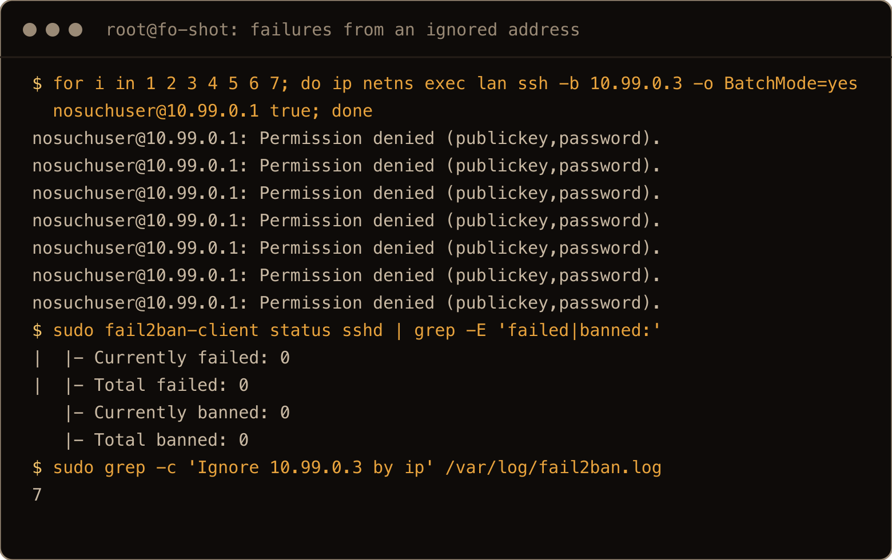
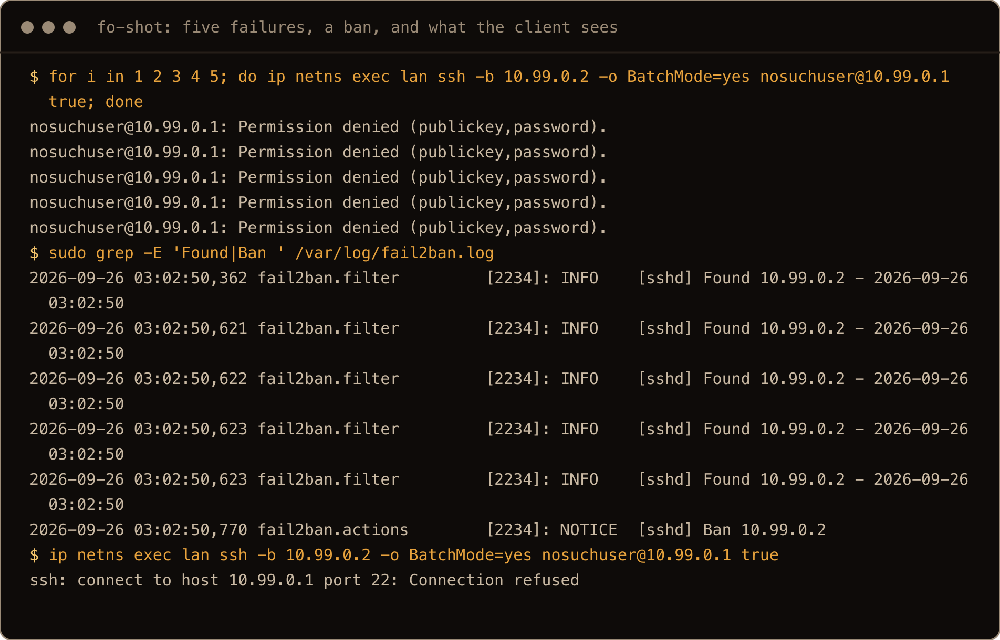
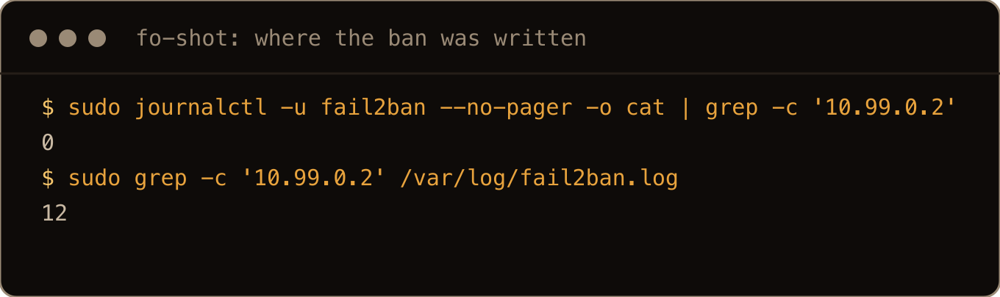

A public SSH server starts collecting failed logins almost as soon as it gets an address. Key-only authentication makes those guesses useless, but it does not stop the same addresses filling the journal all day. Fail2ban is the small second layer: watch the failures, count them, and temporarily stop repeat offenders at the firewall.

This is the standalone version of the Fail2ban step in my [Ubuntu 26.04 server hardening guide](/blog/hardening-ubuntu-26-04-server/). It is deliberately specific to 26.04, because this release ships Python 3.14, Fail2ban 1.1.0, and a journal-first systemd setup. An older guide that copies `jail.conf` or points the SSH jail at `/var/log/auth.log` can leave you with a service that starts but watches the wrong place.

> **TL;DR** Install Ubuntu's `fail2ban` package, put only your overrides in `/etc/fail2ban/jail.d/sshd.local`, use `backend = systemd`, test the configuration, then verify both the service and the `sshd` jail. Fail2ban reduces repeated attempts. It does not turn password authentication into a good idea.

## Before you install it

Do these first:

- Set up [SSH keys](/blog/set-up-ssh-keys-ubuntu/) and prove a key login works in a second terminal.
- Turn off SSH password authentication if the server permits it.
- Enable [UFW](/blog/ufw-firewall-basics-ubuntu/) with SSH allowed before you close your current session.
- Keep one working SSH session open while you configure and test the jail.

Fail2ban is a reaction to failed authentication. Keys remove the weak authentication path in the first place. Use both, but do not confuse their jobs.

## What is different on Ubuntu 26.04

Ubuntu 26.04 carries [`fail2ban` 1.1.0-9](https://packages.ubuntu.com/resolute/fail2ban), compared with 1.0.2 in Ubuntu 24.04. It also uses [Python 3.14 as the default Python](https://packages.ubuntu.com/resolute/python3). That matters because Python removed the old `asyncore` and `asynchat` standard-library modules in 3.12. Fail2ban 1.1 bundles replacements for Python 3.12 and newer, and Ubuntu's maintained package includes the distribution patches and dependencies it needs.

The practical answer is pleasantly dull: **install the Ubuntu package**. Do not follow an old post that downloads Fail2ban 0.x, runs `setup.py`, or drops a random Python package into the system interpreter. On 26.04 that is how you turn a two-minute install into an import error.

The second change is logging. Ubuntu's package depends on `python3-systemd`, and its Debian/Ubuntu configuration selects the `systemd` backend for SSH. That backend reads `sshd` failures from the journal; it does not tail `/var/log/auth.log`. The package already knows this, but I set it explicitly in the local jail so the source of truth is visible when I come back six months later. The packaged backend change is documented in the [Debian patch carried by this Fail2ban release](https://sources.debian.org/patches/fail2ban/1.1.0-8/update_backend_system.diff/).

## 1. Install the maintained package

```bash
sudo apt update
sudo apt install fail2ban
```

Confirm what landed:

```bash
fail2ban-client version
python3 --version
```

On a current Ubuntu 26.04 install, those should report Fail2ban `1.1.0` and Python `3.14.x`. The exact Ubuntu package revisions can move with updates; the important pieces are the 1.1 and 3.14 lines.

The Ubuntu package also installs the systemd unit, the SSH filter, the Python journal bindings, and the nftables action. That is why `apt` is the right install method here rather than a source checkout.

## 2. Check the SSH journal before building a jail

Make sure SSH is actually writing where Fail2ban is about to look:

```bash
sudo journalctl -u ssh --since "30 minutes ago"
```

On Ubuntu the service is `ssh.service`, not `sshd.service`. You should see recent connections and authentication messages. An empty result usually means one of three things: nobody has connected recently, the unit name is different on a customized install, or SSH is running somewhere Fail2ban cannot see (a container is the usual example).

For a wider view, ask the journal for the `sshd` process itself:

```bash
sudo journalctl _COMM=sshd --since today
```

Do this check now. A healthy Fail2ban daemon watching an empty source is still doing nothing.

## 3. Add one small local override

Do not edit `/etc/fail2ban/jail.conf`, and do not copy the whole file to `jail.local`. The `.conf` files belong to the package. Your changes belong in a `.local` file parsed afterward, where they override only the settings you name. That is Fail2ban's documented configuration model, not just tidiness; a copied 1,000-line default slowly freezes old package settings into your machine.

Create an SSH-specific override:

```bash
sudo nano /etc/fail2ban/jail.d/sshd.local
```

Put this in it:

```ini
[sshd]
enabled = true
backend = systemd
port = ssh
maxretry = 5
findtime = 10m
bantime = 1h
```

The settings read as one sentence: if one address produces five matching SSH failures within ten minutes, ban new SSH connections from it for one hour.

Ubuntu's package already enables the `sshd` jail through its distribution defaults. I still keep `enabled = true` here because this file is the complete local policy, and `fail2ban-client status` will prove which jails actually loaded. Configuration is not verification.

If SSH listens on a custom port, replace `port = ssh` with the number:

```ini
port = 2222
```

That setting must match both `sshd` and UFW. Changing it only in Fail2ban makes the ban action guard the wrong port; changing it only in `sshd` without opening UFW locks you out for a much less interesting reason.

## 4. Use ignoreip so you do not ban yourself

Fail2ban already refuses to ban the host's own addresses (`ignoreself = true` is the default). Everything else is fair game, including the laptop you manage the server from. Five failed logins from your own address inside ten minutes, say a script retrying with the wrong username, and your next connection is refused for an hour.

`ignoreip` is the exemption list. Put it under `[DEFAULT]` in the same `sshd.local` so it applies to every jail (per fail2ban's docs; my lab only had the `sshd` jail):

```ini
[DEFAULT]
ignoreip = 127.0.0.1/8 ::1 203.0.113.41 10.20.0.0/24

[sshd]
enabled = true
backend = systemd
port = ssh
maxretry = 5
findtime = 10m
bantime = 1h
```

Entries are separated by spaces and can be single addresses or CIDR ranges. Replace `203.0.113.41` with your own static address and `10.20.0.0/24` with a VPN or management subnet, or drop whichever you do not have. The `127.0.0.1/8 ::1` at the front is the commented example from Ubuntu's `jail.conf`. Keep it; loopback never needs banning.

Only list addresses that are genuinely yours and stable. Do not paste your current coffee shop IP into the file and forget it; eventually somebody else gets that address, and you have handed them a permanent exemption. For a server reached through Tailscale or another private management network, exempting that private subnet is the sensible version of this. For an ordinary public server with no stable address, keeping a second session open while you test is often enough.

After the restart in the next step, ask Fail2ban what it actually loaded:

```bash
sudo fail2ban-client get sshd ignoreip
```



The screenshots in this post come from a fresh box after the rest was written. On that box `10.99.0.3` stands in for the management address: it lives in a network namespace on the same machine, and `10.99.0.2` in the same namespace plays the stranger. That way a ban can be shown without a second server, and no real address ends up in an image.


I put my own public address in `ignoreip` on a test box, then failed seven SSH logins from that address as a user that does not exist. `Total failed` stayed at `0` and `/var/log/fail2ban.log` recorded `Ignore <address> by ip` once per attempt. The failures never even reach the counter.




Two things to know before you lean on it:

- **`ignoreip` does not lift a ban that already exists.** I banned an address, added it to the ignore list, and the next connection from it was still refused. If you are already locked out, unban first (section 8), then fix `ignoreip`.
- **`fail2ban-client set sshd addignoreip ADDRESS` is temporary.** It works immediately, but a `systemctl reload fail2ban` threw it away on my box. The file is the only place the exemption survives.

## 5. Test the configuration before restarting

```bash
sudo fail2ban-client -t
```

Success ends with:

```text
OK: configuration test is successful
```

If it reports an error, fix that first. The most common mistakes are putting the file at `/etc/fail2ban/sshd.local` instead of inside `jail.d`, misspelling the `[sshd]` section, or combining `backend = systemd` with a `logpath`. A systemd jail reads the journal and does not use `logpath`; giving it both is contradictory configuration.

Now enable the service at boot and start it:

```bash
sudo systemctl enable --now fail2ban
sudo systemctl restart fail2ban
```

The explicit restart applies the jail you just wrote even if package installation already started the service.

## 6. Verify the daemon and the jail separately

First check systemd:

```bash
sudo systemctl status fail2ban --no-pager
```

Then ask Fail2ban which jails are running:

```bash
sudo fail2ban-client status
```

You want `sshd` in `Jail list`. Finally inspect that jail:

```bash
sudo fail2ban-client status sshd
```

The useful fields are `Total failed`, `Currently banned`, `Total banned`, and `Banned IP list`. A running service with no `sshd` jail is not protecting SSH. A running jail whose failure count never moves while the journal fills with bad logins is watching or matching the wrong thing.

When startup fails, read the unit log instead of guessing:

```bash
sudo journalctl -u fail2ban -n 100 --no-pager
```

## 7. Test a ban without sacrificing your own address

The safest mechanical test is to ban a documentation-only address, confirm it appears, then remove it:

```bash
sudo fail2ban-client set sshd banip 192.0.2.1
sudo fail2ban-client status sshd
sudo fail2ban-client set sshd unbanip 192.0.2.1
```

`192.0.2.1` comes from a range reserved for examples, so it should not belong to a real client. This proves the jail can add and remove a ban. It does not prove the SSH filter matches your server's journal messages.

For the full test, connect from a different public address, deliberately fail authentication five times, and watch both sides. Fail2ban on Ubuntu 26.04 logs to `/var/log/fail2ban.log`, not the journal, so `journalctl -u fail2ban` shows the service starting and stopping but never a ban. Follow the file instead:

```bash
sudo tail -f /var/log/fail2ban.log
```

In another terminal:

```bash
sudo fail2ban-client status sshd
```

Each matched failure appears as `[sshd] Found ADDRESS`, and the fifth is followed by `[sshd] Ban ADDRESS`. From the banned side, the next attempt fails immediately (on my test box the server was `10.99.0.1` and the client was `10.99.0.2`, a network namespace on the same machine):

```text
ssh: connect to host 10.99.0.1 port 22: Connection refused
```



At the end of the run, after the reboot test in section 8, the journal still had nothing to say about the address, while the log file named it twelve times:




That is Fail2ban, not a stopped `sshd`. The packaged nftables action rejects banned sources with `icmp port-unreachable`, and the SSH client reports that as a refused connection. If port 22 suddenly refuses one machine while another logs in fine, check the ban list before you debug `sshd`.

Run the full test from an address that is not in `ignoreip`, and never from your only management path. An ignored address never reaches the failure counter, so it proves nothing, and any other address is exactly what Fail2ban is supposed to lock out. A successful test should not become an emergency console exercise.

## 8. Show banned IPs and unban an address

`fail2ban-client status` lists the jails. `fail2ban-client status sshd` shows one jail's counters and its `Banned IP list`. That is fine with one jail. Once you have several, ask for every ban at once:

```bash
sudo fail2ban-client banned
```

Fail2ban 1.1 prints a Python style list, one entry per jail (my lab had only `sshd`):

```text
[{'sshd': ['10.99.0.2']}]
```

An empty jail prints as `[{'sshd': []}]`. To see when each ban expires:

```bash
sudo fail2ban-client get sshd banip --with-time
```

```text
10.99.0.2 	2026-09-26 02:42:25 + 3600 = 2026-09-26 03:42:25
```

The `+ 3600` is the one hour `bantime` in seconds. To find out which jail banned a particular address, pass it to `banned`:

```bash
sudo fail2ban-client banned 10.99.0.2
```

![Terminal: fail2ban-client banned prints [{'sshd': ['10.99.0.2']}], get sshd banip --with-time shows 10.99.0.2 banned at 03:02:50 plus 3600 until 04:02:50, and banned 10.99.0.2 prints [['sshd']]](../../assets/fail2ban-2604-shot-04-show-banned.png)


`fail2ban-client status --all` prints the full status block for every jail in one go, if you want the counters too.

To unban an address from one jail:

```bash
sudo fail2ban-client set sshd unbanip 203.0.113.41
```

It prints the number of addresses it removed. `1` means the ban is gone. `0` means that address was not banned in that jail, and it is easy to miss because nothing else is printed. Add `--report-absent` before the address if you want that case to print `not banned` instead.

To unban an address from every jail (with only `sshd` in my lab, "every" was one), or clear every ban on the box:

```bash
sudo fail2ban-client unban 203.0.113.41
sudo fail2ban-client unban --all
```

![Terminal: set sshd unbanip 10.99.0.2 prints 1, the same command again prints 0, with --report-absent it prints not banned, banip of two example addresses prints 2, unban 192.0.2.1 prints 1, unban --all prints 1, and banned ends at [{'sshd': []}]](../../assets/fail2ban-2604-shot-06-unban.png)


Restarting the service does not clear bans, and neither does a reboot. Fail2ban keeps them in `/var/lib/fail2ban/fail2ban.sqlite3`. On my test box `systemctl restart fail2ban` logged `Unban` as the old daemon stopped and `Restore Ban` for the same address a second later, and after a full reboot `fail2ban-client banned` still listed it. If you are locked out and waiting it out, you are waiting for the `bantime` to expire, not for the next restart. Unbanning is the quick way out, and the unban also removes the row from that database.

![Terminal: after systemctl restart fail2ban the log shows Unban 10.99.0.2 then Restore Ban 10.99.0.2 a second later, banned still lists it, and after a reboot at 03:03:01 banned still prints [{'sshd': ['10.99.0.2']}]](../../assets/fail2ban-2604-shot-05-restart-reboot.png)


## Fail2ban and UFW are not duplicates

UFW sets the standing policy: which ports are open and which are closed. Fail2ban adds temporary rules for individual sources that have crossed a threshold. One controls the door; the other deals with the person who keeps rattling the handle.

Ubuntu 26.04's Fail2ban package uses nftables for its default ban action. UFW also programs the kernel firewall, and the two can coexist. Do not try to make Fail2ban edit UFW rules for every ban; temporary nftables sets are exactly the sort of work its packaged action is meant to handle.

`sudo ufw limit OpenSSH` is useful, but it is not the same mechanism either. UFW rate limiting reacts to connection rate. Fail2ban reacts to log messages that matched an authentication-failure filter and keeps state over the configured `findtime`.

## What Fail2ban does not do

Fail2ban does not patch SSH, fix a weak password, replace keys, or make an exposed service safe. Upstream says the same thing plainly: it reduces the rate of incorrect authentication attempts but does not remove the risk of weak authentication. Use public-key authentication or another strong mechanism first.

It also does not normally kill an SSH connection that is already established. A ban blocks new matching traffic from the address. If a test client stays connected through a ban, that does not automatically mean the firewall rule failed; disconnect and try a new connection.

Finally, Fail2ban can only ban the address it sees. Put SSH behind a proxy, port-forwarder, or container bridge that hides the original client and it may see the intermediary every time. Ban that address and you can cut off everybody at once. Check the journal before enabling a jail on any proxied service.

## Optional: make repeat offenders wait longer

Fail2ban 1.1 can increase the ban time for addresses that keep returning. Add these under `[DEFAULT]` in `sshd.local`:

```ini
[DEFAULT]
bantime.increment = true
bantime.factor = 2
bantime.maxtime = 1w
```

The first ban remains one hour. Repeated bans grow, capped at one week. I would get the basic jail running and verified before adding this; clever policy on top of a jail that reads no logs is still zero protection.

## Quick reference

| Job | Command |
| --- | --- |
| Test configuration | `sudo fail2ban-client -t` |
| Check service | `sudo systemctl status fail2ban --no-pager` |
| List jails | `sudo fail2ban-client status` |
| Inspect SSH jail | `sudo fail2ban-client status sshd` |
| Follow Fail2ban log | `sudo tail -f /var/log/fail2ban.log` |
| Inspect SSH journal | `sudo journalctl -u ssh --since today` |
| Ban one address | `sudo fail2ban-client set sshd banip ADDRESS` |
| Show banned IPs in every jail | `sudo fail2ban-client banned` |
| Show bans with expiry times | `sudo fail2ban-client get sshd banip --with-time` |
| Which jail banned an address | `sudo fail2ban-client banned ADDRESS` |
| Unban one address from SSH | `sudo fail2ban-client set sshd unbanip ADDRESS` |
| Unban from every jail | `sudo fail2ban-client unban ADDRESS` |
| Unban everything | `sudo fail2ban-client unban --all` |
| Show the ignoreip list | `sudo fail2ban-client get sshd ignoreip` |
| Reload after an edit | `sudo systemctl restart fail2ban` |

Install the maintained package, keep the override small, read `/var/log/fail2ban.log`, and verify the jail instead of trusting the service's green `active` label. Once those four pieces agree, the bots can keep knocking. They just do it from farther away.
