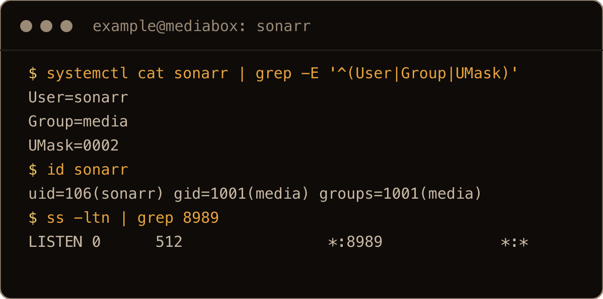
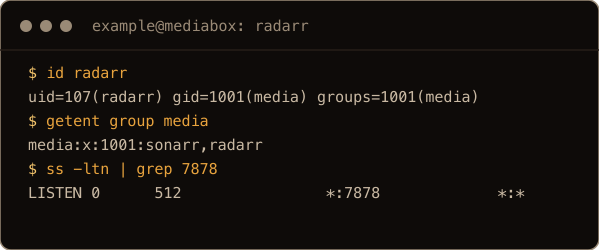
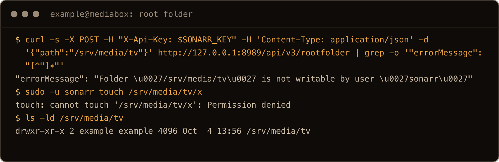
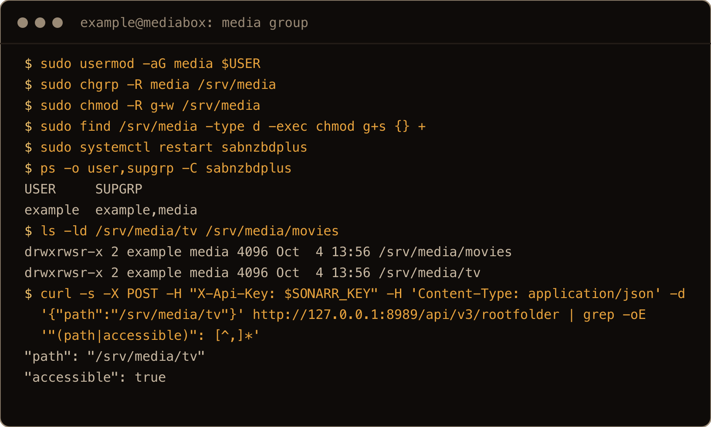
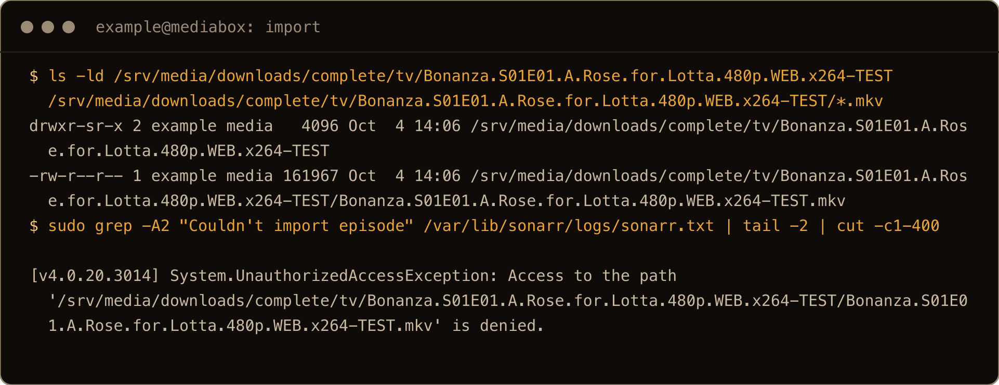
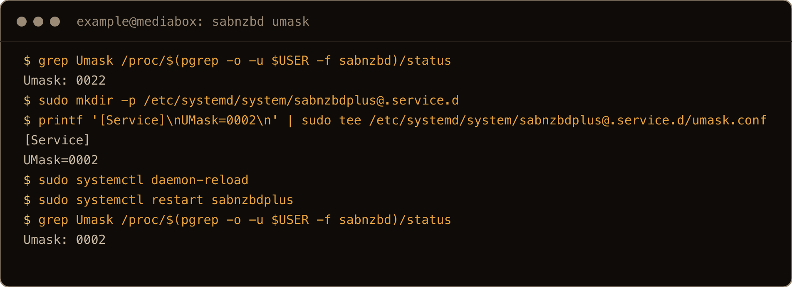
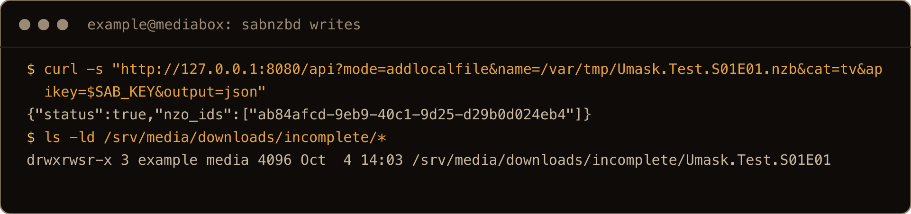
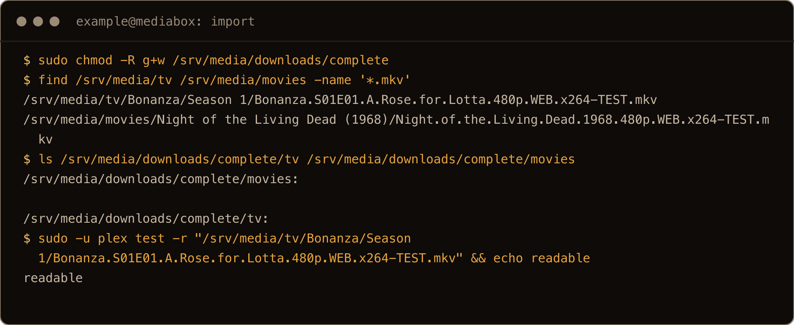
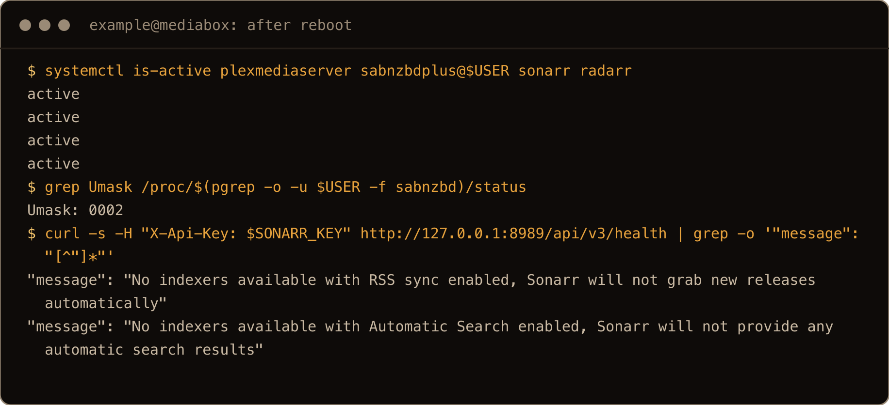
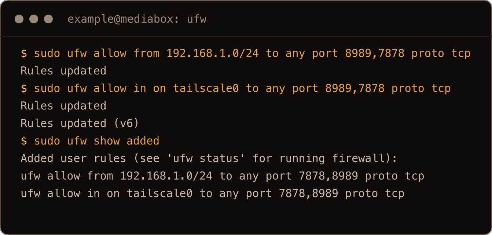

It's great to automate downloading your shows and movies as they're released. Before, I had to hunt down the releases and move them myself. Now I just feed it an XML and a script.

This picks up where [Plex and SABnzbd on Ubuntu 26.10](/blog/install-plex-sabnzbd-ubuntu-26-10/) left off: same server, same `/srv/media`, no Docker. Sonarr watches for TV, Radarr for movies, both hand the download to SABnzbd, and when it finishes they move the file into the folder Plex scans. The install takes a few minutes. The permissions take the afternoon, unless you do them first.

> **TL;DR.** Install Sonarr with its own script and Radarr with the Servarr community script; both run as their own user in a `media` group. Put `/srv/media` in that group with `g+w` and setgid on the folders, add your SABnzbd user to it, and give SABnzbd `UMask=0002` with a systemd drop-in. Point SABnzbd's `tv` and `movies` categories at `downloads/complete`, not at the library. Then add SABnzbd as the download client in both apps, an indexer, a root folder, and the shows and movies you want.

## Contents

- [1. Install Sonarr](#1-install-sonarr)
- [2. Install Radarr](#2-install-radarr)
- [3. "Folder is not writable by user sonarr"](#3-folder-is-not-writable-by-user-sonarr)
- [4. "Access to the path is denied" on import](#4-access-to-the-path-is-denied-on-import)
- [5. Connect SABnzbd](#5-connect-sabnzbd)
- [6. Root folders and indexers](#6-root-folders-and-indexers)
- [7. Keep them inside](#7-keep-them-inside)
- [Gotchas I hit](#gotchas-i-hit)
- [Quick reference](#quick-reference)

## 1. Install Sonarr

Sonarr isn't in Ubuntu's archive. The Sonarr team publishes an install script that downloads Sonarr v4 into `/opt/Sonarr`, keeps its data in `/var/lib/sonarr`, and writes a systemd unit:

```bash
curl -o install-sonarr.sh https://raw.githubusercontent.com/Sonarr/Sonarr/develop/distribution/debian/install.sh
sudo bash install-sonarr.sh
```

It asks two questions: which user Sonarr runs as (default `sonarr`) and which group (default `media`). Take both defaults. The group is the important one; everything that touches your media will share it. Then press Enter to continue.

I got Sonarr 4.0.20, running as `sonarr` in group `media` with `UMask=0002`, on port 8989:

```text
$ systemctl cat sonarr | grep -E '^(User|Group|UMask)'
User=sonarr
Group=media
UMask=0002
```



The screenshots in this post come from a final clean run on a fresh server upgraded to 26.10, set up as in the Plex post with a user called `example`.

Open `http://<server-ip>:8989`. The config starts with `AuthenticationMethod` set to `None` and `AuthenticationRequired` set to `Enabled`, and the [Servarr FAQ](https://wiki.servarr.com/sonarr/faq-v4#forced-authentication) is plain that authentication is mandatory from v4 on, with **Forms** recommended. So on the first visit pick **Forms** and set a username and password (later it lives under **Settings > General > Security**). Radarr wants the same. I only saw this in the config files, not in a browser on the lab box.

## 2. Install Radarr

Radarr comes from the Servarr wiki's [community install script](https://wiki.servarr.com/install-script) (unofficial, by its own description), which can also install Lidarr, Prowlarr or Whisparr, one per run:

```bash
curl -o servarr-install-script.sh https://raw.githubusercontent.com/Servarr/Wiki/master/servarr/servarr-install-script.sh
sudo bash servarr-install-script.sh
```

Pick `radarr` from the menu (it was `3`), take the default user `radarr` and group `media`, and type `yes`. Then it stops once more, because it installs `libicu-dev` with a plain `apt install` and apt wants an answer:

```text
Installing missing prerequisite packages: libicu-dev
Continue? [Y/n]
```

Press Enter. If you feed the script its answers from a pipe, account for this prompt too; my first unattended run sat here until I killed it. I got Radarr 6.4.4 on port 7878, as `radarr` in group `media`.



## 3. "Folder is not writable by user sonarr"

In the Plex post, `/srv/media` belongs to the user SABnzbd runs as. Sonarr and Radarr run as their own users, so the first time you add a root folder:

```text
Folder '/srv/media/tv' is not writable by user 'sonarr'
```



Radarr says the same about `/srv/media/movies`. They're right: `sudo -u sonarr touch /srv/media/tv/x` gets `Permission denied`. The fix is the `media` group the scripts created. Give it the whole tree, make it group-writable, and set the setgid bit on every folder so anything created inside inherits the group:

```bash
sudo usermod -aG media $USER
sudo chgrp -R media /srv/media
sudo chmod -R g+w /srv/media
sudo find /srv/media -type d -exec chmod g+s {} +
sudo systemctl restart sabnzbdplus
```

`usermod` adds you, the user SABnzbd runs as, to `media`. A running process keeps the groups it started with, so restart SABnzbd to pick it up; I checked with `ps -o user,supgrp -C sabnzbdplus`, which then listed `example,media`. Your own login shell needs a log out and back in for the same reason.



Plex doesn't need to be in the group. It only reads, and everything here stays readable by everyone.

## 4. "Access to the path is denied" on import

With the folders fixed, Sonarr can add `/srv/media/tv`. The next trap waits until the first download finishes. Sonarr tries to move the file out of SABnzbd's folder and fails:

```text
System.UnauthorizedAccessException: Access to the path '/srv/media/downloads/complete/tv/Bonanza.S01E01.A.Rose.for.Lotta.480p.WEB.x264-TEST/Bonanza.S01E01.A.Rose.for.Lotta.480p.WEB.x264-TEST.mkv' is denied.
 ---> System.IO.IOException: Permission denied
```

That's in `/var/lib/sonarr/logs/sonarr.txt`; Radarr's log has the same for the movie. The release folder was `drwxr-sr-x`: group `media` thanks to setgid, but not group-writable. Moving a file out of a folder means changing that folder, so Sonarr is stuck.



An honest note on how I got there: I don't have a Usenet account on the lab box, so that release folder wasn't written by a real SABnzbd download. I created it as the SABnzbd user with SABnzbd's default umask, `022`. SABnzbd's [Unix permissions page](https://sabnzbd.org/wiki/advanced/unix-permissions) says that with its permissions setting left empty, what it writes follows its process umask, so a real download lands the same way.

Sonarr and Radarr already run with `UMask=0002`. Give SABnzbd the same with a systemd drop-in on its service template:

```bash
sudo mkdir -p /etc/systemd/system/sabnzbdplus@.service.d
printf '[Service]\nUMask=0002\n' | sudo tee /etc/systemd/system/sabnzbdplus@.service.d/umask.conf
sudo systemctl daemon-reload
sudo systemctl restart sabnzbdplus
```

The SABnzbd process went from `Umask: 0022` to `0002`, and it stayed that way after a reboot. To see SABnzbd itself write with it, I gave it a dummy NZB in the `tv` category. It had no server to download from, but it created the job folder in `downloads/incomplete` straight away, as `drwxrwsr-x`: group `media` and group-writable, with nothing else changed.





The new umask only applies to what SABnzbd writes from now on. If an import already failed, fix the folders it left behind. Sonarr tries again on its next check, or use **Manual Import** from **Activity > Queue**; I re-ran the import scan through the API:

```bash
sudo chmod -R g+w /srv/media/downloads/complete
```

After that, both imports went through: the episode landed in `/srv/media/tv/Bonanza/Season 1/`, the movie in `/srv/media/movies/Night of the Living Dead (1968)/`, the release folders in `downloads/complete` were cleaned up, and `sudo -u plex test -r` on the imported episode passed.



SABnzbd also has its own setting for this, **Config > Folders > Permissions for completed downloads** (an advanced option), which sets the mode on finished jobs explicitly; `775` does the same job. I never set it on the final run, so the umask alone is what made the `incomplete/Umask.Test.S01E01` job folder group-writable. That setting acts on completed downloads; for those, with it empty, SABnzbd's docs say the same umask applies. I never completed a real download on the lab box.

How I tested the imports: I added a real series and movie, made a release folder with a small `ffmpeg` video in it, and told Sonarr and Radarr to import it. The first fake had no audio track, and both apps refused it with `No audio tracks detected`, which is a fair thing to check.

## 5. Connect SABnzbd

In the Plex post, SABnzbd's `tv` and `movies` categories pointed straight at `/srv/media/tv` and `/srv/media/movies`. With Sonarr and Radarr in charge, change that. They want finished downloads in a staging folder, and they do the move into the library (and the rename, if you turn it on). In SABnzbd, **Config > Categories**: set the `tv` folder to `/srv/media/downloads/complete/tv` and `movies` to `/srv/media/downloads/complete/movies`.

Copy SABnzbd's API key from **Config > General**. Then in Sonarr, **Settings > Download Clients**, add **SABnzbd**: give it a name, leave it enabled, host `localhost`, port `8080`, the API key, and category `tv`. Radarr is the same with category `movies`. Both apps prefill `localhost`, `8080` and the category. **Test** should pass; then **Save**. With a wrong key it fails like this:

```text
Unable to connect to SABnzbd, HTTP request failed: [403:Forbidden]
```

![the SABnzbd download client test returns 200 with the right API key, and Unable to connect to SABnzbd, HTTP request failed: [403:Forbidden] with a wrong one](../../assets/arr-2610-shot-05-client.png)

## 6. Root folders and indexers

**Settings > Media Management > Add Root Folder**: `/srv/media/tv` in Sonarr, `/srv/media/movies` in Radarr. These are the folders Plex already scans, so imports show up in Plex on its next scan.

Renaming is off by default; tick **Rename Episodes** on the same page, and **Rename Movies** in Radarr, to get tidy names. My test episode kept its release name.

Now tell them what you want. In Sonarr, **Add New** (or **Library Import** for shows you already have), pick the root folder and a quality profile, and choose what to monitor; Radarr's is the same for movies. New episodes and releases arrive through the indexer feed. For anything already out, start a search from the series or movie page.

It's my Usenet indexer's feed, if I remember correctly. My script mostly just moves the downloaded file to the external drive.

The feed is the "XML": an indexer's RSS feed and API, which both apps add under **Settings > Indexers** with the indexer's URL and your API key from it. Until you add one, the health check on the System page says `No indexers available with RSS sync enabled, Sonarr will not grab new releases automatically`, and Radarr says the same. I couldn't test this part without an indexer account. If you run more than a couple of indexers, Prowlarr (same Servarr script, a different menu choice) manages them in one place and pushes them to both apps.



As for that script: point the root folders at your external drive (and the Plex libraries at the same folders) and the import does the move for you. The group fix needs a filesystem that keeps Unix ownership and permissions, like ext4. exFAT takes them from mount options instead, and so does NTFS unless you mount it with `ntfs-3g`'s permissions support. When the drive is a different filesystem from the download folder, Sonarr and Radarr copy the file and then delete the original instead of renaming it, so the permissions above matter on both ends.

I leave the quality settings at the defaults, and it runs on RSS feeds.

Sonarr's default profiles are fine to start with. Custom formats (**Settings > Custom Formats**) are where people go next for finer control over which release wins; TRaSH Guides has the common ones.

## 7. Keep them inside

Both apps listen on every interface (`*:8989`, `*:7878`), so the login from section 1 matters. Beyond that, keep the ports to your network. Don't forward 8989 or 7878 on your router; Plex's 32400 is the only port family needs. If `ufw` is on (it starts off on Ubuntu, and once on it denies incoming by default), allow your LAN and, for Tailscale, the `tailscale0` interface:

```bash
sudo ufw allow from 192.168.1.0/24 to any port 8989,7878 proto tcp
sudo ufw allow in on tailscale0 to any port 8989,7878 proto tcp
```

Use your own subnet, and check `sudo ufw status` for an older, broader rule that already lets these ports in.



I use Tailscale to reach it from anywhere, but it's locked down to my home network.

That's the right shape: on the [tailnet](/blog/install-tailscale-ubuntu-26-04/) you open `http://<server>:8989` from your phone as if you were home, without opening a port to the internet. Tailnet traffic doesn't come from your LAN subnet, so the LAN rule doesn't cover it. Whether `ufw` would actually drop it depends on Tailscale's [netfilter mode](https://tailscale.com/docs/reference/netfilter-modes): by default Tailscale adds its own rules for tailnet traffic, so the `tailscale0` rule may not be what lets you in. It keeps the intent written down where you'll look for it, and it's what does the job if you run Tailscale with its netfilter rules turned off.

## Gotchas I hit

- `Folder '/srv/media/tv' is not writable by user 'sonarr'`: the media belongs to one user and Sonarr is another. Share a `media` group with `g+w` and setgid.
- `Access to the path ... is denied` on import: a release folder written with umask `022` isn't group-writable, so Sonarr can't move files out of it. `UMask=0002` for SABnzbd in a drop-in, and `chmod -R g+w` on folders that already failed.
- Adding a user to a group doesn't reach a process that's already running. Restart SABnzbd.
- The Servarr script stops at apt's `Continue? [Y/n]` for `libicu-dev`.
- SABnzbd categories should point at `downloads/complete`, not the library, once Sonarr and Radarr do the moving.
- A test video with no audio track is rejected with `No audio tracks detected`.

## Quick reference

| Step | Command or place |
| --- | --- |
| Sonarr | `sudo bash install-sonarr.sh`, user `sonarr`, group `media`, port 8989 |
| Radarr | `sudo bash servarr-install-script.sh`, menu `radarr`, `yes`, Enter at `[Y/n]`, port 7878 |
| First visit | pick **Forms**, set a username and password |
| Shared group | `usermod -aG media $USER`, `chgrp -R media /srv/media`, `chmod -R g+w`, `chmod g+s` on folders |
| SABnzbd umask | `/etc/systemd/system/sabnzbdplus@.service.d/umask.conf` with `UMask=0002`, restart |
| Categories | `tv` and `movies` to `/srv/media/downloads/complete/<category>` |
| Download client | SABnzbd, `localhost`, `8080`, API key from **Config > General** |
| Root folders | `/srv/media/tv`, `/srv/media/movies` |
| Firewall | LAN subnet and `tailscale0` to 8989,7878; no router forward |
| Logs | `/var/lib/sonarr/logs/sonarr.txt`, `/var/lib/radarr/logs/radarr.txt` |

One group, one umask, and the downloads land where Plex already looks.
