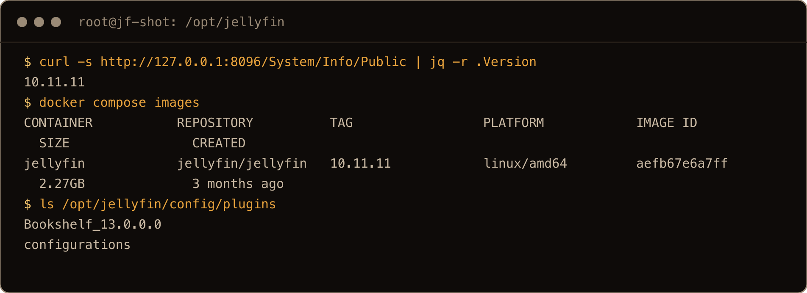
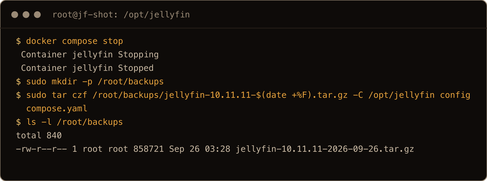
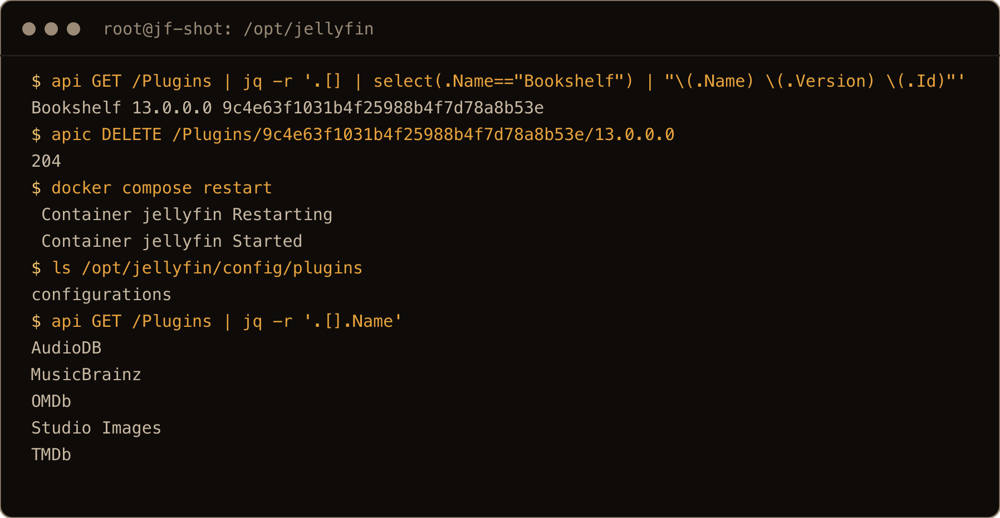
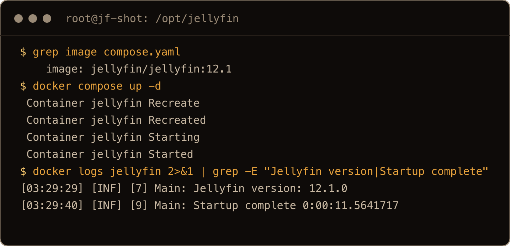
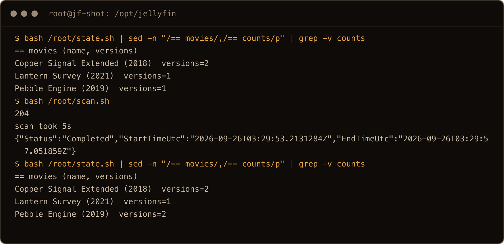
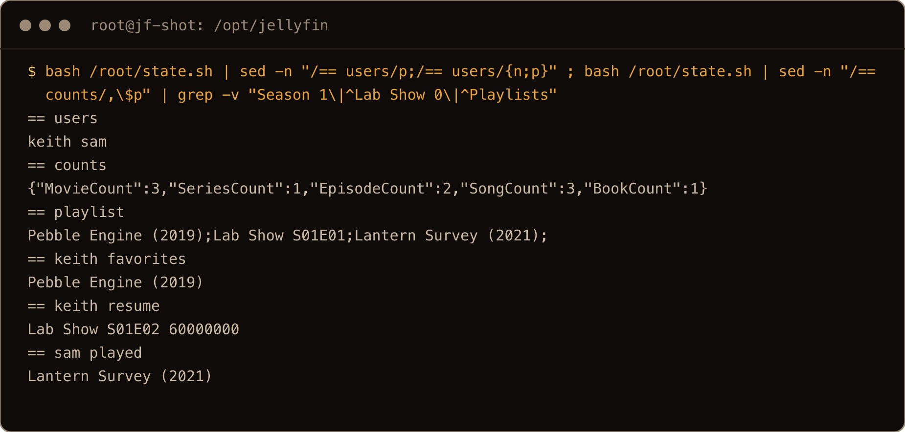
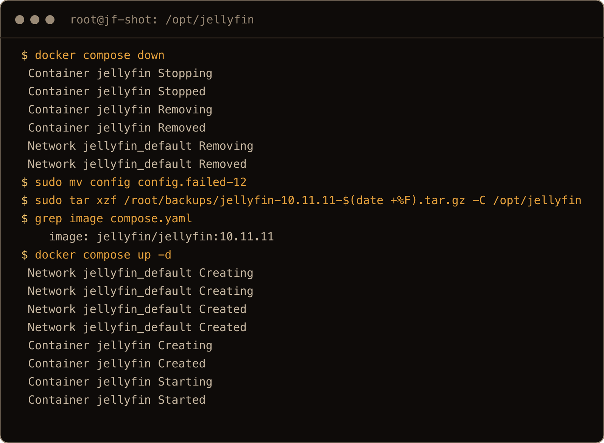
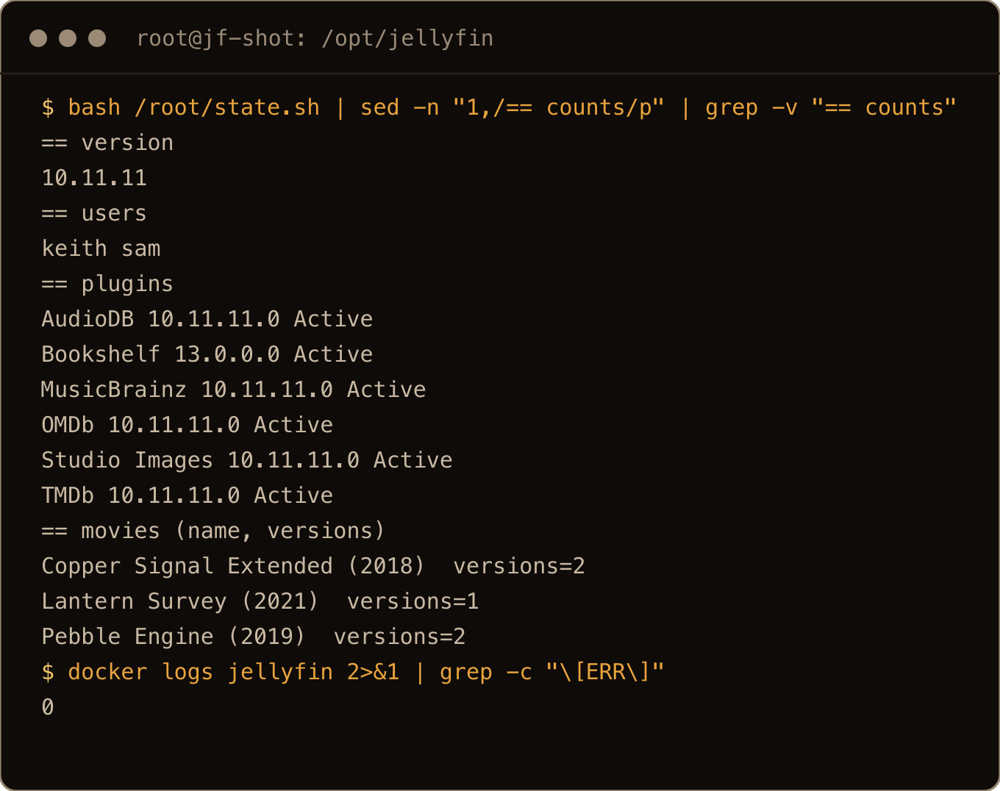

Updating Jellyfin in Docker is normally two commands: pull the new image, start it again. Jellyfin 12 still starts with those two commands, but what happens next is different. On first boot it rewrites the database, and the release notes are blunt about it: a backup is the only way back to 10.11. If your Compose file says `latest`, you do not even have to decide to upgrade. `latest` has pointed at 12.1 since 15 September, so the next routine pull runs the migration for you, backup or not.

So I built a small Jellyfin 10.11.11 server on a fresh Ubuntu 26.04 box and gave it the things the release notes warn about: a repository plugin, a movie with two versions that Jellyfin grouped by itself, a pair I merged by hand, two users, a playlist, a favorite and an episode with a saved resume point. Then I backed it up, upgraded it to 12.1, timed the migration, checked what survived, and rolled it back. This post is that run, in the order I would do it on a server I cared about.

The one thing to get straight: the tarball you make before you start is the only rollback there is. Jellyfin 12 does take its own copy of the database before migrating, and then deletes it once the migration succeeds. And putting the old tag back in the Compose file is not a downgrade. I tried it. 10.11 starts, Docker calls it healthy, the web page loads, and signing in fails with a `500`.

> **TL;DR.** Pin your image to `jellyfin/jellyfin:10.11` until you are ready. Then `docker compose stop`, `sudo tar czf` the whole `/config` folder plus your `compose.yaml`, uninstall any plugin you installed from a repository, change the tag to `jellyfin/jellyfin:12.1`, `docker compose pull` and `docker compose up -d`, and watch `docker logs -f jellyfin` until `Startup complete`. Run a full library scan straight away, because versions Jellyfin merged automatically are removed by the migration and only a scan puts them back. To roll back, stop it, move `/config` aside, untar the backup and start the old tag. Changing the tag alone leaves 10.11 unable to read the 12 database.

## Contents

- [What I tested on](#what-i-tested-on)
- [1. Check what you are running, and pin it](#1-check-what-you-are-running-and-pin-it)
- [2. Stop Jellyfin and back up /config](#2-stop-jellyfin-and-back-up-config)
- [3. Remove repository plugins](#3-remove-repository-plugins)
- [4. Change the tag and start 12](#4-change-the-tag-and-start-12)
- [5. What the migration log says](#5-what-the-migration-log-says)
- [6. Run a full scan to get the merged versions back](#6-run-a-full-scan-to-get-the-merged-versions-back)
- [7. What survived, and the one thing that did not](#7-what-survived-and-the-one-thing-that-did-not)
- [8. Put your plugins back](#8-put-your-plugins-back)
- [9. Roll back from the backup](#9-roll-back-from-the-backup)
- [10. Optional: run the migration on its own](#10-optional-run-the-migration-on-its-own)
- [Gotchas I hit](#gotchas-i-hit)
- [Quick reference](#quick-reference)

## What I tested on

- A Hetzner cx23 (2 vCPU) running Ubuntu 26.04.1 LTS, kernel 7.0.0-30, behind Hetzner's firewall, reached over SSH.
- Docker Engine 29.8.1 and Docker Compose v5.5.1 from Docker's apt repo, installed the way [Install Docker on Ubuntu 26.04](/blog/install-docker-ubuntu-26-04/) describes.
- The official `jellyfin/jellyfin` image: `10.11.11` (the newest 10.11, from June) upgraded to `12.1`, which is what `12` and `latest` pointed at on 25 September 2026.
- A test library I made with ffmpeg: five movie files that end up as three movies, a show with two episodes, an album of three tracks and one epub book. `Pebble Engine (2019)` has a `- 1080p.mkv` and a `- 720p.mkv` in the same folder, which Jellyfin groups into one movie with two versions on its own. `Copper Signal (2018)` and `Copper Signal Extended (2018)` live in separate folders and I merged them by hand.
- Two users, `keith` and `sam`, a playlist of three items, a favorite, a resume point, a watched movie, and the Bookshelf plugin from the official repository.

The box had no browser, so every step you would click through (the startup wizard, installing and removing the plugin, scans, playback) I did through Jellyfin's HTTP API with `curl`. Where I name a dashboard page, that is from Jellyfin's docs and release notes, not something I looked at. I also only tested the official image. The LinuxServer `linuxserver/jellyfin` image lays out `/config` differently, so check which host folder holds your database before copying the backup commands. Tar the wrong folder and the restore in section 9 brings back nothing you need.

## 1. Check what you are running, and pin it

This is the Compose file the server ran on. Yours will differ, and the parts that matter for the upgrade are the image tag and where `/config` lives on the host:

```yaml
services:
  jellyfin:
    image: jellyfin/jellyfin:10.11.11
    container_name: jellyfin
    user: 1000:1000
    ports:
      - "127.0.0.1:8096:8096"
    volumes:
      - /opt/jellyfin/config:/config
      - /opt/jellyfin/cache:/cache
      - /srv/media:/media:ro
    restart: unless-stopped
```

The port is bound to `127.0.0.1` and I reached it with an SSH tunnel (`ssh -N -L 8096:127.0.0.1:8096 you@server`, then `http://localhost:8096`). The media is mounted read only, so nothing Jellyfin does during an upgrade can touch the files themselves. The library the migration rewrites is Jellyfin's database about those files, not the files.

Ask the server what it is:

```bash
curl -s http://127.0.0.1:8096/System/Info/Public | jq -r .Version
docker compose images
```

The first printed `10.11.11`. Jellyfin 12 supports upgrading directly from 10.10.7 or any 10.11 release. If you are on something older than 10.10.7, the release notes say to go to 10.10.7 first. I only tested from 10.11.11.



The screenshots come from a clean run on a fresh box after the post was written, so timestamps, sizes and timings differ a little from the text. `api`, `apic`, `state.sh` and `scan.sh` in them are small `curl` wrappers around Jellyfin's API that I used in place of the browser (`$HDR` is the `Authorization` header they send): `state.sh` prints the users, plugins, movies with their version counts, item counts, the playlist and the watch state, and `scan.sh` starts a full library scan and waits for it.

Now the tag. On 25 September, `latest`, `12` and `12.1` on Docker Hub were the same image (digest `78d3ea12...`, the image ID my 12.1 container ran), and `10` and `10.11` were still 10.11.11. If your file says `latest`, change it to `jellyfin/jellyfin:10.11` today, so a pull by you, a cron job or Watchtower cannot start the migration before you have a backup. It is the rule from the [Plex post](/blog/plex-sabnzbd-docker-compose-hardware-transcoding/): pin explicit versions and bump them on purpose, not by accident. Jellyfin 12 is the release where that stops being a matter of taste.

## 2. Stop Jellyfin and back up /config

In the official image everything Jellyfin knows lives under `/config`. The image sets it up like this:

```text
JELLYFIN_DATA_DIR=/config
JELLYFIN_CONFIG_DIR=/config/config
JELLYFIN_LOG_DIR=/config/log
JELLYFIN_CACHE_DIR=/cache
```

The database is `/config/data/jellyfin.db`, and next to it sit the XML settings, plugins, metadata and the library definitions under `/config/root`. The migration changes the database and some of the settings files, so back up the whole folder, with Jellyfin stopped so the database is not being written while you copy it:

```bash
cd /opt/jellyfin
docker compose stop
sudo mkdir -p /root/backups
sudo tar czf /root/backups/jellyfin-10.11.11-$(date +%F).tar.gz -C /opt/jellyfin config compose.yaml
ls -l /root/backups
```

On the test server `/config` was 3.4MB and the tarball 858300 bytes. A real library with artwork will be far bigger. Two choices in that command are deliberate. `compose.yaml` goes in the same file, so the restore puts back the old tag along with the data and you cannot restore 10.11 data under a 12 image by accident. And `/cache` stays out: it holds transcodes and image caches Jellyfin rebuilds. After my rollback, 10.11 ran on the cache 12.1 had written and logged no errors.



Running `tar` with `sudo` records the owner and puts it back when you extract as root: after my restore, `/opt/jellyfin/config` was still owned by UID 1000, the user the container runs as.

## 3. Remove repository plugins

The 12.0 release notes say to remove every plugin you installed from a repository (anything not built in) before migrating, and to add them back afterwards. The built in ones, TMDb, OMDb, MusicBrainz, AudioDB and Studio Images on my server, update with the image and stay.

Before you remove anything, write down what you have, because you will want the list in section 8:

```bash
ls /opt/jellyfin/config/plugins
```

```text
Bookshelf_13.0.0.0
configurations
```

Start Jellyfin again (`docker compose start`), uninstall each one from the plugin list in the dashboard, and restart. I uninstalled Bookshelf through the API (`DELETE /Plugins/<id>/<version>` answered `204`), and its folder was gone straight away; after the restart only `configurations` was left in that directory and the plugin list had just the five built in ones. The `configurations` folder holds the plugins' settings, so leave it.



In the browser you would use the uninstall button on the plugin's page instead; I used the API's `DELETE` and did not check the button itself.

I also ran the upgrade once with Bookshelf still installed, from a second backup. Bookshelf 13.0.0.0 is built for 10.11, and 12.1 logged `Loaded plugin: Bookshelf 13.0.0.0`, listed it as `Active`, and scanned without a single plugin error. So on my box, leaving it did no visible harm. That is one small plugin on a library of eleven files, and the release post says plainly that plugins built for 10.11 will not load on 12.0. I did not test any other plugin, and I would still remove them. Uninstalling costs a minute. Finding out the hard way that one of yours does not load on 12 means a rollback.

## 4. Change the tag and start 12

Put the new tag in `compose.yaml`:

```yaml
    image: jellyfin/jellyfin:12.1
```

Then:

```bash
docker compose pull
docker compose up -d
docker logs -f jellyfin
```

I pin `12.1` rather than going back to `latest`, for the same reason as section 1: the next jump should be a decision, not a side effect of a pull. The new image is 2.48GB on disk next to 2.27GB for 10.11.11, and both stay there until you remove one.

**Do not stop the container while the log is migrating.** The release notes warn against it, and my reading is that a rewrite cut off halfway is what Jellyfin's own copy of the database is for. I did not interrupt one to see what it leaves behind; if it happens to you, restore the tarball as in section 9. Wait for `Startup complete`. On my server the whole start, migrations included, took 14 seconds:

```text
[02:53:50] [INF] [9] Main: Jellyfin version: 12.1.0
...
[02:54:04] [INF] [11] Main: Startup complete 0:00:14.2667812
```

That is a library the migration log counted as 31 items. The migration walks every item, and the notes warn that it takes longer on large libraries. I cannot tell you how long yours will take, only that this one took seven seconds of that start.



The `docker compose pull` is left out of this one because the layer download fills the screen.

## 5. What the migration log says

The log is long, and a few lines in it are worth knowing before you read it at 2am. First, Jellyfin's own safety copy of the database:

```text
Main: A migration will attempt to modify the jellyfin.db, will attempt to backup the file now.
Main: Jellyfin database has been backed up as 20260926025353
...
Main: Attempt to cleanup JellyfinDb backup.
```

After a successful migration, `/config/data/SQLiteBackups` was empty. My reading is that the copy is there for a migration that dies halfway (I did not test whether Jellyfin restores it by itself), not to let you go back to 10.11 next week. Your tarball does that.

Then the two batches of migrations:

```text
Jellyfin.Server.Migrations.JellyfinMigrationService: There are 18 migrations for stage CoreInitialisation.
Jellyfin.Server.Migrations.JellyfinMigrationService: There are 15 migrations for stage AppInitialisation.
```

The first batch mostly changes the schema: it adds a new `LinkedChildren` table, turns some columns into real IDs, drops the old `ExtraIds` column, and gives usernames a normalized column with a unique index. The second rewrites data, including moving the playlist entries and the links between merged versions into that table. This is the part that removes the automatically merged version:

```text
MigrateLinkedChildren: Found 1 wrong-type alternate version items to remove.
LibraryManager: Removing item, Type: Video, Name: Pebble Engine (2019) - 720p, Path: /media/movies/Pebble Engine (2019)/Pebble Engine (2019) - 720p.mkv, Id: 5bf6a254-2cb7-2a8c-ded3-26dd5cd519f1
MigrateLinkedChildren: Removed 1 wrong-type alternate version items. They will be recreated with the correct type on next library scan.
```

The pair I merged by hand was left alone. The log checked it and changed nothing:

```text
RepairAlternateVersionLinks: Repaired 0 of 1 alternate version links, and promoted 0 primaries that were versions themselves.
```


Two things in the log look worse than they are. On its first start 12.1 logged an `[ERR]` for `/config/config/encoding.xml`: `Instance validation error: '' is not a valid value for EncoderPreset.` 10.11 had written that setting as `<EncoderPreset xsi:nil="true" />`, and 12.1 rewrote it as `<EncoderPreset>auto</EncoderPreset>` and did not complain again. There are also two `[WRN]` lines from Entity Framework saying `The database may not be in an expected state` during one schema step. Everything afterwards checked out, so on this run both were noise. If your log has other `[ERR]` lines, those are the ones to read.

The built in plugins moved to `12.1.0.0` and there is a new one, `ListenBrainz Similarity Provider`, which the release notes say is now bundled.

## 6. Run a full scan to get the merged versions back

Straight after the upgrade, before any scan, the movie list said:

```text
Copper Signal Extended (2018)  versions=2
Lantern Survey (2021)  versions=1
Pebble Engine (2019)  versions=1
```

Pebble Engine had two versions on 10.11. If you have movies that Jellyfin grouped from files in the same folder, they look like this until you scan, and anyone who picks the 720p copy on the TV finds it gone. The manual merge kept both versions.

Run a full scan of every library: Scan All Libraries in the dashboard, per Jellyfin's docs. I ran the same thing through the API with `POST /Library/Refresh`. It finished in 7 seconds here and put the version back:

```text
Pebble Engine (2019)  versions=2
```



The release notes say the first scan after upgrading takes much longer than a normal one, and that some movies can show up as newly added. On eleven files I could not see either.

## 7. What survived, and the one thing that did not

I captured the same summary on 10.11.11 before the upgrade and on 12.1 after the scan. These were identical:

- users `keith` and `sam` (I signed in as `keith` with his old password);
- item counts: 3 movies, 1 series, 2 episodes, 3 songs, 1 book;
- the playlist `Lab Mix`, with the same three items in the same order (the migration log says `Inserting 5 LinkedChildren records`: in the new table afterwards, three rows were the playlist entries and two were the links between the merged movie versions);
- `keith`'s favorite, his resume point on `Lab Show S01E02` at `60000000` ticks (6 seconds), and `sam` having watched `Lantern Survey`;
- the manual merge of the two Copper Signal films;
- the book, `The Lab Notebook`.



The `grep -v` drops three lines 12.1 added that 10.11 did not return: its resume list also named the series `Lab Show` and `Season 1` at position 0, and `sam`'s watched list included the `Playlists` folder. Nothing in the library changed; the API answers those two questions a little differently.

The one loss was watch state stored on the automatically merged 720p item itself. On a second run I marked that 720p item watched for `sam` and gave `keith` a resume point on it, writing straight to that item's ID. After the migration and the scan, the 720p version came back with a new ID (`a9241a76...` instead of `5bf6a254...`), unwatched, at position zero. The old records were still in the database, attached to a placeholder item and no longer shown to anyone, even after a restart and a second scan.

How much that matters depends on where your client writes watch state. When I reported playback the way a client does (`/Sessions/Playing` with the movie's own ID and the 720p copy as the media source), 10.11 stored `sam`'s watched flag on the movie, not on the 720p item, and that survived the upgrade. I have not checked which apps write to the version itself. If you care, note what is watched on your merged movies before you start.

## 8. Put your plugins back

On 12.1 the official repository offered new builds of nearly everything: Fanart 15.0.0.0, Open Subtitles 25.0.0.0, Playback Reporting 19.0.0.0, TheTVDB 24.0.0.0 and Webhook 22.0.0.0 were built for 12.0, Trakt 33.0.0.0 for 12.1. Reinstall the ones on your list from section 3. Not everything has caught up: Bookshelf and AniSearch still only had 10.11 builds in that catalog.

Bookshelf is a special case. The release notes say it is deprecated, with its features merged into the server or split into the Comic Vine and Google Books providers, and the only Bookshelf in the 12.1 catalog was still 13.0.0.0 for 10.11. I left it off, installed Google Books 2.0.0.0 in its place, restarted, and after a scan the epub was still in the Books library. (That book has no real metadata to find, so I only proved the library still reads the file, not what Google Books adds.)


## 9. Roll back from the backup

First, what not to do. With the migrated `/config` still in place I changed the tag back to `10.11.11` and ran `docker compose up -d`. It looked fine from the outside:

```text
$ docker ps --format '{{.Names}} {{.Image}} {{.Status}}'
jellyfin jellyfin/jellyfin:10.11.11 Up 51 seconds (healthy)
```

The public info endpoint said `10.11.11` and the web page answered `200`. Then the sign in:

```text
$ curl -s -w '\nHTTP %{http_code}\n' -X POST ... /Users/AuthenticateByName
Error processing request.
HTTP 500
```

The log says why: `SQLite Error 1: 'no such column: p.Permission_Permissions_Guid'.` 10.11 is reading a database laid out for 12. Before anyone had even tried to sign in, the log was already full of `SQLite Error 1: 'no such column: b.ExtraIds'.`, a column the migration dropped. A healthcheck that only asks whether the server answers will pass while nobody can log in.


The real rollback puts the old `/config` back:

```bash
cd /opt/jellyfin
docker compose down
sudo mv config config.failed-12
sudo tar xzf /root/backups/jellyfin-10.11.11-2026-09-26.tar.gz -C /opt/jellyfin
grep image compose.yaml
docker compose up -d
```

Use your own backup's file name. The tarball also restores `compose.yaml`, which is why the `grep` should print `jellyfin/jellyfin:10.11.11`; the old image was still on disk, so it started without a download. Moving the failed folder aside instead of deleting it keeps the 12 state around in case you want to try again or report a bug.



After that the server said `10.11.11`, Bookshelf was back and active, Pebble Engine had two versions, and the users, playlist, favorite, resume point and watched flag were exactly what they had been before the upgrade. The log had no `[ERR]` lines.



Keep the 10.11 image and the tarball until you have lived with 12 for a while. When you are sure, `docker image rm jellyfin/jellyfin:10.11.11` gives back the 2.27GB.

## 10. Optional: run the migration on its own

Jellyfin 12 has a `--mode` flag, and `MigrateSystem` runs the migrations and exits without starting the server. The image's entrypoint is the Jellyfin binary, so with Compose it goes on the end of `docker compose run`:

```bash
cd /opt/jellyfin
docker compose stop
# image already changed to jellyfin/jellyfin:12.1 in compose.yaml
docker compose run --rm jellyfin --mode MigrateSystem
docker compose up -d
```

From the same 10.11.11 backup, the `run` took 10.3 seconds, exited with status 0, and logged the same database copy, the same 18 and 15 migrations, and the same removal of the 720p version, ending with `Preparing the database for shutdown...`. The `up -d` afterwards reached `Startup complete` in 7.9 seconds and the library was in the same state as after the one step upgrade. It is the same migration either way. What you get is a clean exit code and a log that holds only the migration, which is handy if you want to watch it by itself.


## Gotchas I hit

- `latest`, `12` and `12.1` were the same image on 25 September. A Compose file on `latest` migrates on the next pull, with or without a backup. Pin `10.11` until you are ready.
- The copy of `jellyfin.db` Jellyfin makes before migrating is deleted when the migration succeeds. `SQLiteBackups` was empty afterwards. Your tarball is the only way back.
- Changing the tag back to 10.11 is not a rollback. The container is `healthy`, the web page loads, and sign in returns `500` with `no such column: p.Permission_Permissions_Guid`.
- Movies Jellyfin grouped by itself lose their extra versions in the migration and get them back only after a full scan. Manual merges were kept.
- Watch state written directly on an automatically merged version was detached by the migration and did not come back after scans. Watch state recorded on the movie itself survived.
- The first 12.1 start logs an `[ERR]` about `EncoderPreset` in `encoding.xml`. It rewrote the value to `auto`. On the one step path it did not repeat; after a `MigrateSystem` run it logged once more on the first normal start.
- Bookshelf 13.0.0.0 loaded on 12.1 in my test, despite being built for 10.11. The release notes say 10.11 plugins will not load on 12, I tested no others, and Bookshelf has no 12 build; the release notes point book metadata at the Google Books and Comic Vine providers, and I tried Google Books.
- 10.11.11 refused to create `Sam` next to `sam` (`A user with the name 'Sam' already exists.`), so I could not reproduce the release notes' warning that usernames differing only in case break the migration. If yours came from an older version, check your user list before you start.

## Quick reference

| Job | Command |
| --- | --- |
| Current version | `curl -s http://127.0.0.1:8096/System/Info/Public \| jq -r .Version` |
| Hold on 10.11 | `image: jellyfin/jellyfin:10.11` |
| Back up | `docker compose stop`, then `sudo tar czf /root/backups/jellyfin-10.11.11-$(date +%F).tar.gz -C /opt/jellyfin config compose.yaml` |
| List plugins before removing | `ls /opt/jellyfin/config/plugins` |
| Upgrade | `image: jellyfin/jellyfin:12.1`, then `docker compose pull && docker compose up -d` |
| Watch it | `docker logs -f jellyfin` until `Startup complete` |
| Migrate only | `docker compose run --rm jellyfin --mode MigrateSystem` |
| After upgrading | full scan of every library, then reinstall 12.x plugins |
| Roll back | `docker compose down`, `sudo mv config config.failed-12`, `sudo tar xzf <backup> -C /opt/jellyfin`, `docker compose up -d` |
| Free the old image | `docker image rm jellyfin/jellyfin:10.11.11` |

Tar first, tag second, scan third. The migration only goes one way, and the tarball is the only way back.
