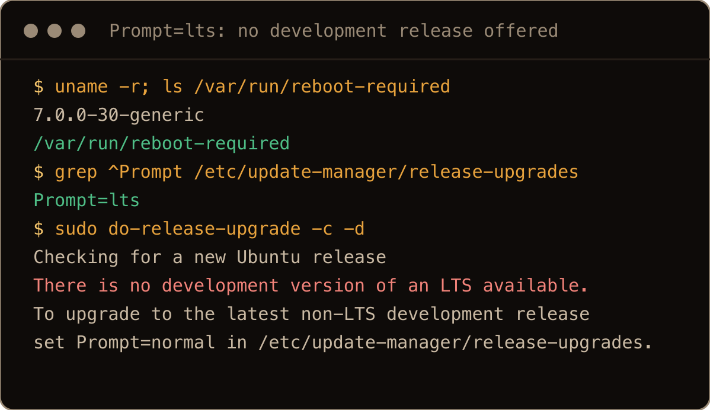
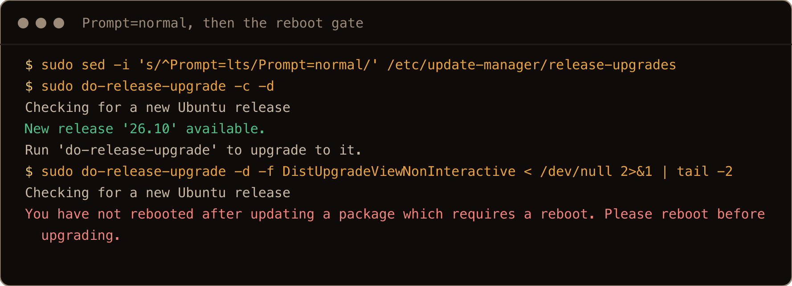
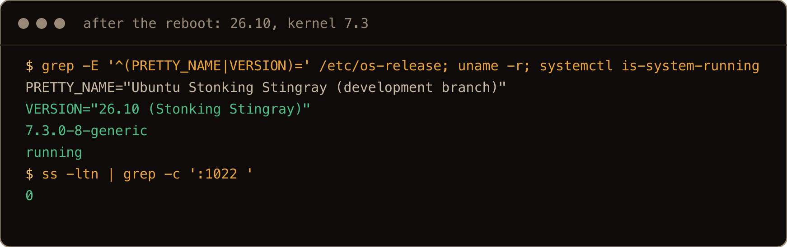

I couldn't wait. I wanted to see what changed, how it would affect my workflow, and what new tech I could use right now.

Ubuntu 26.10, "Stonking Stingray", is in beta, and the final release is due on 15 October 2026. This is how to get a 26.04 LTS server onto the beta: what has to be in place first, the two places the upgrader stops you, and how to check you made it.

Know what you are signing up for first. 26.10 is an interim release with nine months of support, and you are leaving an LTS to get it. There is no supported way back down. Take a snapshot or a backup, and keep anything important on 26.04.

> **TL;DR.** `sudo apt update && sudo apt full-upgrade`, reboot if `/var/run/reboot-required` exists, set `Prompt=normal` in `/etc/update-manager/release-upgrades`, then `sudo do-release-upgrade -d`. It took 7 to 11 minutes on a small cloud server. Reboot, and check that `/etc/os-release` says 26.10 and the kernel is 7.3.

## Contents

- [1. Patch and reboot first](#1-patch-and-reboot-first)
- [2. "There is no development version of an LTS available"](#2-there-is-no-development-version-of-an-lts-available)
- [3. Run the upgrade](#3-run-the-upgrade)
- [4. Reboot and check](#4-reboot-and-check)
- [5. What is different on 26.10](#5-what-is-different-on-2610)
- [6. After 15 October](#6-after-15-october)
- [Gotchas I hit](#gotchas-i-hit)
- [Quick reference](#quick-reference)

## 1. Patch and reboot first

```bash
sudo apt update
sudo apt full-upgrade
ls /var/run/reboot-required
```

On my servers the routine updates pulled in a new kernel (`7.0.0-30` to `7.0.0-38`) and left a reboot pending. The upgrader checks for that and stops:

```text
Checking for a new Ubuntu release
You have not rebooted after updating a package which requires a reboot. Please reboot before upgrading.
```

If that file exists, `sudo reboot` before going further. The [24.04 to 26.04 upgrade](/blog/upgrade-ubuntu-24-04-to-26-04/) has the same gate.

## 2. "There is no development version of an LTS available"

The `-d` flag lets `do-release-upgrade` offer a development release. On an LTS it still says no:

```text
$ sudo do-release-upgrade -c -d
Checking for a new Ubuntu release
There is no development version of an LTS available.
To upgrade to the latest non-LTS development release 
set Prompt=normal in /etc/update-manager/release-upgrades.
```



An LTS ships with `Prompt=lts`, meaning "only offer me the next LTS", and the next LTS is 28.04. Switch it:

```bash
sudo sed -i 's/^Prompt=lts/Prompt=normal/' /etc/update-manager/release-upgrades
sudo do-release-upgrade -c -d
```

```text
Checking for a new Ubuntu release
New release '26.10' available.
Run 'do-release-upgrade' to upgrade to it.
```



The screenshots come from a final clean run on a fresh server. In that run I set `Prompt=normal` before rebooting, which is why the reboot refusal from section 1 shows up here. The setting stays after the upgrade, which is what you want on an interim release: from 26.10 the next stop is 27.04.

## 3. Run the upgrade

```bash
sudo do-release-upgrade -d
```

Interactively, it stops for confirmations and for any config file you have changed. Read those prompts; they are your chance to keep your own config.

I usually use screen or nohup for automation.

For an unattended run that survives a dropped SSH session:

```bash
sudo -v
sudo nohup bash -c 'do-release-upgrade -d -f DistUpgradeViewNonInteractive' > ~/upgrade.log 2>&1 < /dev/null &
```

`sudo -v` asks for your password first, in the foreground; a backgrounded `sudo` that needs a password just sits there.

`DistUpgradeViewNonInteractive` makes every decision for you: it started the upgrade without asking (the interactive question defaults to no) and it decides config file prompts on its own. That is fine on a server you can rebuild and not something to do blind on one you configured by hand. On a 2 vCPU, 4 GB cloud server my runs took between 7 and 11 minutes. Two warnings in the log look alarming and were harmless: `Download is performed unsandboxed as root as file 'stonking.tar.gz.gpg' couldn't be accessed by user '_apt'`, and `APT had planned for dpkg to do more than it reported back (0 vs 2047)`.

A minute into the upgrade there was a second SSH daemon listening on port 1022:

```text
LISTEN 0      128          0.0.0.0:1022      0.0.0.0:*    users:(("sshd",pid=1343,fd=6))
```

Run over SSH, the upgrader starts that extra `sshd` as a way back in if the main one breaks mid upgrade, and it is gone after the reboot. It only helps if you can reach it. If your firewall only lets SSH in on 22, open 1022 to your own IP for the duration.

![during the upgrade ss shows sshd listening on 0.0.0.0:1022 and [::]:1022](../../assets/upgrade-2610-shot-05-during.png)

## 4. Reboot and check

The upgrader leaves a reboot pending. After it:

```text
$ grep -E '^(PRETTY_NAME|VERSION)=' /etc/os-release
PRETTY_NAME="Ubuntu Stonking Stingray (development branch)"
VERSION="26.10 (Stonking Stingray)"
$ uname -r
7.3.0-8-generic
$ systemctl is-system-running
running
```

No failed units, nothing left to upgrade, and the 1022 listener was gone.



If you install a vendor's own apt repo after the upgrade, its install steps take the codename from `/etc/os-release`, so it asks for `stonking`, and on the day I tested Docker's and HashiCorp's did not have it yet. `sudo apt update` then fails for that repo:

```text
Error: The repository 'https://download.docker.com/linux/ubuntu stonking Release' does not have a Release file.
```

Until the vendor catches up, changing the suite to `resolute` (26.04) in that repo's file under `/etc/apt/sources.list.d/` worked for both. For Docker, Ubuntu's own `docker.io` and `docker-compose-v2` packages are the other way; remove Docker's repo file first so `apt update` stops failing.

## 5. What is different on 26.10

What I checked on the upgraded server, as opposed to what the release notes say:

| Area | On 26.10 after the upgrade |
| --- | --- |
| Kernel | `7.3.0-8-generic` |
| D-Bus | `dbus.service` now points at `dbus-broker.service`; the upgrade switched an existing system over |
| coreutils | `ls --version` says `ls (uutils coreutils) 0.12.0`; GNU coreutils 9.10 is still installed as `gnu-coreutils` |
| OpenSSH | 10.5p1. Because `/etc/ssh/ssh_config` had `GSSAPIAuthentication yes`, the upgrader replaced `openssh-client` with the new `openssh-client-gssapi` package |
| apt signature checks | `sqv` 1.4.0 (Sequoia) is installed |
| sudo | still `sudo-rs`, now 0.2.14 (0.2.13 on 26.04) |
| Python, OpenSSL | 3.14.7, 4.0.1 |

## 6. After 15 October

26.10 is released on 15 October, but the plain upgrade (without `-d`) is not switched on that day. Canonical's [upgrade documentation](https://ubuntu.com/desktop/docs/en/26.04/how-to/upgrade-ubuntu-desktop/) says upgrades to a new interim release become available a few days after the release date, and if more than a couple of days pass, to look for known issues in the release notes. Until then, `-d` is the way. I could only test the beta, so that part is the documented behaviour, not something I ran.

## Gotchas I hit

- `do-release-upgrade -d` on an LTS says there is no development version until `Prompt=normal` is set.
- A pending reboot from ordinary updates blocks the upgrade.
- The fallback `sshd` on port 1022 is useless behind a firewall that only opens 22.
- Vendor apt repos keyed on the Ubuntu codename, like Docker's and HashiCorp's, may not have a `stonking` suite yet.

## Quick reference

| Step | Command |
| --- | --- |
| Patch | `sudo apt update && sudo apt full-upgrade` |
| Reboot if needed | `ls /var/run/reboot-required && sudo reboot` |
| Allow interim releases | `sudo sed -i 's/^Prompt=lts/Prompt=normal/' /etc/update-manager/release-upgrades` |
| Check | `sudo do-release-upgrade -c -d` |
| Upgrade | `sudo do-release-upgrade -d` |
| Verify | `grep VERSION= /etc/os-release; uname -r; systemctl --failed` |

A beta is for finding out early, on a box you can throw away: upgrade it, run your real work on it, and destroy it before it costs you anything.
